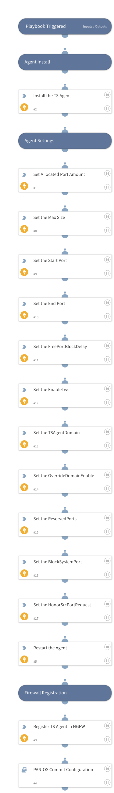

Deploy the PANW NGFW TS Agent to a Windows server

## Dependencies
This playbook uses the following sub-playbooks, integrations, and scripts.

### Sub-playbooks
* PAN-OS Commit Configuration

### Integrations
This playbook does not use any integrations.

### Scripts
This playbook does not use any scripts.

### Commands
* panorama
* win-package
* win-regedit
* win-service

## Playbook Inputs
---

| **Name** | **Description** | **Default Value** | **Required** |
| --- | --- | --- | --- |
| Host | The host to perform the deployment on  | x.x.x.x | Optional |
| Path | The path to the TS Agent msi installer | &lt;somefileshare&gt;/TaInstall64.x64-10.0.4-23.msi | Optional |
| Name | The name of the TS Agent in NGFW console | Windows VDI Agent | Optional |
| StartSize | The agent StartSize | 300 | Optional |
| MaxSize | The agent MaxSize | 2000 | Optional |
| StartPort | The agent StartPort | 20001 | Optional |
| EndPort | The agent EndPort | 39999 | Optional |
| FreePortBlockDelay | The agent FreePortBlockDelay | 245 | Optional |
| EnableTws | The agent EnableTws | 1 | Optional |
| TSAgentDomain | The agent TSAgentDomain | pm.local | Optional |
| OverrideDomainEnable | The agent OverrideDomainEnable | 1 | Optional |
| ReservedPorts | The agent ReservedPorts |  | Optional |
| BlockSystemPort | The agent BlockSystemPort | 1 | Optional |
| HonorSrcPortRequest | The agent HonorSrcPortRequest | 0 | Optional |

## Playbook Outputs
---
There are no outputs for this playbook.

## Playbook Image
---

