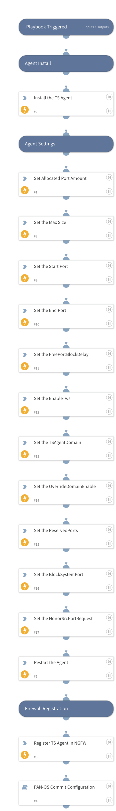

Deploy Terminal Server Agents onto Windows servers and register the agent onto Palo Alto Networks Next Gen Firewalls.  This pack also includes playbooks which can be run as a job to cleanup agents if the Windows server is spun down.  This is especially useful in dynamic VDI environments. 

