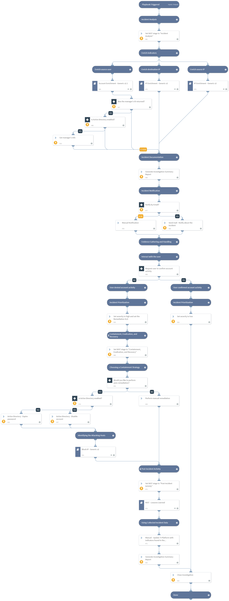

This playbook investigates an access incident by gathering user and IP information, and handling the incident based on the stages in "Handling an incident - Computer Security Incident Handling Guide" by NIST.
https://nvlpubs.nist.gov/nistpubs/SpecialPublications/NIST.SP.800-61r2.pdf

Used Sub-playbooks:
- IP Enrichment - Generic v2
- Account Enrichment - Generic v2.1
- Block IP - Generic v3
- NIST - Lessons Learned

## Dependencies

This playbook uses the following sub-playbooks, integrations, and scripts.

### Sub-playbooks

* Account Enrichment - Generic v2.1
* IP Enrichment - Generic v2
* Block IP - Generic v3
* NIST - Lessons Learned

### Integrations

* Active Directory Query v2

### Scripts

* GenerateInvestigationSummaryReport

### Commands

* closeInvestigation
* send-mail
* ad-get-user
* ad-expire-password
* ad-disable-account
* setIncident

## Playbook Inputs

---

| **Name** | **Description** | **Default Value** | **Required** |
| --- | --- | --- | --- |
| SrcIP | The source IP address from which the incident originated. |  | Optional |
| DstIP | The target IP address that was accessed. |  | Optional |
| Username | The email address of the account that was used to access the DstIP. |  | Optional |
| NotifyEmail | Email addresses to notify about the incident. |  | Optional |
| RemediationSLA | The Remediation SLA for the 'Containment, Eradication, and Recovery' stage \(in minutes\). |  | Optional |
| InternalRange | A list of internal IP ranges to check IP addresses against. The comma-separated list should be provided in CIDR notation. For example, a list of ranges would be: "172.16.0.0/12,10.0.0.0/8,192.168.0.0/16" \(without quotes\). | lists.PrivateIPs | Optional |

## Playbook Outputs

---

| **Path** | **Description** | **Type** |
| --- | --- | --- |
| IP | The IP objects | unknown |
| Endpoint | The Endpoint's object | unknown |
| Endpoint.Hostname | The hostname to enrich | string |
| Endpoint.OS | Endpoint OS | string |
| Endpoint.IP | List of endpoint IP addresses | unknown |
| Endpoint.MAC | List of endpoint MAC addresses | unknown |
| Endpoint.Domain | Endpoint domain name | string |
| Account | The account object. | unknown |
| Account.DisplayName | The user display name. | unknown |
| Account.Groups | Groups for which the user is a member. | unknown |
| Account.Manager | The user manager. | unknown |
| Account.ID | The user distinguished name. | unknown |
| Account.Username | The user sAMAccountName. | unknown |
| Account.Email | The user email address. | unknown |
| ActiveDirectory.Users.userAccountControl | The user account control flag. | unknown |
| ActiveDirectory.Users.sAMAccountName | The user sAMAccountName. | unknown |
| ActiveDirectory.Users.name | The user common name. | unknown |

## Playbook Image

---

