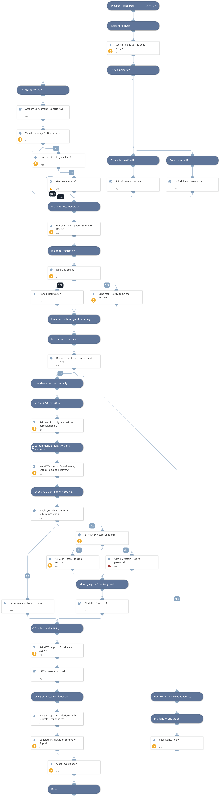

This playbook investigates an access incident by gathering user and IP information, and handling the incident based on the stages in "Handling an incident - Computer Security Incident Handling Guide" by NIST.
https://nvlpubs.nist.gov/nistpubs/SpecialPublications/NIST.SP.800-61r2.pdf

Used Sub-playbooks:
- IP Enrichment - Generic v2
- Account Enrichment - Generic v2.1
- Block IP - Generic v3
- NIST - Lessons Learned

## Dependencies
This playbook uses the following sub-playbooks, integrations, and scripts.

### Sub-playbooks
* Block IP - Generic v3
* Account Enrichment - Generic v2.1
* IP Enrichment - Generic v2
* NIST - Lessons Learned

### Integrations
* Active Directory Query v2

### Scripts
* ADGetUser
* GenerateInvestigationSummaryReport

### Commands
* send-mail
* ad-expire-password
* closeInvestigation
* ad-disable-account
* setIncident

## Playbook Inputs
---

| **Name** | **Description** | **Default Value** | **Required** |
| --- | --- | --- | --- |
| SrcIP | The source IP address from which the incident originated. |  | Optional |
| DstIP | The target IP address that was accessed. |  | Optional |
| Username | The email address of the account that was used to access the DstIP. |  | Optional |
| NotifyEmail | Email addresses to notify about the incident. |  | Optional |
| RemediationSLA | The Remediation SLA for the 'Containment, Eradication, and Recovery' stage \(in minutes\). |  | Optional |

## Playbook Outputs
---

| **Path** | **Description** | **Type** |
| --- | --- | --- |
| Account.Email.Address | The email address object associated with the Account | string |
| DBotScore | Indicator, Score, Type, Vendor | unknown |
| Account.ID | The unique Account DN \(Distinguished Name\) | string |
| Account.Username | The Account username | string |
| Account.Email | The email address associated with the Account | unknown |
| Account.Type | Type of the Account entity | string |
| Account.Groups | The groups the Account is part of | unknown |
| Account | Account object | unknown |
| Account.DisplayName | The Account display name | string |
| Account.Manager | The Account's manager | string |
| DBotScore.Indicator | The indicator value | string |
| DBotScore.Type | The indicator's type | string |
| DBotScore.Vendor | The indicator's vendor | string |
| DBotScore.Score | The indicator's score | number |
| IP | The IP objects | unknown |
| Endpoint | The Endpoint's object | unknown |
| Endpoint.Hostname | The hostname to enrich | string |
| Endpoint.OS | Endpoint OS | string |
| Endpoint.IP | List of endpoint IP addresses | unknown |
| Endpoint.MAC | List of endpoint MAC addresses | unknown |
| Endpoint.Domain | Endpoint domain name | string |

## Playbook Image
---
