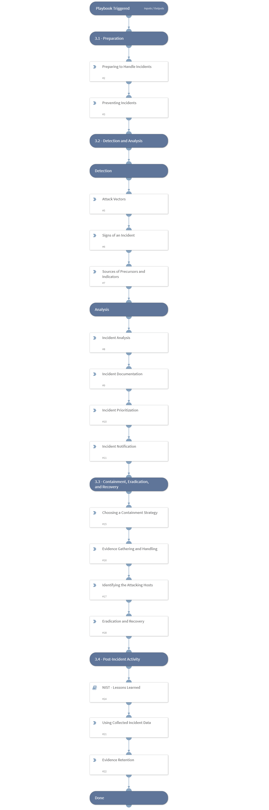

“Computer Security Incident Handling Guide” by NIST outlines the recommendations for handling a cyber security incident. The NIST Incident Response process contains four steps:
- Preparation.
- Detection and Analysis.
- Containment, Eradication, and Recovery.
- Post-Incident Activity.
This NIST content pack contains several playbooks to help streamline your incident response according to NIST guidelines. 

##### What does this pack do?
The playbooks included in this pack help you follow the phases in handling an incident as described in the ‘Handling an Incident’ section of NIST - Computer Security Incident Handling Guide.
Handling an incident - Computer Security Incident Handling Guide
https://nvlpubs.nist.gov/nistpubs/SpecialPublications/NIST.SP.800-61r2.pdf
The “NIST - Handling an Incident Template” playbook helps analysts follow the stages in handling an incident according to NIST guidelines. The “NIST - Lessons Learned” playbook helps SOC teams process an incident after it occurs and facilitates the lessons learned, organized by NIST stages. 
The “Access Investigation - Generic - NIST” playbook handles an access incident based on the stages described in the “Computer Security Incident Handling Guide”.
The playbook included in this pack helps you save time and automate repetitive tasks associated with Access incidents:
- Handle the incident based on the stages in “Handling an incident - Computer Security Incident Handling Guide” by NIST.
- Set the “NIST Stage” field to the different stages most relevant to the ongoing investigation.
- Gather and enrich user and IP information.
- Generate an investigation summary report.
- Notify the relevant parties on the incident.
- Interact with the suspected user about the activity.
- Remediate the incident by blocking malicious indicators and disabling the account.
- Run the “NIST - Lessons learned” sub-playbook to process the incident after the investigation and remediation is over.

As part of this pack, you will also get out-of-the-box “NIST” incident type views, with incident fields and a full layout. All of these are easily customizable to suit the needs of your organization.

_For more information, visit our  [Cortex XSOAR Developer Docs](https://xsoar.pan.dev/docs/reference/playbooks/nist---handling-an-incident-template)_

