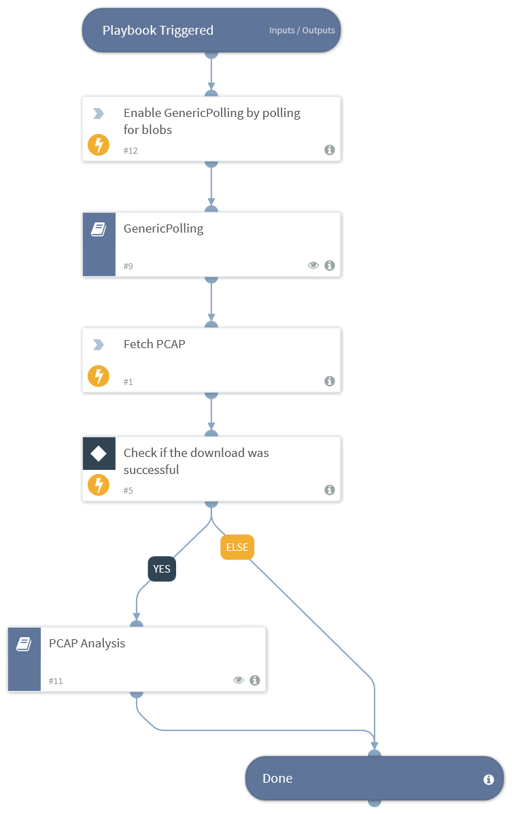

Playbook to enrich TD events

## Dependencies
This playbook uses the following sub-playbooks, integrations, and scripts.

### Sub-playbooks
* PCAP Analysis
* GenericPolling

### Integrations
* NTT Cyber Threat Sensor

### Scripts
This playbook does not use any scripts.

### Commands
* ntt-cyber-threat-sensor-fetch-blobs
* ntt-cyber-threat-sensor-poll-blobs

## Playbook Inputs
---
There are no inputs for this playbook.

## Playbook Outputs
---

| **Path** | **Description** | **Type** |
| --- | --- | --- |
| CTS.EventID | CTS EventID aka alert / sha | string |
| CTS.OccuredTime | Timestamp when incident was registered | date |

## Playbook Image
---

