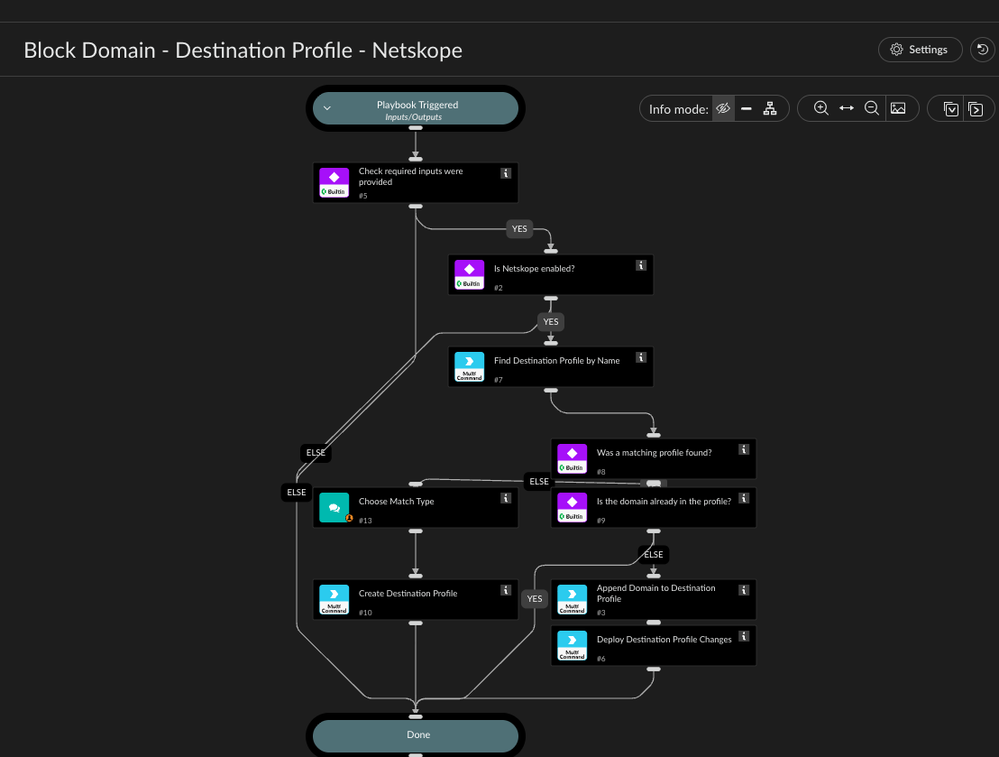

Blocks a domain via a Netskope Destination Profile: looks up the profile by name and either
appends the domain to that existing profile or, if no profile with that name exists yet,
prompts the analyst to pick a match type and creates a new one with the domain as its first
value.

The match type prompt is a single-select with exactly three choices - sensitive (Exact - Case
Sensitive), insensitive (Exact - Case Insensitive), or regex (RegEx), mirroring the "Match Type"
choice in the Netskope UI's destination profile editor - so there's no risk of a typo or wrong
casing (e.g. "Regex" instead of "regex") getting rejected by the create command. It's only asked
when a new profile actually needs to be created - it's skipped entirely when appending to a
profile that already exists (its match type was already fixed at creation).

Profile names are unique in Netskope, so an exact-match lookup (name eq "<ProfileName>") returns
at most one profile - no manual ID lookup needed, just the profile's display name.

IMPORTANT: unlike the URL List and File Hash List "append" behavior, Netskope's destination
profile values "append" operation has no server-side dedup - calling it twice with the same
domain (e.g. re-running this playbook for a domain that's already blocked) adds it twice. This
playbook checks the profile's current values (fetched by the name lookup) first and only
appends when the domain isn't already present, so re-running it for an already-blocked domain
is a safe no-op. Also make sure only one Netskope integration instance is enabled at a time - if
two are enabled, Cortex XSOAR dispatches the command to both, causing the same double-add.

Destination Profile changes are staged. Set Deploy to true to apply the pending change; it
defaults to false. ChangeNote is recorded only when a deployment is requested.

## Dependencies

This playbook uses the following sub-playbooks, integrations, and scripts.

### Sub-playbooks

This playbook does not use any sub-playbooks.

### Integrations

* NetskopeV2

### Scripts

This playbook does not use any scripts.

### Commands

* netskopev2-create-destination-profile
* netskopev2-deploy-destination-profiles
* netskopev2-list-destination-profiles
* netskopev2-update-destination-profile-values

## Playbook Inputs

---

| **Name** | **Description** | **Default Value** | **Required** |
| --- | --- | --- | --- |
| Domain | The domain to block. |  | Required |
| ProfileName | Name of the Netskope Destination Profile to add the domain to. The playbook performs an exact-name lookup without constructing a filter expression. If no profile exists, the analyst selects the match type before a pending profile is created. |  | Required |
| Deploy | Whether to deploy the pending Destination Profile change. Defaults to false. | false | Optional |
| ChangeNote | Change note recorded when Deploy is true. | Domain block requested from Cortex XSOAR | Optional |

## Playbook Outputs

---
There are no outputs for this playbook.

## Playbook Image

---

