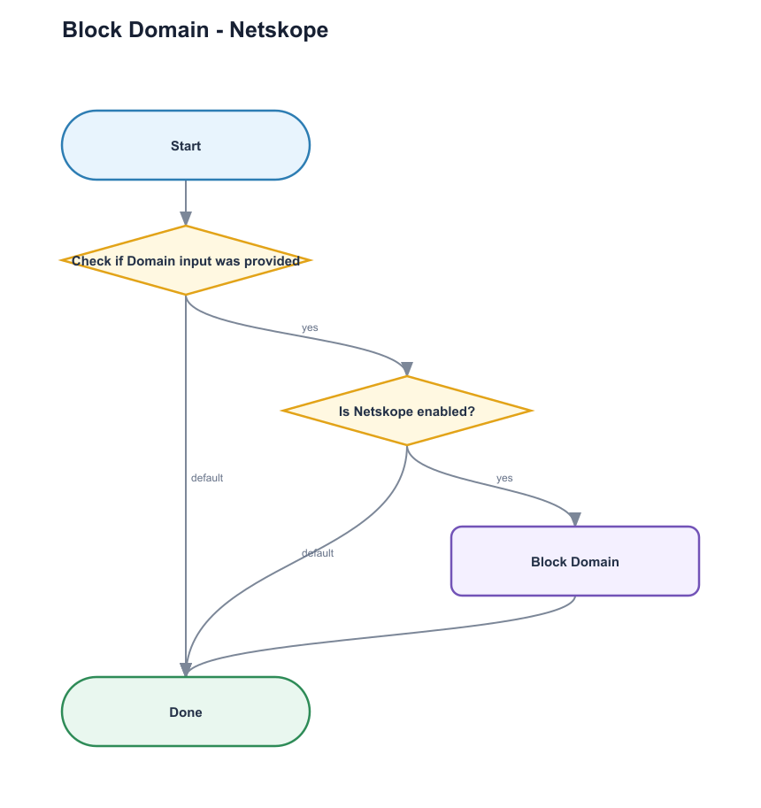

Blocks a domain by adding it to an existing Netskope URL List.

Checks whether the Domain input was provided, checks whether a Netskope integration instance is
enabled (matching any brand name containing "Netskope", so it works against a renamed
dev/test instance too), and if so blocks the domain by adding it to an existing Netskope URL
List.

This pack has no "create list" command - the ListName input must reference a list that already
exists.

## Dependencies

This playbook uses the following sub-playbooks, integrations, and scripts.

### Sub-playbooks

This playbook does not use any sub-playbooks.

### Integrations

* NetskopeV2

### Scripts

This playbook does not use any scripts.

### Commands

* netskopev2-add-url

## Playbook Inputs

---

| **Name** | **Description** | **Default Value** | **Required** |
| --- | --- | --- | --- |
| Domain | The domain to block. |  | Required |
| ListName | Name of an existing Netskope URL List to add the domain to. Must already exist - this pack has no create-list command. |  | Required |

## Playbook Outputs

---
There are no outputs for this playbook.

## Playbook Image

---

