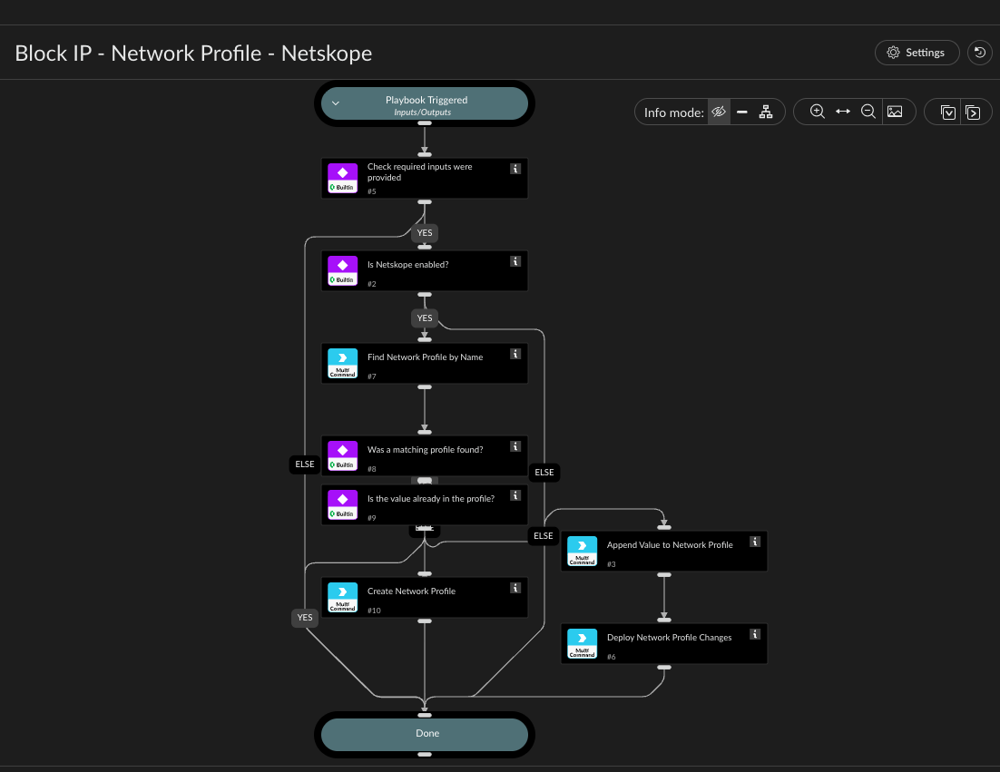

Blocks an IP address, IP range, or CIDR netmask via a Netskope Network Profile (shown as
"Network Location" in the Netskope UI) - the same "check input / check integration enabled /
act" pattern as Block Domain - Destination Profile - Netskope, adapted for Network Profiles
instead of Destination Profiles.

Looks up the network profile by name and either appends the value to that existing profile or,
if no profile with that name exists yet, creates a new one with the value as its first entry.

Unlike Destination Profiles, Network Profiles have no match type at all (netskopev2-create-
network-profile takes no "type" argument) - so unlike the destination profile playbook, there's
no "choose a match type" prompt here; creating a new profile needs nothing beyond the name and
the value itself.

Profile names are unique in Netskope, so the playbook performs an exact-name lookup without
constructing a filter expression.

IMPORTANT: like Destination Profiles, Network Profile values "append" has no server-side dedup -
calling it twice with the same value (e.g. re-running this playbook for a value that's already
present) adds it twice. This playbook checks the profile's current values first and only
appends when the value isn't already present, so re-running it for an already-blocked value is
a safe no-op. Also make sure only one Netskope integration instance is enabled at a time - if
two are enabled, Cortex XSOAR dispatches the command to both, causing the same double-add.

Network Profile changes are staged. Set Deploy to true to apply the pending change; it defaults
to false. ChangeNote is recorded only when a deployment is requested.

## Dependencies

This playbook uses the following sub-playbooks, integrations, and scripts.

### Sub-playbooks

This playbook does not use any sub-playbooks.

### Integrations

* NetskopeV2

### Scripts

This playbook does not use any scripts.

### Commands

* netskopev2-create-network-profile
* netskopev2-deploy-network-profiles
* netskopev2-list-network-profiles
* netskopev2-update-network-profile-values

## Playbook Inputs

---

| **Name** | **Description** | **Default Value** | **Required** |
| --- | --- | --- | --- |
| ProfileName | Name of the Netskope Network Profile \(shown as "Network Location" in the Netskope UI\). The playbook performs an exact-name lookup without constructing a filter expression. |  | Required |
| Value | IP address, IP range, or CIDR netmask to add \(e.g. "192.0.2.0/27"\). |  | Required |
| Deploy | Whether to deploy the pending Network Profile change. Defaults to false. | false | Optional |
| ChangeNote | Change note recorded when Deploy is true. | Network value block requested from Cortex XSOAR | Optional |

## Playbook Outputs

---
There are no outputs for this playbook.

## Playbook Image

---

