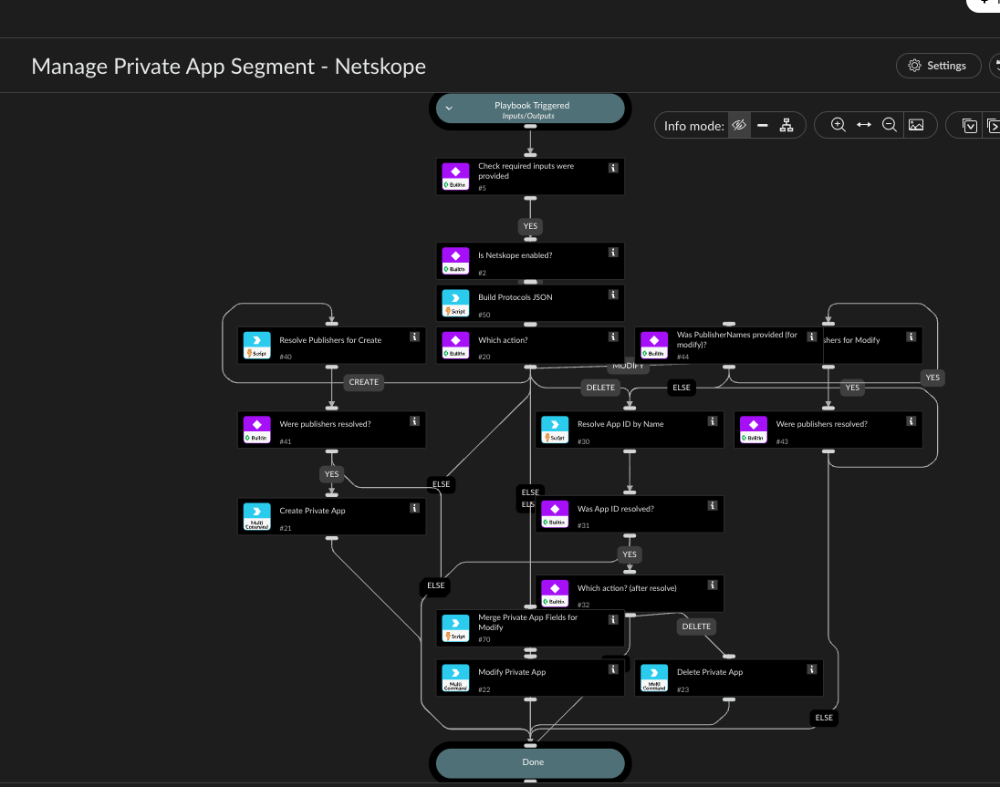

Creates, modifies, or deletes a Netskope private application (ZTNA/NPA) "segment" (Netskope's
own API models this as one Private App object: a host + its protocol/port entries + publishers,
per /api/v2/steering/apps/private/{private_app_id} - there is no separate "segment" sub-resource
in the API, so this playbook manages the whole private app object).

Checks whether the Action input was provided, checks whether a Netskope integration instance is
enabled (matching any brand name containing "Netskope"), then branches on Action:
- "create": creates a new private app using AppName, Host, Ports/ProtocolType, PublisherNames,
  and Tags.
- "modify": updates an existing private app (identified by AppID, or by AppName - see below) -
  only the fields you provide among AppName/Host/Ports/PublisherNames/Tags are changed, the
  rest are left as-is. HostsToAdd/PortsToAdd/TagsToAdd append to the current host/protocols/tags
  instead of replacing them; HostsToRemove/PortsToRemove/TagsToRemove remove specific values from
  the current host/protocols/tags instead of requiring you to retype everything else. Task #70
  fetches the app's current state and applies these merges before the PATCH is sent.
- "delete": permanently deletes the private app identified by AppID or AppName.

The playbook uses the modify operation for partial updates and supports adding or removing
individual field values without replacing the whole object.

For modify/delete, you can provide AppID directly, or leave it blank and provide AppName
instead - netskopev2-list-private-apps has no name filter argument at all, so task #30 fetches
every private app and resolves AppName to an ID itself (also handling the "[app_name]"
bracket-wrapping Netskope applies in list responses). If no app or more than one app matches
that name, the playbook stops with a clear error rather than guessing.

Similarly, PublisherNames takes plain publisher names (e.g. "AWS-NPA") instead of requiring you
to already know each publisher_id - netskopev2-list-publishers also has no name filter, so
tasks #40 (create) / #42 (modify, only if PublisherNames was provided) resolve each name and
build the {"publisher_id": ..., "publisher_name": ...} JSON array the create/update commands
expect.

Ports takes a comma-separated list of port numbers. Task #50 builds the object array expected by
the create and update commands, which validate that protocols is an array of objects.
Host already accepts multiple comma-separated values directly (e.g. "10.0.0.1,10.0.0.2") - no
lookup or building needed for that one.

## Dependencies

This playbook uses the following sub-playbooks, integrations, and scripts.

### Sub-playbooks

This playbook does not use any sub-playbooks.

### Integrations

* NetskopeV2

### Scripts

* NetskopeBuildProtocolsJson
* NetskopeMergePrivateAppFields
* NetskopeResolvePrivateAppId
* NetskopeResolvePublishers
* PrintErrorEntry

### Commands

* netskopev2-create-private-app
* netskopev2-delete-private-app
* netskopev2-update-private-app

## Playbook Inputs

---

| **Name** | **Description** | **Default Value** | **Required** |
| --- | --- | --- | --- |
| Action | Required. Must be create, modify, or delete. Any other value produces an explicit error and no Netskope command is run. |  | Required |
| AppID | ID of the existing private app to modify or delete. Optional for Action=modify/delete if AppName is provided instead - netskopev2-list-private-apps has no name filter, so the playbook fetches all apps and resolves AppName to an ID itself \(fails clearly if no app or more than one app matches that name\). Ignored for Action=create. |  | Optional |
| AppName | Name of the private app. Required for Action=create. For Action=modify, either leave blank to keep the current name, or use it \(with AppID blank\) to look up which app to modify by name. For Action=delete, provide this \(with AppID blank\) to look up which app to delete by name. |  | Optional |
| Host | IP address or hostname of the private app segment - comma-separated for multiple hosts \(e.g. "10.0.0.1,10.0.0.2" or "webserver.local,192.168.0.1"\), Netskope accepts this directly. Required for Action=create, optional for Action=modify \(leave blank to keep the current host\). |  | Optional |
| Ports | Comma-separated port numbers \(e.g. "443,8080,22"\) - no need to hand-write the \{type, port\} JSON array yourself, task |  | Optional |
| ProtocolType | Transport protocol applied to every port in Ports \(e.g. "tcp" or "udp"\) - all ports share this one type. Also used for any newly added ports in PortsToAdd. Defaults to "tcp". | tcp | Optional |
| HostsToAdd | Action=modify only. Comma-separated hosts to add to the app's existing host list \(e.g. "10.0.0.5"\) without discarding the current ones - task |  | Optional |
| PortsToAdd | Action=modify only. Comma-separated ports to add to the app's existing protocols \(e.g. "8080"\) without discarding the current ones - task |  | Optional |
| HostsToRemove | Action=modify only. Comma-separated hosts to remove from the app's existing host list \(e.g. "10.0.0.5"\) without discarding the rest - task |  | Optional |
| PortsToRemove | Action=modify only. Comma-separated ports to remove from the app's existing protocols \(e.g. "8080"\) without discarding the rest - task |  | Optional |
| PublisherNames | Comma-separated publisher names \(e.g. "AWS-NPA"\) - no need to know publisher_id. netskopev2-list-publishers has no name filter, so tasks |  | Optional |
| Tags | Comma-separated tag names to associate with the app, for policy matching. Optional for both Action=create and Action=modify. For Action=modify, this replaces the app's entire tag list - to add or remove individual tags without discarding the rest, use TagsToAdd/TagsToRemove instead \(those take priority over Tags when provided\). |  | Optional |
| TagsToAdd | Action=modify only. Comma-separated tags to add to the app's existing tags \(e.g. "test"\) without discarding the current ones - task |  | Optional |
| TagsToRemove | Action=modify only. Comma-separated tag names to remove from the app's existing tags without discarding the rest - task |  | Optional |

## Playbook Outputs

---
There are no outputs for this playbook.

## Playbook Image

---

