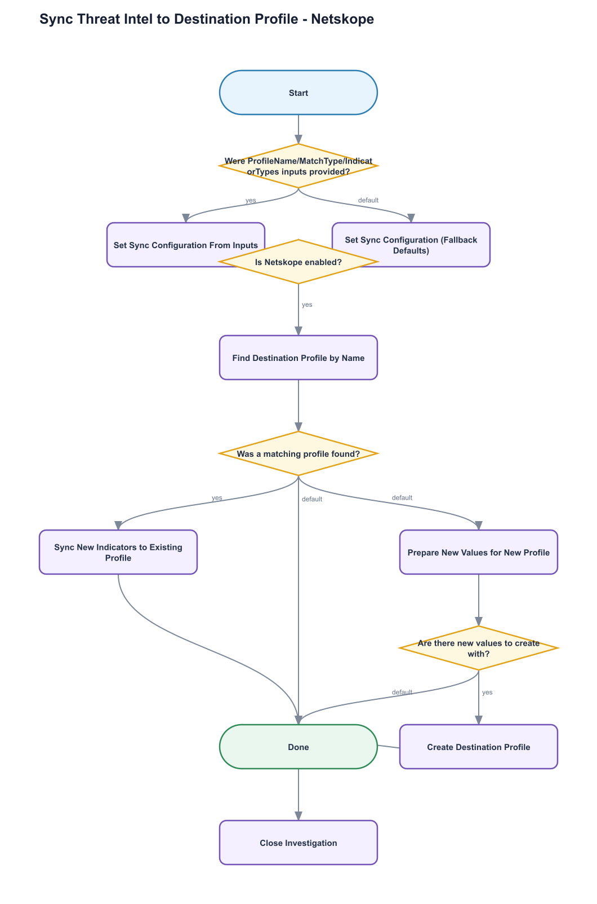

Synchronizes a Netskope Destination Profile with indicators already ingested into Cortex XSOAR's
Threat Intel Management. Run it periodically, for example, from an hourly scheduled Job in Cortex
XSOAR.

ProfileName, MatchType, and IndicatorTypes are ordinary playbook inputs with defaults pre-filled
in the Inputs and Outputs panel (Test02 / regex / Domain,URL,IP,CIDR) - edit them there like any
other input, no task editing needed. IMPORTANT caveat: on this instance, a Job-triggered run of
this playbook does not apply a playbook input's default Value (confirmed empirically - the Job's
incident has no matching custom fields, and the declared input default isn't substituted for an
auto-triggered main playbook), so this run's inputs may come through empty even with defaults
set. To handle that, task #13 ("Were ... inputs provided?") checks for this and, if they're
empty, falls back to the exact same default values hardcoded directly in task #14 - so the sync
still runs correctly on a Job either way. If you change the defaults, update BOTH the input's
Value in this panel AND task #14's values argument, so manual runs and Job runs stay consistent.
All three inputs and both tasks write to the same SyncConfig context key that every downstream
task reads from.

Checks whether a Netskope integration instance is enabled (matching any brand name containing
"Netskope"), looks up the destination profile by name, then:
- if the profile exists: searches Cortex XSOAR indicators of the selected IndicatorTypes
  (Domain/URL/IP/CIDR, customer-selectable), skips any value already present in the profile,
  appends the rest in batches of at most 10 (the API's per-call cap - batching is done inside
  the NetskopeIndicatorSync script, not via a playbook loop task), and deploys the change.
- if no profile with that name exists yet: searches the same way, and if any values were found,
  creates a new profile with MatchType and those values in one call (create has no 10-item cap
  and applies immediately by default, so no separate deploy step is needed on this path).

CIDR indicator values are prefixed with "CIDR:" to match the format Netskope's destination
profile Definition field expects; Domain/URL/IP values are passed through as-is. This playbook
does not attempt to convert CIDR ranges into Netskope's separate "RANGE:start-end" syntax - if
you need that, extend NetskopeIndicatorSync's format_value function.

Every run only pulls indicators already found via the same de-dup logic used by the Block Domain
- Destination Profile playbook (checking current profile values first), so re-running this on a
schedule with a mostly-unchanged indicator set is a safe, idempotent no-op for values already
synced.

Ends with a Close Investigation task - a recurring Job typically won't start a new run while
the previous job-created incident is still open, so leaving it open (the default if a playbook
just ends at a title task) silently blocks every future firing regardless of the configured
interval.

Make sure only one Netskope integration instance is enabled at a time - if two are enabled,
Cortex XSOAR dispatches every command to both, silently doubling every append.

## Dependencies

This playbook uses the following sub-playbooks, integrations, and scripts.

### Sub-playbooks

This playbook does not use any sub-playbooks.

### Integrations

* NetskopeV2

### Scripts

* NetskopeIndicatorSync

### Commands

* SetMultipleValues
* closeInvestigation
* netskopev2-create-destination-profile
* netskopev2-list-destination-profiles

## Playbook Inputs

---

| **Name** | **Description** | **Default Value** | **Required** |
| --- | --- | --- | --- |
| ProfileName | Name of the Netskope Destination Profile to sync indicators into. Defaults to "Test02" - if this run's value ever comes through empty \(e.g. a Job-triggered run on this instance, which doesn't apply this default automatically\), the playbook falls back to the same "Test02" default set directly in task | Test02 | Optional |
| MatchType | Match type to use only if ProfileName doesn't exist yet and a new profile needs to be created - ignored when appending to an existing profile. One of "sensitive" \(Exact - Case Sensitive\), "insensitive" \(Exact - Case Insensitive\), or "regex" \(RegEx\). Defaults to "regex" - keep task | regex | Optional |
| IndicatorTypes | Comma-separated list of Cortex XSOAR indicator types to pull and sync into the profile. One or more of Domain, URL, IP, CIDR. Defaults to all four - keep task | Domain,URL,IP,CIDR | Optional |
| Tags | Optional comma-separated indicator tags to further restrict which indicators are pulled \(e.g. "netskope-block"\). Leave empty to consider all indicators regardless of tag. |  | Optional |
| SkipTags | Optional comma-separated indicator tags to exclude - any indicator carrying one of these tags is skipped even if it matches Tags. Leave empty to not exclude by tag. |  | Optional |
| MaxIndicators | Maximum number of indicators to pull from Cortex XSOAR per run \(default 500 if left empty\). Bounds how much work a single scheduled run does. |  | Optional |

## Playbook Outputs

---
There are no outputs for this playbook.

## Playbook Image

---

