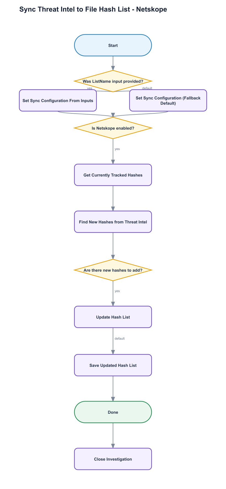

Synchronizes a Netskope file hash list with File indicators already ingested into Cortex XSOAR's
Threat Intel Management. Run it periodically, for example, from an hourly scheduled Job in Cortex
XSOAR.

Maintains the same "list is replace-only, track history on the Cortex XSOAR side" logic used by the
manual Update File Hash List playbook: Netskope's v1 file hash list API has no endpoint to read
the current list content, so this playbook tracks the running hash set in a Cortex XSOAR List named
"NetskopeHashList_<ListName>" (via NetskopeGetXsoarListContent / NetskopeSetXsoarListContentWithRetry,
exactly as before), merges it with newly found hashes from Threat Intel, and sends the full
merged set as a replace. If nothing new is found, it skips the update call entirely rather than
resending an unchanged list every hour.

ListName is an ordinary playbook input with a default pre-filled ("CTETest") in the Inputs and
Outputs panel - edit it there like any other input, no task editing needed. IMPORTANT caveat: on
this instance, a Job-triggered run of this playbook does not apply a playbook input's default
Value (confirmed empirically), so this run's input may come through empty even with a default
set. Task #13 ("Was ListName input provided?") checks for this and, if empty, falls back to the
exact same default hardcoded directly in task #14 - so the sync still runs correctly on a Job
either way. If you change the default, update BOTH ListName's Value in this panel AND task #14's
values argument, so manual runs and Job runs stay consistent. Both write to the same
HashSyncConfig context key that every downstream task reads from.

Checks whether a Netskope integration instance is enabled (matching any brand name containing
"Netskope"), reads the currently tracked hash set, searches Cortex XSOAR File indicators (optionally
restricted by Tags) for valid MD5 (32 hex chars) or SHA256 (64 hex chars) hashes - checking both
an indicator's value and its md5/sha256 CustomFields - and if any aren't already tracked,
updates the Netskope list and saves the new full set back to the Cortex XSOAR List for the next run.

Ends with a Close Investigation task - a recurring Job typically won't start a new run while
the previous job-created incident is still open, so leaving it open (the default if a playbook
just ends at a title task) silently blocks every future firing regardless of the configured
interval.

Make sure only one Netskope integration instance is enabled at a time - if two are enabled,
Cortex XSOAR dispatches the update command to both.

## Dependencies

This playbook uses the following sub-playbooks, integrations, and scripts.

### Sub-playbooks

This playbook does not use any sub-playbooks.

### Integrations

* NetskopeV2

### Scripts

* NetskopeFileHashSync
* NetskopeGetXsoarListContent
* NetskopeSetXsoarListContentWithRetry

### Commands

* SetMultipleValues
* closeInvestigation
* netskopev2-update-file-hash-list

## Playbook Inputs

---

| **Name** | **Description** | **Default Value** | **Required** |
| --- | --- | --- | --- |
| Tags | Optional comma-separated indicator tags to further restrict which File indicators are pulled \(e.g. "malware"\). Leave empty to consider all File-type indicators. |  | Optional |
| ListName | Name of an existing Netskope file hash list to update. Must already exist in the Netskope UI. Defaults to "CTETest" - if this run's value ever comes through empty \(e.g. a Job-triggered run on this instance, which doesn't apply this default automatically\), the playbook falls back to the same "CTETest" default set directly in task | CTETest | Optional |
| MaxIndicators | Maximum number of File indicators to pull from Cortex XSOAR per run \(default 500 if left empty\). Bounds how much work a single scheduled run does. |  | Optional |

## Playbook Outputs

---
There are no outputs for this playbook.

## Playbook Image

---

