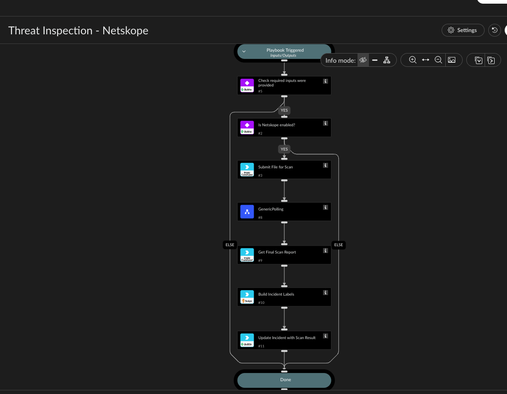

Submits a file for Netskope's sandbox scan (netskopev2-submit-file-scan /
netskopev2-get-scan-report) and polls for the result, since the scan is asynchronous and can
take a while to complete.

Only certain file types are accepted for inspection - this is enforced by
netskopev2-submit-file-scan itself (not just this playbook), per the API spec: the file must be
a password-protected .zip whose one member file is .exe, .pdf, .doc, .xls, .ppt, or .rtf. A
plain .zip (the container format) is also accepted directly. Anything else is rejected with a
clear error before an API call is even made.

Checks whether the EntryID input was provided, checks whether a Netskope integration instance is
enabled (matching any brand name containing "Netskope"), submits the file for scanning, then
uses the standard GenericPolling sub-playbook to repeatedly call netskopev2-get-scan-report
(every Interval minutes, up to Timeout minutes) until the scan's status stops being
"InProgress". The final poll's result is what's left in the Netskope.FileScanReport context
when this playbook finishes - no separate "final fetch" step is needed.

## Dependencies

This playbook uses the following sub-playbooks, integrations, and scripts.

### Sub-playbooks

* GenericPolling

### Integrations

* NetskopeV2

### Scripts

* NetskopeFileScanLabels

### Commands

* netskopev2-get-scan-report
* netskopev2-submit-file-scan
* setIncident

## Playbook Inputs

---

| **Name** | **Description** | **Default Value** | **Required** |
| --- | --- | --- | --- |
| EntryID | Entry ID of the file to submit for sandbox scanning. Defaults to $\{File.EntryID\} - the file already attached to the incident \(via the War Room\) - so no manual entry is needed if the incident has exactly one attached file. Must be one of: zip, exe, pdf, doc, xls, ppt, rtf \(per the Netskope API spec, the file should be a password-protected .zip whose one member is exe/pdf/doc/xls/ppt/rtf - a plain .zip is also accepted directly\). Anything else is rejected with a clear error by netskopev2-submit-file-scan itself. | ${File.EntryID} | Required |
| Interval | Minutes between each poll of the scan status. | 1 | Optional |
| Timeout | Maximum minutes to keep polling before giving up and resuming the playbook \(sandbox scans can take a while\). | 15 | Optional |

## Playbook Outputs

---
There are no outputs for this playbook.

## Playbook Image

---

