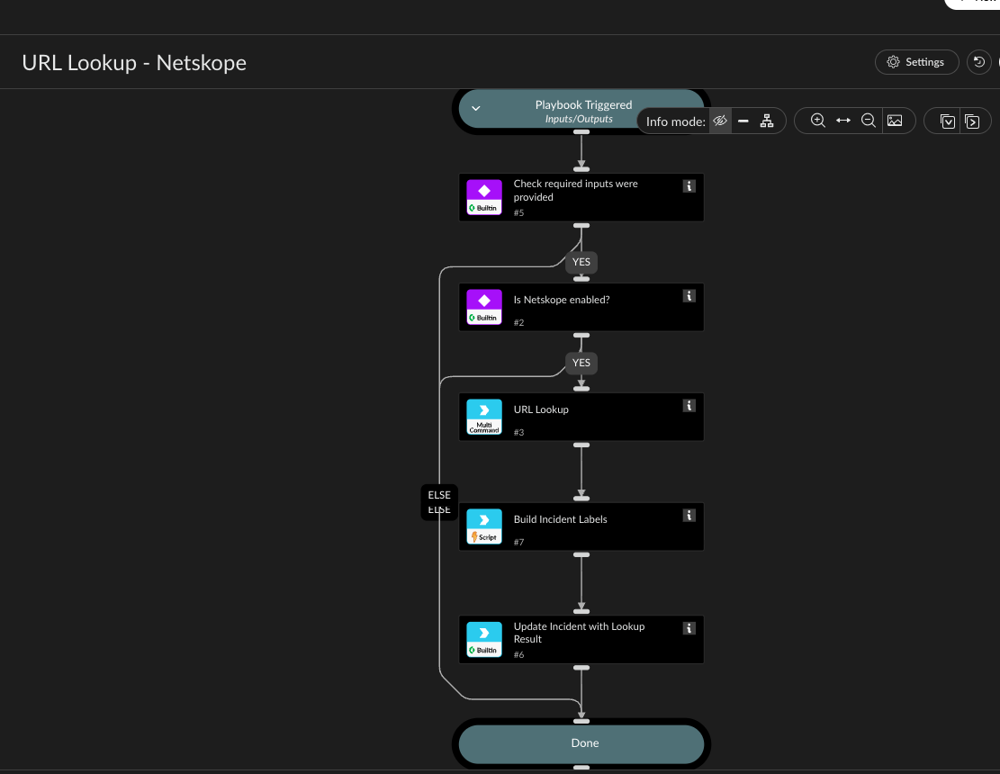

Looks up a URL's categorization/reputation info via netskopev2-url-lookup and records the
result as labels directly on the incident.

netskopev2-url-lookup is a bulk API (up to 100 URLs per call), but this playbook only ever
queries one URL at a time, matching the single URL input. Building the addLabels JSON string
from the lookup result requires joining nested category/URL-list names into flat values, which
isn't reliably expressible in plain playbook YAML templating (see NetskopeURLLookupLabels for
why) - that script does the real work; this playbook just wires it together.

netskopev2-url-lookup is a licensed feature on the Netskope side - if you get an error mentioning
licensing/enablement, URL Lookup needs to be enabled for your tenant by Netskope support.

## Dependencies

This playbook uses the following sub-playbooks, integrations, and scripts.

### Sub-playbooks

This playbook does not use any sub-playbooks.

### Integrations

* NetskopeV2

### Scripts

* NetskopeURLLookupLabels

### Commands

* netskopev2-url-lookup
* setIncident

## Playbook Inputs

---

| **Name** | **Description** | **Default Value** | **Required** |
| --- | --- | --- | --- |
| URL | The URL to look up. |  | Required |

## Playbook Outputs

---
There are no outputs for this playbook.

## Playbook Image

---

