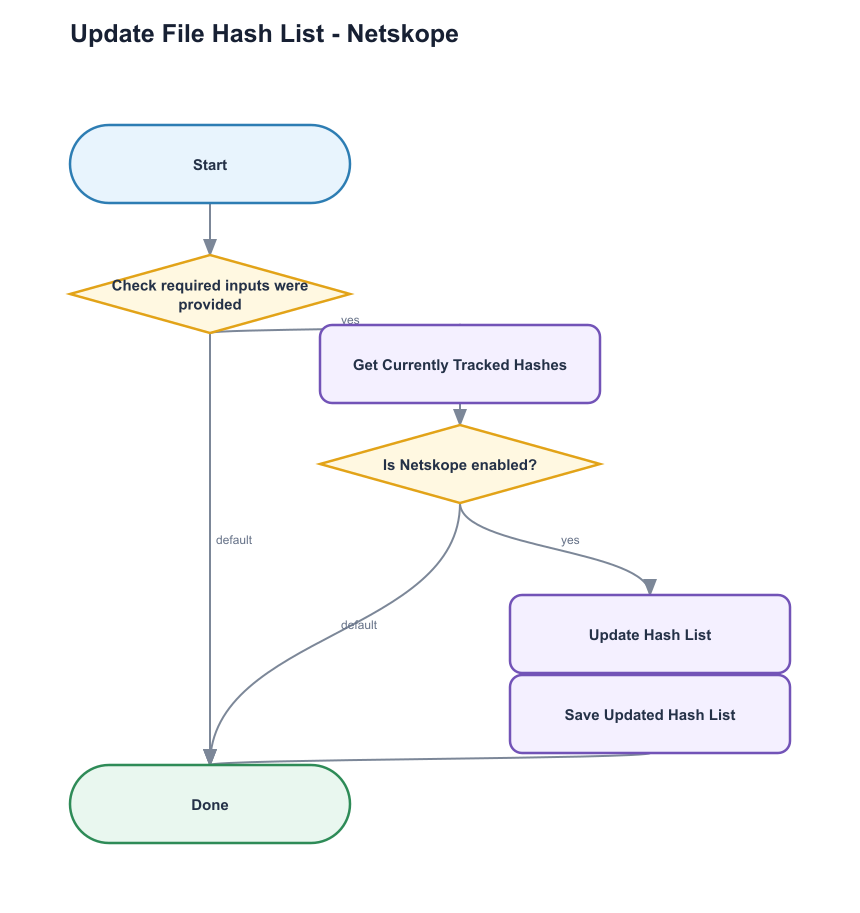

Adds hashes to a Netskope file hash list via netskopev2-update-file-hash-list.

IMPORTANT: Netskope's file hash list API (v1) has no endpoint to read the current list content -
every update REPLACES the full list, it cannot append. Since Netskope itself can't tell us
what's already there, this playbook tracks the running hash set on the Cortex XSOAR side instead, in
a Cortex XSOAR List named "NetskopeHashList_<ListName>" (auto-created on first run): it reads that
List's current content (via the NetskopeGetXsoarListContent script), merges it with NewHashes,
sends the full merged set to Netskope, then writes the result back (via
NetskopeSetXsoarListContentWithRetry, which retries a few times if Cortex XSOAR's storage backend
reports a transient version conflict from a concurrent write) to the same Cortex XSOAR List so the
next run picks up where this one left off. No manual "what's already in the list" input needed.

Only MD5 (32 hex chars) and SHA256 (64 hex chars) hashes are accepted - the command itself
validates this and rejects anything else. A "duplicate request, no change" response from
Netskope is treated as success, not an error, since the desired state (these hashes being
present) is already true in that case.

The ListName input must reference a Netskope list that already exists (the tracking List on the
Cortex XSOAR side is separate and gets created automatically).

## Dependencies

This playbook uses the following sub-playbooks, integrations, and scripts.

### Sub-playbooks

This playbook does not use any sub-playbooks.

### Integrations

* NetskopeV2

### Scripts

* NetskopeGetXsoarListContent
* NetskopeSetXsoarListContentWithRetry

### Commands

* netskopev2-update-file-hash-list

## Playbook Inputs

---

| **Name** | **Description** | **Default Value** | **Required** |
| --- | --- | --- | --- |
| ListName | Name of an existing Netskope file hash list to update. Must already exist in the Netskope UI. |  | Required |
| NewHashes | Comma-separated MD5 or SHA256 hashes to add to the list this run. |  | Required |

## Playbook Outputs

---
There are no outputs for this playbook.

## Playbook Image

---

