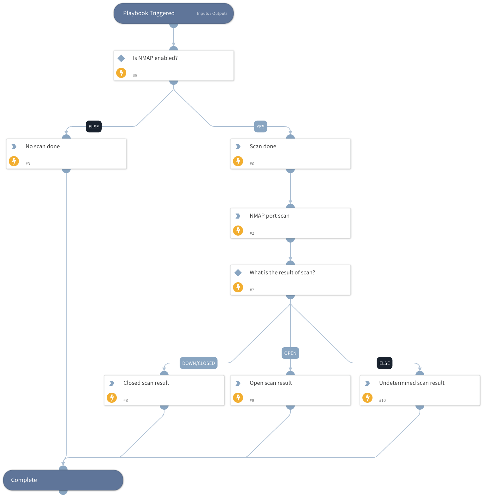

Sub-playbook that conducts a single port NMAP scan and returns results to the parent playbook.

## Dependencies
This playbook uses the following sub-playbooks, integrations, and scripts.

### Sub-playbooks
This playbook does not use any sub-playbooks.

### Integrations
NMAP

### Scripts
Set

### Commands
nmap-scan

## Playbook Inputs
---

| **Name** | **Description** | **Default Value** | **Required** |
| --- | --- | --- | --- |
| RemoteIP | Remote IP address in an incident/alert. |  | Required |
| RemotePort | Remote port number in an incident/alert. |  | Required |
| NMAPOptions | Options to be used for an Nmap scan. \(We do "-p\<RemotePort\>" by default and recommend using "-Pn" to skip a ping check\.) |  | Optional |

## Playbook Outputs
---

| **Path** | **Description** | **Type** |
| --- | --- | --- |
| ScanResult | The result of the scan \(if done\). | unknown |
| ScanDone | Whether a scan was actually performed \(based on subtypes\). | unknown |
| NMAP | NMAP scan data | unknown |

## Playbook Image
---

