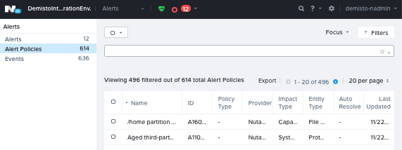

## Nutanix

### Available Alert Type IDs, Impact Types, and Entity Types
Alert Policies contains the list of all possible alerts in the system,
and their ID, impact type, and entity type. In order to check the optional values for these entities:

1. Go to your Nutanix UI and navigate to the *Alerts* screen. (Can be found under the second tab in the top left corner, see image below)
2. Navigate to the Alert Policies tab on the left sidebar.
You should see the following screen:
   

* *ID* is the alert type ID filter parameter for fetching alerts, or the argument for the ***nutanix-hypervisor-alerts-list*** command.
* *Impact Type* is the impact type filter parameter for fetching alerts, or the argument for the ***nutanix-hypervisor-alerts-list*** command.

### Permissions
The following commands require cluster admin or higher permissions.
(Found in Nutanix Settings in the *Users And Roles* category.)

- ***nutanix-hypervisor-vm-powerstatus-change***
- ***nutanix-hypervisor-alert-acknowledge***
- ***nutanix-hypervisor-alert-resolve***
- ***nutanix-hypervisor-alerts-acknowledge-by-filter***
- ***nutanix-hypervisor-alerts-resolve-by-filter***