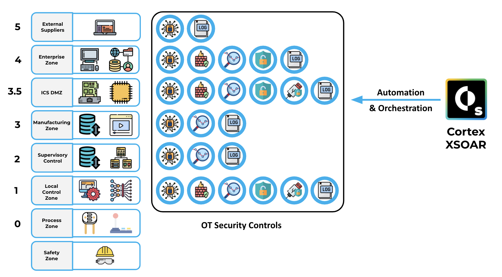
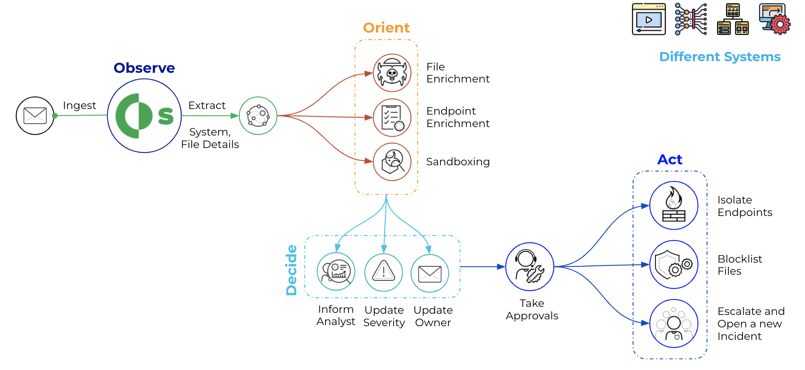
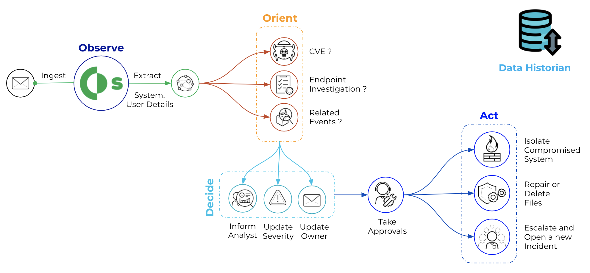
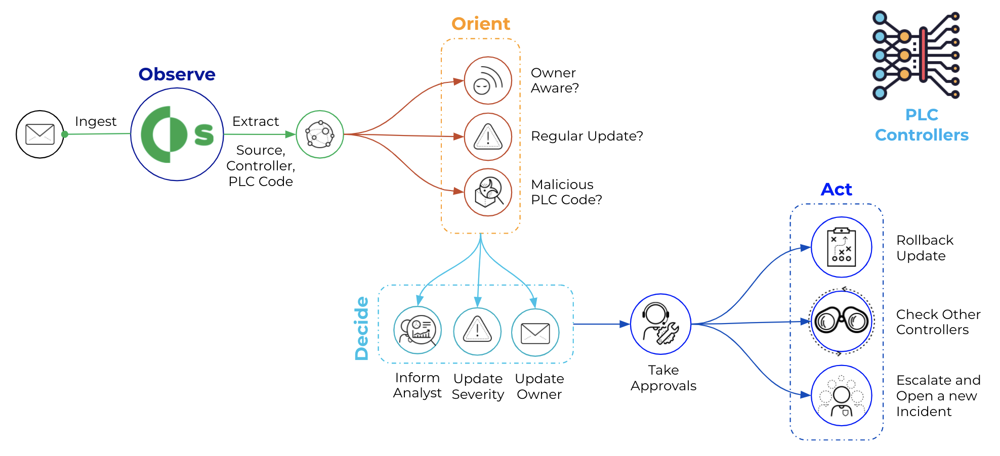
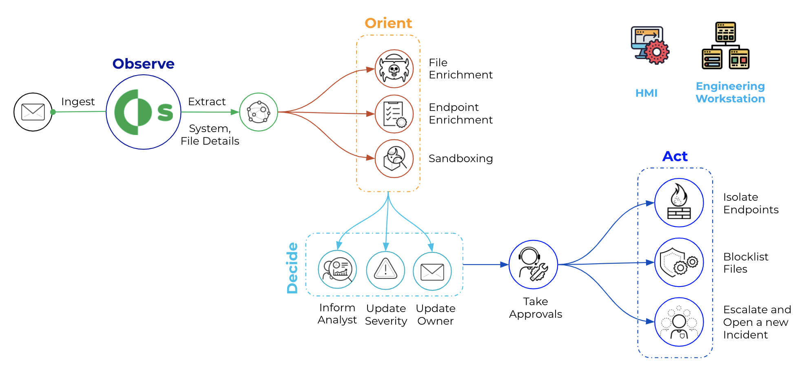
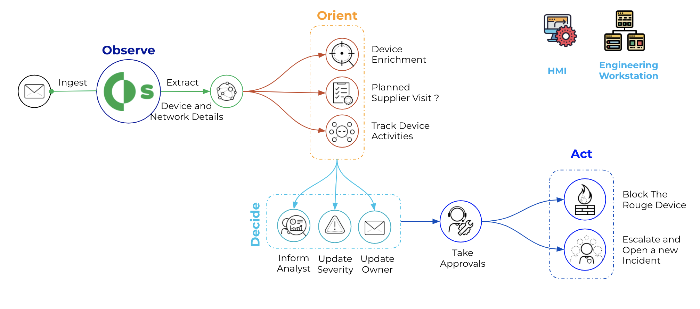
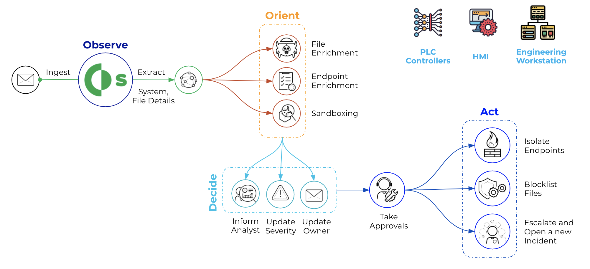
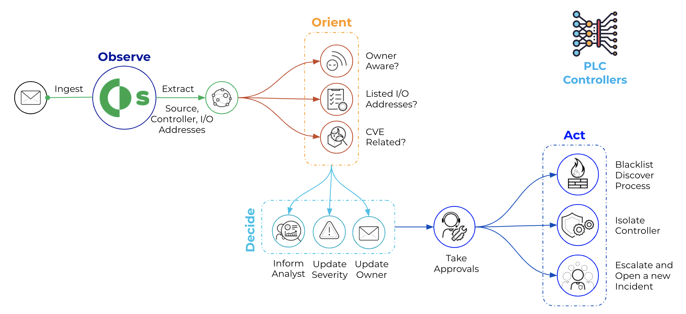
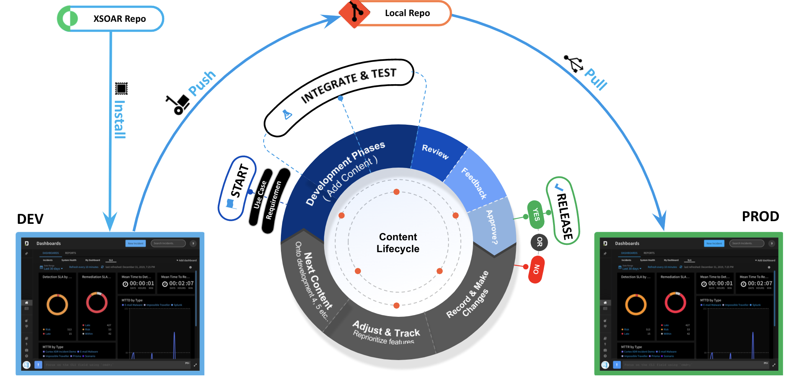

This OT Security pack is created to help you to automate the incident response and threat hunting processes in your Operations and ICS environment.

# Pack Overview

Cortex XSOAR helps to automate OT incidents and alerts response by gathering all relevant data, even from sources that may seem unrelated,
allowing for the buildout of playbooks that cater to the particular automation needs of an ICS’s operational requirements. It also provides bot-aided war rooms where
security analysts and SMEs can safely and securely collaborate on the best course of action. Most importantly, Cortex XSOAR provides automatic documentation of all steps and
processes taken to validate and resolve issues or incidents, creating a knowledge warehouse for first responders. 

# Pack Roadmap
Below are sample types OT investigation that his pack will focus on:

- __Initial Access__
    - Supply Chain Compromise
    

    - Data Historian Compromise
    

- __Execution and Persistence__
    - Unauthorized Program State Alteration
    
    - Project File Infection
    
- __Evasion__
    - Rogue Device Detected
    
    - Rootkits Detected
    
- __Discovery__
    - I/O Module Discovery
    
    - Network Service Scanning
    
- __Lateral Movement__
    - Default Credentials Login
    - Unautherized Remote File Copy
- __Collection__
    - Process State Dump
    - Unautherized Program Upload
- __Command and Control__
    - Proxied Connection Detected
    - Protocol Anomaly Detected
- __Inhibit ICS Function__
    - Activate Firmware Update Mode
    - Unauthorized Program State Alteration

XSOAR content included in this pack will be built based on our integrations with OT security controls that include:
- __Network Segmentation Firewalls From__
    - Palo Alto Networks
    - FortiGate
    - Cisco
    - Calroty
- __Network Access Control From__
    - Cisco
    - Forsecout
- __Network Visibility From__
    - Nozomi
    - ScadaFence
- __Endpoint Security From__
    - Kaspersky
    - Symantec
- __SIEM From__
    - IBM
    - Logrhythem
    - Splunk
- __Vulnerability Management From__
    - Tenable

# XSOAR in Isolated OT Environment

XSOAR provides the ability to have a production instance running in an isolated OT environment, with a jumb host access to a local repository that stores the content updates, for more details:
[Cortex XSOAR 6.13](https://docs-cortex.paloaltonetworks.com/r/Cortex-XSOAR/6.13/Cortex-XSOAR-Administrator-Guide/Configure-a-Remote-Repository-on-a-Development-Machine) or [Cortex XSOAR 8 Cloud](https://docs-cortex.paloaltonetworks.com/r/Cortex-XSOAR/8/Cortex-XSOAR-Cloud-Documentation/Set-up-a-remote-repository) or [Cortex XSOAR 8.7 On-prem](https://docs-cortex.paloaltonetworks.com/r/Cortex-XSOAR/8.7/Cortex-XSOAR-On-prem-Documentation/Remote-Repository-Management).