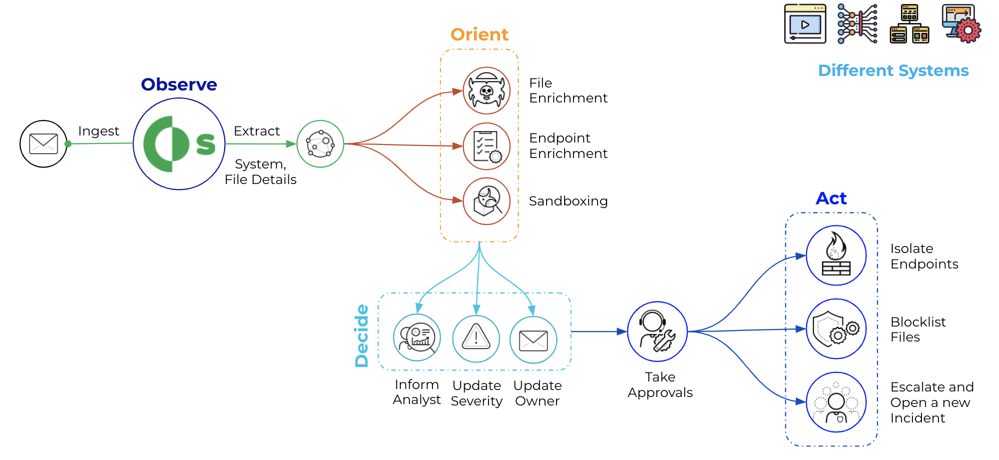
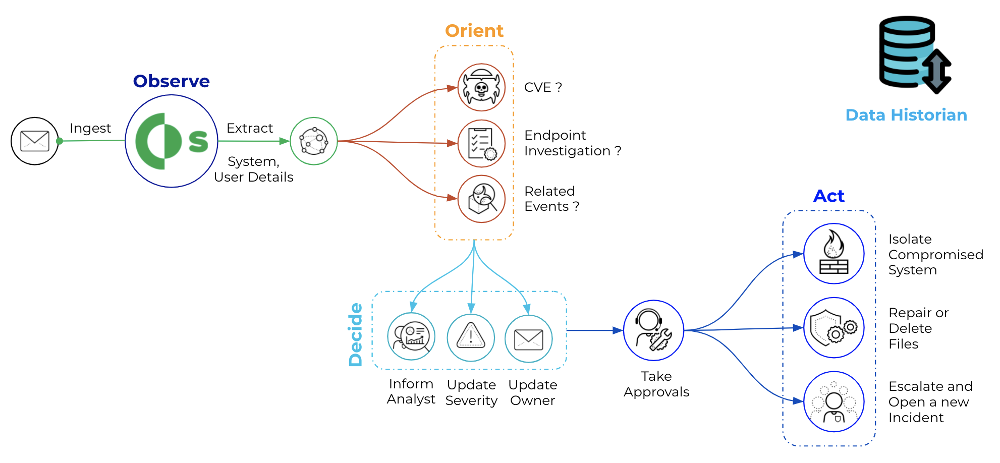
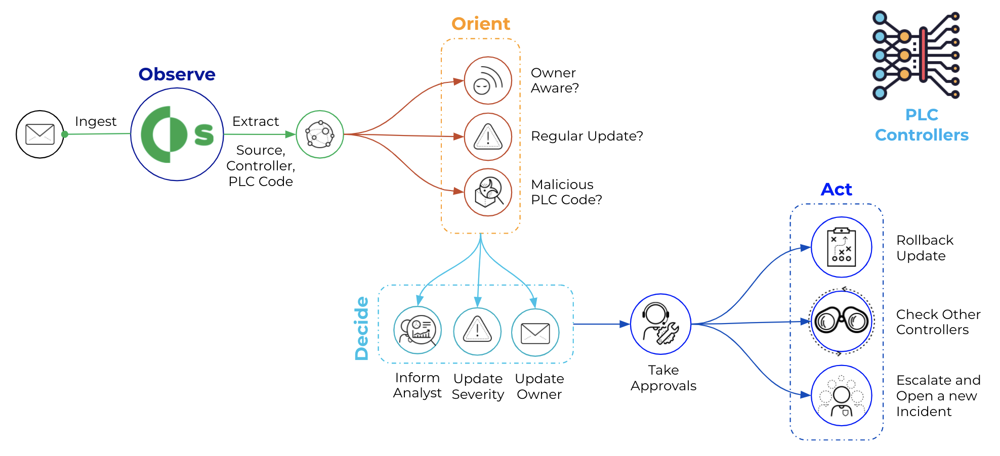
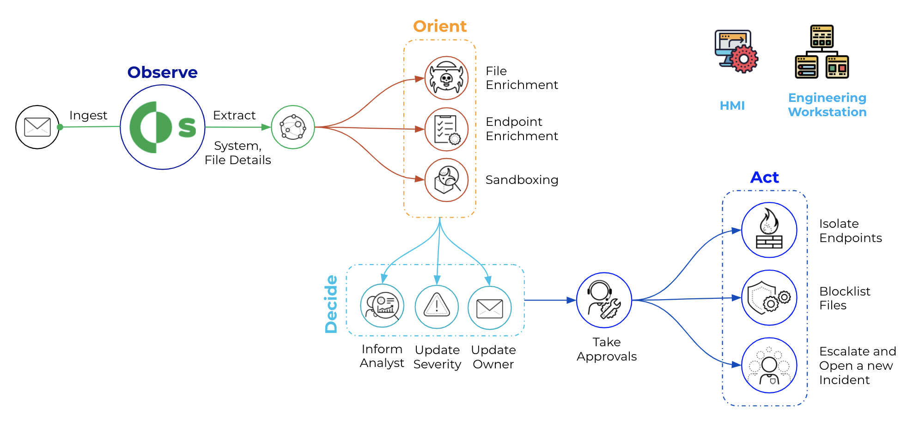
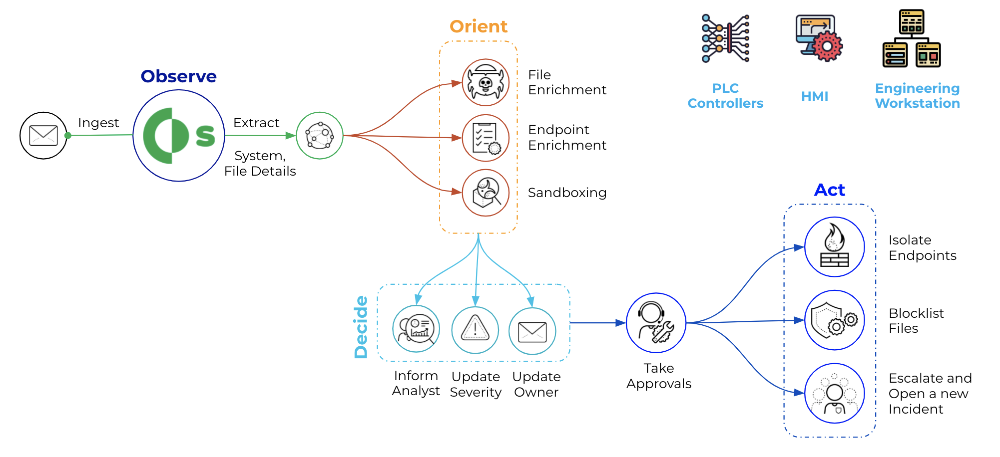
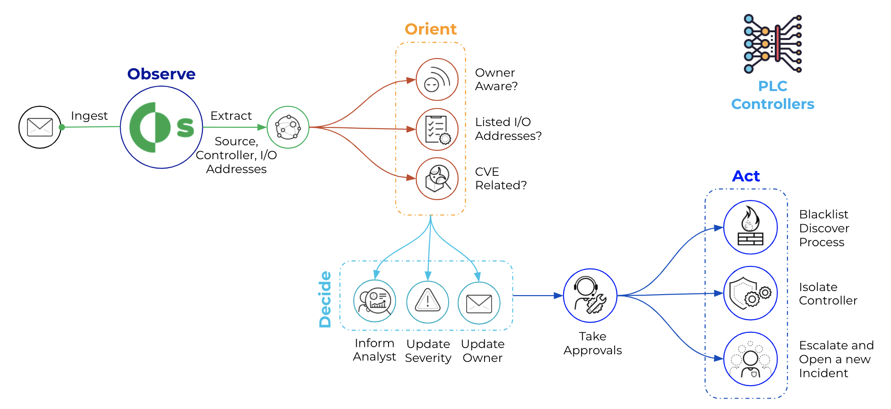

This OT Security pack is created to help you to automate the incident response and threat hunting processes in your Operations and ICS environment.

Cortex XSOAR helps to automate OT incidents and alerts response by gathering all relevant data, even from sources that may seem unrelated,
allowing for the buildout of playbooks that cater to the particular automation needs of an ICS’s operational requirements. It also provides bot-aided war rooms where
security analysts and SMEs can safely and securely collaborate on the best course of action. Most importantly, Cortex XSOAR provides automatic documentation of all steps and
processes taken to validate and resolve issues or incidents, creating a knowledge warehouse for first responders. Below are sample types OT investigation that his pack will focus on:

- __Initial Access__
    - Supply Chain Compromise
    

    - Data Historian Compromise
    

- __Execution and Persistence__
    - Unauthorized Program State Alteration
    
    - Project File Infection
    
- __Evasion__
    - Rogue Device Detected
    
    - Rootkits Detected
    
- __Discovery__
    - I/O Module Discovery
    
    - Network Service Scanning
    
- __Lateral Movement__
    - Default Credentials Login
    - Unautherized Remote File Copy
- __Collection__
    - Process State Dump
    - Unautherized Program Upload
- __Command and Control__
    - Proxied Connection Detected
    - Protocol Anomaly Detected
- __Inhibit ICS Function__
    - Activate Firmware Update Mode
    - Unauthorized Program State Alteration

XSOAR content included in this pack will built based on our integrations with OT security controls that include:
- __Network Segmentation__
    - Palo Alto Networks Firewalls
    - Fortigage Firewalls
    - Cisco Firewalls
    - Calroty Platform
- __Network Access Control__
    - Cisco ISE
    - Forsecout
- __Network Visiblity__
    - Nozomi Guardian
    - Scadafence
- __Endpoint Securtiy__
    - Kaspersky
    - Symantec
- __SIEM__
    - IBM Qradar
    - Logrhythem
    - Splunk
- __Vulnerability Management__
    - Tenable

XSOAR provides the ability to have a production instance running in an isolated OT environment, with a jumb host access to a local repository that stores the content updates, for more details:
https://docs.paloaltonetworks.com/cortex/cortex-xsoar/6-2/cortex-xsoar-admin/remote-repository/configure-a-remote-repository-on-a-development-machine.html
 

This version of the pack has a new playbook:
* A rouge device detected playbook that parse and record the PR details once fetched by the Github integration.

A new incident type along with new fields:
* DevSecOps New Git PR

A new playbook:
* A PR triage Playbook that parse and record the PR details once fetched by the Github integration.
