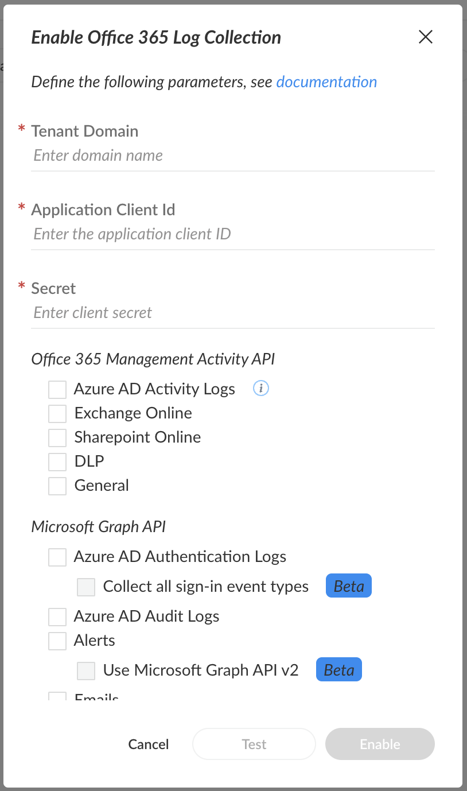

# Office 365
This pack includes Cortex XSIAM content.
</~XSIAM>

### Native O365 Collector

To create or configure the Office 365 collector, use the information described [here](https://docs-cortex.paloaltonetworks.com/r/Cortex-XDR/Cortex-XDR-Pro-Administrator-Guide/Ingest-Logs-from-Microsoft-Office-365).

To access the Office 365 Native Collector on your Cortex XSIAM tenant:
1.  On the left panel, click **Settings** &rarr; **Data Sources**
2.  At the top-right corner, click **Add Data Source**
3.  Search for **Office 365** and click **Connect**.

**Pay Attention**:
In order to normalize **Azure AD** (msft_azure_ad_raw) and **Azure AD Audit** (msft_azure_ad_audit_raw) logs, install the Microsoft Entra ID pack.

**Timestamp Ingestion:**
Ingestion for Office 365 logs is currently available for the following datasets:
* General &rarr; `msft_o365_general_raw`
* Exchange Online &rarr; `msft_o365_exchange_online_raw`
* SharePoint Online &rarr; `msft_o365_sharepoint_online_raw`
* DLP &rarr; `msft_o365_dlp_raw`
* Email &rarr; `msft_o365_emails_raw`

The ingestion is made using the CreationTime field for UTC (+00:00) in the following formats:
* yyyy-mm-ddThh:mm:ss
* yyyy-mm-ddThh:mm:ss.ms
* yyyy-mm-ddThh:mm:ssZ
* yyyy-mm-ddThh:mm:ss.msZ
* yyyy-mm-dd hh:mm:ss UTC
* yyyy-mm-dd hh:mm:ss.ms UTC

For the msft_o365_emails_raw dataset, ingestion is being made with the createdDateTime field.

</~XSIAM>
