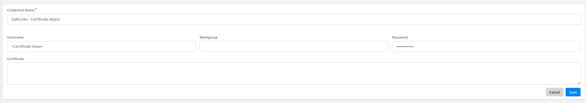

<<<<<<< HEAD
### Ews Audit Log
This integration searches the unified audit log to view user and administrator activity in your organization.

Supported authentication methods:

- OAuth2.0 (For MFA enabled accounts) -
    1. Enter a value for the Email (UPN) parameter in the integration configuration.
    2. Run the ***o365-auditlog-auth-start*** command and follow the instructions.
    3. Run the ***o365-auditlog-auth-test*** command to verify that the authorization process was implemented correctly.
  
#### Permissions:
The app uses the *https://outlook.office365.com/.default* scope.
=======
### Microsoft Policy And Compliance Audit Log
This integration searches the unified audit log to view user and administrator activity in your organization.

### App authentication
To use this integration, you will need to add a new Azure App Registration in the Azure Portal. 
1. To create the application, follow the instructions in this [guide](https://docs.microsoft.com/en-us/powershell/exchange/app-only-auth-powershell-v2?view=exchange-ps). 
2. Run the **CreateCertificate** script from the `EWS` pack in Cortex XSOAR to acquire the certificate. You can also provide your own certificate or perform the instructions in the following Microsoft article: [Generate a self-signed certificate](https://docs.microsoft.com/en-us/powershell/exchange/app-only-auth-powershell-v2?view=exchange-ps#step-3-generate-a-self-signed-certificate).
3. Attach the .cer file to your Azure App. See the following [article](https://docs.microsoft.com/en-us/powershell/exchange/app-only-auth-powershell-v2?view=exchange-ps#step-4-attach-the-certificate-to-the-azure-ad-application) for an example.
4. Copy the contents of the .txt file and paste it in the Certificate parameter of the integration’s instance.

#### Permissions:
To view and run Office 365 unified audit log searches, admins or users must be assigned the **View Only Audit Logs** or **Audit Logs** role in [Exchange Online](https://admin.microsoft.com/Adminportal#/homepage).

-------
##### Note
If the credentials object is used, make sure to set the `certificate` value as the `username` property and not as the certificate field

>>>>>>> 5896217e5bc2e4aeea327a288d416e647bda2af2
