<!-- HTML_DOC -->

Use the Okta integration to create, edit, and view user and group information on Okta.

This integration was integrated and tested with Okta v2018.12.

<h2>Use cases</h2>
<ul>
<li>Unlock, activate, or deactivate users.</li>
<li>Set passwords.</li>
<li>Create and update users.</li>
<li>Get information about users.</li>
<li>Add, remove, or view user group members.</li>
</ul>
<h2>Prerequisites</h2>

Go to <a href="https://developer.okta.com/docs/api/getting_started/getting_a_token" target="_self" rel="nofollow">Okta documentation</a> to create an API token to use on Cortex XSOAR. 

<h2>Configure Okta on Cortex XSOAR</h2>
<ol>
<li>Navigate to <strong>Settings</strong> &gt; <strong>Integrations</strong> &gt; <strong>Servers &amp; Services</strong>.</li>
<li>Search for Okta.</li>
<li>Click <strong>Add instance</strong> to create and configure a new integration instance.
<ul>
<li>
<strong>Name</strong>: A textual name for the integration instance</li>
<li>
<strong>okta URL</strong> (https://&lt;domain.okta.com&gt;)</li>
<li><strong>API Token</strong></li>
<li>
<strong>Trust any certificate </strong>(not secure)</li>
<li><strong>Use system proxy settings</strong></li>
</ul>
</li>
</ol>
<ol start="4">
<li>Click <strong>Test</strong> to validate the URLs, token, and connection.</li>
</ol>
<h2>Commands</h2>

You can execute these commands from the Cortex XSOAR CLI, as part of an automation, or in a playbook. After you successfully execute a command, a DBot message appears in the War Room with the command details.

<ol>
<li><a href="#h_94040463051533631362437">Unlock a user: okta-unlock-user</a></li>
<li><a href="#h_5955856451351533631369089">Deactivate a user: okta-deactivate-user</a></li>
<li><a href="#h_9034513072641533631376432">Activate a user: okta-activate-user</a></li>
<li><a href="#h_500186996231535524634082">Suspend a user: okta-suspend-user</a></li>
<li><a href="#h_8319773441521535524643764">Reactivate a suspended user: okta-unsuspend-user</a></li>
<li><a href="#h_45552536351544085822883">Get enrolled factors for a user: okta-get-user-factors</a></li>
<li><a href="#h_5710465581891544085830891">Create and verify a push factor for a user: okta-verify-push-factor</a></li>
<li><a href="#h_2329685633421544085836123">Remove a factor from a user: okta-reset-factor</a></li>
<li><a href="#h_8088751833921533631384317">Get all user groups associated with a specified user: okta-get-groups</a></li>
<li><a href="#h_7055088315201533631402532">Create user without a recovery question: okta-set-password</a></li>
<li><a href="#h_8808384106461533631425428">Search a specified term: okta-search</a></li>
<li><a href="#h_9057374457721533631441455">Get a specified user: okta-get-user</a></li>
<li><a href="#h_4036981438971533631452798">Create a new user: okta-create-user</a></li>
<li><a href="#h_45461698610211533631484056">Update user details: okta-update-user</a></li>
<li><a href="#h_66994856011431533631497329">Get failed logins: okta-get-failed-logins</a></li>
<li><a href="#h_70861071012651533631513724">Get information about a user that has been added to a group: okta-get-group-assignments</a></li>
<li><a href="#h_23395984213861533631524953">Get information about a user that was assigned to an application: okta-get-application-assignments</a></li>
<li><a href="#h_79284513415061533631541893">Get information about a user who made an SSO attempt: okta-get-application-authentication</a></li>
<li><a href="#h_95355697816251533631551347">Add a user to a group: okta-add-to-group</a></li>
<li><a href="#h_18231657617431533631561439">Remove a user from a group: okta-remove-from-group</a></li>
<li><a href="#h_34655219818591533631581113">Get logs: okta-get-logs</a></li>
<li><a href="#h_64954543619751533631591023">Get a list of groups: okta-list-groups</a></li>
<li><a href="#h_18384912020901533631604427">Get all members of a specified group: okta-get-group-members</a></li>
</ol>
<h3 id="h_94040463051533631362437">1. Unlock a user</h3>

Unlocks a specified user.

<h5>Base Command</h5>

<code>okta-unlock-user</code>

<h5>Input</h5>
<table style="width: 746px; float: left;" border="2" cellpadding="6">
<thead>
<tr>
<th style="width: 173px;"><strong>Argument Name</strong></th>
<th style="width: 329px;"><strong>Description</strong></th>
<th style="width: 206px;"><strong>Required</strong></th>
</tr>
</thead>
<tbody>
<tr>
<td style="width: 173px;">username</td>
<td style="width: 329px;">Okta username to unlock.</td>
<td style="width: 206px;">Required</td>
</tr>
</tbody>
</table>

 

<h5>Context Output</h5>

There is no context output for this command.

<h5>Command Example</h5>
<pre>  !okta-unlock-user username=test@this.com
</pre>
<h5>Human Readable Output</h5>

Okta user unlocked

<h3 id="h_5955856451351533631369089">2. Deactivate a user</h3>

Deactivate a specified user.

<h5>Base Command</h5>

<code>okta-deactivate-user</code>

<h5>Input</h5>
<table style="width: 746px;" border="2" cellpadding="6">
<thead>
<tr>
<th style="width: 176px;"><strong>Argument Name</strong></th>
<th style="width: 360px;"><strong>Description</strong></th>
<th style="width: 172px;"><strong>Required</strong></th>
</tr>
</thead>
<tbody>
<tr>
<td style="width: 176px;">username</td>
<td style="width: 360px;">Okta username to deactivate.</td>
<td style="width: 172px;">Required</td>
</tr>
</tbody>
</table>

 

<h5>Context Output</h5>

There is no context output for this command.

<h5>Command Example</h5>
<pre>!okta-deactivate-user username=test@this.com</pre>
<h5>Human Readable Output</h5>

Okta user deactivated

<h5>War Room Output</h5>

<a href="../../doc_files/43458368-b70ff2a4-94d2-11e8-91b3-dd8467e3e076.png" target="_blank" rel="noopener">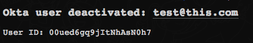</a>

<h3 id="h_9034513072641533631376432">3. Activate a user</h3>

Activate a specified user.

<h5>Base Command</h5>

<code>okta-activate-user</code>

<h5>Input</h5>
<table style="width: 742px;" border="2" cellpadding="6">
<thead>
<tr>
<th style="width: 152px;"><strong>Argument Name</strong></th>
<th style="width: 293px;"><strong>Description</strong></th>
<th style="width: 263px;"><strong>Required</strong></th>
</tr>
</thead>
<tbody>
<tr>
<td style="width: 152px;">username</td>
<td style="width: 293px;">Okta username to activate</td>
<td style="width: 263px;">Required</td>
</tr>
</tbody>
</table>

 Context Output

There is no context output for this command.

<h5>Command Example</h5>
<pre>  !okta-activate-user username=test@this.com</pre>
<h5>War Room  Output</h5>

<a href="../../doc_files/43458391-cbbeda8a-94d2-11e8-99cd-7913ec999799.png" target="_blank" rel="noopener">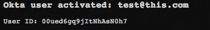</a>

<h3> </h3>
<h3 id="h_500186996231535524634082">4. Suspend a user</h3>

Suspends a user. This operation can only be performed on users with an ACTIVE status. The user's status changes to SUSPENDED when the process is complete.

<h5>Base Command</h5>

<code>okta-suspend-user</code>

<h5>Input</h5>
<table style="width: 748px;" border="2" cellpadding="6">
<thead>
<tr>
<th style="width: 140px;"><strong>Argument Name</strong></th>
<th style="width: 492px;"><strong>Description</strong></th>
<th style="width: 76px;"><strong>Required</strong></th>
</tr>
</thead>
<tbody>
<tr>
<td style="width: 140px;">username</td>
<td style="width: 492px;">Okta username of the user you want to change to SUSPEND status</td>
<td style="width: 76px;">Required</td>
</tr>
</tbody>
</table>

 

<h5>Context Output</h5>

There is no context output for this command.

<h5>Command Example</h5>
<pre>  !okta-suspend-user username="test@this.com"</pre>
<h5>Human Readable Output</h5>

<a href="../../doc_files/44389432-8189b180-a533-11e8-8984-b29dcd5851e5.png" target="_blank" rel="noopener noreferrer">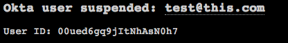</a>

<h3 id="h_8319773441521535524643764">5. Reactivate a suspended user</h3>

Returns a user to ACTIVE status. This operation can only be performed on users that have a SUSPENDED status.

<h5>Base Command</h5>

<code>okta-unsuspend-user</code>

<h5>Input</h5>
<table style="width: 750px;" border="2" cellpadding="6">
<thead>
<tr>
<th><strong>Argument Name</strong></th>
<th><strong>Description</strong></th>
<th><strong>Required</strong></th>
</tr>
</thead>
<tbody>
<tr>
<td>username</td>
<td>Okta username of the user you want to change to ACTIVE status</td>
<td>True</td>
</tr>
</tbody>
</table>

 

<h5>Context Output</h5>

There is no context output for this command.

<h5>Command Example</h5>
<pre>  !okta-unsuspend-user username="test@this.com"</pre>
<h5>Human Readable Output</h5>

<a href="../../doc_files/44389475-a0884380-a533-11e8-8c0f-365e1b9bc723.png" target="_blank" rel="noopener noreferrer">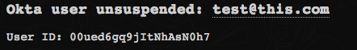</a>

<h3 id="h_45552536351544085822883">6. Get enrolled factors for a user</h3>

Returns all the enrolled factors for the specified user.

<h5>Base Command</h5>

<code>okta-get-user-factors</code>

<h5>Input</h5>
<table style="width: 742px;" border="2" cellpadding="6">
<thead>
<tr>
<th style="width: 214px;"><strong>Argument Name</strong></th>
<th style="width: 344px;"><strong>Description</strong></th>
<th style="width: 150px;"><strong>Required</strong></th>
</tr>
</thead>
<tbody>
<tr>
<td style="width: 214px;">userId</td>
<td style="width: 344px;">User ID of the user in which to get enrolled factors.</td>
<td style="width: 150px;">Optional</td>
</tr>
<tr>
<td style="width: 214px;">username</td>
<td style="width: 344px;">Username of the user in which to get enrolled factors.</td>
<td style="width: 150px;">Optional</td>
</tr>
</tbody>
</table>

 

<h5>Context Output</h5>
<table style="width: 748px;" border="2" cellpadding="6">
<thead>
<tr>
<th style="width: 288px;"><strong>Path</strong></th>
<th style="width: 86px;"><strong>Type</strong></th>
<th style="width: 334px;"><strong>Description</strong></th>
</tr>
</thead>
<tbody>
<tr>
<td style="width: 288px;">Account.ID</td>
<td style="width: 86px;">string</td>
<td style="width: 334px;">Okta account ID.</td>
</tr>
<tr>
<td style="width: 288px;">Account.Factor.ID</td>
<td style="width: 86px;">string</td>
<td style="width: 334px;">Okta account factor ID.</td>
</tr>
<tr>
<td style="width: 288px;">Account.Factor.FactorType</td>
<td style="width: 86px;">string</td>
<td style="width: 334px;">Okta account factor type.</td>
</tr>
<tr>
<td style="width: 288px;">Account.Factor.Provider</td>
<td style="width: 86px;">string</td>
<td style="width: 334px;">Okta account factor provider.</td>
</tr>
<tr>
<td style="width: 288px;">Account.Factor.Status</td>
<td style="width: 86px;">string</td>
<td style="width: 334px;">Okta account factor status.</td>
</tr>
<tr>
<td style="width: 288px;">Account.Factor.Profile</td>
<td style="width: 86px;">string</td>
<td style="width: 334px;">Okta account factor profile.</td>
</tr>
</tbody>
</table>

 

<h5>Command Example</h5>
<pre>!okta-get-user-factors userId=00ugo6k55kHeoJMYC0h7</pre>
<h5>Context Example</h5>
<pre>{
    "Account": {
        "Factor": [
            {
                "FactorType": "push",
                "ID": "opfi25ztilatndHD80h7",
                "Profile": {
                    "credentialId": "test@domain.com",
                    "deviceType": "SmartPhone_Android",
                    "keys": [
                        {
                            "kid": "default",
                            "kty": "XYZ",
                            "use": "xyz",
                            "x5c": [
                                "ABCDEFG"
                            ]
                        }
                    ],
                    "name": "SMARTPHONE",
                    "platform": "ANDROID",
                    "version": "20"
                },
                "Provider": "OKTA",
                "Status": "ACTIVE"
            }
        ],
        "ID": "00ugo6k55kHeoJMYC0h7"
    }
}
</pre>
<h5>Human Readable Output</h5>

<a href="../../doc_files/49521506-3e6b0880-f8ae-11e8-9f2a-37ec8d49d5b0.png" target="_blank" rel="noopener noreferrer">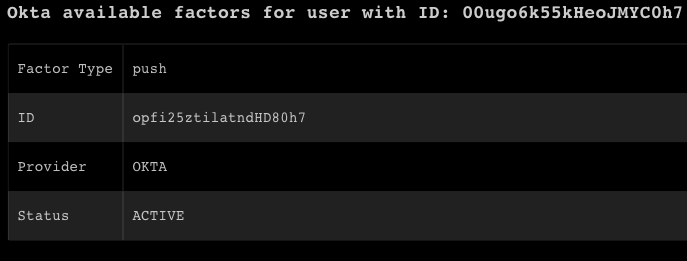</a>

<h3 id="h_5710465581891544085830891">7. Enroll and verify a push factor for a user</h3>

Enrolls and verifies a push factor for a specified user.

<h5>Base Command</h5>

&lt;<code>okta-verify-push-factor</code>

<h5>Input</h5>
<table style="width: 748px;" border="2" cellpadding="6">
<thead>
<tr>
<th style="width: 197px;"><strong>Argument Name</strong></th>
<th style="width: 396px;"><strong>Description</strong></th>
<th style="width: 115px;"><strong>Required</strong></th>
</tr>
</thead>
<tbody>
<tr>
<td style="width: 197px;">userId</td>
<td style="width: 396px;">The user ID of the user to verify.</td>
<td style="width: 115px;">True</td>
</tr>
<tr>
<td style="width: 197px;">factorId</td>
<td style="width: 396px;">The push factor ID.</td>
<td style="width: 115px;">True</td>
</tr>
</tbody>
</table>
<h5> </h5>
<h5>Context Output</h5>
<table style="width: 748px;" border="2" cellpadding="6">
<thead>
<tr>
<th style="width: 265px;"><strong>Path</strong></th>
<th style="width: 74px;"><strong>Type</strong></th>
<th style="width: 369px;"><strong>Description</strong></th>
</tr>
</thead>
<tbody>
<tr>
<td style="width: 265px;">Account.ID</td>
<td style="width: 74px;">string</td>
<td style="width: 369px;">Okta user ID.</td>
</tr>
<tr>
<td style="width: 265px;">Account.VerifyPushResult</td>
<td style="width: 74px;">string</td>
<td style="width: 369px;">Okta user push factor result.</td>
</tr>
</tbody>
</table>

 

<h5>Command Example</h5>
<pre>!okta-verify-push-factor factorId=opfi25ztilatndHD80h7 userId=00ugo6k55kHeoJMYC0h7</pre>
<h5>Context Example</h5>
<pre>{
    "Account": {
        "ID": "00ugo6k55kHeoJMYC0h7",
        "VerifyPushResult": "SUCCESS"
    }
}
</pre>
<h5>Human Readable Output</h5>

<h3 id="h_2329685633421544085836123">8. Remove a factor from a user</h3>

Removes an existing factor for the specified user, allowing the user to enroll a new factor.

<h5>Base Command</h5>

<code>okta-reset-factor</code>

<h5>Input</h5>
<table style="width: 748px;" border="2" cellpadding="6">
<thead>
<tr>
<th style="width: 224px;"><strong>Argument Name</strong></th>
<th style="width: 351px;"><strong>Description</strong></th>
<th style="width: 133px;"><strong>Required</strong></th>
</tr>
</thead>
<tbody>
<tr>
<td style="width: 224px;">userId</td>
<td style="width: 351px;">The user ID.</td>
<td style="width: 133px;">Optional</td>
</tr>
<tr>
<td style="width: 224px;">username</td>
<td style="width: 351px;">The user name.</td>
<td style="width: 133px;">Optional</td>
</tr>
<tr>
<td style="width: 224px;">factorId</td>
<td style="width: 351px;">The ID of the factor to reset.</td>
<td style="width: 133px;">Required</td>
</tr>
</tbody>
</table>

 

<h5>Context Output</h5>

There is no context output for this command.

<h5>Command Example</h5>
<pre>!okta-reset-factor factorId=osti2xdcf0FwcR9x80h7 userId=00ugo6k55kHeoJMYC0h7</pre>
<h5>Human Readable Output</h5>

<a href="../../doc_files/49521874-00221900-f8af-11e8-8ab8-5c50575a372c.png" target="_blank" rel="noopener noreferrer">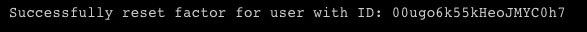</a>

<h3 id="h_8088751833921533631384317">9. Get user groups associated with a specified user</h3>

Returns all user groups associated with a specified user.

<h5>Base Command</h5>

<code>okta-get-groups</code>

<h5>Input</h5>
<table style="width: 746px;" border="2" cellpadding="6">
<thead>
<tr>
<th style="width: 162px;"><strong>Argument Name</strong></th>
<th style="width: 404px;"><strong>Description</strong></th>
<th style="width: 142px;"><strong>Required</strong></th>
</tr>
</thead>
<tbody>
<tr>
<td style="width: 162px;">username</td>
<td style="width: 404px;">Okta username in which to get groups.</td>
<td style="width: 142px;">Required</td>
</tr>
</tbody>
</table>

 

<h5>Context Output</h5>
<table style="width: 742px;" border="2" cellpadding="6">
<thead>
<tr>
<th style="width: 212px;"><strong>Path</strong></th>
<th style="width: 64px;"><strong>Type</strong></th>
<th style="width: 432px;"><strong>Description</strong></th>
</tr>
</thead>
<tbody>
<tr>
<td style="width: 212px;">Account.Group</td>
<td style="width: 64px;">unknown</td>
<td style="width: 432px;">Okta group in which the account is associated.</td>
</tr>
<tr>
<td style="width: 212px;">Account.ID</td>
<td style="width: 64px;">string</td>
<td style="width: 432px;">Okta account ID.</td>
</tr>
<tr>
<td style="width: 212px;">Account.Type</td>
<td style="width: 64px;">string</td>
<td style="width: 432px;">Type of account, such as Okta.</td>
</tr>
<tr>
<td style="width: 212px;">Account.Group.ID</td>
<td style="width: 64px;">string</td>
<td style="width: 432px;">Unique key for group.</td>
</tr>
<tr>
<td style="width: 212px;">Account.Group.Created</td>
<td style="width: 64px;">date</td>
<td style="width: 432px;">Timestamp when group was created.</td>
</tr>
<tr>
<td style="width: 212px;">Account.Group.ObjectClass</td>
<td style="width: 64px;">string</td>
<td style="width: 432px;">Determines the group profile.</td>
</tr>
<tr>
<td style="width: 212px;">Account.Group.LastUpdated</td>
<td style="width: 64px;">date</td>
<td style="width: 432px;">Timestamp when group profile was last updated.</td>
</tr>
<tr>
<td style="width: 212px;">Account.Group.LastMembershipUpdated</td>
<td style="width: 64px;">date</td>
<td style="width: 432px;">Timestamp when group memberships were last updated.</td>
</tr>
<tr>
<td style="width: 212px;">Account.Group.Type</td>
<td style="width: 64px;">string</td>
<td style="width: 432px;">Determines how a group profile and memberships are managed.</td>
</tr>
<tr>
<td style="width: 212px;">Account.Group.Name</td>
<td style="width: 64px;">string</td>
<td style="width: 432px;">Name of the group.</td>
</tr>
<tr>
<td style="width: 212px;">Account.Group.Description</td>
<td style="width: 64px;">string</td>
<td style="width: 432px;">Description of the group.</td>
</tr>
</tbody>
</table>

 

<h5>Command Example</h5>
<pre>  !okta-get-groups username=test@this.com
</pre>
<h5>Context Example</h5>
<pre>{
    "Account": {
        "Group": [
            {
                "Created": "2016-04-12T15:01:50.000Z",
                "Description": "All users in your organization",
                "ID": "00g66lckcsAJpLcNc0h7",
                "LastMembershipUpdated": "2018-07-30T19:56:59.000Z",
                "LastUpdated": "2016-04-12T15:01:50.000Z",
                "Name": "Everyone",
                "ObjectClass": [
                    "okta:user_group"
                ],
                "Type": "BUILT_IN"
            },
            {
                "Created": "2016-10-25T14:52:38.000Z",
                "Description": null,
                "ID": "00g8mo0l5wuTxmoIC0h7",
                "LastMembershipUpdated": "2018-07-31T09:30:33.000Z",
                "LastUpdated": "2016-10-25T14:52:38.000Z",
                "Name": "test1",
                "ObjectClass": [
                    "okta:user_group"
                ],
                "Type": "OKTA_GROUP"
            }
        ],
        "ID": "00ued6gq9jItNhAsN0h7",
        "Type": "Okta"
    }
}
</pre>
<h5>War Room Output</h5>

<a href="../../doc_files/43457688-4e6ba010-94d0-11e8-9697-89a0edda4ba3.png" target="_blank" rel="noopener">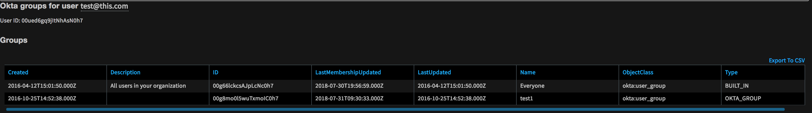</a>

<h3 id="h_7055088315201533631402532">10. Create a user without a recovery question</h3>

Creates a user without a recovery question-and-answer requirement. 

<h5>Base Command</h5>

<code>okta-set-password</code>

<h5>Input</h5>
<table style="width: 750px;" border="2" cellpadding="6">
<thead>
<tr>
<th style="width: 116px;"><strong>Argument Name</strong></th>
<th style="width: 338px;"><strong>Description</strong></th>
<th style="width: 71px;"><strong>Required</strong></th>
</tr>
</thead>
<tbody>
<tr>
<td style="width: 116px;">username</td>
<td style="width: 338px;">Okta username in whcih to change the password.</td>
<td style="width: 71px;">Required</td>
</tr>
<tr>
<td style="width: 116px;">password</td>
<td style="width: 338px;">The new password to set for the user.</td>
<td style="width: 71px;">Required</td>
</tr>
</tbody>
</table>

 

<h5>Context Output</h5>

There is no context output for this command.

<h5>Command Example</h5>
<pre>!okta-set-password username=test@this.com password=newpassword
</pre>
<h5>Human Readable Output</h5>

Okta user password set

<h3 id="h_8808384106461533631425428">11. Search a specified term</h3>

Returns details of users that match the found term.

<h5>Base Command</h5>

<code>okta-search</code>

<h5>Input</h5>
<table style="width: 744px;" border="2" cellpadding="6">
<thead>
<tr>
<th style="width: 152px;"><strong>Argument Name</strong></th>
<th style="width: 445px;"><strong>Description</strong></th>
<th style="width: 111px;"><strong>Required</strong></th>
</tr>
</thead>
<tbody>
<tr>
<td style="width: 152px;">term</td>
<td style="width: 445px;">The term to search for. Can be first name, last name, or email.</td>
<td style="width: 111px;">Required</td>
</tr>
<tr>
<td style="width: 152px;">limit</td>
<td style="width: 445px;">Maximum number of results to return (default 200).</td>
<td style="width: 111px;">Optional</td>
</tr>
<tr>
<td style="width: 152px;">verbose</td>
<td style="width: 445px;">Whether to list all details of users that match search term.</td>
<td style="width: 111px;">Optional</td>
</tr>
</tbody>
</table>

 

<h5>Context Output</h5>
<table style="width: 746px;" border="2" cellpadding="6">
<thead>
<tr>
<th style="width: 138px;"><strong>Path</strong></th>
<th style="width: 39px;"><strong>Type</strong></th>
<th style="width: 531px;"><strong>Description</strong></th>
</tr>
</thead>
<tbody>
<tr>
<td style="width: 138px;">Account.ID</td>
<td style="width: 39px;">string</td>
<td style="width: 531px;">Okta account IDs returned by search.</td>
</tr>
<tr>
<td style="width: 138px;">Account.Username</td>
<td style="width: 39px;">string</td>
<td style="width: 531px;">Okta account usernames returned by search.</td>
</tr>
<tr>
<td style="width: 138px;">Account.Email</td>
<td style="width: 39px;">string</td>
<td style="width: 531px;">Okta account emails returned by search.</td>
</tr>
<tr>
<td style="width: 138px;">Accout.DisplayName</td>
<td style="width: 39px;">string</td>
<td style="width: 531px;">Okta account display names returned by search.</td>
</tr>
<tr>
<td style="width: 138px;">Account.Type</td>
<td style="width: 39px;">string</td>
<td style="width: 531px;">Account type returned by search, such as Okta.</td>
</tr>
</tbody>
</table>

 

<h5>Command Example</h5>
<pre>  !okta-search term=test@this.com
</pre>
<h5>Context Example</h5>
<pre>{
    "Account": [
        {
            "DisplayName": "test this",
            "Email": "test@this.com",
            "ID": "00ued6gq9jItNhAsN0h7",
            "Type": "Okta",
            "Username": "test@this.com",
            "id": "00ued6gq9jItNhAsN0h7"
        }
    ]
}
</pre>
<h5>War Room Output</h5>

<a href="../../doc_files/43457838-c2f59d64-94d0-11e8-99d5-743216e3cf57.png" target="_blank" rel="noopener">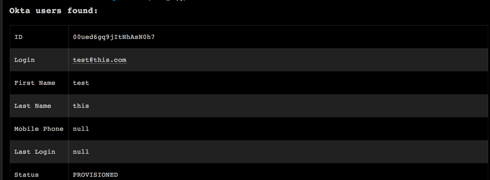</a>

<h3 id="h_9057374457721533631441455">12. Get a specified user</h3>

Fetches information for a specified user. You must enter one or more parameters for the command to run.

<h5>Base Command</h5>

<code>okta-get-user</code>

<h5>Input</h5>
<table style="width: 744px;" border="2" cellpadding="6">
<thead>
<tr>
<th style="width: 132px;"><strong>Argument Name</strong></th>
<th style="width: 518px;"><strong>Description</strong></th>
<th style="width: 58px;"><strong>Required</strong></th>
</tr>
</thead>
<tbody>
<tr>
<td style="width: 132px;">username</td>
<td style="width: 518px;">Username in which to return information. Usernames must not  contain a forward slash ('/').</td>
<td style="width: 58px;">Optional</td>
</tr>
<tr>
<td style="width: 132px;">userid</td>
<td style="width: 518px;">User ID of the requested user in which to return information.</td>
<td style="width: 58px;">Optional</td>
</tr>
<tr>
<td style="width: 132px;">verbose</td>
<td style="width: 518px;">Whether to return all details of the user.</td>
<td style="width: 58px;">Optional</td>
</tr>
</tbody>
</table>

 

<h5>Context Output</h5>
<table style="width: 746px;" border="2" cellpadding="6">
<thead>
<tr>
<th style="width: 132px;"><strong>Path</strong></th>
<th style="width: 40px;"><strong>Type</strong></th>
<th style="width: 536px;"><strong>Description</strong></th>
</tr>
</thead>
<tbody>
<tr>
<td style="width: 132px;">Account.ID</td>
<td style="width: 40px;">string</td>
<td style="width: 536px;">Okta account ID.</td>
</tr>
<tr>
<td style="width: 132px;">Account.Email</td>
<td style="width: 40px;">string</td>
<td style="width: 536px;">Okta account email.</td>
</tr>
<tr>
<td style="width: 132px;">Account.Username</td>
<td style="width: 40px;">string</td>
<td style="width: 536px;">Okta account username.</td>
</tr>
<tr>
<td style="width: 132px;">Account.DisplayName</td>
<td style="width: 40px;">string</td>
<td style="width: 536px;">Okta account display name.</td>
</tr>
<tr>
<td style="width: 132px;">Account.Type</td>
<td style="width: 40px;">string</td>
<td style="width: 536px;">Type of account, such as Okta.</td>
</tr>
</tbody>
</table>

 

<h5>Command Example</h5>
<pre>  !okta-get-user username=test@this.com verbose=true</pre>
<h5>Context Example</h5>
<pre>{
    "Account": [
        {
            "DisplayName": "test this",
            "Email": "test@this.com",
            "ID": "00ued6gq9jItNhAsN0h7",
            "Type": "Okta",
            "Username": "test@this.com",
            "id": "00ued6gq9jItNhAsN0h7"
        }
    ]
}
</pre>
<h5>War Room Output</h5>

<a href="../../doc_files/43460338-02e11d74-94d9-11e8-86d5-058fa1e15651.png" target="_blank" rel="noopener">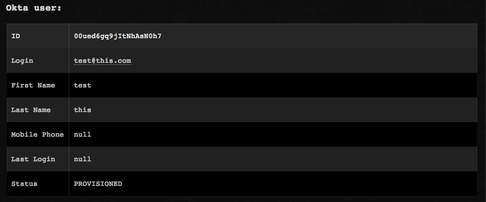</a>

<h3 id="h_4036981438971533631452798">13. Create a new user</h3>

Creates a new user with the option to set a password, and recovery question and answer. This flow is common when developing a custom user registration experience.

<h5>Base Command</h5>

<code>okta-create-user</code>

<h5>Input</h5>
<table style="width: 746px;" border="2" cellpadding="6">
<thead>
<tr>
<th style="width: 139px;"><strong>Argument Name</strong></th>
<th style="width: 511px;"><strong>Description</strong></th>
<th style="width: 58px;"><strong>Required</strong></th>
</tr>
</thead>
<tbody>
<tr>
<td style="width: 139px;">firstName</td>
<td style="width: 511px;">First name of the user (givenName).</td>
<td style="width: 58px;">Required</td>
</tr>
<tr>
<td style="width: 139px;">lastName</td>
<td style="width: 511px;">Family name of the user (familyName).</td>
<td style="width: 58px;">Required</td>
</tr>
<tr>
<td style="width: 139px;">email</td>
<td style="width: 511px;">Primary email address of the user.</td>
<td style="width: 58px;">Required</td>
</tr>
<tr>
<td style="width: 139px;">login</td>
<td style="width: 511px;">Unique identifier for the user (username).</td>
<td style="width: 58px;">Required</td>
</tr>
<tr>
<td style="width: 139px;">secondEmail</td>
<td style="width: 511px;">Secondary email address of the user.  Usually for account recovery.</td>
<td style="width: 58px;">Optional</td>
</tr>
<tr>
<td style="width: 139px;">middleName</td>
<td style="width: 511px;">Middle name(s) of the user. </td>
<td style="width: 58px;">Optional</td>
</tr>
<tr>
<td style="width: 139px;">honorificPrefix</td>
<td style="width: 511px;">Honorific prefix(es) of the user, or title in most Western languages. </td>
<td style="width: 58px;">Optional</td>
</tr>
<tr>
<td style="width: 139px;">honorificSuffix</td>
<td style="width: 511px;">Honorific suffix(es) of the user. </td>
<td style="width: 58px;">Optional</td>
</tr>
<tr>
<td style="width: 139px;">title</td>
<td style="width: 511px;">User title. For example, <em>Vice President.</em>
</td>
<td style="width: 58px;">Optional</td>
</tr>
<tr>
<td style="width: 139px;">displayName</td>
<td style="width: 511px;">Name of the user, suitable for display to end users.</td>
<td style="width: 58px;">Optional</td>
</tr>
<tr>
<td style="width: 139px;">nickName</td>
<td style="width: 511px;">Casual way to address the user.</td>
<td style="width: 58px;">Optional</td>
</tr>
<tr>
<td style="width: 139px;">profileUrl</td>
<td style="width: 511px;">

URL of user online profile. For example, a web page.

</td>
<td style="width: 58px;">Optional</td>
</tr>
<tr>
<td style="width: 139px;">primaryPhone</td>
<td style="width: 511px;">

Primary phone number of the user.

</td>
<td style="width: 58px;">Optional</td>
</tr>
<tr>
<td style="width: 139px;">mobilePhone</td>
<td style="width: 511px;">Mobile phone number of the user.</td>
<td style="width: 58px;">Optional</td>
</tr>
<tr>
<td style="width: 139px;">streetAddress</td>
<td style="width: 511px;">Full street address component of the user address.</td>
<td style="width: 58px;">Optional</td>
</tr>
<tr>
<td style="width: 139px;">city</td>
<td style="width: 511px;">City or locality component of the user address (locality).</td>
<td style="width: 58px;">Optional</td>
</tr>
<tr>
<td style="width: 139px;">state</td>
<td style="width: 511px;">State or region component of the user address (region).</td>
<td style="width: 58px;">Optional</td>
</tr>
<tr>
<td style="width: 139px;">zipCode</td>
<td style="width: 511px;">Zipcode or postal code component of the user address (postalCode).</td>
<td style="width: 58px;">Optional</td>
</tr>
<tr>
<td style="width: 139px;">countryCode</td>
<td style="width: 511px;">Country name component of the user address (country).</td>
<td style="width: 58px;">Optional</td>
</tr>
<tr>
<td style="width: 139px;">postalAddress</td>
<td style="width: 511px;">Mailing address component of the user address.</td>
<td style="width: 58px;">Optional</td>
</tr>
<tr>
<td style="width: 139px;">preferredLanguage</td>
<td style="width: 511px;">User preferred written or spoken language.</td>
<td style="width: 58px;">Optional</td>
</tr>
<tr>
<td style="width: 139px;">locale</td>
<td style="width: 511px;">User default location for localizing items such as currency, date time format, numerical representations, and so on.</td>
<td style="width: 58px;">Optional</td>
</tr>
<tr>
<td style="width: 139px;">timezone</td>
<td style="width: 511px;">User time zone.</td>
<td style="width: 58px;">Optional</td>
</tr>
<tr>
<td style="width: 139px;">userType</td>
<td style="width: 511px;">Identify the organization's relationship with the user such as <em>Employee</em> or <em>Contractor.</em>
</td>
<td style="width: 58px;">Optional</td>
</tr>
<tr>
<td style="width: 139px;">employeeNumber</td>
<td style="width: 511px;">Organization or company assigned unique identifier for the user.</td>
<td style="width: 58px;">Optional</td>
</tr>
<tr>
<td style="width: 139px;">costCenter</td>
<td style="width: 511px;">Name of the cost center in which the user is assigned.</td>
<td style="width: 58px;">Optional</td>
</tr>
<tr>
<td style="width: 139px;">organization</td>
<td style="width: 511px;">The organization in which the user belongs.</td>
<td style="width: 58px;">Optional</td>
</tr>
<tr>
<td style="width: 139px;">division</td>
<td style="width: 511px;">The division in which the user belongs.</td>
<td style="width: 58px;">Optional</td>
</tr>
<tr>
<td style="width: 139px;">department</td>
<td style="width: 511px;">The Department in which the user belongs.</td>
<td style="width: 58px;">Optional</td>
</tr>
<tr>
<td style="width: 139px;">managerId</td>
<td style="width: 511px;">ID of the user’s manager.</td>
<td style="width: 58px;">Optional</td>
</tr>
<tr>
<td style="width: 139px;">manager</td>
<td style="width: 511px;">
<em>DisplayName</em> of the user’s manager.</td>
<td style="width: 58px;">Optional</td>
</tr>
<tr>
<td style="width: 139px;">password</td>
<td style="width: 511px;">Password for the new user.</td>
<td style="width: 58px;">Optional</td>
</tr>
<tr>
<td style="width: 139px;">passwordQuestion</td>
<td style="width: 511px;">Password question for the new user.</td>
<td style="width: 58px;">Optional</td>
</tr>
<tr>
<td style="width: 139px;">passwordAnswer</td>
<td style="width: 511px;">Password answer for the specified question.</td>
<td style="width: 58px;">Optional</td>
</tr>
<tr>
<td style="width: 139px;">providerType</td>
<td style="width: 511px;">

Type of provider. Valid <em>providerType</em>s are:

<ul>
<li>OKTA</li>
<li>ACTIVE_DIRECTORY</li>
<li>LDAP</li>
<li>FEDERATION</li>
<li>SOCIAL</li>
</ul>
</td>
<td style="width: 58px;">Optional</td>
</tr>
<tr>
<td style="width: 139px;">providerName</td>
<td style="width: 511px;">Name of provider.</td>
<td style="width: 58px;">Optional</td>
</tr>
<tr>
<td style="width: 139px;">groupIds</td>
<td style="width: 511px;">IDs of groups that user is immediately added to at the time of creation (Do not include default group).</td>
<td style="width: 58px;">Optional</td>
</tr>
<tr>
<td style="width: 139px;">activate</td>
<td style="width: 511px;">
<em>Activates the lifecycle</em> operation when creating the user.</td>
<td style="width: 58px;">Optional</td>
</tr>
</tbody>
</table>

 

<h5>Context Output</h5>
<table style="width: 750px;" border="2" cellpadding="6">
<thead>
<tr>
<th style="width: 141px;"><strong>Path</strong></th>
<th style="width: 37px;"><strong>Type</strong></th>
<th style="width: 530px;"><strong>Description</strong></th>
</tr>
</thead>
<tbody>
<tr>
<td style="width: 141px;">Account.ID</td>
<td style="width: 37px;">string</td>
<td style="width: 530px;">Created Okta account ID.</td>
</tr>
<tr>
<td style="width: 141px;">Account.Email</td>
<td style="width: 37px;">string</td>
<td style="width: 530px;">Created Okta account email.</td>
</tr>
<tr>
<td style="width: 141px;">Account.Username</td>
<td style="width: 37px;">string</td>
<td style="width: 530px;">Created Okta account username.</td>
</tr>
<tr>
<td style="width: 141px;">Account.DisplayName</td>
<td style="width: 37px;">string</td>
<td style="width: 530px;">Created Okta account display name.</td>
</tr>
<tr>
<td style="width: 141px;">Account.Type</td>
<td style="width: 37px;">string</td>
<td style="width: 530px;">Type of account that was created, such as Okta.</td>
</tr>
</tbody>
</table>

 

<h5>Command Example</h5>
<pre>  !okta-create-user email=test@that.com firstName=test lastName=that login=test@that.com
</pre>
<h5>Context Example</h5>
<pre>{
    "Account": [
        {
            "DisplayName": "test that",
            "Email": "test@that.com",
            "ID": "00ufufhqits3y78Ju0h7",
            "Type": "Okta",
            "Username": "test@that.com",
            "id": "00ufufhqits3y78Ju0h7"
        }
    ]
}
</pre>
<h5>War Room Output</h5>

<a href="../../doc_files/43460466-632e38c4-94d9-11e8-9f2a-2187b3076b18.png" target="_blank" rel="noopener">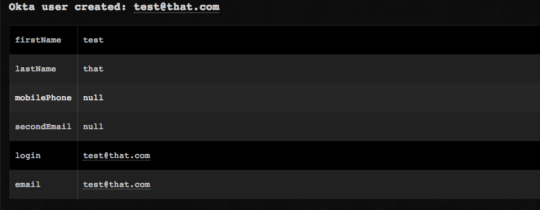</a>

<h3 id="h_45461698610211533631484056">14. Update user details</h3>

Updates account details for a specified user. The only required parameter is <em>username.</em>

<h5>Base Command</h5>

<code>okta-update-user</code>

<h5>Input</h5>
<table style="width: 746px;" border="2" cellpadding="6">
<thead>
<tr>
<th style="width: 142px;"><strong>Argument Name</strong></th>
<th style="width: 505px;"><strong>Description</strong></th>
<th style="width: 61px;"><strong>Required</strong></th>
</tr>
</thead>
<tbody>
<tr>
<td style="width: 142px;">username</td>
<td style="width: 505px;">Unique identifier for the user (login).</td>
<td style="width: 61px;">Required</td>
</tr>
<tr>
<td style="width: 142px;">firstName</td>
<td style="width: 505px;">First name of the user (givenName).</td>
<td style="width: 61px;">Optional</td>
</tr>
<tr>
<td style="width: 142px;">lastName</td>
<td style="width: 505px;">Family name of the user (familyName).</td>
<td style="width: 61px;">Optional</td>
</tr>
<tr>
<td style="width: 142px;">email</td>
<td style="width: 505px;">Primary email address of the user.</td>
<td style="width: 61px;">Optional</td>
</tr>
<tr>
<td style="width: 142px;">secondEmail</td>
<td style="width: 505px;">Secondary email address of user typically used for account recovery.</td>
<td style="width: 61px;">Optional</td>
</tr>
<tr>
<td style="width: 142px;">middleName</td>
<td style="width: 505px;">Middle name of the user. Supports multiple middle names.</td>
<td style="width: 61px;">Optional</td>
</tr>
<tr>
<td style="width: 142px;">honorificPrefix</td>
<td style="width: 505px;">Honorific prefix of the user, or title in most Western languages. Supports multiple input.</td>
<td style="width: 61px;">Optional</td>
</tr>
<tr>
<td style="width: 142px;">honorificSuffix</td>
<td style="width: 505px;">Honorific suffix of the user. Supports multiple input.</td>
<td style="width: 61px;">Optional</td>
</tr>
<tr>
<td style="width: 142px;">title</td>
<td style="width: 505px;">The user’s title (for example, Vice President)</td>
<td style="width: 61px;">Optional</td>
</tr>
<tr>
<td style="width: 142px;">displayName</td>
<td style="width: 505px;">Name of the user, suitable for display to end users.</td>
<td style="width: 61px;">Optional</td>
</tr>
<tr>
<td style="width: 142px;">nickName</td>
<td style="width: 505px;">Casual way to address the user.</td>
<td style="width: 61px;">Optional</td>
</tr>
<tr>
<td style="width: 142px;">profileUrl</td>
<td style="width: 505px;">URL of user’s online profile (for example, a web page).</td>
<td style="width: 61px;">Optional</td>
</tr>
<tr>
<td style="width: 142px;">primaryPhone</td>
<td style="width: 505px;">Primary phone number of user.</td>
<td style="width: 61px;">Optional</td>
</tr>
<tr>
<td style="width: 142px;">mobilePhone</td>
<td style="width: 505px;">Mobile phone number of user.</td>
<td style="width: 61px;">Optional</td>
</tr>
<tr>
<td style="width: 142px;">streetAddress</td>
<td style="width: 505px;">Full street address component of user.</td>
<td style="width: 61px;">Optional</td>
</tr>
<tr>
<td style="width: 142px;">city</td>
<td style="width: 505px;">City or locality component of user’s address (locality).</td>
<td style="width: 61px;">Optional</td>
</tr>
<tr>
<td style="width: 142px;">state</td>
<td style="width: 505px;">State or region component of user’s address (region).</td>
<td style="width: 61px;">Optional</td>
</tr>
<tr>
<td style="width: 142px;">zipCode</td>
<td style="width: 505px;">Zipcode or postal code component of user’s address (postalCode).</td>
<td style="width: 61px;">Optional</td>
</tr>
<tr>
<td style="width: 142px;">countryCode</td>
<td style="width: 505px;">Country name component of user’s address (country).</td>
<td style="width: 61px;">Optional</td>
</tr>
<tr>
<td style="width: 142px;">postalAddress</td>
<td style="width: 505px;">Mailing address of the user.</td>
<td style="width: 61px;">Optional</td>
</tr>
<tr>
<td style="width: 142px;">preferredLanguage</td>
<td style="width: 505px;">User’s preferred written or spoken languages.</td>
<td style="width: 61px;">Optional</td>
</tr>
<tr>
<td style="width: 142px;">locale</td>
<td style="width: 505px;">User’s default location for purposes of localizing items such as currency, date time format, numerical representations, and so on.</td>
<td style="width: 61px;">Optional</td>
</tr>
<tr>
<td style="width: 142px;">timezone</td>
<td style="width: 505px;">User’s time zone.</td>
<td style="width: 61px;">Optional</td>
</tr>
<tr>
<td style="width: 142px;">userType</td>
<td style="width: 505px;">Used to identify the organization to user relationship such as <em>E</em><em>mployee</em> or <em>Contractor.</em>
</td>
<td style="width: 61px;">Optional</td>
</tr>
<tr>
<td style="width: 142px;">employeeNumber</td>
<td style="width: 505px;">Organization or company assigned unique identifier for the user.</td>
<td style="width: 61px;">Optional</td>
</tr>
<tr>
<td style="width: 142px;">costCenter</td>
<td style="width: 505px;">Name of a cost center assigned to the user.</td>
<td style="width: 61px;">Optional</td>
</tr>
<tr>
<td style="width: 142px;">organization</td>
<td style="width: 505px;">The organization the user belongs to.</td>
<td style="width: 61px;">Optional</td>
</tr>
<tr>
<td style="width: 142px;">division</td>
<td style="width: 505px;">The division the user belongs to.</td>
<td style="width: 61px;">Optional</td>
</tr>
<tr>
<td style="width: 142px;">department</td>
<td style="width: 505px;">The department that the user belongs to.</td>
<td style="width: 61px;">Optional</td>
</tr>
<tr>
<td style="width: 142px;">managerId</td>
<td style="width: 505px;">ID of a user’s manager.</td>
<td style="width: 61px;">Optional</td>
</tr>
<tr>
<td style="width: 142px;">manager</td>
<td style="width: 505px;">
<em>DisplayName</em> of the user’s manager.</td>
<td style="width: 61px;">Optional</td>
</tr>
<tr>
<td style="width: 142px;">password</td>
<td style="width: 505px;">Password for the new user.</td>
<td style="width: 61px;">Optional</td>
</tr>
<tr>
<td style="width: 142px;">passwordQuestion</td>
<td style="width: 505px;">Password question for new user.</td>
<td style="width: 61px;">Optional</td>
</tr>
<tr>
<td style="width: 142px;">passwordAnswer</td>
<td style="width: 505px;">Password answer for the specified question.</td>
<td style="width: 61px;">Optional</td>
</tr>
<tr>
<td style="width: 142px;">providerType</td>
<td style="width: 505px;">

Valid <em>providerType</em>s are:

<ul>
<li>OKTA</li>
<li>ACTIVE_DIRECTORY</li>
<li>LDAP</li>
<li>FEDERATION</li>
<li>SOCIAL</li>
</ul>
</td>
<td style="width: 61px;">Optional</td>
</tr>
<tr>
<td style="width: 142px;">providerName</td>
<td style="width: 505px;">Name of provider.</td>
<td style="width: 61px;">Optional</td>
</tr>
</tbody>
</table>

 

<h5>Context Output</h5>

There is no context output for this command.

<h5>Command Example</h5>

<code>!okta-update-user username=test@that.com displayName=alsotest</code>

<h5>War Room Output</h5>

<a href="../../doc_files/43460554-9fa5d1fe-94d9-11e8-8769-eddc01050544.png" target="_blank" rel="noopener">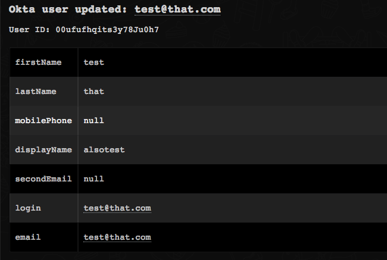</a>

<h3 id="h_66994856011431533631497329">15. Get failed logins</h3>

Returns event details of Okta issued sessions for user authentication for user failed logins.

<h5>Base Command</h5>

<code>okta-get-failed-logins</code>

<h5>Input</h5>
<table style="width: 728px;" border="2" cellpadding="6">
<thead>
<tr>
<th style="width: 239px;"><strong>Argument Name</strong></th>
<th style="width: 416px;"><strong>Description</strong></th>
<th style="width: 580px;"><strong>More Information</strong></th>
<th style="width: 53px;"><strong>Required</strong></th>
</tr>
</thead>
<tbody>
<tr>
<td style="width: 239px;">since</td>
<td style="width: 416px;">

The start date of the search range in the Internet Date/Time.

</td>
<td style="width: 580px;">

Format profile: ISO 8601

Example: 2017-05-03T16:22:18Z

</td>
<td style="width: 53px;">Optional</td>
</tr>
<tr>
<td style="width: 239px;">until</td>
<td style="width: 416px;">The end date of the search range in the Internet Date/Time.</td>
<td style="width: 580px;">

Format profile: ISO 8601

Example: 2017-05-03T16:22:18Z

</td>
<td style="width: 53px;">Optional</td>
</tr>
<tr>
<td style="width: 239px;">sortOrder</td>
<td style="width: 416px;">The order of the returned events.</td>
<td style="width: 580px;">default is ASCENDING</td>
<td style="width: 53px;">Optional</td>
</tr>
<tr>
<td style="width: 239px;">limit</td>
<td style="width: 416px;">Sets the number of results returned in the response.</td>
<td style="width: 580px;">Default is 100</td>
<td style="width: 53px;">Optional</td>
</tr>
</tbody>
</table>

 

<h5>Context Output</h5>
<table style="width: 744px;" border="2" cellpadding="6">
<thead>
<tr>
<th style="width: 312px;"><strong>Path</strong></th>
<th style="width: 109px;"><strong>Type</strong></th>
<th style="width: 287px;"><strong>Description</strong></th>
</tr>
</thead>
<tbody>
<tr>
<td style="width: 312px;">Okta.Logs.Events.actor.alternateId</td>
<td style="width: 109px;">string</td>
<td style="width: 287px;">Alternative ID of the actor.</td>
</tr>
<tr>
<td style="width: 312px;">Okta.Logs.Events.actor.displayName</td>
<td style="width: 109px;">string</td>
<td style="width: 287px;">Display name of actor.</td>
</tr>
<tr>
<td style="width: 312px;">Okta.Logs.Events.actor.id</td>
<td style="width: 109px;">string</td>
<td style="width: 287px;">ID of the actor.</td>
</tr>
<tr>
<td style="width: 312px;">Okta.Logs.Events.client.userAgent.rawUserAgent</td>
<td style="width: 109px;">string</td>
<td style="width: 287px;">A raw string representation of the user agent, formatted according to section 5.5.3 of HTTP/1.1 Semantics and Content. Both the browser and the OS fields can be derived from this field.</td>
</tr>
<tr>
<td style="width: 312px;">Okta.Logs.Events.client.userAgent.os</td>
<td style="width: 109px;">string</td>
<td style="width: 287px;">The Operating System on which the client runs. For example, Microsoft Windows 10).</td>
</tr>
<tr>
<td style="width: 312px;">Okta.Logs.Events.client.userAgent.browser</td>
<td style="width: 109px;">string</td>
<td style="width: 287px;">Identifies the web browser type. For example, Chrome.</td>
</tr>
<tr>
<td style="width: 312px;">Okta.Logs.Events.client.device</td>
<td style="width: 109px;">string</td>
<td style="width: 287px;">Type of device that the client operated from (for example, Computer).</td>
</tr>
<tr>
<td style="width: 312px;">Okta.Logs.Events.client.id</td>
<td style="width: 109px;">string</td>
<td style="width: 287px;">

For OAuth requests:ID of the requesting OAuth client.

For SSWS token requests: ID of the requesting agent.

</td>
</tr>
<tr>
<td style="width: 312px;">Okta.Logs.Events.client.ipAddress</td>
<td style="width: 109px;">string</td>
<td style="width: 287px;">IP address in which the client made the request.</td>
</tr>
<tr>
<td style="width: 312px;">Okta.Logs.Events.client.geographicalContext.city</td>
<td style="width: 109px;">string</td>
<td style="width: 287px;">The city encompassing the area containing the <em>geolocation</em> coordinates, if available. For example, Seattle, San Francisco.</td>
</tr>
<tr>
<td style="width: 312px;">Okta.Logs.Events.geographicalContext.state</td>
<td style="width: 109px;">string</td>
<td style="width: 287px;">Full name of the state or province encompassing the area containing the <em>geolocation</em> coordinates. For example, Montana, Incheon.</td>
</tr>
<tr>
<td style="width: 312px;">Okta.Logs.Events.client.geographicalContext.country</td>
<td style="width: 109px;">string</td>
<td style="width: 287px;">Full name of the country encompassing the area containing the <em>geolocation</em> coordinates. For example,  France, Uganda.</td>
</tr>
<tr>
<td style="width: 312px;">Okta.Logs.Events.displayMessage</td>
<td style="width: 109px;">string</td>
<td style="width: 287px;">The display message for an event.</td>
</tr>
<tr>
<td style="width: 312px;">Okta.Logs.Events.eventType</td>
<td style="width: 109px;">string</td>
<td style="width: 287px;">Type of event that was published.</td>
</tr>
<tr>
<td style="width: 312px;">Okta.Logs.Events.outcome.result</td>
<td style="width: 109px;">string</td>
<td style="width: 287px;">

Result of the action:

<ul>
<li>SUCCESS</li>
<li>FAILURE</li>
<li>SKIPPED</li>
<li>UNKNOWN</li>
</ul>
</td>
</tr>
<tr>
<td style="width: 312px;">Okta.Logs.Events.outcome.reason</td>
<td style="width: 109px;">string</td>
<td style="width: 287px;">Reason for the result. For example, INVALID_CREDENTIALS.</td>
</tr>
<tr>
<td style="width: 312px;">Okta.Logs.Events.published</td>
<td style="width: 109px;">string</td>
<td style="width: 287px;">Timestamp when event was published.</td>
</tr>
<tr>
<td style="width: 312px;">Okta.Logs.Events.severity</td>
<td style="width: 109px;">string</td>
<td style="width: 287px;">

Indicates how severe the event is:

<ul>
<li>DEBUG</li>
<li>INFO</li>
<li>WARN</li>
<li>ERROR</li>
</ul>
</td>
</tr>
<tr>
<td style="width: 312px;">Okta.Logs.Events.securityContext.asNumber</td>
<td style="width: 109px;">number</td>
<td style="width: 287px;">Autonomous system number associated with the autonomous system that the event request was sourced to.</td>
</tr>
<tr>
<td style="width: 312px;">Okta.Logs.Events.securityContext.asOrg</td>
<td style="width: 109px;">string</td>
<td style="width: 287px;">Organization associated with the autonomous system that the event request was sourced to.</td>
</tr>
<tr>
<td style="width: 312px;">Okta.Logs.Events.securityContext.isp</td>
<td style="width: 109px;">string</td>
<td style="width: 287px;">Internet service provider used to sent the event request.</td>
</tr>
<tr>
<td style="width: 312px;">Okta.Logs.Events.securityContext.domain</td>
<td style="width: 109px;">string</td>
<td style="width: 287px;">The domain name associated with the IP address of the inbound event request.</td>
</tr>
<tr>
<td style="width: 312px;">Okta.Logs.Events.securityContext.isProxy</td>
<td style="width: 109px;">string</td>
<td style="width: 287px;">Specifies whether an event’s request is from a known proxy.</td>
</tr>
<tr>
<td style="width: 312px;">Okta.Logs.Events.request.ipChain.IP</td>
<td style="width: 109px;">string</td>
<td style="width: 287px;">IP address.</td>
</tr>
<tr>
<td style="width: 312px;">Okta.Logs.Events.request.ipChain.geographicalContext.city</td>
<td style="width: 109px;">string</td>
<td style="width: 287px;">The city encompassing the area containing the geolocation coordinates, if available (for example, Seattle, San Francisco).</td>
</tr>
<tr>
<td style="width: 312px;">Okta.Logs.Events.request.ipChain.geographicalContext.state</td>
<td style="width: 109px;">string</td>
<td style="width: 287px;">Full name of the state or province encompassing the area containing the <em>geolocation</em> coordinates (for example, Montana, Incheon).</td>
</tr>
<tr>
<td style="width: 312px;">Okta.Logs.Events.request.ipChain.geographicalContext.country</td>
<td style="width: 109px;">string</td>
<td style="width: 287px;">Full name of the country encompassing the area containing the <em>geolocation</em> coordinates (for examplem France, Uganda).</td>
</tr>
<tr>
<td style="width: 312px;">Okta.Logs.Events.request.ipChain.source</td>
<td style="width: 109px;">string</td>
<td style="width: 287px;">Details regarding the source.</td>
</tr>
<tr>
<td style="width: 312px;">Okta.Logs.Events.target.id</td>
<td style="width: 109px;">string</td>
<td style="width: 287px;">ID of a target.</td>
</tr>
<tr>
<td style="width: 312px;">Okta.Logs.Events.target.type</td>
<td style="width: 109px;">string</td>
<td style="width: 287px;">Type of a target.</td>
</tr>
<tr>
<td style="width: 312px;">Okta.Logs.Events.target.alternateId</td>
<td style="width: 109px;">string</td>
<td style="width: 287px;">Alternative ID of a target.</td>
</tr>
<tr>
<td style="width: 312px;">Okta.Logs.Events.target.displayName</td>
<td style="width: 109px;">string</td>
<td style="width: 287px;">Display name of a target.</td>
</tr>
</tbody>
</table>

 

<h5>Command Example</h5>
<pre>  !okta-get-failed-logins limit=1 since=2018-07-30T16:22:18Z
</pre>
<h5>Context Example</h5>
<pre>{
    "Okta": {
        "Logs": {
            "Events": {
                "actor": {
                    "alternateId": "test@this.com",
                    "detailEntry": null,
                    "displayName": "test1",
                    "id": "00ued6gq9jItNhAsN0h7",
                    "type": "User"
                },
                "authenticationContext": {
                    "authenticationProvider": null,
                    "authenticationStep": 0,
                    "credentialProvider": null,
                    "credentialType": null,
                    "externalSessionId": "unknown",
                    "interface": null,
                    "issuer": null
                },
                "client": {
                    "device": "Computer",
                    "geographicalContext": {
                        "city": "Tel Aviv",
                        "country": "Israel",
                        "geolocation": {
                            "lat": 32.0667,
                            "lon": 34.7667
                        },
                        "postalCode": null,
                        "state": "Tel Aviv"
                    },
                    "id": null,
                    "ipAddress": "1.2.3.4",
                    "userAgent": {
                        "browser": "CHROME",
                        "os": "Mac OS X",
                        "rawUserAgent": "Mozilla/5.0 (Macintosh; Intel Mac OS X 10_13_6) AppleWebKit/537.36 (KHTML, like Gecko) Chrome/67.0.3396.99 Safari/537.36"
                    },
                    "zone": "null"
                },
                "debugContext": {
                    "debugData": {
                        "requestUri": "/api/v1/authn"
                    }
                },
                "displayMessage": "User login to Okta",
                "eventType": "user.session.start",
                "legacyEventType": "core.user_auth.login_failed",
                "outcome": {
                    "reason": "GENERAL_NONSUCCESS",
                    "result": "FAILURE"
                },
                "published": "2018-07-31T12:55:59.231Z",
                "request": {
                    "ipChain": [
                        {
                            "geographicalContext": {
                                "city": "Tel Aviv",
                                "country": "Israel",
                                "geolocation": {
                                    "lat": 32.0667,
                                    "lon": 34.7667
                                },
                                "postalCode": null,
                                "state": "Tel Aviv"
                            },
                            "ip": "1.2.3.4",
                            "source": null,
                            "version": "V4"
                        }
                    ]
                },
                "securityContext": {
                    "asNumber": null,
                    "asOrg": null,
                    "domain": null,
                    "isProxy": null,
                    "isp": null
                },
                "severity": "WARN",
                "target": null,
                "transaction": {
                    "detail": {},
                    "id": "W2BcX2qHbXMeIQ9PwrRMgQAABKY",
                    "type": "WEB"
                },
                "uuid": "ff9cb6c1-e8a0-474f-8d0e-56e45bb0f9d6",
                "version": "0"
            }
        }
    }
}
</pre>
<h5>War Room Output</h5>

<a href="../../doc_files/43462076-ccb0ee46-94dd-11e8-8bac-9a54b5315c9a.png" target="_blank" rel="noopener">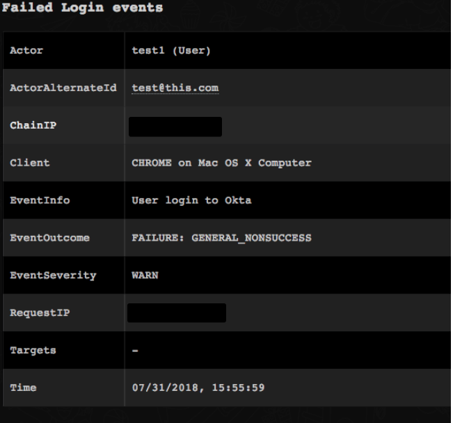</a>

<h3 id="h_70861071012651533631513724">16. Get information about a user that was added to a group</h3>

Returns event details for when a user is added to a group.

<h5>Base Command</h5>

<code>okta-get-group-assignments</code>

<h5>Input</h5>
<table style="width: 736px;" border="2" cellpadding="6">
<thead>
<tr>
<th style="width: 242px;"><strong>Argument Name</strong></th>
<th style="width: 418px;"><strong>Description</strong></th>
<th style="width: 588px;"><strong>More Information</strong></th>
<th style="width: 48px;"><strong>Required</strong></th>
</tr>
</thead>
<tbody>
<tr>
<td style="width: 242px;">since</td>
<td style="width: 418px;">

The start date of the search range in the Internet Date/Time 

</td>
<td style="width: 588px;">

Format profile:ISO 8601.

For example: 2017-05-03T16:22:18Z.

</td>
<td style="width: 48px;">Optional</td>
</tr>
<tr>
<td style="width: 242px;">until</td>
<td style="width: 418px;">The end date of the search range in the Internet Date/Time </td>
<td style="width: 588px;">

Format profile:ISO 8601.

For example: 2017-05-03T16:22:18Z.

</td>
<td style="width: 48px;">Optional</td>
</tr>
<tr>
<td style="width: 242px;">sortOrder</td>
<td style="width: 418px;">The order of the returned events</td>
<td style="width: 588px;">Default is ASCENDING.</td>
<td style="width: 48px;">Optional</td>
</tr>
<tr>
<td style="width: 242px;">limit</td>
<td style="width: 418px;">Sets the number of results returned in the response</td>
<td style="width: 588px;">Default is 100.</td>
<td style="width: 48px;">Optional</td>
</tr>
</tbody>
</table>

 

<h5>Context Output</h5>
<table style="width: 742px;" border="2" cellpadding="6">
<thead>
<tr>
<th style="width: 166px;"><strong>Path</strong></th>
<th style="width: 228px;"><strong>Type</strong></th>
<th style="width: 314px;"><strong>Description</strong></th>
</tr>
</thead>
<tbody>
<tr>
<td style="width: 166px;">Okta.Logs.Events.actor.alternateId</td>
<td style="width: 228px;">string</td>
<td style="width: 314px;">Alternative ID of the actor.</td>
</tr>
<tr>
<td style="width: 166px;">Okta.Logs.Events.actor.displayName</td>
<td style="width: 228px;">string</td>
<td style="width: 314px;">Display name of the actor.</td>
</tr>
<tr>
<td style="width: 166px;">Okta.Logs.Events.actor.id</td>
<td style="width: 228px;">string</td>
<td style="width: 314px;">ID of the actor.</td>
</tr>
<tr>
<td style="width: 166px;">Okta.Logs.Events.client.userAgent.rawUserAgent</td>
<td style="width: 228px;">string</td>
<td style="width: 314px;">A raw string representation of the user agent, formatted according to section 5.5.3 of HTTP/1.1 Semantics and Content. Both the browser and the OS fields can be derived from this field.</td>
</tr>
<tr>
<td style="width: 166px;">Okta.Logs.Events.client.userAgent.os</td>
<td style="width: 228px;">string</td>
<td style="width: 314px;">The Operating System the client runs on (for example, Windows 10).</td>
</tr>
<tr>
<td style="width: 166px;">Okta.Logs.Events.client.userAgent.browser</td>
<td style="width: 228px;">string</td>
<td style="width: 314px;">If the client is a web browser, this field identifies the type of web browser (for example, CHROME, FIREFOX).</td>
</tr>
<tr>
<td style="width: 166px;">Okta.Logs.Events.client.device</td>
<td style="width: 228px;">string</td>
<td style="width: 314px;">Type of device that the client operated from (for example, Computer).</td>
</tr>
<tr>
<td style="width: 166px;">Okta.Logs.Events.client.id</td>
<td style="width: 228px;">string</td>
<td style="width: 314px;">

For OAuth requests this is the ID of the requesting OAuth client.

For SSWS token requests, this is the ID of the requesting agent.

</td>
</tr>
<tr>
<td style="width: 166px;">Okta.Logs.Events.client.ipAddress</td>
<td style="width: 228px;">string</td>
<td style="width: 314px;">IP address that the client made the request from.</td>
</tr>
<tr>
<td style="width: 166px;">Okta.Logs.Events.client.geographicalContext.city</td>
<td style="width: 228px;">string</td>
<td style="width: 314px;">The city encompassing the area containing the <em>geolocation</em> coordinates, if available (for example, Seattle, San Francisco).</td>
</tr>
<tr>
<td style="width: 166px;">Okta.Logs.Events.geographicalContext.state</td>
<td style="width: 228px;">string</td>
<td style="width: 314px;">Full name of the state or province encompassing the area containing the <em>geolocation</em> coordinates (for example, Montana, Incheon).</td>
</tr>
<tr>
<td style="width: 166px;">Okta.Logs.Events.client.geographicalContext.country</td>
<td style="width: 228px;">string</td>
<td style="width: 314px;">Full name of the country encompassing the area containing the <em>geolocation</em> coordinates (for example, France, Uganda).</td>
</tr>
<tr>
<td style="width: 166px;">Okta.Logs.Events.displayMessage</td>
<td style="width: 228px;">string</td>
<td style="width: 314px;">The display message for an event.</td>
</tr>
<tr>
<td style="width: 166px;">Okta.Logs.Events.eventType</td>
<td style="width: 228px;">string</td>
<td style="width: 314px;">The type of event that was published.</td>
</tr>
<tr>
<td style="width: 166px;">Okta.Logs.Events.outcome.result</td>
<td style="width: 228px;">string</td>
<td style="width: 314px;">

Result of the action:

<ul>
<li>SUCCESS</li>
<li>FAILURE</li>
<li>SKIPPED</li>
<li>UNKNOWN</li>
</ul>
</td>
</tr>
<tr>
<td style="width: 166px;">Okta.Logs.Events.outcome.reason</td>
<td style="width: 228px;">string</td>
<td style="width: 314px;">Reason for the result (for example, INVALID_CREDENTIALS)</td>
</tr>
<tr>
<td style="width: 166px;">Okta.Logs.Events.published</td>
<td style="width: 228px;">string</td>
<td style="width: 314px;">Timestamp when event was published.</td>
</tr>
<tr>
<td style="width: 166px;">Okta.Logs.Events.severity</td>
<td style="width: 228px;">string</td>
<td style="width: 314px;">

Indicates how severe the event is:

<ul>
<li>DEBUG</li>
<li>INFO</li>
<li>WARN</li>
<li>ERROR</li>
</ul>
</td>
</tr>
<tr>
<td style="width: 166px;">Okta.Logs.Events.securityContext.asNumber</td>
<td style="width: 228px;">number</td>
<td style="width: 314px;">Autonomous system number associated with the autonomous system that the event request was sourced to.</td>
</tr>
<tr>
<td style="width: 166px;">Okta.Logs.Events.securityContext.asOrg</td>
<td style="width: 228px;">string</td>
<td style="width: 314px;">Organization associated with the autonomous system that the event request was sourced to.</td>
</tr>
<tr>
<td style="width: 166px;">Okta.Logs.Events.securityContext.isp</td>
<td style="width: 228px;">string</td>
<td style="width: 314px;">Internet service provider used to sent the event’s request.</td>
</tr>
<tr>
<td style="width: 166px;">Okta.Logs.Events.securityContext.domain</td>
<td style="width: 228px;">string</td>
<td style="width: 314px;">The domain name associated with the IP address of the inbound event request.</td>
</tr>
<tr>
<td style="width: 166px;">Okta.Logs.Events.securityContext.isProxy</td>
<td style="width: 228px;">string</td>
<td style="width: 314px;">Specifies whether an event’s request is from a known proxy.</td>
</tr>
<tr>
<td style="width: 166px;">Okta.Logs.Events.request.ipChain.IP</td>
<td style="width: 228px;">string</td>
<td style="width: 314px;">IP address.</td>
</tr>
<tr>
<td style="width: 166px;">Okta.Logs.Events.request.ipChain.geographicalContext.city</td>
<td style="width: 228px;">string</td>
<td style="width: 314px;">The city encompassing the area containing the <em>geolocation</em> coordinates, if available (for example, Seattle, San Francisco).</td>
</tr>
<tr>
<td style="width: 166px;">Okta.Logs.Events.request.ipChain.geographicalContext.state</td>
<td style="width: 228px;">string</td>
<td style="width: 314px;">Full name of the state or province encompassing the area containing the <em>geolocation</em> coordinates (for example, Montana, Incheon).</td>
</tr>
<tr>
<td style="width: 166px;">Okta.Logs.Events.request.ipChain.geographicalContext.country</td>
<td style="width: 228px;">string</td>
<td style="width: 314px;">Full name of the country encompassing the area containing the <em>geolocation</em> coordinates (for example, France, Uganda).</td>
</tr>
<tr>
<td style="width: 166px;">Okta.Logs.Events.request.ipChain.source</td>
<td style="width: 228px;">string</td>
<td style="width: 314px;">Details regarding the source.</td>
</tr>
<tr>
<td style="width: 166px;">Okta.Logs.Events.target.id</td>
<td style="width: 228px;">string</td>
<td style="width: 314px;">Target ID.</td>
</tr>
<tr>
<td style="width: 166px;">Okta.Logs.Events.target.type</td>
<td style="width: 228px;">string</td>
<td style="width: 314px;">Target type.</td>
</tr>
<tr>
<td style="width: 166px;">Okta.Logs.Events.target.alternateId</td>
<td style="width: 228px;">string</td>
<td style="width: 314px;">Alternative ID of target.</td>
</tr>
<tr>
<td style="width: 166px;">Okta.Logs.Events.target.displayName</td>
<td style="width: 228px;">string</td>
<td style="width: 314px;">Display name of the target.</td>
</tr>
</tbody>
</table>

 

<h5>Command Example</h5>
<pre>!okta-get-group-assignments limit=1 since=2018-07-30T16:22:18Z</pre>
<h5>Context Example</h5>
<pre>{
    "Okta": {
        "Logs": {
            "Events": {
                "actor": {
                    "alternateId": "actor@org.com",
                    "detailEntry": null,
                    "displayName": "the actor",
                    "id": "00u66lckd7lpjidYi0h7",
                    "type": "User"
                },
                "authenticationContext": {
                    "authenticationProvider": null,
                    "authenticationStep": 0,
                    "credentialProvider": null,
                    "credentialType": null,
                    "externalSessionId": "trsd7PuSH7sSDS_UIfWdOsPPg",
                    "interface": null,
                    "issuer": null
                },
                "client": {
                    "device": "Unknown",
                    "geographicalContext": {
                        "city": "Boardman",
                        "country": "United States",
                        "geolocation": {
                            "lat": 45.8696,
                            "lon": -119.688
                        },
                        "postalCode": "97818",
                        "state": "Oregon"
                    },
                    "id": null,
                    "ipAddress": "54.190.157.130",
                    "userAgent": {
                        "browser": "UNKNOWN",
                        "os": "Unknown",
                        "rawUserAgent": "Go-http-client/1.1"
                    },
                    "zone": "null"
                },
                "debugContext": {
                    "debugData": {
                        "requestUri": "/api/v1/groups/00g8mo0l5wuTxmoIC0h7/users/00ued6gq9jItNhAsN0h7"
                    }
                },
                "displayMessage": "Add user to group membership",
                "eventType": "group.user_membership.add",
                "legacyEventType": "core.user_group_member.user_add",
                "outcome": {
                    "reason": null,
                    "result": "SUCCESS"
                },
                "published": "2018-07-30T16:25:02.936Z",
                "request": {
                    "ipChain": [
                        {
                            "geographicalContext": {
                                "city": "Boardman",
                                "country": "United States",
                                "geolocation": {
                                    "lat": 45.8696,
                                    "lon": -119.688
                                },
                                "postalCode": "97818",
                                "state": "Oregon"
                            },
                            "ip": "1.2.3.4",
                            "source": null,
                            "version": "V4"
                        }
                    ]
                },
                "securityContext": {
                    "asNumber": null,
                    "asOrg": null,
                    "domain": null,
                    "isProxy": null,
                    "isp": null
                },
                "severity": "INFO",
                "target": [
                    {
                        "alternateId": "test@this.com",
                        "detailEntry": null,
                        "displayName": "test this",
                        "id": "00ued6gq9jItNhAsN0h7",
                        "type": "User"
                    },
                    {
                        "alternateId": "unknown",
                        "detailEntry": null,
                        "displayName": "test1",
                        "id": "00g8mo0l5wuTxmoIC0h7",
                        "type": "UserGroup"
                    }
                ],
                "transaction": {
                    "detail": {},
                    "id": "W1873sDkmmCcshePrev2GQAAAws",
                    "type": "WEB"
                },
                "uuid": "db8e9dda-62d2-458c-a311-9e18eec59c8e",
                "version": "0"
            }
        }
    }
}
</pre>
<h5>War Room Output</h5>

<a href="../../doc_files/43461863-3629ab34-94dd-11e8-8959-58bafde323ef.png" target="_blank" rel="noopener">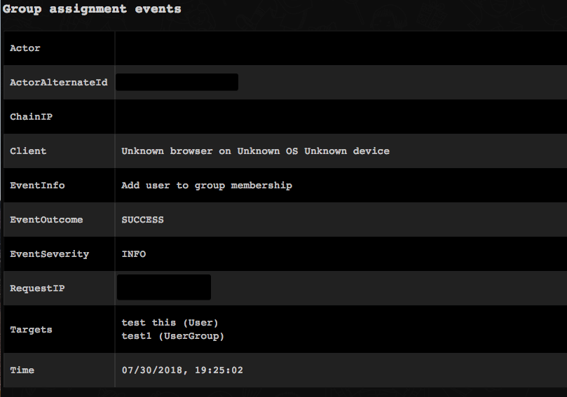</a>

<h3 id="h_23395984213861533631524953">17. Get information about a user that was assigned to an application</h3>

Returns event details for when a user is assigned to an application.

<h5>Base Command</h5>

<code>okta-get-application-assignments</code>

<h5>Input</h5>
<table style="width: 742px;" border="2" cellpadding="6">
<thead>
<tr>
<th style="width: 233px;"><strong>Argument Name</strong></th>
<th style="width: 417px;"><strong>Description</strong></th>
<th style="width: 582px;"><strong>More Information</strong></th>
<th style="width: 58px;"><strong>Required</strong></th>
</tr>
</thead>
<tbody>
<tr>
<td style="width: 233px;">since</td>
<td style="width: 417px;">

The start date of the search range in the Internet Date/Time 

</td>
<td style="width: 582px;">

Format profile: ISO 8601

For example: 2017-05-03T16:22:18Z.

</td>
<td style="width: 58px;">Optional</td>
</tr>
<tr>
<td style="width: 233px;">until</td>
<td style="width: 417px;">The end date of the search range in the Internet Date/Time </td>
<td style="width: 582px;">

Format profile: ISO 8601

For example: 2017-05-03T16:22:18Z.

</td>
<td style="width: 58px;">Optional</td>
</tr>
<tr>
<td style="width: 233px;">sortOrder</td>
<td style="width: 417px;">The order of the returned event</td>
<td style="width: 582px;">Default is ASCENDING.</td>
<td style="width: 58px;">Optional</td>
</tr>
<tr>
<td style="width: 233px;">limit</td>
<td style="width: 417px;">Sets the number of results returned in the response</td>
<td style="width: 582px;">Default is 100.</td>
<td style="width: 58px;">Optional</td>
</tr>
</tbody>
</table>

 

<h5>Context Output</h5>
<table style="width: 746px;" border="2" cellpadding="6">
<thead>
<tr>
<th style="width: 292px;"><strong>Path</strong></th>
<th style="width: 153px;"><strong>Type</strong></th>
<th style="width: 263px;"><strong>Description</strong></th>
</tr>
</thead>
<tbody>
<tr>
<td style="width: 292px;">Okta.Logs.Events.actor.alternateId</td>
<td style="width: 153px;">string</td>
<td style="width: 263px;">Alternative ID of actor.</td>
</tr>
<tr>
<td style="width: 292px;">Okta.Logs.Events.actor.displayName</td>
<td style="width: 153px;">string</td>
<td style="width: 263px;">Display name of actor.</td>
</tr>
<tr>
<td style="width: 292px;">Okta.Logs.Events.actor.id</td>
<td style="width: 153px;">string</td>
<td style="width: 263px;">ID of actor.</td>
</tr>
<tr>
<td style="width: 292px;">Okta.Logs.Events.client.userAgent.rawUserAgent</td>
<td style="width: 153px;">string</td>
<td style="width: 263px;">A raw string representation of the user agent, formatted according to section 5.5.3 of HTTP/1.1 Semantics and Content. Both the browser and the OS fields can be derived from this field.</td>
</tr>
<tr>
<td style="width: 292px;">Okta.Logs.Events.client.userAgent.os</td>
<td style="width: 153px;">string</td>
<td style="width: 263px;">The Operating System the client runs on (for example, Windows 10).</td>
</tr>
<tr>
<td style="width: 292px;">Okta.Logs.Events.client.userAgent.browser</td>
<td style="width: 153px;">string</td>
<td style="width: 263px;">If the client is a web browser, this field identifies the type of web browser (for example, CHROME, FIREFOX).</td>
</tr>
<tr>
<td style="width: 292px;">Okta.Logs.Events.client.device</td>
<td style="width: 153px;">string</td>
<td style="width: 263px;">The type of device that the client operated from (for example, Computer).</td>
</tr>
<tr>
<td style="width: 292px;">Okta.Logs.Events.client.id</td>
<td style="width: 153px;">string</td>
<td style="width: 263px;">

For OAuth requests this is the ID of the requesting OAuth client.

For SSWS token requests, this is the ID of the requesting agent.

</td>
</tr>
<tr>
<td style="width: 292px;">Okta.Logs.Events.client.ipAddress</td>
<td style="width: 153px;">string</td>
<td style="width: 263px;">IP address that the client made the request from.</td>
</tr>
<tr>
<td style="width: 292px;">Okta.Logs.Events.client.geographicalContext.city</td>
<td style="width: 153px;">string</td>
<td style="width: 263px;">The city encompassing the area containing the <em>geolocation</em> coordinates, if available (for example, Seattle, San Francisco)</td>
</tr>
<tr>
<td style="width: 292px;">Okta.Logs.Events.geographicalContext.state</td>
<td style="width: 153px;">string</td>
<td style="width: 263px;">Full name of the state or province encompassing the area containing the <em>geolocation</em> coordinates (for example, Montana, Incheon).</td>
</tr>
<tr>
<td style="width: 292px;">Okta.Logs.Events.client.geographicalContext.country</td>
<td style="width: 153px;">string</td>
<td style="width: 263px;">Full name of the country encompassing the area containing the <em>geolocation</em> coordinates (for example, France, Uganda).</td>
</tr>
<tr>
<td style="width: 292px;">Okta.Logs.Events.displayMessage</td>
<td style="width: 153px;">string</td>
<td style="width: 263px;">The display message for an event.</td>
</tr>
<tr>
<td style="width: 292px;">Okta.Logs.Events.eventType</td>
<td style="width: 153px;">string</td>
<td style="width: 263px;">The type of event that was published.</td>
</tr>
<tr>
<td style="width: 292px;">Okta.Logs.Events.outcome.result</td>
<td style="width: 153px;">string</td>
<td style="width: 263px;">

Result of the action:

<ul>
<li>SUCCESS</li>
<li>FAILURE</li>
<li>SKIPPED</li>
<li>UNKNOWN</li>
</ul>
</td>
</tr>
<tr>
<td style="width: 292px;">Okta.Logs.Events.outcome.reason</td>
<td style="width: 153px;">string</td>
<td style="width: 263px;">Reason for the result (for example, INVALID_CREDENTIALS).</td>
</tr>
<tr>
<td style="width: 292px;">Okta.Logs.Events.published</td>
<td style="width: 153px;">string</td>
<td style="width: 263px;">Timestamp when the event was published.</td>
</tr>
<tr>
<td style="width: 292px;">Okta.Logs.Events.severity</td>
<td style="width: 153px;">string</td>
<td style="width: 263px;">

Indicates how severe the event is:

<ul>
<li>DEBUG</li>
<li>INFO</li>
<li>WARN</li>
<li>ERROR</li>
</ul>
</td>
</tr>
<tr>
<td style="width: 292px;">Okta.Logs.Events.securityContext.asNumber</td>
<td style="width: 153px;">number</td>
<td style="width: 263px;">Autonomous system number associated with the autonomous system that the event request was sourced to.</td>
</tr>
<tr>
<td style="width: 292px;">Okta.Logs.Events.securityContext.asOrg</td>
<td style="width: 153px;">string</td>
<td style="width: 263px;">Organization associated with the autonomous system that the event request was sourced to.</td>
</tr>
<tr>
<td style="width: 292px;">Okta.Logs.Events.securityContext.isp</td>
<td style="width: 153px;">string</td>
<td style="width: 263px;">Internet service provider used to sent the event’s request.</td>
</tr>
<tr>
<td style="width: 292px;">Okta.Logs.Events.securityContext.domain</td>
<td style="width: 153px;">string</td>
<td style="width: 263px;">The domain name associated with the IP address of the inbound event request.</td>
</tr>
<tr>
<td style="width: 292px;">Okta.Logs.Events.securityContext.isProxy</td>
<td style="width: 153px;">string</td>
<td style="width: 263px;">Specifies whether an event’s request is from a known proxy.</td>
</tr>
<tr>
<td style="width: 292px;">Okta.Logs.Events.request.ipChain.IP</td>
<td style="width: 153px;">string</td>
<td style="width: 263px;">IP address.</td>
</tr>
<tr>
<td style="width: 292px;">Okta.Logs.Events.request.ipChain.geographicalContext.city</td>
<td style="width: 153px;">string</td>
<td style="width: 263px;">The city encompassing the area containing the <em>geolocation</em> coordinates, if available (for example, Seattle, San Francisco).</td>
</tr>
<tr>
<td style="width: 292px;">Okta.Logs.Events.request.ipChain.geographicalContext.state</td>
<td style="width: 153px;">string</td>
<td style="width: 263px;">Full name of the state or province encompassing the area containing the <em>geolocation</em> coordinates (for example, Montana, Incheon).</td>
</tr>
<tr>
<td style="width: 292px;">Okta.Logs.Events.request.ipChain.geographicalContext.country</td>
<td style="width: 153px;">string</td>
<td style="width: 263px;">Full name of the country encompassing the area containing the <em>geolocation</em> coordinates (for example, France, Uganda).</td>
</tr>
<tr>
<td style="width: 292px;">Okta.Logs.Events.request.ipChain.source</td>
<td style="width: 153px;">string</td>
<td style="width: 263px;">Details regarding the source.</td>
</tr>
<tr>
<td style="width: 292px;">Okta.Logs.Events.target.id</td>
<td style="width: 153px;">string</td>
<td style="width: 263px;">Target ID.</td>
</tr>
<tr>
<td style="width: 292px;">Okta.Logs.Events.target.type</td>
<td style="width: 153px;">string</td>
<td style="width: 263px;">Target type.</td>
</tr>
<tr>
<td style="width: 292px;">Okta.Logs.Events.target.alternateId</td>
<td style="width: 153px;">string</td>
<td style="width: 263px;">Alternative target ID.</td>
</tr>
<tr>
<td style="width: 292px;">Okta.Logs.Events.target.displayName</td>
<td style="width: 153px;">string</td>
<td style="width: 263px;">Display name of the target.</td>
</tr>
</tbody>
</table>

 

<h5>Command Example</h5>

<code>!okta-get-application-assignments limit=1 since=2018-07-31T08:22:18Z</code>

<h5>Context Example</h5>
<pre>{
    "Okta": {
        "Logs": {
            "Events": {
                "actor": {
                    "alternateId": "actor@org.com",
                    "detailEntry": null,
                    "displayName": "the actor",
                    "id": "00u66lckd7lpjidYi0h7",
                    "type": "User"
                },
                "authenticationContext": {
                    "authenticationProvider": null,
                    "authenticationStep": 0,
                    "credentialProvider": null,
                    "credentialType": null,
                    "externalSessionId": "trsTLYkoNfDSRGgbq9SzBnY-Q",
                    "interface": null,
                    "issuer": null
                },
                "client": {
                    "device": "Unknown",
                    "geographicalContext": {
                        "city": "Tel Aviv",
                        "country": "Israel",
                        "geolocation": {
                            "lat": 32.0667,
                            "lon": 34.7667
                        },
                        "postalCode": null,
                        "state": "Tel Aviv"
                    },
                    "id": null,
                    "ipAddress": "1.2.3.4",
                    "userAgent": {
                        "browser": "UNKNOWN",
                        "os": "Unknown",
                        "rawUserAgent": "Go-http-client/1.1"
                    },
                    "zone": "null"
                },
                "debugContext": {
                    "debugData": {
                        "requestUri": "/api/v1/users/00ued6gq9jItNhAsN0h7/lifecycle/activate"
                    }
                },
                "displayMessage": "Add user to application membership",
                "eventType": "application.user_membership.add",
                "legacyEventType": "app.generic.provision.assign_user_to_app",
                "outcome": {
                    "reason": null,
                    "result": "SUCCESS"
                },
                "published": "2018-07-31T12:02:31.078Z",
                "request": {
                    "ipChain": [
                        {
                            "geographicalContext": {
                                "city": "Tel Aviv",
                                "country": "Israel",
                                "geolocation": {
                                    "lat": 32.0667,
                                    "lon": 34.7667
                                },
                                "postalCode": null,
                                "state": "Tel Aviv"
                            },
                            "ip": "1.2.3.4",
                            "source": null,
                            "version": "V4"
                        }
                    ]
                },
                "securityContext": {
                    "asNumber": null,
                    "asOrg": null,
                    "domain": null,
                    "isProxy": null,
                    "isp": null
                },
                "severity": "INFO",
                "target": [
                    {
                        "alternateId": "test@this.com",
                        "detailEntry": null,
                        "displayName": "test1",
                        "id": "0uafuf6i7ardNkj7X0h7",
                        "type": "AppUser"
                    },
                    {
                        "alternateId": "org",
                        "detailEntry": null,
                        "displayName": "org",
                        "id": "0oabfkvxe1npBRdow0h7",
                        "type": "AppInstance"
                    },
                    {
                        "alternateId": "test@this.com",
                        "detailEntry": null,
                        "displayName": "test1",
                        "id": "00ued6gq9jItNhAsN0h7",
                        "type": "User"
                    }
                ],
                "transaction": {
                    "detail": {},
                    "id": "W2BP1iZAuMuRo8nEWoBn5QAABgw",
                    "type": "WEB"
                },
                "uuid": "eef74c84-4e91-45b8-be35-51d3953ad2ac",
                "version": "0"
            }
        }
    }
}
</pre>
<h5>War Room Output</h5>

<a href="../../doc_files/43462420-baffa5ec-94de-11e8-853f-bf02b25c9690.png" target="_blank" rel="noopener">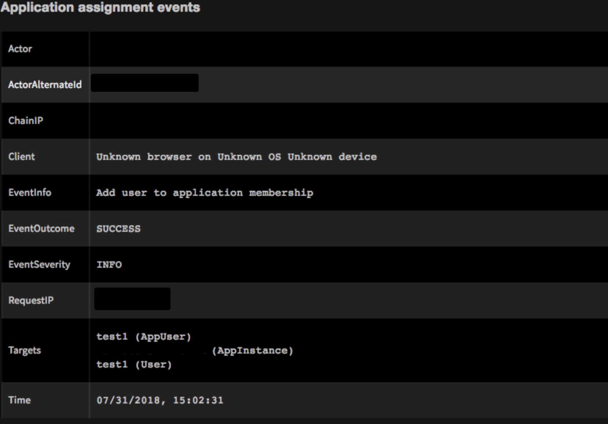</a>

<h3 id="h_79284513415061533631541893">18. Get information about a user who made an SSO attempt</h3>

Returns event details for when a user attempts to sign on using SSO to an application managed in Okta.

<h5>Base Command</h5>

<code></code>okta-get-application-authentication

<h5>Input</h5>
<table style="width: 744px;" border="2" cellpadding="6">
<tbody>
<tr>
<th style="width: 228px;"><strong>Argument Name</strong></th>
<th style="width: 422px;"><strong>Description</strong></th>
<th style="width: 582px;"><strong>More Information</strong></th>
<th style="width: 58px;"><strong>Required</strong></th>
</tr>
<tr>
<td style="width: 228px;">since</td>
<td style="width: 422px;">

The start date of the search range in the Internet Date/Time 

</td>
<td style="width: 582px;">

Format profile: ISO 8601

For example: 2017-05-03T16:22:18Z.

</td>
<td style="width: 58px;">Optional</td>
</tr>
<tr>
<td style="width: 228px;">until</td>
<td style="width: 422px;">The end date of the search range in the Internet Date/Time </td>
<td style="width: 582px;">

Format profile: ISO 8601

For example: 2017-05-03T16:22:18Z.

</td>
<td style="width: 58px;">Optional</td>
</tr>
<tr>
<td style="width: 228px;">sortOrder</td>
<td style="width: 422px;">The order of the returned event</td>
<td style="width: 582px;">Default is ASCENDING.</td>
<td style="width: 58px;">Optional</td>
</tr>
<tr>
<td style="width: 228px;">limit</td>
<td style="width: 422px;">Sets the number of results returned in the response</td>
<td style="width: 582px;">Default is 100.</td>
<td style="width: 58px;">Optional</td>
</tr>
</tbody>
</table>

 

<h5>Context Output</h5>
<table style="width: 746px;" border="2" cellpadding="6">
<thead>
<tr>
<th style="width: 279px;"><strong>Path</strong></th>
<th style="width: 164px;"><strong>Type</strong></th>
<th style="width: 265px;"><strong>Description</strong></th>
</tr>
</thead>
<tbody>
<tr>
<td style="width: 279px;">Okta.Logs.Events.actor.alternateId</td>
<td style="width: 164px;">string</td>
<td style="width: 265px;">Alternative ID of actor.</td>
</tr>
<tr>
<td style="width: 279px;">Okta.Logs.Events.actor.displayName</td>
<td style="width: 164px;">string</td>
<td style="width: 265px;">Display name of actor.</td>
</tr>
<tr>
<td style="width: 279px;">Okta.Logs.Events.actor.id</td>
<td style="width: 164px;">string</td>
<td style="width: 265px;">Actor ID.</td>
</tr>
<tr>
<td style="width: 279px;">Okta.Logs.Events.client.userAgent.rawUserAgent</td>
<td style="width: 164px;">string</td>
<td style="width: 265px;">A raw string representation of the user agent, formatted according to section 5.5.3 of HTTP/1.1 Semantics and Content. Both the browser and the OS fields can be derived from this field.</td>
</tr>
<tr>
<td style="width: 279px;">Okta.Logs.Events.client.userAgent.os</td>
<td style="width: 164px;">string</td>
<td style="width: 265px;">The Operating System the client runs on (for example, Windows 10).</td>
</tr>
<tr>
<td style="width: 279px;">Okta.Logs.Events.client.userAgent.browser</td>
<td style="width: 164px;">string</td>
<td style="width: 265px;">If the client is a web browser, this field identifies the type of web browser (for example, CHROME, FIREFOX).</td>
</tr>
<tr>
<td style="width: 279px;">Okta.Logs.Events.client.device</td>
<td style="width: 164px;">string</td>
<td style="width: 265px;">The type of device that the client operated from (for example, Computer).</td>
</tr>
<tr>
<td style="width: 279px;">Okta.Logs.Events.client.id</td>
<td style="width: 164px;">string</td>
<td style="width: 265px;">

For OAuth requests this is the ID of the requesting OAuth client.

For SSWS token requests, this is the ID of the requesting agent.

</td>
</tr>
<tr>
<td style="width: 279px;">Okta.Logs.Events.client.ipAddress</td>
<td style="width: 164px;">string</td>
<td style="width: 265px;">IP address that the client made the request from.</td>
</tr>
<tr>
<td style="width: 279px;">Okta.Logs.Events.client.geographicalContext.city</td>
<td style="width: 164px;">string</td>
<td style="width: 265px;">The city encompassing the area containing the <em>geolocation</em> coordinates, if available (for example, Seattle, San Francisco).</td>
</tr>
<tr>
<td style="width: 279px;">Okta.Logs.Events.geographicalContext.state</td>
<td style="width: 164px;">string</td>
<td style="width: 265px;">Full name of the state or province encompassing the area containing the <em>geolocation</em> coordinates (for example, Montana, Incheon).</td>
</tr>
<tr>
<td style="width: 279px;">Okta.Logs.Events.client.geographicalContext.country</td>
<td style="width: 164px;">string</td>
<td style="width: 265px;">Full name of the country encompassing the area containing the <em>geolocation</em> coordinates (for example, France, Uganda).</td>
</tr>
<tr>
<td style="width: 279px;">Okta.Logs.Events.displayMessage</td>
<td style="width: 164px;">string</td>
<td style="width: 265px;">The display message for an event.</td>
</tr>
<tr>
<td style="width: 279px;">Okta.Logs.Events.eventType</td>
<td style="width: 164px;">string</td>
<td style="width: 265px;">The type of event that was published.</td>
</tr>
<tr>
<td style="width: 279px;">Okta.Logs.Events.outcome.result</td>
<td style="width: 164px;">string</td>
<td style="width: 265px;">

Result of the action:

<ul>
<li>SUCCESS</li>
<li>FAILURE</li>
<li>SKIPPED</li>
<li>UNKNOWN</li>
</ul>
</td>
</tr>
<tr>
<td style="width: 279px;">Okta.Logs.Events.outcome.reason</td>
<td style="width: 164px;">string</td>
<td style="width: 265px;">Reason for the result (for example, INVALID_CREDENTIALS).</td>
</tr>
<tr>
<td style="width: 279px;">Okta.Logs.Events.published</td>
<td style="width: 164px;">string</td>
<td style="width: 265px;">Timestamp when event was published.</td>
</tr>
<tr>
<td style="width: 279px;">Okta.Logs.Events.severity</td>
<td style="width: 164px;">string</td>
<td style="width: 265px;">

Indicates how severe the event is:

<ul>
<li>DEBUG</li>
<li>INFO</li>
<li>WARN</li>
<li>ERROR</li>
</ul>
</td>
</tr>
<tr>
<td style="width: 279px;">Okta.Logs.Events.securityContext.asNumber</td>
<td style="width: 164px;">number</td>
<td style="width: 265px;">Autonomous system number associated with the autonomous system that the event request was sourced to.</td>
</tr>
<tr>
<td style="width: 279px;">Okta.Logs.Events.securityContext.asOrg</td>
<td style="width: 164px;">string</td>
<td style="width: 265px;">Organization associated with the autonomous system that the event request was sourced to.</td>
</tr>
<tr>
<td style="width: 279px;">Okta.Logs.Events.securityContext.isp</td>
<td style="width: 164px;">string</td>
<td style="width: 265px;">Internet service provider used to sent the event’s request.</td>
</tr>
<tr>
<td style="width: 279px;">Okta.Logs.Events.securityContext.domain</td>
<td style="width: 164px;">string</td>
<td style="width: 265px;">The domain name associated with the IP address of the inbound event request.</td>
</tr>
<tr>
<td style="width: 279px;">Okta.Logs.Events.securityContext.isProxy</td>
<td style="width: 164px;">string</td>
<td style="width: 265px;">Specifies whether an event’s request is from a known proxy</td>
</tr>
<tr>
<td style="width: 279px;">Okta.Logs.Events.request.ipChain.IP</td>
<td style="width: 164px;">string</td>
<td style="width: 265px;">IP address.</td>
</tr>
<tr>
<td style="width: 279px;">Okta.Logs.Events.request.ipChain.geographicalContext.city</td>
<td style="width: 164px;">string</td>
<td style="width: 265px;">The city encompassing the area containing the <em>geolocation</em> coordinates, if available (for example, Seattle, San Francisco).</td>
</tr>
<tr>
<td style="width: 279px;">Okta.Logs.Events.request.ipChain.geographicalContext.state</td>
<td style="width: 164px;">string</td>
<td style="width: 265px;">Full name of the state or province encompassing the area containing the <em>geolocation</em> coordinates (for example, Montana, Incheon).</td>
</tr>
<tr>
<td style="width: 279px;">Okta.Logs.Events.request.ipChain.geographicalContext.country</td>
<td style="width: 164px;">string</td>
<td style="width: 265px;">Full name of the country encompassing the area containing the <em>geolocation</em> coordinates (for example, France, Uganda).</td>
</tr>
<tr>
<td style="width: 279px;">Okta.Logs.Events.request.ipChain.source</td>
<td style="width: 164px;">string</td>
<td style="width: 265px;">Details regarding the source.</td>
</tr>
<tr>
<td style="width: 279px;">Okta.Logs.Events.target.id</td>
<td style="width: 164px;">string</td>
<td style="width: 265px;">Target ID.</td>
</tr>
<tr>
<td style="width: 279px;">Okta.Logs.Events.target.type</td>
<td style="width: 164px;">string</td>
<td style="width: 265px;">Target type.</td>
</tr>
<tr>
<td style="width: 279px;">Okta.Logs.Events.target.alternateId</td>
<td style="width: 164px;">string</td>
<td style="width: 265px;">Alternative target ID.</td>
</tr>
<tr>
<td style="width: 279px;">Okta.Logs.Events.target.displayName</td>
<td style="width: 164px;">string</td>
<td style="width: 265px;">Display name of the target.</td>
</tr>
</tbody>
</table>

 

<h5>Command Example</h5>

<code>!okta-get-application-authentication limit=1</code>

<h5>Context Example</h5>
<pre>{
    "Okta": {
        "Logs": {
            "Events": {
                "actor": {
                    "alternateId": "actor@org.com",
                    "detailEntry": null,
                    "displayName": "the actor",
                    "id": "00u66lckd7lpjidYi0h7",
                    "type": "User"
                },
                "authenticationContext": {
                    "authenticationProvider": null,
                    "authenticationStep": 0,
                    "credentialProvider": null,
                    "credentialType": null,
                    "externalSessionId": "102Mir-8MMcRSyiM0JUWgA3Xg",
                    "interface": null,
                    "issuer": null
                },
                "client": {
                    "device": "Computer",
                    "geographicalContext": {
                        "city": "Cupertino",
                        "country": "United States",
                        "geolocation": {
                            "lat": 37.3042,
                            "lon": -122.0946
                        },
                        "postalCode": "95014",
                        "state": "California"
                    },
                    "id": null,
                    "ipAddress": "1.2.3.4",
                    "userAgent": {
                        "browser": "CHROME",
                        "os": "Mac OS X",
                        "rawUserAgent": "Mozilla/5.0 (Macintosh; Intel Mac OS X 10_11_6) AppleWebKit/537.36 (KHTML, like Gecko) Chrome/67.0.3396.99 Safari/537.36"
                    },
                    "zone": "null"
                },
                "debugContext": {
                    "debugData": {
                        "initiationType": "IDP_INITIATED",
                        "requestUri": "/app/demistodev725178_examplesamlapplication_1/exk66lba7vkLRUBQj0h7/sso/saml",
                        "signOnMode": "SAML 2.0"
                    }
                },
                "displayMessage": "User single sign on to app",
                "eventType": "user.authentication.sso",
                "legacyEventType": "app.auth.sso",
                "outcome": {
                    "reason": null,
                    "result": "SUCCESS"
                },
                "published": "2018-07-24T20:16:30.670Z",
                "request": {
                    "ipChain": [
                        {
                            "geographicalContext": {
                                "city": "Cupertino",
                                "country": "United States",
                                "geolocation": {
                                    "lat": 37.3042,
                                    "lon": -122.0946
                                },
                                "postalCode": "95014",
                                "state": "California"
                            },
                            "ip": "1.2.3.4",
                            "source": null,
                            "version": "V4"
                        }
                    ]
                },
                "securityContext": {
                    "asNumber": null,
                    "asOrg": null,
                    "domain": null,
                    "isProxy": null,
                    "isp": null
                },
                "severity": "INFO",
                "target": [
                    {
                        "alternateId": "Application",
                        "detailEntry": {
                            "signOnModeType": "SAML_2_0"
                        },
                        "displayName": "Application",
                        "id": "0oa66lba7w3Ns1ril0h7",
                        "type": "AppInstance"
                    },
                    {
                        "alternateId": "target@org.com",
                        "detailEntry": null,
                        "displayName": "the target",
                        "id": "0ua66lsm6uLy0L8aZ0h7",
                        "type": "AppUser"
                    }
                ],
                "transaction": {
                    "detail": {},
                    "id": "W1eJHiPpdkHoLVc0yU04WwAAB20",
                    "type": "WEB"
                },
                "uuid": "0ef202af-0bc5-4fa9-a972-4aeedcb68428",
                "version": "0"
            }
        }
    }
}
</pre>
<h5>War Room Output</h5>

<a href="../../doc_files/43462731-91389038-94df-11e8-9fe5-39b030db28fe.png" target="_blank" rel="noopener">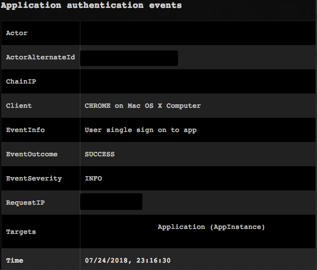</a>

<h3 id="h_95355697816251533631551347">19. Add a user to a group</h3>

Adds a user to a group with the <em>OKTA_GROUP</em> type.

<h5>Base Command</h5>

<code>okta-add-to-group</code>

<h5>Input</h5>
<table style="width: 746px;" border="2" cellpadding="6">
<thead>
<tr>
<th style="width: 171px;"><strong>Argument Name</strong></th>
<th style="width: 438px;"><strong>Description</strong></th>
<th style="width: 99px;"><strong>Required</strong></th>
</tr>
</thead>
<tbody>
<tr>
<td style="width: 171px;">userId</td>
<td style="width: 438px;">ID of the user to add</td>
<td style="width: 99px;">Optional</td>
</tr>
<tr>
<td style="width: 171px;">groupId</td>
<td style="width: 438px;">ID of the group to add the user to</td>
<td style="width: 99px;">Optional</td>
</tr>
<tr>
<td style="width: 171px;">username</td>
<td style="width: 438px;">Name of the user to add</td>
<td style="width: 99px;">Optional</td>
</tr>
<tr>
<td style="width: 171px;">groupName</td>
<td style="width: 438px;">Name of the group to add the user to</td>
<td style="width: 99px;">Optional</td>
</tr>
</tbody>
</table>

 

<h5>Context Output</h5>

There is no context output for this command.

<h5>Command Example</h5>

<code>!okta-add-to-group username=test@this.com groupName=test1</code>

<h5>War Room Output</h5>

<a href="../../doc_files/43463112-8652d6dc-94e0-11e8-88a0-e53e59dc79e4.png" target="_blank" rel="noopener">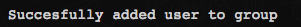</a>

<h3 id="h_18231657617431533631561439">20 Remove a user from a group</h3>

Removes a user from a group with the <em>OKTA_GROUP</em> type.

<h5>Base Command</h5>

<code>okta-remove-from-group</code>

<h5>Input</h5>
<table style="width: 746px;" border="2" cellpadding="6">
<thead>
<tr>
<th style="width: 178px;"><strong>Argument Name</strong></th>
<th style="width: 427px;"><strong>Description</strong></th>
<th style="width: 103px;"><strong>Required</strong></th>
</tr>
</thead>
<tbody>
<tr>
<td style="width: 178px;">userId</td>
<td style="width: 427px;">ID of the user to remove</td>
<td style="width: 103px;">Optional</td>
</tr>
<tr>
<td style="width: 178px;">groupId</td>
<td style="width: 427px;">ID of the group to remove the user from</td>
<td style="width: 103px;">Optional</td>
</tr>
<tr>
<td style="width: 178px;">username</td>
<td style="width: 427px;">Name of the user to add</td>
<td style="width: 103px;">Optional</td>
</tr>
<tr>
<td style="width: 178px;">groupName</td>
<td style="width: 427px;">Name of the group to add the user to</td>
<td style="width: 103px;">Optional</td>
</tr>
</tbody>
</table>

 

<h5>Context Output</h5>

There is no context output for this command.

<h5>Command Example</h5>
<pre>  !okta-remove-from-group username=test@this.com groupName=test1
</pre>
<h5>War Room Output</h5>

<h3 id="h_34655219818591533631581113">21. Get logs</h3>

Returns logs using specified filters.

<h5>Base Command</h5>

<code>okta-get-logs</code>

<h5>Input</h5>
<table style="width: 786px;" border="2" cellpadding="6">
<thead>
<tr>
<th style="width: 256px;"><strong>Argument Name</strong></th>
<th style="width: 438px;"><strong>Description</strong></th>
<th style="width: 624px;"><strong>More Information</strong></th>
<th style="width: 56px;"><strong>Required</strong></th>
</tr>
</thead>
<tbody>
<tr>
<td style="width: 256px;">filter</td>
<td style="width: 438px;">

Useful for performing structured queries where constraints on <a href="https://developer.okta.com/docs/reference/api/system-log/#logevent-object"><em>LogEvent</em></a> attribute values can be explicitly targeted.

For more information about filtering, visit <a href="https://developer.okta.com/docs/api/getting_started/design_principles#filtering" rel="nofollow">Okta Support on Filtering</a>

</td>
<td style="width: 624px;">

These Okta parameters are supported on Cortex XSOAR:

<ul>
<li>
<strong><em>eventType</em></strong> - Events that have a specific action (<em>eventType eq </em>on Okta)</li>
<li>
<em><strong>id</strong></em> - Events published with a specific target ID (<em>eventType target.id eq </em>on Okta)</li>
<li>
<strong><em>id</em></strong> - Events published with a specific actor ID (<em>actor.id eq </em>on Okta)</li>
</ul>
</td>
<td style="width: 56px;">Optional</td>
</tr>
<tr>
<td style="width: 256px;">query</td>
<td style="width: 438px;">

Can be used to perform keyword matching against a <a href="https://developer.okta.com/okta-sdk-php/1.0.0/Okta/Generated/Logs/LogEvent.html"><em>LogEvents</em></a> object’s attribute values. In order to satisfy the constraint, all supplied keywords must be matched exactly. Matching is case-insensitive.

</td>
<td style="width: 624px;">

Examples of common keyword filtering:

<ul>
<li>Events that mention a specific city query=San Francisco</li>
<li>Events that mention a specific URL query=interestingURI.com</li>
<li>Events that mention a specific person query=firstName lastName</li>
</ul>
</td>
<td style="width: 56px;">Optional</td>
</tr>
<tr>
<td style="width: 256px;">since</td>
<td style="width: 438px;">The start date of the search range in the Internet Date/Time  </td>
<td style="width: 624px;">

Format profile: ISO 8601

For example: 2017-05-03T16:22:18Z

</td>
<td style="width: 56px;">Optional</td>
</tr>
<tr>
<td style="width: 256px;">until</td>
<td style="width: 438px;">The end date of the search range in the Internet Date/Time </td>
<td style="width: 624px;">

Format profile: ISO 8601

For example: 2017-05-03T16:22:18Z

</td>
<td style="width: 56px;">Optional</td>
</tr>
<tr>
<td style="width: 256px;">sortOrder</td>
<td style="width: 438px;">The order of the returned events</td>
<td style="width: 624px;">Default is ASCENDING</td>
<td style="width: 56px;">Optional</td>
</tr>
<tr>
<td style="width: 256px;">limit</td>
<td style="width: 438px;">Sets the number of results returned in the response</td>
<td style="width: 624px;">Default is 100</td>
<td style="width: 56px;">Optional</td>
</tr>
</tbody>
</table>

 

<h5>Context Output</h5>
<table style="width: 746px;" border="2" cellpadding="6">
<thead>
<tr>
<th style="width: 311px;"><strong>Path</strong></th>
<th style="width: 135px;"><strong>Type</strong></th>
<th style="width: 262px;"><strong>Description</strong></th>
</tr>
</thead>
<tbody>
<tr>
<td style="width: 311px;">Okta.Logs.Events.actor.alternateId</td>
<td style="width: 135px;">string</td>
<td style="width: 262px;">Alternative actor ID.</td>
</tr>
<tr>
<td style="width: 311px;">Okta.Logs.Events.actor.displayName</td>
<td style="width: 135px;">string</td>
<td style="width: 262px;">Display name of actor.</td>
</tr>
<tr>
<td style="width: 311px;">Okta.Logs.Events.actor.id</td>
<td style="width: 135px;">string</td>
<td style="width: 262px;">Actor ID.</td>
</tr>
<tr>
<td style="width: 311px;">Okta.Logs.Events.client.userAgent.rawUserAgent</td>
<td style="width: 135px;">string</td>
<td style="width: 262px;">A raw string representation of the user agent, formatted according to section 5.5.3 of HTTP/1.1 Semantics and Content. Both the browser and the OS fields can be derived from this field.</td>
</tr>
<tr>
<td style="width: 311px;">Okta.Logs.Events.client.userAgent.os</td>
<td style="width: 135px;">string</td>
<td style="width: 262px;">The Operating System the client runs on (for example, Windows 10).</td>
</tr>
<tr>
<td style="width: 311px;">Okta.Logs.Events.client.userAgent.browser</td>
<td style="width: 135px;">string</td>
<td style="width: 262px;">If the client is a web browser, this field identifies the type of web browser (for example, CHROME, FIREFOX).</td>
</tr>
<tr>
<td style="width: 311px;">Okta.Logs.Events.client.device</td>
<td style="width: 135px;">string</td>
<td style="width: 262px;">The type of device that the client operated from (for example, Computer).</td>
</tr>
<tr>
<td style="width: 311px;">Okta.Logs.Events.client.id</td>
<td style="width: 135px;">string</td>
<td style="width: 262px;">

For OAuth requests this is the ID of the requesting OAuth client.

For SSWS token requests, this is the ID of the requesting agent.

</td>
</tr>
<tr>
<td style="width: 311px;">Okta.Logs.Events.client.ipAddress</td>
<td style="width: 135px;">string</td>
<td style="width: 262px;">IP address that the client made the request from.</td>
</tr>
<tr>
<td style="width: 311px;">Okta.Logs.Events.client.geographicalContext.city</td>
<td style="width: 135px;">string</td>
<td style="width: 262px;">The city encompassing the area containing the <em>geolocation</em> coordinates, if available (for example, Seattle, San Francisco).</td>
</tr>
<tr>
<td style="width: 311px;">Okta.Logs.Events.geographicalContext.state</td>
<td style="width: 135px;">string</td>
<td style="width: 262px;">Full name of the state or province encompassing the area containing the <em>geolocation</em> coordinates (for example, Montana, Incheon).</td>
</tr>
<tr>
<td style="width: 311px;">Okta.Logs.Events.client.geographicalContext.country</td>
<td style="width: 135px;">string</td>
<td style="width: 262px;">Full name of the country encompassing the area containing the <em>geolocation</em> coordinates (for example, France, Uganda).</td>
</tr>
<tr>
<td style="width: 311px;">Okta.Logs.Events.displayMessage</td>
<td style="width: 135px;">string</td>
<td style="width: 262px;">The display message for an event.</td>
</tr>
<tr>
<td style="width: 311px;">Okta.Logs.Events.eventType</td>
<td style="width: 135px;">string</td>
<td style="width: 262px;">Type of event that was published.</td>
</tr>
<tr>
<td style="width: 311px;">Okta.Logs.Events.outcome.result</td>
<td style="width: 135px;">string</td>
<td style="width: 262px;">

Result of the action:

<ul>
<li>SUCCESS</li>
<li>FAILURE</li>
<li>SKIPPED</li>
<li>UNKNOWN</li>
</ul>
</td>
</tr>
<tr>
<td style="width: 311px;">Okta.Logs.Events.outcome.reason</td>
<td style="width: 135px;">string</td>
<td style="width: 262px;">Reason for the result (for example, INVALID_CREDENTIALS).</td>
</tr>
<tr>
<td style="width: 311px;">Okta.Logs.Events.published</td>
<td style="width: 135px;">string</td>
<td style="width: 262px;">Timestamp when event was published.</td>
</tr>
<tr>
<td style="width: 311px;">Okta.Logs.Events.severity</td>
<td style="width: 135px;">string</td>
<td style="width: 262px;">

Indicates how severe the event is:

<ul>
<li>DEBUG</li>
<li>INFO</li>
<li>WARN</li>
<li>ERROR</li>
</ul>
</td>
</tr>
<tr>
<td style="width: 311px;">Okta.Logs.Events.securityContext.asNumber</td>
<td style="width: 135px;">number</td>
<td style="width: 262px;">Autonomous system number associated with the autonomous system that the event request was sourced to.</td>
</tr>
<tr>
<td style="width: 311px;">Okta.Logs.Events.securityContext.asOrg</td>
<td style="width: 135px;">string</td>
<td style="width: 262px;">Organization associated with the autonomous system that the event request was sourced to.</td>
</tr>
<tr>
<td style="width: 311px;">Okta.Logs.Events.securityContext.isp</td>
<td style="width: 135px;">string</td>
<td style="width: 262px;">Internet service provider used to sent the event’s request.</td>
</tr>
<tr>
<td style="width: 311px;">Okta.Logs.Events.securityContext.domain</td>
<td style="width: 135px;">string</td>
<td style="width: 262px;">The domain name associated with the IP address of the inbound event request.</td>
</tr>
<tr>
<td style="width: 311px;">Okta.Logs.Events.securityContext.isProxy</td>
<td style="width: 135px;">string</td>
<td style="width: 262px;">Specifies whether an event’s request is from a known proxy.</td>
</tr>
<tr>
<td style="width: 311px;">Okta.Logs.Events.request.ipChain.IP</td>
<td style="width: 135px;">string</td>
<td style="width: 262px;">IP address.</td>
</tr>
<tr>
<td style="width: 311px;">Okta.Logs.Events.request.ipChain.geographicalContext.city</td>
<td style="width: 135px;">string</td>
<td style="width: 262px;">The city encompassing the area containing the <em>geolocation</em> coordinates, if available (for example, Seattle, San Francisco).</td>
</tr>
<tr>
<td style="width: 311px;">Okta.Logs.Events.request.ipChain.geographicalContext.state</td>
<td style="width: 135px;">string</td>
<td style="width: 262px;">Full name of the state or province encompassing the area containing the <em>geolocation</em> coordinates (for example, Montana, Incheon).</td>
</tr>
<tr>
<td style="width: 311px;">Okta.Logs.Events.request.ipChain.geographicalContext.country</td>
<td style="width: 135px;">string</td>
<td style="width: 262px;">Full name of the country encompassing the area containing the <em>geolocation</em> coordinates (for example, France, Uganda).</td>
</tr>
<tr>
<td style="width: 311px;">Okta.Logs.Events.request.ipChain.source</td>
<td style="width: 135px;">string</td>
<td style="width: 262px;">Details regarding the source.</td>
</tr>
<tr>
<td style="width: 311px;">Okta.Logs.Events.target.id</td>
<td style="width: 135px;">string</td>
<td style="width: 262px;">Target ID.</td>
</tr>
<tr>
<td style="width: 311px;">Okta.Logs.Events.target.type</td>
<td style="width: 135px;">string</td>
<td style="width: 262px;">Type of Target.</td>
</tr>
<tr>
<td style="width: 311px;">Okta.Logs.Events.target.alternateId</td>
<td style="width: 135px;">string</td>
<td style="width: 262px;">Alternative target ID.</td>
</tr>
<tr>
<td style="width: 311px;">Okta.Logs.Events.target.displayName</td>
<td style="width: 135px;">string</td>
<td style="width: 262px;">Display name of the target.</td>
</tr>
</tbody>
</table>

 

<h5>Command Example</h5>

<code>!okta-get-logs filter="eventType eq \"user.session.start\"" until=2018-07-30T16:22:18Z</code>

<h5>Context Example</h5>
<pre>{
    "Okta": {
        "Logs": {
            "Events": {
                "actor": {
                    "alternateId": "test@this.com",
                    "detailEntry": null,
                    "displayName": "test1",
                    "id": "00ued6gq9jItNhAsN0h7",
                    "type": "User"
                },
                "authenticationContext": {
                    "authenticationProvider": null,
                    "authenticationStep": 0,
                    "credentialProvider": null,
                    "credentialType": null,
                    "externalSessionId": "unknown",
                    "interface": null,
                    "issuer": null
                },
                "client": {
                    "device": "Computer",
                    "geographicalContext": {
                        "city": "Tel Aviv",
                        "country": "Israel",
                        "geolocation": {
                            "lat": 32.0667,
                            "lon": 34.7667
                        },
                        "postalCode": null,
                        "state": "Tel Aviv"
                    },
                    "id": null,
                    "ipAddress": "1.2.3.4",
                    "userAgent": {
                        "browser": "CHROME",
                        "os": "Mac OS X",
                        "rawUserAgent": "Mozilla/5.0 (Macintosh; Intel Mac OS X 10_13_6) AppleWebKit/537.36 (KHTML, like Gecko) Chrome/67.0.3396.99 Safari/537.36"
                    },
                    "zone": "null"
                },
                "debugContext": {
                    "debugData": {
                        "requestUri": "/api/v1/authn"
                    }
                },
                "displayMessage": "User login to Okta",
                "eventType": "user.session.start",
                "legacyEventType": "core.user_auth.login_failed",
                "outcome": {
                    "reason": "GENERAL_NONSUCCESS",
                    "result": "FAILURE"
                },
                "published": "2018-07-31T12:55:59.231Z",
                "request": {
                    "ipChain": [
                        {
                            "geographicalContext": {
                                "city": "Tel Aviv",
                                "country": "Israel",
                                "geolocation": {
                                    "lat": 32.0667,
                                    "lon": 34.7667
                                },
                                "postalCode": null,
                                "state": "Tel Aviv"
                            },
                            "ip": "1.2.3.4",
                            "source": null,
                            "version": "V4"
                        }
                    ]
                },
                "securityContext": {
                    "asNumber": null,
                    "asOrg": null,
                    "domain": null,
                    "isProxy": null,
                    "isp": null
                },
                "severity": "WARN",
                "target": null,
                "transaction": {
                    "detail": {},
                    "id": "W2BcX2qHbXMeIQ9PwrRMgQAABKY",
                    "type": "WEB"
                },
                "uuid": "ff9cb6c1-e8a0-474f-8d0e-56e45bb0f9d6",
                "version": "0"
            }
        }
    }
}
</pre>
<h5>War Room Output</h5>

<h3 id="h_64954543619751533631591023">22. Get a list of groups</h3>

Enumerates groups in your organization. A subset of groups can be returned that match a supported filter expression or query.

<h5>Base Command</h5>

<code>okta-list-groups</code>

<h5>Input</h5>
<table style="width: 780px;" border="2" cellpadding="6">
<thead>
<tr>
<th style="width: 148px;"><strong>Argument Name</strong></th>
<th style="width: 564px;"><strong>Description</strong></th>
<th style="width: 38px;"><strong>Required</strong></th>
</tr>
</thead>
<tbody>
<tr>
<td style="width: 148px;">query</td>
<td style="width: 564px;">Searches the name property of groups for matching value.</td>
<td style="width: 38px;">Optional</td>
</tr>
<tr>
<td style="width: 148px;">filter</td>
<td style="width: 564px;">

Useful for performing structured queries where constraints on group attribute values are explicitly targeted.

These are some examples of Okta parameters that are supported on Cortex XSOAR for groups with the filter query parameter:

<ul>
<li>
<em><strong>type eq </strong>"OKTA_GROUP"</em> - Groups that have an <em>OKTA_GROUP</em> type</li>
<li>
<em><strong>lastUpdated lt </strong>"yyyy-MM-dd'T'HH:mm:ss.SSSZ"</em> - Groups with profile last updated before a specific timestamp</li>
<li>
<em><strong> lastMembershipUpdated eq </strong>"yyyy-MM-dd'T'HH:mm:ss.SSSZ"</em> - Groups with memberships last updated at a specific timestamp</li>
<li>
<em><strong>id eq </strong>"00g1emaKYZTWRYYRRTSK"</em> - Group with a specified ID</li>
</ul>

For more information about filtering, visit <a href="https://developer.okta.com/docs/api/getting_started/design_principles#filtering" rel="nofollow">Okta Support on Filtering</a>

</td>
<td style="width: 38px;">Optional</td>
</tr>
<tr>
<td style="width: 148px;">limit</td>
<td style="width: 564px;">Sets the number of results returned in the response.</td>
<td style="width: 38px;">Optional</td>
</tr>
</tbody>
</table>

 

<h5>Context Output</h5>
<table style="width: 746px;" border="2" cellpadding="6">
<thead>
<tr>
<th style="width: 238px;"><strong>Path</strong></th>
<th style="width: 49px;"><strong>Type</strong></th>
<th style="width: 421px;"><strong>Description</strong></th>
</tr>
</thead>
<tbody>
<tr>
<td style="width: 238px;">Okta.Group.ID</td>
<td style="width: 49px;">string</td>
<td style="width: 421px;">Unique key for the group</td>
</tr>
<tr>
<td style="width: 238px;">Okta.Group.Created</td>
<td style="width: 49px;">date</td>
<td style="width: 421px;">Timestamp for when the group was created</td>
</tr>
<tr>
<td style="width: 238px;">Okta.Group.ObjectClass</td>
<td style="width: 49px;">unknown</td>
<td style="width: 421px;">The group profile</td>
</tr>
<tr>
<td style="width: 238px;">Okta.Group.LastUpdated</td>
<td style="width: 49px;">date</td>
<td style="width: 421px;">Timestamp for when the group profile was last updated</td>
</tr>
<tr>
<td style="width: 238px;">Okta.Group.LastMembershipUpdated</td>
<td style="width: 49px;">date</td>
<td style="width: 421px;">Timestamp for when the group’s memberships were last updated</td>
</tr>
<tr>
<td style="width: 238px;">Okta.Group.Type</td>
<td style="width: 49px;">string</td>
<td style="width: 421px;">

Determines how a group’s profile and memberships are managed

<ul>
<li>OKTA_GROUP</li>
<li>APP_GROUP</li>
<li>BUILT_IN</li>
</ul>
</td>
</tr>
<tr>
<td style="width: 238px;">Okta.Group.Name</td>
<td style="width: 49px;">string</td>
<td style="width: 421px;">Name of the group</td>
</tr>
<tr>
<td style="width: 238px;">Okta.Group.Description</td>
<td style="width: 49px;">string</td>
<td style="width: 421px;">Description of the group</td>
</tr>
</tbody>
</table>

 

<h5>Command Example</h5>
<pre>  !okta-list-groups query=test1
</pre>
<h5>Context Example</h5>
<pre>{
    "Okta": {
        "Group": {
            "Created": "2016-10-25T14:52:38.000Z",
            "Description": null,
            "ID": "00g8mo0l5wuTxmoIC0h7",
            "LastMembershipUpdated": "2018-07-31T13:58:28.000Z",
            "LastUpdated": "2016-10-25T14:52:38.000Z",
            "Name": "test1",
            "ObjectClass": [
                "okta:user_group"
            ],
            "Type": "OKTA_GROUP"
        }
    }
}
</pre>
<h5>War Room Output</h5>

<a href="../../doc_files/43464242-3cd6e748-94e3-11e8-974e-5d27d1b0ccbf.png" target="_blank" rel="noopener">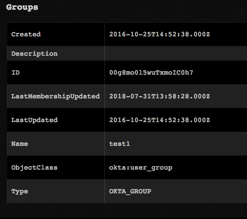</a>

<h3 id="h_18384912020901533631604427">23. Get members of a specified group</h3>

Returns members of a specified group.

<h5>Base Command</h5>

<code>okta-get-group-members</code>

<h5>Input</h5>
<table style="width: 746px;" border="2" cellpadding="6">
<thead>
<tr>
<th style="width: 180px;"><strong>Argument Name</strong></th>
<th style="width: 432px;"><strong>Description</strong></th>
<th style="width: 96px;"><strong>Required</strong></th>
</tr>
</thead>
<tbody>
<tr>
<td style="width: 180px;">groupId</td>
<td style="width: 432px;">Id of the group</td>
<td style="width: 96px;">Optional</td>
</tr>
<tr>
<td style="width: 180px;">limit</td>
<td style="width: 432px;">Limits the number of user results</td>
<td style="width: 96px;">Optional</td>
</tr>
<tr>
<td style="width: 180px;">verbose</td>
<td style="width: 432px;">Print all details</td>
<td style="width: 96px;">Optional</td>
</tr>
<tr>
<td style="width: 180px;">groupName</td>
<td style="width: 432px;">Name of the group</td>
<td style="width: 96px;">Optional</td>
</tr>
</tbody>
</table>

 

<h5>Context Output</h5>
<table style="width: 746px;" border="2" cellpadding="6">
<thead>
<tr>
<th style="width: 213px;"><strong>Path</strong></th>
<th style="width: 83px;"><strong>Type</strong></th>
<th style="width: 412px;"><strong>Description</strong></th>
</tr>
</thead>
<tbody>
<tr>
<td style="width: 213px;">Account.ID</td>
<td style="width: 83px;">string</td>
<td style="width: 412px;">Okta account ID</td>
</tr>
<tr>
<td style="width: 213px;">Account.Email</td>
<td style="width: 83px;">string</td>
<td style="width: 412px;">Okta account email</td>
</tr>
<tr>
<td style="width: 213px;">Account.Username</td>
<td style="width: 83px;">string</td>
<td style="width: 412px;">Okta account username</td>
</tr>
<tr>
<td style="width: 213px;">Account.DisplayName</td>
<td style="width: 83px;">string</td>
<td style="width: 412px;">Okta account display name</td>
</tr>
<tr>
<td style="width: 213px;">Account.Type</td>
<td style="width: 83px;">string</td>
<td style="width: 412px;">Account type - Okta</td>
</tr>
</tbody>
</table>

 

<h5>Command Example</h5>
<pre>!okta-get-group-members groupName=test1</pre>
<h5>Context Example</h5>
<pre>{
    "Account": [
        {
            "DisplayName": "User1 Fam1",
            "Email": "user1@demisto.com",
            "Group": [
                {
                    "Created": "2016-10-25T14:52:38.000Z",
                    "Description": null,
                    "ID": "00g8mo0l5wuTxmoIC0h7",
                    "LastMembershipUpdated": "2018-07-31T13:59:57.000Z",
                    "LastUpdated": "2016-10-25T14:52:38.000Z",
                    "Name": "test1",
                    "ObjectClass": [
                        "okta:user_group"
                    ],
                    "Type": "OKTA_GROUP"
                }
            ],
            "ID": "00u8mnv647IGaq5Wr0h7",
            "Type": "Okta",
            "Username": "user1@demisto.com",
            "id": "00u8mnv647IGaq5Wr0h7"
        },
        {
            "DisplayName": "user2 test2",
            "Email": "user2@demisto.com",
            "Group": [
                {
                    "Created": "2016-10-25T14:52:38.000Z",
                    "Description": null,
                    "ID": "00g8mo0l5wuTxmoIC0h7",
                    "LastMembershipUpdated": "2018-07-31T13:59:57.000Z",
                    "LastUpdated": "2016-10-25T14:52:38.000Z",
                    "Name": "test1",
                    "ObjectClass": [
                        "okta:user_group"
                    ],
                    "Type": "OKTA_GROUP"
                }
            ],
            "ID": "00u8mo28qn8pmbLBJ0h7",
            "Type": "Okta",
            "Username": "user2@demisto.com",
            "id": "00u8mo28qn8pmbLBJ0h7"
        },
        {
            "DisplayName": "John Doe",
            "Email": "jondoe@test.org",
            "Group": [
                {
                    "Created": "2016-10-25T14:52:38.000Z",
                    "Description": null,
                    "ID": "00g8mo0l5wuTxmoIC0h7",
                    "LastMembershipUpdated": "2018-07-31T13:59:57.000Z",
                    "LastUpdated": "2016-10-25T14:52:38.000Z",
                    "Name": "test1",
                    "ObjectClass": [
                        "okta:user_group"
                    ],
                    "Type": "OKTA_GROUP"
                }
            ],
            "ID": "00u8od2zcd5cFBMBU0h7",
            "Type": "Okta",
            "Username": "johndoe@test.org",
            "id": "00u8od2zcd5cFBMBU0h7"
        },
        {
            "DisplayName": "test this",
            "Email": "test@this.com",
            "Group": [
                {
                    "Created": "2016-10-25T14:52:38.000Z",
                    "Description": null,
                    "ID": "00g8mo0l5wuTxmoIC0h7",
                    "LastMembershipUpdated": "2018-07-31T13:59:57.000Z",
                    "LastUpdated": "2016-10-25T14:52:38.000Z",
                    "Name": "test1",
                    "ObjectClass": [
                        "okta:user_group"
                    ],
                    "Type": "OKTA_GROUP"
                }
            ],
            "ID": "00ued6gq9jItNhAsN0h7",
            "Type": "Okta",
            "Username": "test@this.com",
            "id": "00ued6gq9jItNhAsN0h7"
        }
    ]
}
</pre>
<h5>War Room Output</h5>

<a href="../../doc_files/43464335-8cb9d3ec-94e3-11e8-900b-8b27c7789dd6.png" target="_blank" rel="noopener">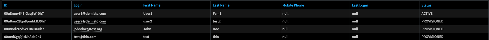</a>

<h2>Troubleshooting</h2>

This is a list of probable reasons for possible errors.

<table style="width: 750px;" border="2" cellpadding="6">
<tbody>
<tr>
<td><strong>Error</strong></td>
<td><strong>Possible Causes</strong></td>
</tr>
<tr>
<td>401<em> Unauthorized</em>
</td>
<td>

Wrong API URL or wrong API token

</td>
</tr>
<tr>
<td>404<em> not found</em>
</td>
<td>The user or the search term does not exsist</td>
</tr>
<tr>
<td>400 <em>Bad request</em>
</td>
<td>Request arguments are not provided correctly (for example, the date might be in the wrong format)</td>
</tr>
</tbody>
</table>
