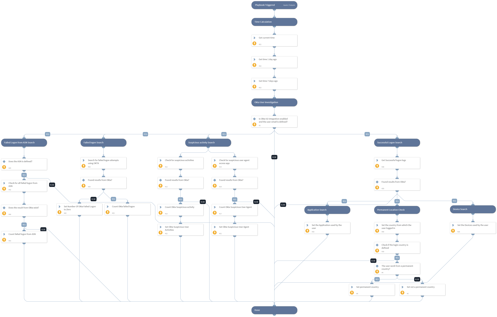

This playbook performs an investigation on a specific user, using queries and logs from Okta.

## Dependencies
This playbook uses the following sub-playbooks, integrations, and scripts.

### Sub-playbooks
This playbook does not use any sub-playbooks.

### Integrations
* Okta v2

### Scripts
* GetTime
* Set
* CountArraySize

### Commands
* okta-get-logs

## Playbook Inputs
---

| **Name** | **Description** | **Default Value** | **Required** |
| --- | --- | --- | --- |
| UserEmail | The user email to search Okta logs. |  | Optional |
| LoginCountry | The Country from which the user logged in. |  | Optional |

## Playbook Outputs
---

| **Path** | **Description** | **Type** |
| --- | --- | --- |
| PermanentCountry | True if the user work from a permanent country. False if else. | unknown |
| UserDevices | Devices used by the user. | unknown |
| NumOfOktaSuspiciousActivities | Number of Suspicious Activities for the user. | unknown |
|  SuspiciousUserActivities | Suspicious Activities for the user. | unknown |
| NumOfOktaSuspiciousUserAgent | Number of Suspicious User Agent. | unknown |
| SuspiciousUserAgent | Suspicious User Agent. | unknown |
| UserApplication |  Applications used by the user. | unknown |
| NumOfOktaFailedLogon | Number of failed login. | unknown |

## Playbook Image
---
