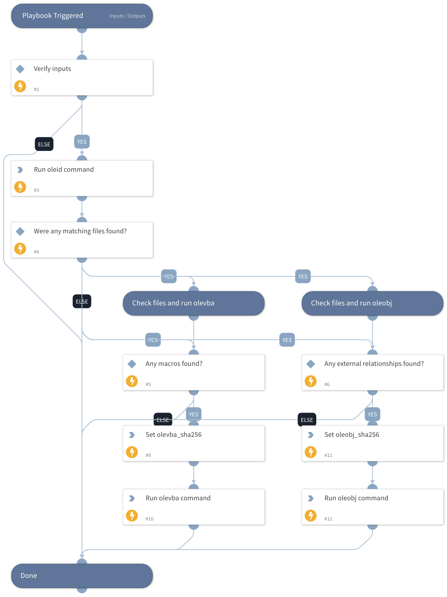

Oletools is a tool for analyzing Microsoft OLE2 files, such as Microsoft Office documents or Outlook messages, mainly for malware analysis, forensics, and debugging.
This playbook will run run the "oleid" command on the files which are passed to to it as playbook inputs. In case any macros or external relationships were found, it will also run "olevba" and "oleobj" commands as well on the relevant files.
oleid - Analyze OLE files to detect specific characteristics usually found in malicious files.
oleobj - Extract embedded objects from OLE files.
olevba - Extract and analyze VBA Macro source code from MS Office documents (OLE and OpenXML).

## Dependencies
This playbook uses the following sub-playbooks, integrations, and scripts.

### Sub-playbooks
This playbook does not use any sub-playbooks.

### Integrations
This playbook does not use any integrations.

### Scripts
* Set
* Oletools

### Commands
This playbook does not use any commands.

## Playbook Inputs
---

| **Name** | **Description** | **Default Value** | **Required** |
| --- | --- | --- | --- |
| FileObject | A list of file objects. Default is "File" key. | File | Required |
| Decode | Available values: "True" or "False". Default is "False" When this is set to "True", in case a macro was found within the file, it will output all the obfuscated strings with their decoded content \(Hex, Base64, StrReverse, Dridex, VBA\). | False | Optional |
| NonSecretPassword | Will be used to decrypt encrypted files. Encrypted files cannot be analyzed otherwise. Please note that this input is "Non Secret" because it will be visible as plain text. |  | Optional |

## Playbook Outputs
---

| **Path** | **Description** | **Type** |
| --- | --- | --- |
| Oletools.Oleid.ole_command_result | Indicator list from the oleid command. | unknown |
| Oletools.Oleid.file_name | File name. | unknown |
| Oletools.Oleid.sha256 | SHA256 hash. | unknown |
| Oletools.Oleid.ole_command_result.File_format | Indicator file format. | unknown |
| Oletools.Oleid.ole_command_result.Container_format | Indicator container format. | unknown |
| Oletools.Oleid.ole_command_result.Encrypted | Indicator encrypted. | unknown |
| Oletools.Oleid.ole_command_result.VBA_Macros | Indicator VBA macros. | unknown |
| Oletools.Oleid.ole_command_result.XLM_Macros | Indicator XLM macros. | unknown |
| Oletools.Oleid.ole_command_result.External_Relationships | Indicator external relationships. | unknown |
| Oletools.Oleid.ole_command_result.ObjectPool | Indicator object pool. | unknown |
| Oletools.Oleid.ole_command_result.Flash_objects | Indicator flash objects. | unknown |
| Oletools.Oleid.ole_command_result.File_format.Value | Indicator file format value. | unknown |
| Oletools.Oleid.ole_command_result.File_format.Ole_Risk | Indicator file format OLE risk. | unknown |
| Oletools.Oleid.ole_command_result.File_format.Description | Indicator file format description. | unknown |
| Oletools.Oleid.ole_command_result.Container_format.Value | Indicator container format value. | unknown |
| Oletools.Oleid.ole_command_result.Container_format.Ole_Risk | Indicator container format OLE risk. | unknown |
| Oletools.Oleid.ole_command_result.Container_format.Description | Indicator container format description. | unknown |
| Oletools.Oleid.ole_command_result.Encrypted.Value | Indicator encrypted value. | unknown |
| Oletools.Oleid.ole_command_result.Encrypted.Ole_Risk | Indicator encrypted OLE risk. | unknown |
| Oletools.Oleid.ole_command_result.Encrypted.Description | Indicator encrypted description. | unknown |
| Oletools.Oleid.ole_command_result.VBA_Macros.Value | Indicator VBA macros value. | unknown |
| Oletools.Oleid.ole_command_result.VBA_Macros.Ole_Risk | Indicator VBA macros OLE risk. | unknown |
| Oletools.Oleid.ole_command_result.VBA_Macros.Description | Indicator VBA macros description. | unknown |
| Oletools.Oleid.ole_command_result.XLM_Macros.Value | Indicator XLM macros value. | unknown |
| Oletools.Oleid.ole_command_result.XLM_Macros.Ole_Risk | Indicator XLM macros OLE risk. | unknown |
| Oletools.Oleid.ole_command_result.XLM_Macros.Description | Indicator XLM macros description. | unknown |
| Oletools.Oleid.ole_command_result.External_Relationships.Value | Indicator XLM macros value. | unknown |
| Oletools.Oleid.ole_command_result.External_Relationships.Ole_Risk | Indicator XLM macros OLE risk. | unknown |
| Oletools.Oleid.ole_command_result.External_Relationships.Description | Indicator XLM macros description. | unknown |
| Oletools.Oleid.ole_command_result.ObjectPool.Value | Indicator object pool value. | unknown |
| Oletools.Oleid.ole_command_result.ObjectPool.Ole_Risk | Indicator object pool OLE risk. | unknown |
| Oletools.Oleid.ole_command_result.ObjectPool.Description | Indicator object pool description. | unknown |
| Oletools.Oleid.ole_command_result.Flash_objects.Value | Indicator Flash objects value. | unknown |
| Oletools.Oleid.ole_command_result.Flash_objects.Ole_Risk | Indicator Flash objects OLE risk. | unknown |
| Oletools.Oleid.ole_command_result.Flash_objects.Description | Indicator Flash objects description. | unknown |
| Oletools.Oleobj.ole_command_result.hyperlinks | List of hyperlinks. | unknown |
| Oletools.Oleobj.file_name | File name. | unknown |
| Oletools.Oleobj.sha256 | SHA256 hash. | unknown |
| Oletools.Olevba.file_name | File name. | unknown |
| Oletools.Olevba.sha256 | SHA256 hash. | unknown |
| Oletools.Olevba.ole_command_result.macro_analyze | Macro analyze. | unknown |
| Oletools.Olevba.ole_command_result.macro_src_code | Macro source code. | unknown |
| Oletools.Olevba.ole_command_result.macro_list | Macro list. | unknown |
| DBotScore.Indicator | The indicator that was tested. | unknown |
| DBotScore.Type | The indicator type. | unknown |
| DBotScore.Vendor | The vendor used to calculate the score. | unknown |
| DBotScore.Score | The actual score. | unknown |

## Playbook Image
---
