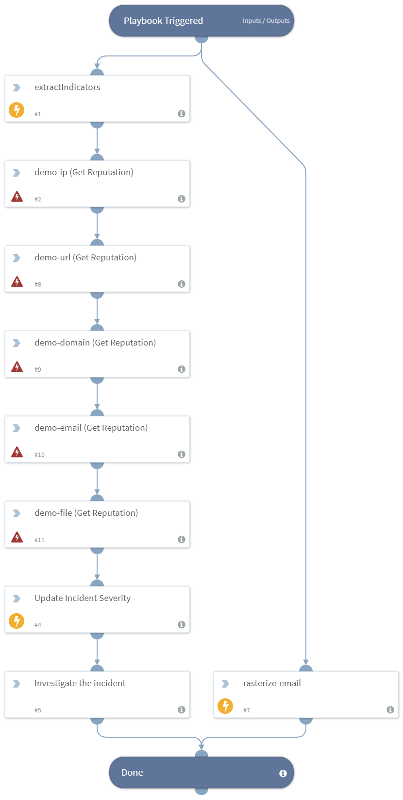

Focuses on phishing scenarios. This playbook is part of the on-boarding experience. To use this playbook, you'll need to enable the `on-boarding` integration and configure incidents of type `Phishing`.

## Dependencies
This playbook uses the following sub-playbooks, integrations, and scripts.

### Sub-playbooks
This playbook does not use any sub-playbooks.

### Integrations
* OnboardingIntegration
* Builtin
* Rasterize

### Scripts
This playbook does not use any scripts.

### Commands
* demo-email
* setIncident
* extractIndicators
* demo-url
* demo-file
* rasterize-email
* demo-ip
* demo-domain

## Playbook Inputs
---
There are no inputs for this playbook.

## Playbook Outputs
---
There are no outputs for this playbook.

## Playbook Image
---

