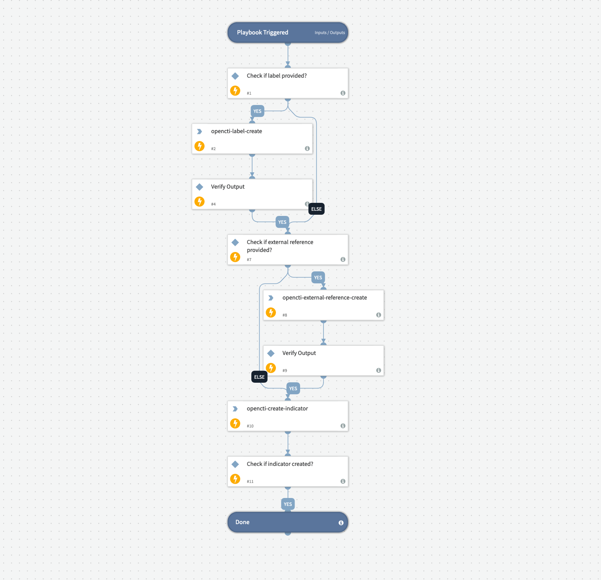

This pack enables you to take advantage of the cyber threat intelligence database offered by OpenCTI.
You can get lists of indicators that are linked to threats, with additional information to assist with your investigation. You can also contribute to the OpenCTI database by reporting new indicators or updating the information of existing indicators.

## What does this pack do?
This pack enables you to
- Get information about indicators from the OpenCTI database. Fetch indicators according to the indicator type and/or indicator score. 
- Report new indicators to OpenCTI.
- Delete indicators from the OpenCTI database.
- Update the score and description fields of indicators in the OpenCTI database. You can also add/remove marking definitions and labels of existing indicators.
- Get a list of organizations from the OpenCTI database and create a new organization.

The **OpenCTI Create Indicator** playbook creates an OpenCTI indicator according to the information provided as the playbook inputs, for example, the indicator type, score, label, external reference name and URL, and more. All information other than the indicator type is optional.

The pack includes the **OpenCTI** integration and the **OpenCTI Create Indicator** playbook.

## How does this pack work?

Create an instance of the **OpenCTI** integration and start fetching and ingesting incidents.

