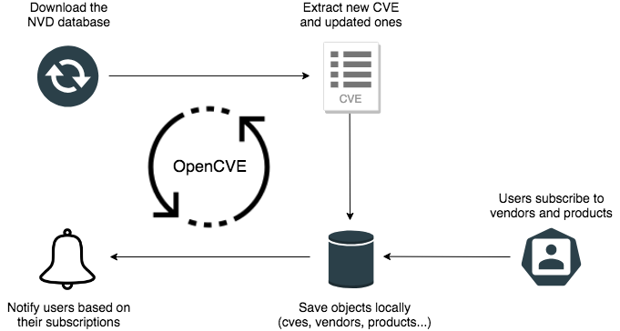

[View Integration Documentation](https://xsoar.pan.dev/docs/reference/integrations/opencve)


# What is OpenCVE

[OpenCVE](https://docs.opencve.io/) is a platform used to locally import the list of CVEs and perform searches on it (by vendors, products, CVSS, CWE...).

Users subscribe to vendors or products and OpenCVE alerts them when a new CVE is created or when an update is done in an existing CVE.

You can [manually install](https://docs.opencve.io/installation/manual/) OpenCVE, or [use docker](https://docs.opencve.io/installation/docker/). We also provide a running instance on [https://www.opencve.io](https://www.opencve.io) if you don't want to host it yourself.


## How it Works

OpenCVE uses the [JSON feed](https://nvd.nist.gov/vuln/data-feeds#JSON_FEED) provided by the [NVD](https://nvd.nist.gov/) to update the local list of CVEs.

After an initial import, a background task is regularly executed to synchronize the local copy with the NVD feed. If a new CVE is added, or if a change is detected, the subscribers of the related vendors and products are alerted.



> **Note:** It is recommended to run this integration and [OpenCVE](https://www.opencve.io) on an XSOAR engine.


# What does this integration do?

This integration uses the [OpenCVE APIs](https://docs.opencve.io/api/) to ingest and enrich CVEs. You can pull CVEs for a vendor, product, or individually and get information like:
 - CVSS v2/v3 info
	 - Score
	 - Vector
	 - Vector broken down for easy understanding
 - NVD and Mitre links to CVE
 - Tags for all vendors and products related to the CVE


## Installation

There are two parts to the installation: OpenCVE and optionally an XSOAR engine (recommended). If you want to deploy a standalone instance of OpenCVE, skip to the OpenCVE installation section, or see [their documentation](https://docs.opencve.io/installation/docker/).

### Install XSOAR Engine

#### Prerequisites

 - Fresh Linux installation (CentOS, RHEL, Ubuntu, etc.)
 - [See Documentation](https://docs.paloaltonetworks.com/cortex/cortex-xsoar/6-9/cortex-xsoar-admin/engines/install-deploy-and-configure-demisto-engines)

#### Installation

In XSOAR navigate to **Settings** > **Integrations** > **Engines** and select **Create New Engine** in the upper right. This will create a link to a script that should be put on the engine VM. Run the script to install the XSOAR engine.

See the [official documentation](https://docs.paloaltonetworks.com/cortex/cortex-xsoar/6-9/cortex-xsoar-admin/engines/install-deploy-and-configure-demisto-engines/install-a-signed-engine) for more information.

### Install OpenCVE

#### Prerequisites

Make sure the following are complete before moving on:
 - **Python >=3.6** installed
 - `docker-compose` installed
 - Current user is in the `docker` group

The instructions below will deploy via `docker-compose` the following services:
 - `webserver`: used to present the data to the user (also provides the API) on port `8000`
 - `postgres`: used to store the data (CVE, Users, Vendors, Products, Subscriptions, etc.)
 - `celery_worker` and `celery_beat`: used to periodically fetch the NVD database and update the list of CVEs
 - `redis`: brokers `celery_beat` with `postgres`


> **Note:** The XOAR engine does have Docker installed but it does not have `docker-compose`. You will need to install `docker-compose` on your own (typically `pip3 install docker-compose`, but this may change depending on distro and setup).

#### Installation

Installation is fairly straight forward.

1. Start by cloning the repo

	```bash
	git clone https://github.com/opencve/opencve-docker.git
	cd opencve-docker && cp ./conf/opencve.cfg.example ./conf/opencve.cfg
	```

2. Next edit the config file and update with your settings.

	> **Note:** The two main fields to update are `server_name` and `secret_key`. The rest of the defaults are fine and the email options at the end are optional.

	```bash
	vim conf/opencve.cfg
	```

	If you ever need to change these settings, restart the docker containers for the changes to take effect.

3. Build the images and start `postgres`, `redis`, the `webserver` and `celery_worker`

	```bash
	docker-compose build
	docker-compose up -d postgres redis webserver celery_worker
	```

4. Next, ingest the CVEs from NIST.

	> **⏳ Note:** This can take around an hour

	```bash
	docker exec -it webserver opencve upgrade-db
	docker exec -it webserver opencve import-data
	```

5. Start  `celery_beat` which will monitor for changes and ingest new CVEs

	```bash
	docker-compose up -d celery_beat
	```

6. Create an admin user

	```bash
	read -p "Enter admin username: " USERNAME
	read -p "Enter admin email: " EMAIL
	docker exec -it webserver opencve create-user ${USERNAME} ${EMAIL} --admin
	```
OpenCVE is now running on `http://<server_ip>:8000`. Log in and subscribe to some vendors and products.

7. Configure the integration.
	> **Note:** ⚠️ Remember to select the engine where OpenCVE is installed