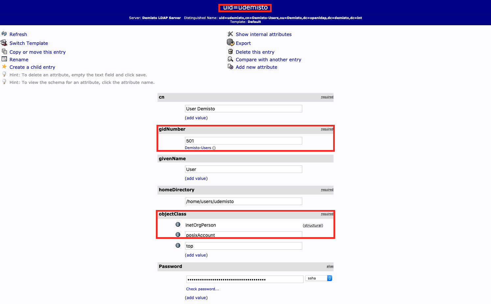
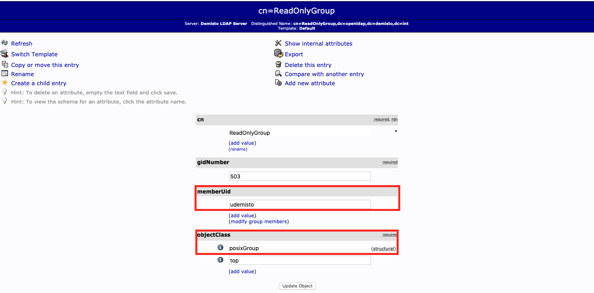
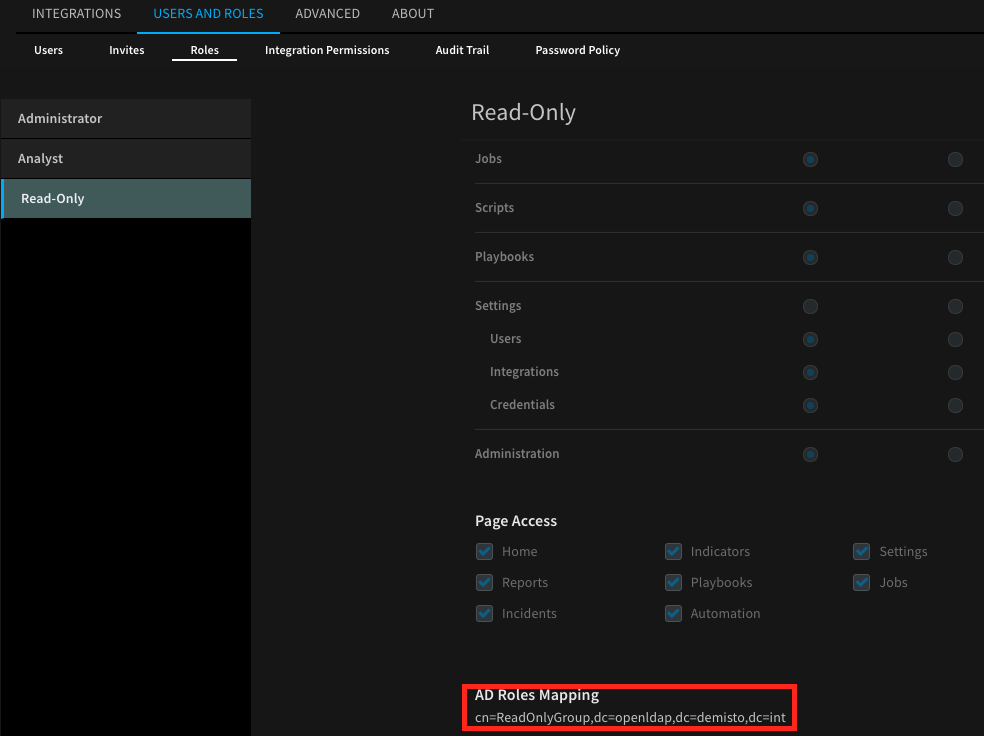

## Overview

This integration enables using your OpenLDAP or Active Directory user authentication settings in Cortex XSOAR. Users can log in to Cortex XSOAR with their OpenLDAP or Active Directory username and passwords, and their permissions in Cortex XSOAR will be set according to the groups and mapping set in AD Roles Mapping.  

* For connecting to the LDAP server with TLS connection it is recommended to use this integration instead of the server integration
**Active Directory Authentication**.

## Use Cases

Use OpenLDAP or Active Directory user authentication groups to set user roles in Cortex XSOAR.


## Configure OpenLDAP on Cortex XSOAR


1. Navigate to __Settings__ > __Integrations__ > __Servers & Services__.
2. Search for 'LDAP Authentication' ('OpenLDAP' or 'Active Directory Authentication' should work as well).
3. Click __Add instance__ to create and configure a new integration instance.
    * __Name__: a textual name for the integration instance.
    * __LDAP Server Vendor (OpenLDAP or Active Directory. Use 'Auto' option to determine the vendor automatically.)__
    * __Server IP or Host Name (e.g., 192.168.0.1)__
    * __Port. If not specified, default port is 389, or 636 for LDAPS.__
    * __User DN (e.g cn=admin,ou=users,dc=domain,dc=com)__
    * __Base DN (e.g. DC=domain,DC=com)__
    * __Auto populate groups__
    * __Groups Object Class__
    * __Groups Unique Identifier Attribute__
    * __Group Membership Identifier Attribute__
    * __User Object Class__
    * __User Unique Identifier Attribute__
    * __Page size__
    * __Connection Type (None, SSL or Start TLS)__
    * __SSL Version (None, TLS, TLSv1, TLSv1_1, TLSv1_2, TLS_CLIENT)__
    (The SSL\TLS version to use in SSL or Start TLS connections types. It is recommended to select the TLS_CLIENT option, which auto-negotiate the highest protocol version that both the client and server support, and configure the context client-side connections. For more information please see: [ssl.PROTOCOLS](https://docs.python.org/3/library/ssl.html#ssl.PROTOCOL_TLS_CLIENT)).
    * __Trust any certificate (not secure)__
    * __Use system proxy settings__
4. Click __Test__ to validate the URLs, token, and connection.


## Additional Information

**Steps required for setting AD roles Mapping:** (The steps refer to an OpenLDAP server)

1. Create OpenLDAP child entry of *User Account* template under wanted *Organizational Unit* and *Posix Group*, with *uid* as part of DN:



2. Create OpenLDAP child entry of *Posix Group* template, with created account from step 1 as *memberUid*:



3. If using different attributes and class/group templates (different *objectClass*), customize the following default values in the instance configuration:
    * __Groups Object Class__
    * __Groups Unique Identifier Attribute__
    * __Group Membership Identifier Attribute__
    * __User Object Class__
    * __User Unique Identifier Attribute__

4. Navigate to __Settings__ > __USERS AND ROLES__ > __ROLES__.

5. Choose the role.

6. Add the created group from step 2 to **AD Roles Mapping**.



7. Login to Cortex XSOAR using *uid* or full DN and password of the user created in step 1. 

## Commands
You can execute these commands from the Cortex XSOAR CLI, as part of an automation, or in a playbook.
After you successfully execute a command, a DBot message appears in the War Room with the command details.
### ad-authenticate
***
Performs a simple bind operation on the LDAP server.

#### Base Command
`ad-authenticate`

#### Input

| **Argument Name** | **Description** | **Required** |
| --- | --- | --- |
| username | The username for simple authentication. | Required | 
| password | The password for simple authentication. | Required | 

#### Context Output
There is no context output for this command.

#### Command Example
`!ad-authenticate username=user password=secret`

#### Human Readable Output

>Done

### ad-groups
***
Fetches LDAP groups under a given base DN.

#### Base Command
`ad-groups`

#### Input

| **Argument Name** | **Description** | **Required** |
| --- | --- | --- |
| specific-groups | A list of group object names to fetch. The list is delimited by a number sign (#). | Optional |  

#### Context Output
There is no context output for this command.

#### Command Example
`!ad-groups`

#### Human Readable Output
```json
{
    "Controls": null,
    "Entries": [
        {
            "Attributes": [
                {
                    "Name": "primaryGroupToken",
                    "Values": [
                        "111"
                    ]
                }
            ],
            "DN": "CN=Admin,CN=Builtin,DC=Test,DC=Test1"
        },
        {
            "Attributes": [
                {
                    "Name": "primaryGroupToken",
                    "Values": [
                        "222"
                    ]
                }
            ],
            "DN": "CN=Users,CN=Builtin,DC=Test,DC=Test1"
        },
        
    ],
    "Referrals": [
        "ldap://domainTest/CN=Test,DC=Test,DC=Test1",
        "ldap://domainTest2/CN=Test,DC=Test,DC=Test2"
    ]
}
```

### ad-authenticate-and-roles
***
Performs a simple bind operation on the LDAP server and returns the authenticated user's groups.

#### Base Command
`ad-authenticate-and-roles`

#### Input

| **Argument Name** | **Description** | **Required** |
| --- | --- | --- |
| username | The username for simple authentication. | Required | 
| password | The password for simple authentication. | Required | 
| attribute-mail-pull | Whether to return the mail attribute. Possible values are: "true", "false". Default is "true". | Optional | 
| attribute-mail | Mail attribute to return in the response. Default is "mail". | Optional | 
| attribute-name-pull | Whether to return the name attribute. Possible values are: "true", "false". Default is "true". | Optional | 
| attribute-name | Name attribute to return in the response. Default is "name". | Optional | 
| attribute-phone-pull | Whether to return the phone attribute. Possible values are: "true", "false". Default is "false". | Optional | 
| attribute-phone | Phone attribute to return in the response. Default is "mobile". | Optional | 

#### Context Output
There is no context output for this command.

#### Command Example
`!ad-authenticate-and-roles username='username' password='password' attribute-phone-pull=true`

#### Human Readable Output
```json
{
    "Controls": [],
    "Entries": [
        {
            "Attributes": [
                {
                    "Name": "memberOf",
                    "Values": [
                        "CN=Domain ,CN=Users,DC=Test,DC=Test1"
                    ]
                },
                {
                    "Name": "name",
                    "Values": [
                        "User Name"
                    ]
                },
                {
                    "Name": "primaryGroupID",
                    "Values": [
                        "111"
                    ]
                },
                {
                    "Name": "mail",
                    "Values": [
                        "username@mail.com"
                    ]
                },
                {
                    "Name": "mobile",
                    "Values": [
                        "555-5555555"
                    ]
                }
            ],
            "DN": "CN=User Name,CN=Users,DC=Test,DC=Test1"
        }
    ],
    "Referrals": [
        "ldap://domainTest/CN=Test,DC=Test,DC=Test1",
        "ldap://domainTest2/CN=Test,DC=Test,DC=Test2"
    ]
}
```

### ad-entries-search

***
A generic LDAP search command.

#### Base Command

`ad-entries-search`

#### Input

| **Argument Name** | **Description** | **Required** |
| --- | --- | --- |
| search_base | The location in the DIT where the search will start. Default is the provided Base DN in the configuration. | Optional | 
| search_filter | A string that describes what you are searching for. When provided with additional filter arguments, the OR join operator is used. If not provided, and no other filter arguments are present, all entries are returned. Search filters are based on assertions. One assertion is a bracketed expression that affirms something about an attribute and its values, as (givenName=John) or (maxRetries&gt;=10). On the server, each assertion resolves to True, False, or Undefined (which is treated as False) for one or more entries in the DIT. Assertions can be grouped in boolean groups where all assertions (and group, specified with &amp;) or at least one assertion (or group, specified with \|) must be True. A single assertion can be negated (not group, specified with !). Each group must be bracketed, allowing for recursive filters. Operators allowed in an assertion are = (equal), &lt;= (less than or equal), &gt;= (greater than or equal), =* (present), ~= (approximate), and := (extensible). Surprisingly the less than and the greater than operators don’t exist in the LDAP filter syntax. The aproximate and the extensible operators are obscure and seldom used. In an equality filter you can use the * character as a wildcard. | Optional | 
| search_scope | Specifies how broad the search context. 'BASE'- retrieves attributes of the entry specified in the search_base. 'LEVEL'- retrieves attributes of the entries contained in the search_base. The base must reference a container object. 'SUBTREE' - retrieves attributes of the entries specified in the search_base and all subordinate containers downward. Possible values are: BASE, LEVEL, SUBTREE. Default is SUBTREE. | Optional | 
| attributes | A comma-separated list of attributes to return in the response. If attributes is 'none', no attributes will be returned except the dn. If attributes is 'all_user_attributes' or 'all_operational_attributes', all user attributes or all operational attributes are returned. If attributes is 'all', both user and operational attributes are returned. Possible values are: none, all_user_attributes, all_operational_attributes, all. Default is all. | Optional | 
| cn | A comma-separated list of CNs to filter the search by (AND operator is used to join them). | Optional | 
| uid | A comma-separated list of UIDs to filter the search by (AND operator is used to join them). | Optional | 
| object_class | A comma-separated list of objectClasses to filter the search by (AND operator is used to join them). | Optional | 
| description | A comma-separated list of descriptions to filter the search by (AND operator is used to join them). | Optional | 
| page | Page to return. | Optional | 
| page_size | Number of entries per page. Defaults to 50 (in case only page was provided). Maximum entries per page is 2000. | Optional | 
| limit | The maximum number of entries to return. Default is 50. | Optional | 

#### Context Output

The context output will vary depending on the LDAP server scheme configuration and the attributes provided in the command.


#### Command Example

`!ad-entries-search base_dn="dc=openldap,dc=demisto,dc=int" object_class=top,posixAccount search_filter="(creatorsName=cn=ldapadm,dc=openldap,dc=demisto,dc=int)"  attributes=all_operational_attributes page=1 page_size=2`
#### Human Readable Output

| createTimestamp           | creatorsName                             | dn                                       | entryCSN                             | entryUUID                            | hasSubordinates   | modifiersName                            | modifyTimestamp           | structuralObjectClass   | subschemaSubentry   |
|:--------------------------|:-----------------------------------------|:-----------------------------------------|:-------------------------------------|:-------------------------------------|:------------------|:-----------------------------------------|:--------------------------|:------------------------|:--------------------|
| 2019-12-03 11:23:40+00:00 | cn=ldapadm,dc=openldap,dc=demisto,dc=int | dc=openldap,dc=demisto,dc=int            | 20191203112340.454387Z#000000#000, # | 19f7dd04-aa0b-1039-811c-25103214a95a | True              | cn=ldapadm,dc=openldap,dc=demisto,dc=int | 2019-12-03 11:23:40+00:00 | domain                  | cn=Subschema        |
| 2019-12-03 11:23:40+00:00 | cn=ldapadm,dc=openldap,dc=demisto,dc=int | cn=ldapadm,dc=openldap,dc=demisto,dc=int | 20240708140845.283421Z#000000#000, # | 19f8d2c2-aa0b-1039-811d-25103214a95a | False             | cn=ldapadm,dc=openldap,dc=demisto,dc=int | 2024-07-08 14:08:45+00:00 | organizationalRole      | cn=Subschema        |
