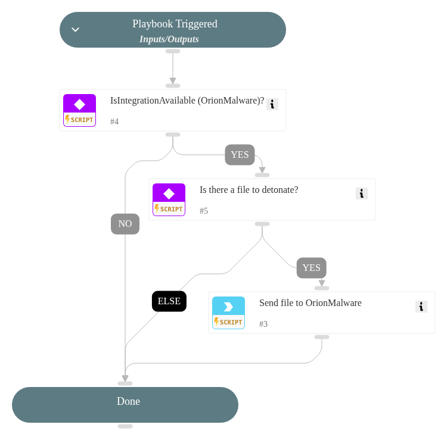

Detonate a file through OrionMalware.

## Dependencies

This playbook uses the following sub-playbooks, integrations, and scripts.

### Sub-playbooks

This playbook does not use any sub-playbooks.

### Integrations

* OrionMalware

### Scripts

* IsIntegrationAvailable

### Commands

* file-scan

## Playbook Inputs

---

| **Name** | **Description** | **Default Value** | **Required** |
| --- | --- | --- | --- |
| file_entryid | File entryID | ${File.EntryID} | Required |

## Playbook Outputs

---

| **Path** | **Description** | **Type** |
| --- | --- | --- |
| Orion.File.antivirus.antivirus_name | antivirus_name analysis. | unknown |
| Orion.File.antivirus.threat_name | threat detected by antivirus. | unknown |
| Orion.File.end_analysis | end_analysis. | unknown |
| Orion.File.first_submission | first_submission. | unknown |
| Orion.File.last_updated | last_updated. | unknown |
| Orion.File.payloads | payloads. | unknown |
| Orion.File.rules | rules. | unknown |
| Orion.File.start_analysis | start analysis date. | unknown |
| Orion.File.identification.filename | filename of the file corresponding to the hash. | unknown |
| Orion.File.identification.md5 | md5 hash of the file. | unknown |
| Orion.File.identification.sha1 | sha1 hash of the file. | unknown |
| Orion.File.identification.sha256 | sha256 hash of the file. | unknown |
| Orion.File.identification.size | Byte size. | unknown |
| Orion.File.identification.type | type of file. | unknown |
| Orion.File.matched_mitre_attacks.description | mitre description. | unknown |
| Orion.File.matched_mitre_attacks.id | mitre ttp. | unknown |
| Orion.File.matched_mitre_attacks.kill_chain_phases | mitre tactics. | unknown |
| Orion.File.matched_mitre_attacks.name | technique name. | unknown |
| Orion.File.networks.address | network address detected. | unknown |
| Orion.File.risk.dynamic.descriptions.files | dynmaic file analysis. | unknown |
| Orion.File.risk.dynamic.descriptions.network | network dynamic analysis. | unknown |
| Orion.File.risk.dynamic.descriptions.persistence | persistence dynamic analysis. | unknown |
| Orion.File.risk.dynamic.descriptions.processes | processes dynamic analysis. | unknown |
| Orion.File.risk.dynamic.descriptions.system | system dynamic analysis. | unknown |
| Orion.File.risk.dynamic.scores | dynamic risk scoring. | unknown |
| Orion.File.risk.level | dynamic risk. | unknown |
| Orion.File.risk.scanner.descriptions.system | system static analysis. | unknown |
| Orion.File.risk.scanner.descriptions.processes | processes static analysis. | unknown |
| Orion.File.risk.scanner.descriptions.persistence | persistence static analysis. | unknown |
| Orion.File.risk.scanner.descriptions.files | files static analysis. | unknown |
| Orion.File.risk.scanner.descriptions.network | network static analysis. | unknown |
| Orion.File.risk.scanner.scores | static risk scoring. | unknown |
| File.MD5 | Bad MD5 hash. | unknown |
| File.SHA1 | bad SHA1 has h. | unknown |
| File.SHA256 | bad SHA256 has h. | unknown |
| File.Orion.EngineDetections | Number of engines that flagged the file as malicious. | unknown |
| File.Orion.EngineVendors | engines. | unknown |
| File.Orion.EngineDetectionNames | threat name. | unknown |
| IP.Address | IP Linked to hash. | unknown |
| Orion.IP.Address | IP Linked to hash. | unknown |
| File.Relationships.EntityA | Source of relationship. | unknown |
| File.Relationships.EntityB | Destination of relationship. | unknown |
| File.Relationships.EntityAType | Source type of relationship. | unknown |
| File.Relationships.EntityBType | Destination type of relationship. | unknown |
| File.Relationships.Relationship | Kind of relation. | unknown |

## Playbook Image

---

