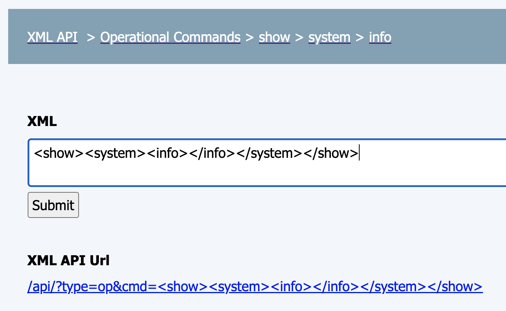
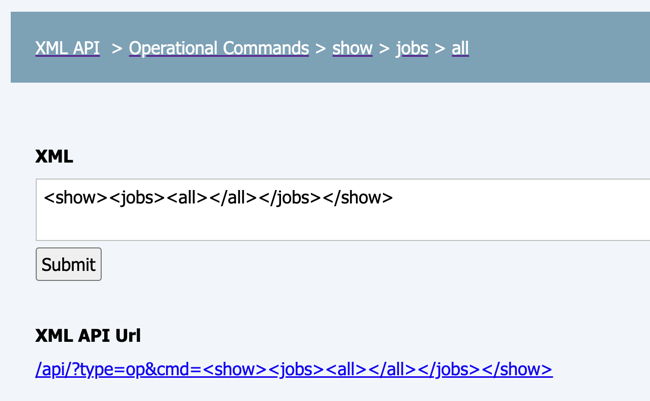
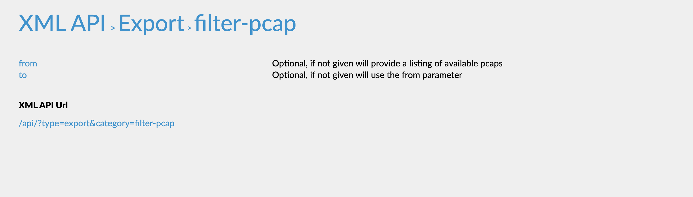
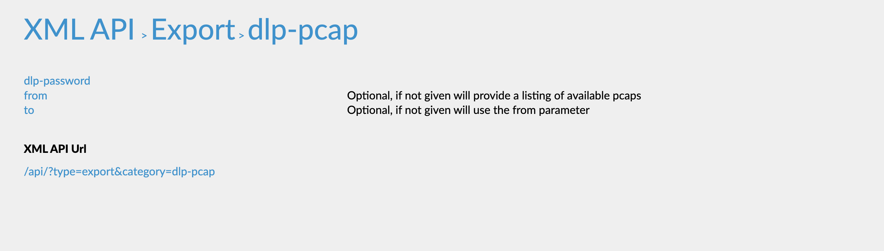
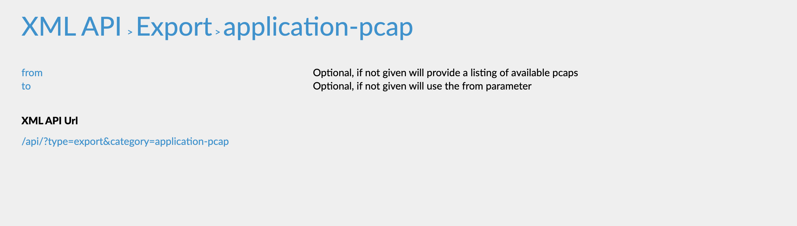
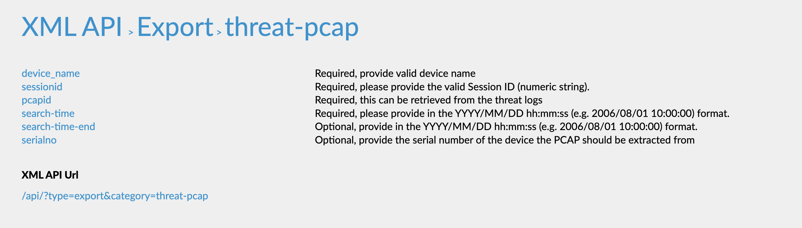

This integration supports both Palo Alto Networks Panorama and Palo Alto Networks Firewall. You can create separate instances of each integration, and they are not necessarily related or dependent on one another.

This integration enables you to manage the Palo Alto Networks Firewall and Panorama. For more information see the [PAN-OS documentation](https://docs.paloaltonetworks.com/pan-os.html).
This integration was integrated and tested with versions 8.xx, 9.xx, and 10.xx of Palo Alto Firewall and Palo Alto Panorama.


## Use Cases
* Create custom security rules in Palo Alto Networks PAN-OS.
* Create and update address objects, address-groups, custom URL categories, and URL filtering objects.
* Use the URL Filtering category information from Palo Alto Networks to enrich URLs by checking the *use_url_filtering* parameter. A valid license for the Firewall is required.
* Get URL Filtering category information from Palo Alto. Request Change is a known Palo Alto limitation.
* Add URL filtering objects including overrides to Palo Alto Panorama and Firewall.
* Commit a configuration to Palo Alto Firewall and to Panorama, and push a configuration from Panorama to Pre-Defined Device-Groups of Firewalls.
* Block IP addresses using registered IP tags from PAN-OS without committing the PAN-OS instance. First you have to create a registered IP tag, DAG, and security rule, and commit the instance. You can then register additional IP addresses to the tag without committing the instance.

     1. Create a registered IP tag and add the necessary IP addresses by running the [pan-os-register-ip-tag](#pan-os-register-ip-tag) command.
   
     2. Create a dynamic address group (DAG), by running the [pan-os-create-address-group](#pan-os-create-address-group) command. Specify values for the following arguments: type="dynamic", match={ tagname }.
   
     3. Create a security rule using the DAG created in the previous step, by running the [pan-os-create-rule](#pan-os-create-rule) command.
   
     4. Commit the PAN-OS instance by running the PanoramaCommitConfiguration playbook.
   
     5. You can now register IP addresses to, or unregister IP addresses from the IP tag by running the [pan-os-register-ip-tag](#pan-os-register-ip-tag) command, or [pan-os-unregister-ip-tag](#pan-os-unregister-ip-tag) command, respectively, without committing the PAN-OS instance.

* Create a predefined security profiles with the best practices by Palo Alto Networks.
* Get security profiles best practices as defined by Palo Alto Networks. For more information about Palo Alto Networks best practices, visit [Palo Alto Networks best practices](https://docs.paloaltonetworks.com/best-practices/9-0/internet-gateway-best-practices/best-practice-internet-gateway-security-policy/create-best-practice-security-profiles).
* Apply security profiles to specific rule.
* Set default categories to block in the URL filtering profile.
* Enforce WildFire best practice.
   
   1. Set file upload to the maximum size.
   
   2. Set WildFire Update Schedule to download and install updates every minute.
   
   3. All file types are forwarded.

## Known Limitations
* Maximum commit queue length is 3. Running numerous Panorama commands simultaneously might cause errors.
* After running `panorama-create-` commands and the object is not committed, the `panorama-edit` commands or `panorama-get` commands might not run correctly.
* URL Filtering `request change` of a URL is not available via the API. Instead, you need to use the https://urlfiltering.paloaltonetworks.com website.
* If you do not specify a vsys (Firewall instances) or a device group (Panorama instances), you will only be able to execute the following commands.
   * [pan-os-get-url-category](#pan-os-get-url-category)
   * [pan-os-commit](#pan-os-commit)
   * [pan-os-push-to-device-group](#pan-os-push-to-device-group)
   * [pan-os-register-ip-tag](#pan-os-register-ip-tag)
   * [pan-os-unregister-ip-tag](#pan-os-unregister-ip-tag)
   * [pan-os-query-logs](#pan-os-query-logs)
   * [pan-os-check-logs-status](#pan-os-check-logs-status)
   * [pan-os-get-logs](#pan-os-get-logs)
   * [pan-os-get-master-key-details](#pan-os-get-master-key-details)
   * [pan-os-create-master-key](#pan-os-create-master-key)
   * [pan-os-update-master-key](#pan-os-update-master-key)
* The target argument is supported only in operational type commands. Meaning, you cannot use it with commit, logs, or PCAP commands.
* Creating or updating the encryption master key of Palo Alto Networks Firewall or Panorama invalidates the current API key and requires obtaining a new one. All subsequent commands will raise an "Invalid Credential" error until a new API key is obtained and the integration instance is updated accordingly.

## Fetch Incidents
The Panorama integration now supports fetch incidents.
The incidents are fetched according to a number of different optional log type queries. The log types are: **Traffic, Threat, URL, Data, Correlation, System, Wildfire, Decryption**.

##### Max incidents per fetch
- The max incidents per fetch parameter specifies the maximum number of incidents to fetch **per** Log Type Query.
- Important note: Cortex XSOAR standard setup is not designed to handle many hundreds of new incidents every minute. Therefore, it is strongly recommended to narrow your query by log type, severity, or other criteria to ensure that each fetch cycle retrieves no more than 200 incidents at a time.

##### Log Type
The queries that will be included during the fetch are decided according to the "Log Type" parameter (Multiple select dropdown).
- Selecting "All" will use all the log type queries in the fetch.
- To choose a specific set of queries, select their log types from the dropdown (make sure "All" option is unselected).

##### Log Type Query
- Each log type has its own query field in the instance configuration.
- Note that the default query values has some example text in it, make sure to enter a valid query.
- Note: In case of multiple devices, for the sake of speed it is recommended to narrow the query to a specific device. 
For example: "and (device_name eq dummy_device)".

##### Log Type Query Examples

| Log Type            | Query Example                                                                                                                                           |
|---------------------|---------------------------------------------------------------------------------------------------------------------------------------------------------|
| Traffic             | (addr.src in {source}) and (addr.dst in {destination}) and (action eq {action})                                                                         |
| Threat              | (severity geq high)                                                                                                                                     |
| URL                 | ((action eq block-override) or (action eq block-url)) and (severity geq high)                                                                           |
| Data                | ((action eq alert) or (action eq wildfire-upload-success) or (action eq forward)) and (severity geq high)                                               |
| Correlation         | (hostid eq {host_id}) and (match_time in {last_x_time}) and (objectname eq {object_name}) and (severity geq '{severity}') and (src in {source_address}) |
| System              | (subtype eq {sub_type}) and (severity geq {severity})                                                                                                   |
| Wildfire Submission | ((action eq wildfire-upload-fail) or (action eq wildfire-upload-skip) or (action eq sinkhole))                                                          |
| Decryption          | (app eq {application}) and (policy_name geq {policy_name}) and ((src in {source}) or (dst in {destination}))                                            |

##### Classifiers and Mappers

This integration supports a default Classifier (Panorama Classifier) and Mapper (Panorama Mapper) that handles incidents returned from the API.


## Configure Panorama on Cortex XSOAR

1. Navigate to **Settings** > **Integrations** > **Servers & Services**.
2. Search for Panorama.
3. Click **Add instance** to create and configure a new integration instance.

| **Parameter** | **Description** | **Required** |
| --- | --- | --- |
| server | Server URL \(e.g., https://192.168.0.1\) | True |
| port | Port \(e.g 443\) | False |
| key | API Key | True |
| device_group | Device group - Panorama instances only \(write shared for Shared location\) | False |
| vsys | Vsys - Firewall instances only | False |
| template | Template - Panorama instances only | False |****
| use_url_filtering | Use URL Filtering for auto enrichment | False |
| additional_suspicious | URL Filtering Additional suspicious categories. CSV list of categories that will be considered suspicious. | False |
| additional_malicious | URL Filtering Additional malicious categories. CSV list of categories that will be considered malicious. | False |
| insecure | Trust any certificate \(not secure\) | False |
| First fetch timestamp  | First fetch time interval | False |
| Max incidents per fetch | Max incidents per fetch for each selected Log Type Query | False |
| Log Type | Log Types incidents to fetch | False |****
| Log type max number of pull attempts  | The maximum number of attempts to try and pull results for each log type. Each attempt takes around 1 second. Increasing this value is useful in case there are many logs to pull from a given log type.Note: When increasing this number, in case fetching more than 4 logs types together, it is recommended to split different log types for different integration instance | False |
| Traffic Log Type Query | Traffic Query for fetch incidents | False |
| Threat Log Type Query | Threat Query for fetch incidents | False |
| URL Log Type Query | URL Query for fetch incidents | False |
| Data Log Type Query | Data Query for fetch incidents | False |
| Correlation Log Type Query | Correlation Query for fetch incidents | False |
| System Log Type Query | System Query for fetch incidents | False |
| Wildfire Submission Log Type Query | Wildfire Submission Query for fetch incidents | False |
| Decryption Log Type Query | Decryption Query for fetch incidents | False |
| Incidents Fetch Interval | Time interval between incident fetches | False |

1. Click **Test** to validate the URLs, token, and connection.


## Debugging in Panorama
In order to ease the process of understanding what parameters are required to be used in the `!pan-os` command, it is highly recommended to use the debugging mode in Panorama to get the correct structure of a request.

Debugging Methods:
* [How to run a PAN-OS Web UI Debug](https://knowledgebase.paloaltonetworks.com/KCSArticleDetail?id=kA10g000000CmA9CAK)
* [Configuration (API)](https://docs.paloaltonetworks.com/pan-os/9-1/pan-os-panorama-api/pan-os-xml-api-request-types/configuration-api)
* [Use the API browser](https://docs.paloaltonetworks.com/pan-os/9-1/pan-os-panorama-api/get-started-with-the-pan-os-xml-api/explore-the-api/use-the-api-browser#id676e85fa-1823-466a-9e31-269dc6eb433a)

Several Examples of `!pan-os` for a configuration type commands:

1) Create a new address object named test123 for the test device-group.

Given the following debug-log from PAN-OS Web UI Debug after creating an address through the Panorama UI:

`
<request cmd="set" obj="/config/devices/entry[@name='localhost.localdomain']/device-group/entry[@name='test']/address/entry[@name='test123']" cookie="12345" newonly="yes">
  <ip-netmask>1.1.1.1</ip-netmask>
</request>
`

   The equivalent `!pan-os` command is:

`
!pan-os action=set xpath=/config/devices/entry[@name='localhost.localdomain']/device-group/entry[@name='test']/address/entry[@name='test123'] type=config element=<ip-netmask>1.1.1.1</ip-netmask>
`
| Argument | Description |
| --- | --- |
| action | Create/add an object. In this case we want to create a new address object, so we will use set - the Panorama debug log shows us its a 'set' action. |
| xpath | /config/devices/entry[@name='localhost.localdomain']/device-group/entry[@name='test']/address/entry[@name='test123'] - simply the location of the new object. |
| type | This is a configuration type command, therefore use config. |
| element | The object properties (similar to an API body request). |

2) Modify an existing address group object named test12345 under the test device group to use a different address object.

Given the following debug-log from PAN-OS Web UI Debug after editing an address group through the Panorama UI to use a different address object:

`
<request cmd="edit" obj="/config/devices/entry[@name='localhost.localdomain']/device-group/entry[@name='test']/address-group/entry[@name='test12345']" cookie="1234">
  <entry name="test12345">
    <static>
      <member>test123</member>
    </static>
  </entry>
</request>
`

The equivalent `!pan-os` command is:

`
!pan-os action=edit xpath=/config/devices/entry[@name='localhost.localdomain']/device-group/entry[@name='test']/address-group/entry[@name='test12345'] type=config element=<static><member>test123</member></static>
`
| Argument | Description |
| --- | --- |
| action | Edit an object, in this case we want to edit an entry in an existing address group object, so we will use edit - the panorama debug log shows us its an 'edit' action. |
| xpath | /config/devices/entry[@name='localhost.localdomain']/device-group/entry[@name='test']/address-group/entry[@name='test12345' - simply the location of the object. |
| type | This is a configuration type command, therefore use config.
| element | The object properties (similar to an API body request).

3) Get a specific security pre-rule called test1.

Using the API browser, we can easily find the xpath for the security pre-rule object, therefore the pan-os command will be:

`
!pan-os xpath=/config/devices/entry[@name='localhost.localdomain']/device-group/entry[@name='test']/pre-rulebase/security/rules/entry[@name='test1'], action=get type=config
`

| Argument | Description |
| --- | --- |
| action | Get an object, in this case we want to get an object, so we will use 'get' as an action. |
| xpath | By using the API browser, we can find every object's xpath easily.
| type | This is a configuration type command, therefore use config.

Several examples of `!pan-os` for an operational type command:

1) Show system information  - Can be viewed by using the API browser to get the structure of the request.



The equivalent `!pan-os` command is:

`
!pan-os type=op cmd=<show><system><info></info></system></show>
`

2) Show information about all the jobs - Can be viewed by using the API browser to get the structure of the request.



The equivalent `!pan-os` command is:

`
!pan-os type=op cmd=<show><jobs><all></all></jobs></show>
`

## Commands
You can execute these commands from the Cortex XSOAR CLI, as part of an automation, or in a playbook.
After you successfully execute a command, a DBot message appears in the War Room with the command details.
> **_NOTE:_**  The "create" commands function as UPSERT (UPDATE and INSERT), overriding existing data with new data if it already exists.

1. [Run any command supported in the Panorama API: pan-os](#pan-os)
2. [Get pre-defined threats list from a Firewall or Panorama and stores as a JSON file in the context: panorama-get-predefined-threats-list](#pan-os-get-predefined-threats-list)
3. [Commit a configuration: panorama-commit](#pan-os-commit)
4. [Pushes rules from PAN-OS to the configured device group: panorama-push-to-device-group](#pan-os-push-to-device-group)
5. [Returns a list of addresses: panorama-list-addresses](#pan-os-list-addresses)
6. [Returns address details for the supplied address name: panorama-get-address](#pan-os-get-address)
7. [Creates an address object: panorama-create-address](#pan-os-create-address)
8. [Delete an address object: panorama-delete-address](#pan-os-delete-address)
9. [Returns a list of address groups: panorama-list-address-groups](#pan-os-list-address-groups)
10. [Get details for the specified address group: panorama-get-address-group](#pan-os-get-address-group)
11. [Creates a static or dynamic address group: panorama-create-address-group](#pan-os-create-address-group)
12. [Sets a vulnerability signature to block mode: panorama-block-vulnerability](#pan-os-block-vulnerability)
13. [Deletes an address group: panorama-delete-address-group](#pan-os-delete-address-group)
14. [Edits a static or dynamic address group: panorama-edit-address-group](#pan-os-edit-address-group)
15. [Returns a list of addresses: panorama-list-services](#pan-os-list-services)
16. [Returns service details for the supplied service name: panorama-get-service](#pan-os-get-service)
17. [Creates a service: panorama-create-service](#pan-os-create-service)
18. [Deletes a service: panorama-delete-service](#pan-os-delete-service)
19. [Returns a list of service groups: panorama-list-service-groups](#pan-os-list-service-groups)
20. [Returns details for the specified service group: panorama-get-service-group](#pan-os-get-service-group)
21. [Creates a service group: panorama-create-service-group](#pan-os-create-service-group)
22. [Deletes a service group: panorama-delete-service-group](#pan-os-delete-service-group)
23. [Edit a service group: panorama-edit-service-group](#pan-os-edit-service-group)
24. [Returns information for a custom URL category: panorama-get-custom-url-category](#pan-os-get-custom-url-category)
25. [Creates a custom URL category: panorama-create-custom-url-category](#pan-os-create-custom-url-category)
26. [Deletes a custom URL category: panorama-delete-custom-url-category](#pan-os-delete-custom-url-category)
27. [Adds or removes sites to and from a custom URL category: panorama-edit-custom-url-category](#pan-os-edit-custom-url-category)
28. [Gets a URL category from URL Filtering: panorama-get-url-category](#pan-os-get-url-category)
29. [Gets a URL information: url](#url)
30. [Returns a URL category from URL Filtering in the cloud: panorama-get-url-category-from-cloud](#pan-os-get-url-category-from-cloud)
31. [Returns a URL category from URL Filtering on the host: panorama-get-url-category-from-host](#pan-os-get-url-category-from-host)
32. [Returns information for a URL filtering rule: panorama-get-url-filter](#pan-os-get-url-filter)
33. [Creates a URL filtering rule: panorama-create-url-filter](#pan-os-create-url-filter)
34. [Edit a URL filtering rule: panorama-edit-url-filter](#pan-os-edit-url-filter)
35. [Deletes a URL filtering rule: panorama-delete-url-filter](#pan-os-delete-url-filter)
36. [Returns a list of external dynamic lists: panorama-list-edls](#pan-os-list-edls)
37. [Returns information for an external dynamic list: panorama-get-edl](#pan-os-get-edl)
38. [Creates an external dynamic list: panorama-create-edl](#pan-os-create-edl)
39. [Modifies an element of an external dynamic list: panorama-edit-edl](#pan-os-edit-edl)
40. [Deletes an external dynamic list: panorama-delete-edl](#pan-os-delete-edl)
41. [Refreshes the specified external dynamic list: panorama-refresh-edl](#pan-os-refresh-edl)
42. [Creates a policy rule: panorama-create-rule](#pan-os-create-rule)
43. [Creates a custom block policy rule: panorama-custom-block-rule](#pan-os-custom-block-rule)
44. [Changes the location of a policy rule: panorama-move-rule](#pan-os-move-rule)
45. [Edits a policy rule: panorama-edit-rule](#pan-os-edit-rule)
46. [Deletes a policy rule: panorama-delete-rule](#pan-os-delete-rule)
47. [Returns a list of applications: panorama-list-applications](#pan-os-list-applications)
48. [Returns commit status for a configuration: panorama-commit-status](#pan-os-commit-status)
49. [Returns the push status for a configuration: panorama-push-status](#pan-os-push-status)
50. [Returns information for a Panorama PCAP file: panorama-get-pcap](#pan-os-get-pcap)
51. [Returns a list of all PCAP files by PCAP type: panorama-list-pcaps](#pan-os-list-pcaps)
52. [Registers IP addresses to a tag: panorama-register-ip-tag](#pan-os-register-ip-tag)
53. [Unregisters IP addresses from a tag: panorama-unregister-ip-tag](#pan-os-unregister-ip-tag)
54. [Registers Users to a tag: panorama-register-user-tag](#pan-os-register-user-tag)
55. [Unregisters Users from a tag: panorama-unregister-user-tag](#pan-os-unregister-user-tag)
56. [Deprecated. Queries traffic logs: panorama-query-traffic-logs](#pan-os-query-traffic-logs)
57. [Deprecated. Checks the query status of traffic logs: panorama-check-traffic-logs-status](#pan-os-check-traffic-logs-status)
58. [Deprecated. Retrieves traffic log query data by job id: panorama-get-traffic-logs](#pan-os-get-traffic-logs)
59. [Returns a list of predefined Security Rules: panorama-list-rules](#pan-os-list-rules)
60. [Query logs in Panorama: panorama-query-logs](#pan-os-query-logs)
61. [Checks the status of a logs query: panorama-check-logs-status](#pan-os-check-logs-status)
62. [Retrieves the data of a logs query: panorama-get-logs](#pan-os-get-logs)
63. [Checks whether a session matches the specified security policy: panorama-security-policy-match](#pan-os-security-policy-match)
64. [Lists the static routes of a virtual router: panorama-list-static-routes](#pan-os-list-static-routes)
65. [Returns the specified static route of a virtual router: panorama-get-static-route](#pan-os-get-static-route)
66. [Adds a static route: panorama-add-static-route](#pan-os-add-static-route)
67. [Deletes a static route: panorama-delete-static-route](#pan-os-delete-static-route)
68. [Show firewall device software version: panorama-show-device-version](#pan-os-show-device-version)
69. [Downloads the latest content update: panorama-download-latest-content-update](#pan-os-download-latest-content-update)
70. [Checks the download status of a content update: panorama-content-update-download-status](#pan-os-content-update-download-status)
71. [Installs the latest content update: panorama-install-latest-content-update](#pan-os-install-latest-content-update)
72. [Gets the installation status of the content update: panorama-content-update-install-status](#pan-os-content-update-install-status)
73. [Checks the PAN-OS software version from the repository: panorama-check-latest-panos-software](#pan-os-check-latest-panos-software)
74. [Downloads the target PAN-OS software version to install on the target device: panorama-download-panos-version](#pan-os-download-panos-version)
75. [Gets the download status of the target PAN-OS software: panorama-download-panos-status](#pan-os-download-panos-status)
76. [Installs the target PAN-OS version on the specified target device: panorama-install-panos-version](#pan-os-install-panos-version)
77. [Gets the installation status of the PAN-OS software: panorama-install-panos-status](#pan-os-install-panos-status)
78. [Reboots the Firewall device: panorama-device-reboot](#pan-os-device-reboot)
79. [Gets location information for an IP address: panorama-show-location-ip](#pan-os-show-location-ip)
80. [Gets information about available PAN-OS licenses and their statuses: panorama-get-licenses](#pan-os-get-licenses)
81. [Gets information for the specified security profile: panorama-get-security-profiles](#pan-os-get-security-profiles)
82. [Apply a security profile to specific rules or rules with a specific tag: panorama-apply-security-profile](#pan-os-apply-security-profile)
83. [Removes a security profile to specific rules or rules with a specific tag](#pan-os-remove-security-profile)
84. [Get SSL decryption rules: panorama-get-ssl-decryption-rules](#pan-os-get-ssl-decryption-rules)
85. [Retrieves the Wildfire configuration: panorama-get-wildfire-configuration](#pan-os-get-wildfire-configuration)
86. [Set default categories to block in the URL filtering profile: panorama-url-filtering-block-default-categories](#pan-os-url-filtering-block-default-categories)
87. [Get anti-spyware best practices: panorama-get-anti-spyware-best-practice](#pan-os-get-anti-spyware-best-practice)
88. [Get file-blocking best practices: panorama-get-file-blocking-best-practice](#pan-os-get-file-blocking-best-practice)
89. [Get anti-virus best practices: panorama-get-antivirus-best-practice](#pan-os-get-antivirus-best-practice)
90. [Get vulnerability-protection best practices: panorama-get-vulnerability-protection-best-practice](#pan-os-get-vulnerability-protection-best-practice)
91. [View WildFire best practices: panorama-get-wildfire-best-practice](#pan-os-get-wildfire-best-practice)
92. [View URL Filtering best practices: panorama-get-url-filtering-best-practice](#pan-os-get-url-filtering-best-practice)
93. [Enforces wildfire best practices to upload files to the maximum size, forwards all file types, and updates the schedule: panorama-enforce-wildfire-best-practice](#pan-os-enforce-wildfire-best-practice)
94. [Creates an antivirus best practice profile: panorama-create-antivirus-best-practice-profile](#pan-os-create-antivirus-best-practice-profile)
95. [Creates an Anti-Spyware best practice profile: panorama-create-anti-spyware-best-practice-profile](#pan-os-create-anti-spyware-best-practice-profile)
96. [Creates a vulnerability protection best practice profile: panorama-create-vulnerability-best-practice-profile](#pan-os-create-vulnerability-best-practice-profile)
97. [Creates a URL filtering best practice profile: panorama-create-url-filtering-best-practice-profile](#pan-os-create-url-filtering-best-practice-profile)
98. [Creates a file blocking best practice profile: panorama-create-file-blocking-best-practice-profile](#pan-os-create-file-blocking-best-practice-profile)
99. [Creates a WildFire analysis best practice profile: panorama-create-wildfire-best-practice-profile](#pan-os-create-wildfire-best-practice-profile)
100. [Shows the user ID interface configuration.](#pan-os-show-user-id-interfaces-config)
101. [Shows the zones configuration.](#pan-os-show-zones-config)
102. [Retrieves list of user-ID agents configured in the system.](#pan-os-list-configured-user-id-agents)
103. [Gets global counter information from all the PAN-OS firewalls in the topology.](#pan-os-platform-get-global-counters)
104. [Retrieves all BGP peer information from the PAN-OS firewalls in the topology.](#pan-os-platform-get-bgp-peers)
105. [Check the devices for software that is available to be installed.](#pan-os-platform-get-available-software)
106. [Get the HA state and associated details from the given device and any other details.](#pan-os-platform-get-ha-state)
107. [Get all the jobs from the devices in the environment, or a single job when ID is specified.](#pan-os-platform-get-jobs)
108. [Download The provided software version onto the device.](#pan-os-platform-download-software)
109. [Download the running configuration](#pan-os-get-running-config)
110. [Download the merged configuration](#pan-os-get-merged-config)
111. [Create Nat-rule](#pan-os-create-nat-rule)
112. [Create PBF-rule](#pan-os-create-pbf-rule)


### pan-os
***
Run any command supported in the API.


#### Base Command

`pan-os`
#### Input

| **Argument Name** | **Description** | **Required** |
| --- | --- | --- |
| action | Action to be taken, such as show, get, set, edit, delete, rename, clone, move, override, multi-move, multi-clone, or complete. Documentation - https://docs.paloaltonetworks.com/pan-os/9-1/pan-os-panorama-api/pan-os-xml-api-request-types/configuration-api | Optional | 
| category | Category parameter. For example, when exporting a configuration file, use "category=configuration". | Optional | 
| cmd | Specifies the XML structure that defines the command. Used for operation commands (op type command). Can be retrieved from the PAN-OS web UI debugger or enabling debugging via the CLI using `debug cli on`. | Optional | 
| command | Run a command. For example, command =&lt;show&gt;&lt;arp&gt;&lt;entry name='all'/&gt;&lt;/arp&gt;&lt;/show&gt; | Optional | 
| dst | Specifies a destination. | Optional | 
| element | Used to define a new value for an object. Should be an XML object, for example, <static><member>test</member></static>. | Optional | 
| to | End time (used only when cloning an object). | Optional | 
| from | Start time (used only when cloning an object). | Optional | 
| key | Sets a key value. | Optional | 
| log-type | Retrieves log types. For example, log-type=threat for threat logs. | Optional | 
| where | Specifies the type of a move operation (for example, where=after, where=before, where=top, where=bottom). | Optional | 
| period | Time period. For example, period=last-24-hrs | Optional | 
| xpath | xpath location. xpath defines the location of the object. For example, xpath=/config/predefined/application/entry[@name='hotmail']. Documentation - https://docs.paloaltonetworks.com/pan-os/9-1/pan-os-panorama-api/about-the-pan-os-xml-api/structure-of-a-pan-os-xml-api-request/xml-and-xpath. | Optional | 
| pcap-id | PCAP ID included in the threat log. | Optional | 
| serialno | Specifies the device serial number. | Optional | 
| reporttype | Chooses the report type, such as dynamic, predefined or custom. | Optional | 
| reportname | Report name. | Optional | 
| type | Request type (e.g. export, import, log, config). Possible values are: keygen, config, commit, op, report, log, import, export, user-id, version. default is config. | Optional | 
| search-time | The time that the PCAP was received on the firewall. Used for threat PCAPs. | Optional | 
| target | Serial number of the firewall on which to run the command. Use only for a Panorama instance. | Optional | 
| job-id | Job ID. | Optional | 
| query | Query string. | Optional | 
| vsys | The name of the virtual system to be configured. If no vsys is mentioned, this command will not use the vsys parameter. | Optional | 


#### Context Output

There is no context output for this command.


#### Command Example
```!pan-os xpath=“/config/devices/entry[@name=‘localhost.localdomain’]/template/entry[@name=‘test’]/config/devices/entry[@name=‘localhost.localdomain’]/network/profiles/zone-protection-profile/entry[@name=‘test’]/scan-white-list/entry[@name=‘test’]/ipv4" type=config action=edit element=“<ipv4>1.1.1.1</ipv4>” ```

#### Human Readable Output
>Command was executed successfully.


### pan-os-get-predefined-threats-list
***
Gets the pre-defined threats list from a Firewall or Panorama and stores as a JSON file in the context.


#### Base Command

`pan-os-get-predefined-threats-list`
#### Input

| **Argument Name** | **Description** | **Required** |
| --- | --- | --- |
| target | The firewall managed by Panorama from which to retrieve the predefined threats. | Optional | 


#### Context Output

| **Path** | **Type** | **Description** |
| --- | --- | --- |
| File.Size | number | File size. | 
| File.Name | string | File name. | 
| File.Type | string | File type. | 
| File.Info | string | File info. | 
| File.Extension | string | File extension. | 
| File.EntryID | string | File entryID. | 
| File.MD5 | string | MD5 hash of the file. | 
| File.SHA1 | string | SHA1 hash of the file. | 
| File.SHA256 | string | SHA256 hash of the file. | 
| File.SHA512 | string | SHA512 hash of the file. |
| File.SSDeep | string | SSDeep hash of the file. |


#### Command Example
```!pan-os-get-predefined-threats-list```


### pan-os-commit
***
Commits a configuration to the Palo Alto firewall or Panorama, validates if a commit was successful if using polling="true", otherwise does not validate if the commit was successful. Committing to Panorama does not push the configuration to the firewalls. To push the configuration, run the panorama-push-to-device-group command.


#### Base Command

`pan-os-commit`
#### Input

| **Argument Name** | **Description** | **Required** |
| --- | --- | --- |
| description | The commit description. | Optional | 
| admin_name | The administrator name. To commit admin-level changes on a firewall, include the administrator name in the request. | Optional | 
| force_commit | Forces a commit. Possible values are: true, false. | Optional | 
| exclude_device_network_configuration | Performs a partial commit while excluding device and network configuration. Possible values are: true, false. | Optional | 
| exclude_shared_objects | Performs a partial commit while excluding shared objects. Possible values are: true, false. | Optional | 
| polling | Whether to use polling. Possible values are: true, false. Default is false. | Optional |
| timeout | The timeout (in seconds) when polling. Default is 120. | Optional | 
| interval_in_seconds | The interval (in seconds) when polling. Default is 10. | Optional | 


#### Context Output

| **Path** | **Type** | **Description** |
| --- | --- | --- |
| Panorama.Commit.JobID | Number | The job ID to commit. | 
| Panorama.Commit.Status | String | The commit status. | 
| Panorama.Commit.Description | String | The commit description from the the command input. | 

#### Command example with polling
```!pan-os-commit description=test polling=true interval_in_seconds=5 timeout=60```
#### Human Readable Output

>Waiting for commit "test" with job ID 12345 to finish...
>### Commit Status:
>|JobID|Status| Description
>|---|---|---|
>| 12345 | Success | test

#### Context Example
```json
{
    "Panorama": {
        "Commit": {
            "JobID": "12345",
            "Status": "Success",
            "Description": "test"
        }
    }
}
```

#### Command example without polling
```!pan-os-commit description=test```

#### Human Readable Output

>### Commit Status:
>|JobID|Status| Description
>|---|---|---|
>| 12345 | Pending | test


#### Context Example
```json
{
    "Panorama": {
        "Commit": {
            "JobID": "12345",
            "Status": "Pending",
            "Description": "test"
        }
    }
}
```


### pan-os-push-to-device-group
***
Pushes rules from PAN-OS to the configured device group. In order to push the configuration to Prisma Access managed tenants (single or multi tenancy), use the device group argument with the device group which is associated with the tenant ID. Validates if a push has been successful if polling="true".


#### Base Command

`pan-os-push-to-device-group`
#### Input

| **Argument Name** | **Description** | **Required** |
| --- | --- | --- |
| device-group | The device group to which to push (Panorama instances). | Optional | 
| validate-only | Pre policy validation. Possible values are: true, false. Default is false. | Optional | 
| include-template | Whether to include template changes. Possible values are: true, false. Default is true. | Optional | 
| description | The push description. | Optional | 
| serial_number | The serial number for a virtual system commit. If provided, the commit will be a virtual system commit. | Optional | 
| polling | Whether to use polling. Possible values are: true, false. Default is false. | Optional | 
| timeout | The timeout (in seconds) when polling. Default is 120. | Optional | 
| interval_in_seconds | The interval (in seconds) when polling. Default is 10. | Optional | 


#### Context Output

| **Path** | **Type** | **Description** |
| --- | --- | --- |
| Panorama.Push.DeviceGroup | String | The device group in which the policies were pushed. | 
| Panorama.Push.JobID | Number | The job ID of the policies that were pushed. | 
| Panorama.Push.Status | String | The push status. | 
| Panorama.Push.Warnings | String | The push warnings. | 
| Panorama.Push.Errors | String | The push errors. | 
| Panorama.Push.Details | String | The job ID details. | 

#### Command example with polling=true
```!pan-os-push-to-device-group description=test polling=true interval_in_seconds=5 timeout=60```

#### Context Example
```json
{
    "Panorama": {
        "Push": {
            "Details": [
                "commit succeeded with warnings",
                "commit succeeded with warnings"
            ],
            "Errors": ,
            "JobID": "31377",
            "Status": "Completed",
            "Warnings": [
                "Interface loopback.645 has no zone configuration.",
                "External Dynamic List test_pb_domain_edl_DONT_DEL is configured with no certificate profile. Please select a certificate profile for performing server certificate validation.",
                "External Dynamic List Cortex XSOAR Remediation - IP EDL-ip-edl-object is configured with no certificate profile. Please select a certificate profile for performing server certificate validation.",
                "External Dynamic List Cortex XSOAR Remediation - URL EDL-url-edl-object is configured with no certificate profile. Please select a certificate profile for performing server certificate validation.",
                "External Dynamic List Cortex XSOAR Remediation - URL EDL tamarcat3-url-edl-object is configured with no certificate profile. Please select a certificate profile for performing server certificate validation.",
                "External Dynamic List Cortex XSOAR Remediation - IP EDL tamarcat3-ip-edl-object is configured with no certificate profile. Please select a certificate profile for performing server certificate validation.",
                "External Dynamic List minemeld is configured with no certificate profile. Please select a certificate profile for performing server certificate validation.",
                "External Dynamic List edl-webinar-malicious-urls-OLD is configured with no certificate profile. Please select a certificate profile for performing server certificate validation.",
                "External Dynamic List edl-webinar-malicious-ips is configured with no certificate profile. Please select a certificate profile for performing server certificate validation.",
                "External Dynamic List edl-webinar-malicious-domains is configured with no certificate profile. Please select a certificate profile for performing server certificate validation.",
                "Warning: No valid Antivirus content package exists",
                "(Module: device)"
            ]
        }
    }
}
```

#### Human Readable Output

>Waiting for Job-ID 31374 to finish push changes to device-group Lab-Devices..
>### Push to Device Group status:
>|JobID|Status|Details|Errors|Warnings|
>|---|---|---|---|---|
>| 31377 | Completed | commit succeeded with warnings,<br/>commit succeeded with warnings | | Interface loopback.645 has no zone configuration.,<br/>External Dynamic List test_pb_domain_edl_DONT_DEL is configured with no certificate profile. Please select a certificate profile for performing server certificate validation.,<br/>External Dynamic List Cortex XSOAR Remediation - IP EDL-ip-edl-object is configured with no certificate profile. Please select a certificate profile for performing server certificate validation.,<br/>External Dynamic List Cortex XSOAR Remediation - URL EDL-url-edl-object is configured with no certificate profile. Please select a certificate profile for performing server certificate validation.,<br/>External Dynamic List Cortex XSOAR Remediation - URL EDL tamarcat3-url-edl-object is configured with no certificate profile. Please select a certificate profile for performing server certificate validation.,<br/>External Dynamic List Cortex XSOAR Remediation - IP EDL tamarcat3-ip-edl-object is configured with no certificate profile. Please select a certificate profile for performing server certificate validation.,<br/>External Dynamic List minemeld is configured with no certificate profile. Please select a certificate profile for performing server certificate validation.,<br/>External Dynamic List edl-webinar-malicious-urls-OLD is configured with no certificate profile. Please select a certificate profile for performing server certificate validation.,<br/>External Dynamic List edl-webinar-malicious-ips is configured with no certificate profile. Please select a certificate profile for performing server certificate validation.,<br/>External Dynamic List edl-webinar-malicious-domains is configured with no certificate profile. Please select a certificate profile for performing server certificate validation.,<br/>Warning: No valid Antivirus content package exists,<br/>(Module: device) |

#### Command example with polling=false
```!pan-os-push-to-device-group description=test polling=false```

#### Human Readable Output

>### Push to Device Group status:
>|JobID|Status|Description|
>|---|---|---|
>| 113198 | Pending | test |

#### Context Example
```json
{
    "Panorama": {
        "Push": {
          "JobID": "113198",
          "Status": "Pending",
          "Description": "test",
          "DeviceGroup": "device group name"
        }
    }
}
```

### pan-os-list-addresses
***
Returns a list of addresses.


#### Base Command

`pan-os-list-addresses`
#### Input

| **Argument Name** | **Description** | **Required** |
| --- | --- | --- |
| device-group | The device group for which to return addresses (Panorama instances). | Optional | 
| tag | Tag for which to filter the list of addresses. | Optional | 


#### Context Output

| **Path** | **Type** | **Description** |
| --- | --- | --- |
| Panorama.Addresses.Name | string | Address name. | 
| Panorama.Addresses.Description | string | Address description. | 
| Panorama.Addresses.FQDN | string | Address FQDN. | 
| Panorama.Addresses.IP_Netmask | string | Address IP Netmask. | 
| Panorama.Addresses.IP_Range | string | Address IP range. | 
| Panorama.Addresses.DeviceGroup | String | Address device group. | 
| Panorama.Addresses.Tags | String | Address tags. | 


#### Command Example
```!pan-os-list-addresses```

#### Context Example
```json
{
    "Panorama": {
        "Addresses": [
            {
                "IP_Netmask": "10.10.10.1/24",
                "Name": "Demisto address"
            },
            {
                "Description": "a",
                "IP_Netmask": "1.1.1.1",
                "Name": "test1"
            }
        ]
    }
}
```

#### Human Readable Output

>### Addresses:
>|Name|IP_Netmask|IP_Range|FQDN|
>|---|---|---|---|
>| Demisto address | 10.10.10.1/24 |  |  |
>| test1 | 1.1.1.1 |  |  |


### pan-os-get-address
***
Returns address details for the supplied address name.


#### Base Command

`pan-os-get-address`
#### Input

| **Argument Name** | **Description** | **Required** |
| --- | --- | --- |
| name | Address name. | Required | 
| device-group | The device group for which to return addresses (Panorama instances). | Optional | 


#### Context Output

| **Path** | **Type** | **Description** |
| --- | --- | --- |
| Panorama.Addresses.Name | string | Address name. | 
| Panorama.Addresses.Description | string | Address description. | 
| Panorama.Addresses.FQDN | string | Address FQDN. | 
| Panorama.Addresses.IP_Netmask | string | Address IP Netmask. | 
| Panorama.Addresses.IP_Range | string | Address IP range. | 
| Panorama.Addresses.DeviceGroup | String | Device group for the address \(Panorama instances\). | 
| Panorama.Addresses.Tags | String | Address tags. | 


#### Command Example
```!pan-os-get-address name="Demisto address"```

#### Context Example
```json
{
    "Panorama": {
        "Addresses": {
            "IP_Netmask": "10.10.10.1/24",
            "Name": "Demisto address"
        }
    }
}
```

#### Human Readable Output

>### Address:
>|Name|IP_Netmask|
>|---|---|
>| Demisto address | 10.10.10.1/24 |


### pan-os-create-address
***
Creates an address object.


#### Base Command

`pan-os-create-address`
#### Input

| **Argument Name** | **Description** | **Required** |
|-------------------| --- | --- |
| name              | New address name. | Required | 
| description       | New address description. | Optional | 
| fqdn              | FQDN of the new address. | Optional | 
| ip_netmask        | IP Netmask of the new address. For example, 10.10.10.10/24 | Optional | 
| ip_range          | IP range of the new address IP. For example, 10.10.10.0-10.10.10.255 | Optional | 
| ip_wildcard       | The IP wildcard of the new address. For example, 10.20.1.0/0.0.248.255 | Optional | 
| device-group      | The device group for which to return addresses (Panorama instances). | Optional | 
| tag               | The tag for the new address. | Optional | 
| create_tag        | Whether to create the tag if it does not exist. | Optional | 


#### Context Output

| **Path** | **Type** | **Description** |
| --- | --- | --- |
| Panorama.Addresses.Name | string | Address name. | 
| Panorama.Addresses.Description | string | Address description. | 
| Panorama.Addresses.FQDN | string | Address FQDN. | 
| Panorama.Addresses.IP_Netmask | string | Address IP Netmask. | 
| Panorama.Addresses.IP_Range | string | Address IP range. | 
| Panorama.Addresses.DeviceGroup | String | Device group for the address \(Panorama instances\). | 
| Panorama.Addresses.Tags | String | Address tags. | 


#### Command Example
```!pan-os-create-address name="address_test_pb" description="just a desc" ip_range="10.10.10.9-10.10.10.10"```

#### Context Example
```json
{
    "Panorama": {
        "Addresses": {
            "Description": "just a desc",
            "IP_Range": "10.10.10.9-10.10.10.10",
            "Name": "address_test_pb"
        }
    }
}
```

#### Human Readable Output

>Address was created successfully.

### pan-os-delete-address
***
Delete an address object


#### Base Command

`pan-os-delete-address`
#### Input

| **Argument Name** | **Description** | **Required** |
| --- | --- | --- |
| name | Name of the address to delete. | Required | 
| device-group | The device group for which to return addresses (Panorama instances). | Optional | 


#### Context Output

| **Path** | **Type** | **Description** |
| --- | --- | --- |
| Panorama.Addresses.Name | string | Address name that was deleted. | 
| Panorama.Addresses.DeviceGroup | String | Device group for the address \(Panorama instances\). | 


#### Command Example
```!pan-os-delete-address name="address_test_pb"```

#### Context Example
```json
{
    "Panorama": {
        "Addresses": {
            "Name": "address_test_pb"
        }
    }
}
```

#### Human Readable Output

>Address was deleted successfully.

### pan-os-list-address-groups
***
Returns a list of address groups.


#### Base Command

`pan-os-list-address-groups`
#### Input

| **Argument Name** | **Description** | **Required** |
| --- | --- | --- |
| device-group | The device group for which to return addresses (Panorama instances). | Optional | 
| tag | Tag for which to filter the Address groups. | Optional | 


#### Context Output

| **Path** | **Type** | **Description** |
| --- | --- | --- |
| Panorama.AddressGroups.Name | string | Address group name. | 
| Panorama.AddressGroups.Type | string | Address group type. | 
| Panorama.AddressGroups.Match | string | Dynamic Address group match. | 
| Panorama.AddressGroups.Description | string | Address group description. | 
| Panorama.AddressGroups.Addresses | String | Static Address group addresses. | 
| Panorama.AddressGroups.DeviceGroup | String | Device group for the address group \(Panorama instances\). | 
| Panorama.AddressGroups.Tags | String | Address group tags. | 


#### Command Example
```!pan-os-list-address-groups```

#### Context Example
```json
{
    "Panorama": {
        "AddressGroups": [
            {
                "Match": "2.2.2.2",
                "Name": "a_g_1",
                "Type": "dynamic"
            },
            {
                "Addresses": [
                    "Demisto address",
                    "test3",
                    "test_demo3"
                ],
                "Name": "Demisto group",
                "Type": "static"
            },
            {
                "Description": "jajja",
                "Match": "4.4.4.4",
                "Name": "dynamic2",
                "Type": "dynamic"
            },
            {
                "Addresses": [
                    "test4",
                    "test2"
                ],
                "Name": "static2",
                "Type": "static"
            }
        ]
    }
}
```

#### Human Readable Output

>### Address groups:
>|Name|Type|Addresses|Match|Description|Tags|
>|---|---|---|---|---|---|
>| a_g_1 | dynamic |  | 2.2.2.2 |  |  |
>| Demisto group | static | Demisto address,<br/>test3,<br/>test_demo3 |  |  |  |
>| dynamic2 | dynamic |  | 4.4.4.4 | jajja |  |
>| static2 | static | test4,<br/>test2 |  |  |  |


### pan-os-get-address-group
***
Get details for the specified address group


#### Base Command

`pan-os-get-address-group`
#### Input

| **Argument Name** | **Description** | **Required** |
| --- | --- | --- |
| name | Address group name. | Required | 
| device-group | The device group for which to return addresses (Panorama instances). | Optional | 


#### Context Output

| **Path** | **Type** | **Description** |
| --- | --- | --- |
| Panorama.AddressGroups.Name | string | Address group name. | 
| Panorama.AddressGroups.Type | string | Address group type. | 
| Panorama.AddressGroups.Match | string | Dynamic Address group match. | 
| Panorama.AddressGroups.Description | string | Address group description. | 
| Panorama.AddressGroups.Addresses | string | Static Address group addresses. | 
| Panorama.AddressGroups.DeviceGroup | String | Device group for the address group \(Panorama instances\). | 
| Panorama.AddressGroups.Tags | String | Address group tags. | 


#### Command Example
```!pan-os-get-address-group name=suspicious_address_group ```

#### Human Readable Output

>### Address groups:
>|Name|Type|Addresses|Match|Description|
>|---|---|---|---|---|
>| suspicious_address_group | dynamic | 1.1.1.1 | this ip is very bad |

### pan-os-create-address-group
***
Creates a static or dynamic address group.


#### Base Command

`pan-os-create-address-group`
#### Input

| **Argument Name** | **Description** | **Required** |
| --- | --- | --- |
| name | Address group name. | Required | 
| type | Address group type. | Required | 
| match | Dynamic Address group match. e.g: "1.1.1.1 or 2.2.2.2" | Optional | 
| addresses | Static address group list of addresses. | Optional | 
| description | Address group description. | Optional | 
| device-group | The device group for which to return addresses (Panorama instances). | Optional | 
| tags | The tags for the Address group. | Optional | 


#### Context Output

| **Path** | **Type** | **Description** |
| --- | --- | --- |
| Panorama.AddressGroups.Name | string | Address group name. | 
| Panorama.AddressGroups.Type | string | Address group type. | 
| Panorama.AddressGroups.Match | string | Dynamic Address group match. | 
| Panorama.AddressGroups.Addresses | string | Static Address group list of addresses. | 
| Panorama.AddressGroups.Description | string | Address group description. | 
| Panorama.AddressGroups.DeviceGroup | String | Device group for the address group \(Panorama instances\). | 
| Panorama.AddressGroups.Tags | String | Address group tags. | 


#### Command Example
```!pan-os-create-address-group name=suspicious_address_group type=dynamic match=1.1.1.1 description="this ip is very bad"```

#### Context Example
```json
{
    "Panorama": {
        "AddressGroups": {
            "Description": "this ip is very bad",
            "Match": "1.1.1.1",
            "Name": "suspicious_address_group",
            "Type": "dynamic"
        }
    }
}
```

#### Human Readable Output

>Address group was created successfully.

### pan-os-block-vulnerability
***
Sets a vulnerability signature to block mode.


#### Base Command

`pan-os-block-vulnerability`
#### Input

| **Argument Name** | **Description** | **Required** |
| --- | --- | --- |
| drop_mode | Type of session rejection. Possible values are: "drop", "alert", "block-ip", "reset-both", "reset-client", and "reset-server".' Default is "drop". | Optional | 
| vulnerability_profile | Name of vulnerability profile. | Required | 
| threat_id | Numerical threat ID. | Required | 


#### Context Output

| **Path** | **Type** | **Description** |
| --- | --- | --- |
| Panorama.Vulnerability.ID | string | ID of vulnerability that has been blocked/overridden. | 
| Panorama.Vulnerability.NewAction | string | New action for the vulnerability. | 


#### Command Example
```!pan-os-block-vulnerability threat_id=18250 vulnerability_profile=name```

#### Human Readable Output

>Threat with ID 18250 overridden.

### pan-os-delete-address-group
***
Deletes an address group.


#### Base Command

`pan-os-delete-address-group`
#### Input

| **Argument Name** | **Description** | **Required** |
| --- | --- | --- |
| name | Name of address group to delete. | Required | 
| device-group | The device group for which to return addresses (Panorama instances). | Optional | 


#### Context Output

| **Path** | **Type** | **Description** |
| --- | --- | --- |
| Panorama.AddressGroups.Name | string | Name of address group that was deleted. | 
| Panorama.AddressGroups.DeviceGroup | String | Device group for the address group \(Panorama instances\). | 


#### Command Example
```!pan-os-delete-address-group name="dynamic_address_group_test_pb3"```


#### Human Readable Output

>Address group was deleted successfully

### pan-os-edit-address-group
***
Edits a static or dynamic address group.


#### Base Command

`pan-os-edit-address-group`
#### Input

| **Argument Name** | **Description** | **Required** |
|-------------------| --- | --- |
| name              | Name of the address group to edit. | Required | 
| type              | Address group type. | Required | 
| match             | Address group new match. For example, '1.1.1.1 and 2.2.2.2'. | Optional | 
| element_to_add    | Element to add to the list of the static address group. Only existing Address objects can be added. | Optional | 
| element_to_remove | Element to remove from the list of the static address group. Only existing Address objects can be removed. | Optional | 
| description       | Address group new description. | Optional | 
| tags              | The tag of the Address group to edit. | Optional | 
| device-group      | The device group in which the address group belongs to. | Optional |

#### Context Output

| **Path** | **Type** | **Description** |
| --- | --- | --- |
| Panorama.AddressGroups.Name | string | Address group name. | 
| Panorama.AddressGroups.Type | string | Address group type. | 
| Panorama.AddressGroups.Filter | string | Dynamic Address group match. | 
| Panorama.AddressGroups.Description | string | Address group description. | 
| Panorama.AddressGroups.Addresses | string | Static Address group addresses. | 
| Panorama.AddressGroups.DeviceGroup | String | Device group for the address group \(Panorama instances\). | 
| Panorama.AddressGroups.Tags | String | Address group tags. | 


### pan-os-list-services
***
Returns a list of addresses.


#### Base Command

`pan-os-list-services`
#### Input

| **Argument Name** | **Description** | **Required** |
| --- | --- | --- |
| device-group | The device group for which to return addresses (Panorama instances). | Optional | 
| tag | Tag for which to filter the Services. | Optional | 


#### Context Output

| **Path** | **Type** | **Description** |
| --- | --- | --- |
| Panorama.Services.Name | string | Service name. | 
| Panorama.Services.Protocol | string | Service protocol. | 
| Panorama.Services.Description | string | Service description. | 
| Panorama.Services.DestinationPort | string | Service destination port. | 
| Panorama.Services.SourcePort | string | Service source port. | 
| Panorama.Services.DeviceGroup | string | Device group in which the service was configured \(Panorama instances\). | 
| Panorama.Services.Tags | String | Service tags. | 


#### Command Example
```!pan-os-list-services```

#### Context Example
```json
{
    "Panorama": {
        "Services": [
            {
                "Description": "rgfg",
                "DestinationPort": "55",
                "Name": "demisto_service1",
                "Protocol": "tcp",
                "SourcePort": "567-569"
            },
            {
                "Description": "mojo",
                "DestinationPort": "55",
                "Name": "demi_service_test_pb",
                "Protocol": "sctp",
                "SourcePort": "60"
            },
        ]
    }
}
```

#### Human Readable Output

>### Services:
>|Name|Protocol|SourcePort|DestinationPort|Description|
>|---|---|---|---|---|
>| demisto_service1 | tcp | 567-569 | 55 | rgfg |
>| demi_service_test_pb | sctp | 60 | 55 | mojo |


### pan-os-get-service
***
Returns service details for the supplied service name.


#### Base Command

`pan-os-get-service`
#### Input

| **Argument Name** | **Description** | **Required** |
| --- | --- | --- |
| name | Service name. | Required | 
| device-group | The device group for which to return addresses (Panorama instances). | Optional | 


#### Context Output

| **Path** | **Type** | **Description** |
| --- | --- | --- |
| Panorama.Services.Name | string | Service name. | 
| Panorama.Services.Protocol | string | Service protocol. | 
| Panorama.Services.Description | string | Service description. | 
| Panorama.Services.DestinationPort | string | Service destination port. | 
| Panorama.Services.SourcePort | string | Service source port. | 
| Panorama.Services.DeviceGroup | string | Device group for the service \(Panorama instances\). | 
| Panorama.Service.Tags | String | Service tags. | 


#### Command Example
```!pan-os-get-service name=demisto_service1 ```

#### Human Readable Output

>### Address
>|Name|Protocol|SourcePort|DestinationPort|Description|
>|---|---|---|---|---|
>| demisto_service1 | tcp | 567-569 | 55 | rgfg |


### pan-os-create-service

***
Creates a service.

#### Base Command

`pan-os-create-service`

#### Input

| **Argument Name** | **Description** | **Required** |
| --- | --- | --- |
| name | The name for the new service. | Required | 
| protocol | The protocol for the new service. Possible values are: tcp, udp, sctp. | Required | 
| destination_port | The destination port  for the new service. | Required | 
| source_port | The source port for the new service. | Optional | 
| description | The description for the new service. | Optional | 
| device-group | The device group for which to return addresses (Panorama instances). | Optional | 
| tags | The tags for the new service. | Optional | 

#### Context Output

| **Path** | **Type** | **Description** |
| --- | --- | --- |
| Panorama.Services.Name | string | The service name. | 
| Panorama.Services.Protocol | string | The service protocol. | 
| Panorama.Services.Description | string | The service description. | 
| Panorama.Services.DestinationPort | string | The service destination port. | 
| Panorama.Services.SourcePort | string | The service source port. | 
| Panorama.Services.DeviceGroup | string | The device group for the service \(Panorama instances\). | 
| Panorama.Services.Tags | String | The service tags. | 


#### Command Example
```!pan-os-create-service name=guy_ser3 protocol=udp destination_port=36 description=bfds```

#### Context Example
```json
{
    "Panorama": {
        "Services": {
            "Description": "bfds",
            "DestinationPort": "36",
            "Name": "guy_ser3",
            "Protocol": "udp"
        }
    }
}
```

#### Human Readable Output

>Service was created successfully.

### pan-os-delete-service
***
Deletes a service.


#### Base Command

`pan-os-delete-service`
#### Input

| **Argument Name** | **Description** | **Required** |
| --- | --- | --- |
| name | Name of the service to delete. | Required | 
| device-group | The device group for which to return addresses (Panorama instances). | Optional | 


#### Context Output

| **Path** | **Type** | **Description** |
| --- | --- | --- |
| Panorama.Services.Name | string | Name of the deleted service. | 
| Panorama.Services.DeviceGroup | string | Device group for the service \(Panorama instances\). | 


#### Command Example
```!pan-os-delete-service name=guy_ser3```

#### Context Example
```json
{
    "Panorama": {
        "Services": {
            "Name": "guy_ser3"
        }
    }
}
```

#### Human Readable Output

>Service was deleted successfully.

### pan-os-list-service-groups
***
Returns a list of service groups.


#### Base Command

`pan-os-list-service-groups`
#### Input

| **Argument Name** | **Description** | **Required** |
| --- | --- | --- |
| device-group | The device group for which to return addresses (Panorama instances). | Optional | 
| tag | Tags for which to filter the Service groups. | Optional | 


#### Context Output

| **Path** | **Type** | **Description** |
| --- | --- | --- |
| Panorama.ServiceGroups.Name | string | Service group name. | 
| Panorama.ServiceGroups.Services | string | Service group related services. | 
| Panorama.ServiceGroups.DeviceGroup | string | Device group for the service group \(Panorama instances\). | 
| Panorama.ServiceGroups.Tags | String | Service group tags. | 


#### Command Example
```!pan-os-list-service-groups```

#### Context Example
```json
{
    "Panorama": {
        "ServiceGroups": [
            {
                "Name": "demisto_default_service_groups",
                "Services": [
                    "service-http",
                    "service-https"
                ]
            },
            {
                "Name": "demisto_test_pb_service_group",
                "Services": "serice_tcp_test_pb"
            }
        ]
    }
}
```

#### Human Readable Output

>### Service groups:
>|Name|Services|
>|---|---|
>| demisto_default_service_groups | service-http,<br/>service-https |
>| demisto_test_pb_service_group | service_tcp_test_pb |


### pan-os-get-service-group
***
Returns details for the specified service group.


#### Base Command

`pan-os-get-service-group`
#### Input

| **Argument Name** | **Description** | **Required** |
| --- | --- | --- |
| name | Service group name. | Required | 
| device-group | The device group for which to return addresses (Panorama instances). | Optional | 


#### Context Output

| **Path** | **Type** | **Description** |
| --- | --- | --- |
| Panorama.ServiceGroups.Name | string | Service group name. | 
| Panorama.ServiceGroups.Services | string | Service group related services. | 
| Panorama.ServiceGroups.DeviceGroup | string | Device group for the service group \(Panorama instances\). | 
| Panorama.ServiceGroups.Tags | String | Service group tags. | 


#### Command Example
```!pan-os-get-service-group name=ser_group6```

#### Context Example
```json
{
    "Panorama": {
        "ServiceGroups": {
            "Name": "ser_group6",
            "Services": [
                "serice_tcp_test_pb",
                "demi_service_test_pb"
            ]
        }
    }
}
```

#### Human Readable Output

>### Service group:
>|Name|Services|
>|---|---|
>| ser_group6 | serice_tcp_test_pb,<br/>demi_service_test_pb |


### pan-os-create-service-group
***
Creates a service group.


#### Base Command

`pan-os-create-service-group`
#### Input

| **Argument Name** | **Description** | **Required** |
| --- | --- | --- |
| name | Service group name. | Required | 
| services | Service group related services. | Required | 
| device-group | The device group for which to return addresses (Panorama instances). | Optional | 
| tags | Tags for which to filter Service groups. | Optional | 


#### Context Output

| **Path** | **Type** | **Description** |
| --- | --- | --- |
| Panorama.ServiceGroups.Name | string | Service group name. | 
| Panorama.ServiceGroups.Services | string | Service group related services. | 
| Panorama.ServiceGroups.DeviceGroup | string | Device group for the service group \(Panorama instances\). | 
| Panorama.ServiceGroups.Tags | String | Service group tags. | 


#### Command Example
```!pan-os-create-service-group name=lalush_sg4 services=`["demisto_service1","demi_service_test_pb"]```


### pan-os-delete-service-group
***
Deletes a service group.


#### Base Command

`pan-os-delete-service-group`
#### Input

| **Argument Name** | **Description** | **Required** |
| --- | --- | --- |
| name | Name of the service group to delete. | Required | 
| device-group | The device group for which to return addresses (Panorama instances). | Optional | 


#### Context Output

| **Path** | **Type** | **Description** |
| --- | --- | --- |
| Panorama.ServiceGroups.Name | string | Name of the deleted service group. | 
| Panorama.ServiceGroups.DeviceGroup | string | Device group for the service group \(Panorama instances\). | 


#### Command Example
```!pan-os-delete-service-group name=lalush_sg4```


### pan-os-edit-service-group
***
Edit a service group.


#### Base Command

`pan-os-edit-service-group`
#### Input

| **Argument Name**  | **Description** | **Required** |
|--------------------| --- | --- |
| name               | Name of the service group to edit. | Required | 
| services_to_add    | Services to add to the service group. Only existing Services objects can be added. | Optional | 
| services_to_remove | Services to remove from the service group. Only existing Services objects can be removed. | Optional | 
| tags               | Tag of the Service group to edit. | Optional | 
| device-group       | The device group in which the service group belongs to. | Optional |

#### Context Output

| **Path** | **Type** | **Description** |
| --- | --- | --- |
| Panorama.ServiceGroups.Name | string | Service group name. | 
| Panorama.ServiceGroups.Services | string | Service group related services. | 
| Panorama.ServiceGroups.DeviceGroup | string | Device group for the service group \(Panorama instances\). | 
| Panorama.ServiceGroups.Tags | String | Service group tags. | 


#### Command Example
```!pan-os-edit-service-group name=lalush_sg4 services_to_remove=`["serice_udp_test_pb","demisto_service1"] ```

#### Human Readable Output
>Service group was edited successfully


### pan-os-get-custom-url-category
***
Returns information for a custom URL category.


#### Base Command

`pan-os-get-custom-url-category`
#### Input

| **Argument Name** | **Description** | **Required** |
| --- | --- | --- |
| name | Custom URL category name. | Required | 
| device-group | The device group for which to return addresses for the custom URL category (Panorama instances). | Optional | 


#### Context Output

| **Path** | **Type** | **Description** |
| --- | --- | --- |
| Panorama.CustomURLCategory.Name | String | The category name of the custom URL. | 
| Panorama.CustomURLCategory.Description | String | The category description of the custom URL. | 
| Panorama.CustomURLCategory.Sites | String | The list of sites of the custom URL category. | 
| Panorama.CustomURLCategory.DeviceGroup | String | The device group for the custom URL Category \(Panorama instances\). | 
| Panorama.CustomURLCategory.Categories | String | The list of categories of the custom URL category. | 
| Panorama.CustomURLCategory.Type | String | The category type of the custom URL. | 


#### Command Example
```!pan-os-get-custom-url-category name=my_personal_url_category```


#### Human Readable Output

>### Custom URL Category:
>|Name|Sites|Description|
>|---|---|
>| my_personal_url_category | thepill.com,<br/>abortion.com | just a desc |

### pan-os-create-custom-url-category
***
Creates a custom URL category.


#### Base Command

`pan-os-create-custom-url-category`
#### Input

| **Argument Name** | **Description** | **Required** |
| --- | --- | --- |
| name | The name of the custom URL category to create. | Required | 
| description | Description of the custom URL category to create. | Optional | 
| sites | List of sites for the custom URL category. | Optional | 
| device-group | The device group for which to return addresses for the custom URL category (Panorama instances). | Optional | 
| type | The category type of the URL. Relevant from PAN-OS v9.x. | Optional | 
| categories | The list of categories. Relevant from PAN-OS v9.x. | Optional | 


#### Context Output

| **Path** | **Type** | **Description** |
| --- | --- | --- |
| Panorama.CustomURLCategory.Name | String | Custom URL category name. | 
| Panorama.CustomURLCategory.Description | String | Custom URL category description. | 
| Panorama.CustomURLCategory.Sites | String | Custom URL category list of sites. | 
| Panorama.CustomURLCategory.DeviceGroup | String | Device group for the Custom URL Category \(Panorama instances\). | 
| Panorama.CustomURLCategory.Sites | String | Custom URL category list of categories. | 
| Panorama.CustomURLCategory.Type | String | Custom URL category type. | 


#### Command Example
```!pan-os-create-custom-url-category name=suspicious_address_group sites=["thepill.com","abortion.com"] description=momo```

#### Context Example
```json
{
    "Panorama": {
        "CustomURLCategory": {
            "Description": "momo",
            "Name": "suspicious_address_group",
            "Sites": [
                "thepill.com",
                "abortion.com"
            ]
        }
    }
}
```

#### Human Readable Output

>### Created Custom URL Category:
>|Name|Sites|Description|
>|---|---|---|
>| suspicious_address_group | thepill.com,<br/>abortion.com | momo |


### pan-os-delete-custom-url-category
***
Deletes a custom URL category.


#### Base Command

`pan-os-delete-custom-url-category`
#### Input

| **Argument Name** | **Description** | **Required** |
| --- | --- | --- |
| name | Name of the custom URL category to delete. | Optional | 
| device-group | The device group for which to return addresses (Panorama instances). | Optional | 


#### Context Output

| **Path** | **Type** | **Description** |
| --- | --- | --- |
| Panorama.CustomURLCategory.Name | string | Name of the custom URL category to delete. | 
| Panorama.CustomURLCategory.DeviceGroup | string | Device group for the Custom URL Category \(Panorama instances\). | 


#### Command Example
```!pan-os-delete-custom-url-category name=suspicious_address_group```

#### Context Example
```json
{
    "Panorama": {
        "CustomURLCategory": {
            "Name": "suspicious_address_group"
        }
    }
}
```

#### Human Readable Output

>Custom URL category was deleted successfully.

### pan-os-edit-custom-url-category
***
Adds or removes sites to and from a custom URL category.


#### Base Command

`pan-os-edit-custom-url-category`
#### Input

| **Argument Name** | **Description**                                                         | **Required** |
|-------------------|-------------------------------------------------------------------------| --- |
| name              | Name of the custom URL category to add or remove sites.                 | Required | 
| sites             | A comma separated list of sites to add to the custom URL category.      | Optional | 
| action            | Adds or removes sites or categories. Possible values are: add, remove   | Required | 
| categories        | A comma separated list of categories to add to the custom URL category. | Optional | 
| device-group      | The device group in which the URL category belongs to.                  | Optional |

#### Context Output

| **Path** | **Type** | **Description** |
| --- | --- | --- |
| Panorama.CustomURLCategory.Name | string | Custom URL category name. | 
| Panorama.CustomURLCategory.Description | string | Custom URL category description. | 
| Panorama.CustomURLCategory.Sites | string | Custom URL category list of sites. | 
| Panorama.CustomURLCategory.DeviceGroup | string | Device group for the Custom URL Category \(Panorama instances\). | 


### pan-os-get-url-category
***
Gets a URL category from URL Filtering. This command is only available on Firewall devices.


#### Base Command

`pan-os-get-url-category`
#### Input

| **Argument Name** | **Description** | **Required** |
| --- | --- | --- |
| url | URL to check. | Optional | 
| target | Serial number of the firewall on which to run the command. Use only for a Panorama instance | Optional |


#### Context Output

| **Path** | **Type** | **Description** |
| --- | --- | --- |
| Panorama.URLFilter.URL | string | URL. | 
| Panorama.URLFilter.Category | string | URL category. | 
| DBotScore.Vendor | String | The vendor used to calculate the score. | 
| DBotScore.Score | Number | The actual score. | 
| DBotScore.Type | String | The indicator type. | 
| DBotScore.Indicator | String | The indicator that was tested. | 
| URL.Data | String | The URL address. | 
| URL.Category | String | The URL Category. | 


#### Command Example
```!pan-os-get-url-category url="poker.com"```

#### Context Example
```json
{
    "DBotScore": {
        "Indicator": "poker.com",
        "Score": 1,
        "Type": "url",
        "Vendor": "PAN-OS"
    },
    "Panorama": {
        "URLFilter": {
            "Category": "gambling",
            "URL": [
                "poker.com"
            ]
        }
    },
    "URL": {
        "Category": "gambling",
        "Data": "poker.com"
    }
}
```

#### Human Readable Output

>### URL Filtering:
>|URL|Category|
>|---|---|
>| poker.com | gambling |


### url
***
Gets a URL category from URL Filtering. This command is only available on Firewall devices.


#### Base Command

`url`
#### Input

| **Argument Name** | **Description** | **Required** |
| --- | --- | --- |
| url | URL to check. | Optional | 


#### Context Output

| **Path** | **Type** | **Description** |
| --- | --- | --- |
| Panorama.URLFilter.URL | string | URL. | 
| Panorama.URLFilter.Category | string | The URL category. | 
| DBotScore.Vendor | String | The vendor used to calculate the score. | 
| DBotScore.Score | Number | The actual score. | 
| DBotScore.Type | String | The indicator type. | 
| DBotScore.Indicator | String | The indicator that was tested. | 
| URL.Data | String | The URL address. | 
| URL.Category | String | The URL category. | 


### pan-os-get-url-category-from-cloud
***
Returns a URL category from URL filtering. This command is only available on Firewall devices.


#### Base Command

`pan-os-get-url-category-from-cloud`
#### Input

| **Argument Name** | **Description** | **Required** |
| --- | --- | --- |
| url | URL to check. | Required | 


#### Context Output

| **Path** | **Type** | **Description** |
| --- | --- | --- |
| Panorama.URLFilter.URL | string | The URL. | 
| Panorama.URLFilter.Category | string | URL category. | 


#### Command Example
```!pan-os-get-url-category-from-cloud url=google.com ```

#### Human Readable Output

>### URL Filtering from cloud:
>|URL|Category|
>|---|---|
>| google.com | search-engines |


### pan-os-get-url-category-from-host
***
Returns a URL category from URL Filtering.


#### Base Command

`pan-os-get-url-category-from-host`
#### Input

| **Argument Name** | **Description** | **Required** |
| --- | --- | --- |
| url | URL to check. | Required | 


#### Context Output

| **Path** | **Type** | **Description** |
| --- | --- | --- |
| Panorama.URLFilter.URL | string | The URL. | 
| Panorama.URLFilter.Category | string | The URL category. | 


#### Command Example
```!pan-os-get-url-category-from-host url=google.com ```

#### Human Readable Output

>### URL Filtering from host:
>|URL|Category|
>|---|---|
>| google.com | search-engines |

### pan-os-get-url-filter
***
Returns information for a URL filtering rule.


#### Base Command

`pan-os-get-url-filter`
#### Input

| **Argument Name** | **Description** | **Required** |
| --- | --- | --- |
| name | URL Filter name. | Required | 
| device-group | The device group for which to return addresses for the URL Filter (Panorama instances). | Optional | 


#### Context Output

| **Path** | **Type** | **Description** |
| --- | --- | --- |
| Panorama.URLFilter.Name | string | URL Filter name. | 
| Panorama.URLFilter.Category.Name | string | URL Filter category name. | 
| Panorama.URLFilter.Category.Action | string | Action for the URL category. | 
| Panorama.URLFilter.OverrideBlockList | string | URL Filter override block list. | 
| Panorama.URLFilter.OverrideAllowList | string | URL Filter override allow list. | 
| Panorama.URLFilter.Description | string | URL Filter description. | 
| Panorama.URLFilter.DeviceGroup | string | Device group for the URL Filter \(Panorama instances\). | 


#### Command Example
```!pan-os-get-url-filter name=demisto_default_url_filter```


#### Human Readable Output

>### URL Filter:
>|Name|Category|OverrideAllowList|Description|
>|---|---|---|---|
>| demisto_default_url_filter | {'Action': 'block', 'Name': u'abortion'},<br/>{'Action': 'block', 'Name': u'abuse-drugs'} | 888.com,<br/>777.com | gres |

### pan-os-create-url-filter
***
Creates a URL filtering rule.


#### Base Command

`pan-os-create-url-filter`
#### Input

| **Argument Name** | **Description** | **Required** |
| --- | --- | --- |
| name | Name of the URL filter to create. | Required | 
| url_category | URL categories. | Required | 
| action | Action for the URL categories. Can be "allow", "block", "alert", "continue", or "override". | Required | 
| override_allow_list | CSV list of URLs to exclude from the allow list. | Optional | 
| override_block_list | CSV list of URLs to exclude from the blocked list. | Optional | 
| description | URL Filter description. | Optional | 
| device-group | The device group for which to return addresses for the URL Filter (Panorama instances). | Optional | 


#### Context Output

| **Path** | **Type** | **Description** |
| --- | --- | --- |
| Panorama.URLFilter.Name | string | URL Filter name. | 
| Panorama.URLFilter.Category.Name | string | URL Filter category name. | 
| Panorama.URLFilter.Category.Action | string | Action for the URL category. | 
| Panorama.URLFilter.OverrideBlockList | string | URL Filter override allow list. | 
| Panorama.URLFilter.OverrideBlockList | string | URL Filter override blocked list. | 
| Panorama.URLFilter.Description | string | URL Filter description. | 
| Panorama.URLFilter.DeviceGroup | string | Device group for the URL Filter \(Panorama instances\). | 


#### Command Example
```!pan-os-create-url-filter action=block name=gambling_url url_category=gambling```

#### Context Example
```json
{
    "Panorama": {
        "URLFilter": {
            "Category": [
                {
                    "Action": "block",
                    "Name": "gambling"
                }
            ],
            "Name": "gambling_url"
        }
    }
}
```

#### Human Readable Output

>URL Filter was created successfully.

### pan-os-edit-url-filter
***
Edit a URL filtering rule.


#### Base Command

`pan-os-edit-url-filter`
#### Input

| **Argument Name**  | **Description** | **Required** |
|--------------------| --- | --- |
| name               | Name of the URL filter to edit. | Required | 
| element_to_change  | Element to change. | Required | 
| element_value      | Element value. Limited to one value. | Required | 
| add_remove_element | Add or remove an element from the Allow List or Block List fields. Default is to 'add' the element_value to the list. | Optional | 
| device-group       | The device group in which the URL-filter belongs to. | Optional |


#### Context Output

| **Path** | **Type** | **Description** |
| --- | --- | --- |
| Panorama.URLFilter.Name | string | URL Filter name. | 
| Panorama.URLFilter.Description | string | URL Filter description. | 
| Panorama.URLFilter.Category.Name | string | URL Filter category. | 
| Panorama.URLFilter.Action | string | Action for the URL category. | 
| Panorama.URLFilter.OverrideAllowList | string | Allow Overrides for the URL category. | 
| Panorama.URLFilter.OverrideBlockList | string | Block Overrides for the URL category. | 
| Panorama.URLFilter.DeviceGroup | string | Device group for the URL Filter \(Panorama instances\). | 


#### Command Example
```!pan-os-edit-url-filter name=demisto_default_url_filter element_to_change=override_allow_list element_value="poker.com" add_remove_element=add```


#### Human Readable Output

>URL Filter was edited successfully

### pan-os-delete-url-filter
***
Deletes a URL filtering rule.


#### Base Command

`pan-os-delete-url-filter`
#### Input

| **Argument Name** | **Description** | **Required** |
| --- | --- | --- |
| name | Name of the URL filter rule to delete. | Required | 
| device-group | The device group for which to return addresses for the URL filter (Panorama instances) | Optional | 


#### Context Output

| **Path** | **Type** | **Description** |
| --- | --- | --- |
| Panorama.URLFilter.Name | string | URL filter rule name. | 
| Panorama.URLFilter.DeviceGroup | string | Device group for the URL Filter \(Panorama instances\). | 


#### Command Example
```!pan-os-delete-url-filter name=gambling_url```

#### Context Example
```json
{
    "Panorama": {
        "URLFilter": {
            "Name": "gambling_url"
        }
    }
}
```

#### Human Readable Output

>URL Filter was deleted successfully.

### pan-os-list-edls
***
Returns a list of external dynamic lists.


#### Base Command

`pan-os-list-edls`
#### Input

| **Argument Name** | **Description** | **Required** |
| --- | --- | --- |
| device-group | The device group for which to return addresses for the EDL (Panorama instances). | Optional | 


#### Context Output

| **Path** | **Type** | **Description** |
| --- | --- | --- |
| Panorama.EDL.Name | string | Name of the EDL. | 
| Panorama.EDL.Type | string | The type of EDL. | 
| Panorama.EDL.URL | string | URL in which the EDL is stored. | 
| Panorama.EDL.Description | string | Description of the EDL. | 
| Panorama.EDL.CertificateProfile | string | EDL certificate profile. | 
| Panorama.EDL.Recurring | string | Time interval that the EDL was pulled and updated. | 
| Panorama.EDL.DeviceGroup | string | Device group for the EDL \(Panorama instances\). | 


#### Command Example
```!pan-os-list-edls```

#### Context Example
```json
{
    "Panorama": {
        "EDL": [
            {
                "Description": "6u4ju7",
                "Name": "blabla3",
                "Recurring": "hourly",
                "Type": "url",
                "URL": "lolo"
            },
            {
                "Description": "ip",
                "Name": "bad_ip_edl_demisot_web_server",
                "Recurring": "five-minute",
                "Type": "ip",
                "URL": "http://192.168.1.15/files/very_bad_ip2.txt"
            }
        ]
    }
}
```

#### Human Readable Output

>### External Dynamic Lists:
>|Name|Type|URL|Recurring|Description|
>|---|---|---|---|---|
>| blabla3 | url | lolo | hourly | 6u4ju7 |
>| bad_ip_edl_demisot_web_server | ip | http://192.168.1.15/files/very_bad_ip2.txt | five-minute | ip |


### pan-os-get-edl
***
Returns information for an external dynamic list


#### Base Command

`pan-os-get-edl`
#### Input

| **Argument Name** | **Description** | **Required** |
| --- | --- | --- |
| name | Name of the EDL. | Required | 
| device-group | The device group for which to return addresses for the EDL (Panorama instances). | Optional | 


#### Context Output

| **Path** | **Type** | **Description** |
| --- | --- | --- |
| Panorama.EDL.Name | string | Name of the EDL. | 
| Panorama.EDL.Type | string | The type of EDL. | 
| Panorama.EDL.URL | string | URL in which the EDL is stored. | 
| Panorama.EDL.Description | string | Description of the EDL. | 
| Panorama.EDL.CertificateProfile | string | EDL certificate profile. | 
| Panorama.EDL.Recurring | string | Time interval that the EDL was pulled and updated. | 
| Panorama.EDL.DeviceGroup | string | Device group for the EDL \(Panorama instances\). | 


#### Command Example
```!pan-os-get-edl name=test_pb_domain_edl_DONT_DEL```

#### Context Example
```json
{
    "Panorama": {
        "EDL": {
            "Description": "new description3",
            "Name": "test_pb_domain_edl_DONT_DEL",
            "Recurring": "hourly",
            "Type": "url",
            "URL": "https://test_pb_task.not.real"
        }
    }
}
```

#### Human Readable Output

>### External Dynamic List:
>|Name|Type|URL|Recurring|Description|
>|---|---|---|---|---|
>| test_pb_domain_edl_DONT_DEL | url | https://test_pb_task.not.real | hourly | new description3 |


### pan-os-create-edl
***
Creates an external dynamic list.


#### Base Command

`pan-os-create-edl`
#### Input

| **Argument Name** | **Description** | **Required** |
| --- | --- | --- |
| name | Name of the EDL. | Required | 
| url | URL from which to pull the EDL. | Required | 
| type | The type of EDL. | Required | 
| recurring | Time interval for pulling and updating the EDL. | Required | 
| certificate_profile | Certificate Profile name for the URL that was previously uploaded. to PAN OS. | Optional | 
| description | Description of the EDL. | Optional | 
| device-group | The device group for which to return addresses for the EDL (Panorama instances). | Optional | 


#### Context Output

| **Path** | **Type** | **Description** |
| --- | --- | --- |
| Panorama.EDL.Name | string | Name of theEDL. | 
| Panorama.EDL.Type | string | Type of the EDL. | 
| Panorama.EDL.URL | string | URL in which the EDL is stored. | 
| Panorama.EDL.Description | string | Description of the EDL. | 
| Panorama.EDL.CertificateProfile | string | EDL certificate profile. | 
| Panorama.EDL.Recurring | string | Time interval that the EDL was pulled and updated. | 
| Panorama.EDL.DeviceGroup | string | Device group for the EDL \(Panorama instances\). | 


#### Command Example
```!pan-os-create-edl name=new_EDL recurring="five-minute" type=url url="gmail.com"```

#### Context Example
```json
{
    "Panorama": {
        "EDL": {
            "Name": "new_EDL",
            "Recurring": "five-minute",
            "Type": "url",
            "URL": "gmail.com"
        }
    }
}
```

#### Human Readable Output

>External Dynamic List was created successfully.

### pan-os-edit-edl
***
Modifies an element of an external dynamic list.


#### Base Command

`pan-os-edit-edl`
#### Input

| **Argument Name** | **Description** | **Required** |
|-------------------| --- | --- |
| name              | Name of the external dynamic list to edit. | Required | 
| element_to_change | The element to change (“url”, “recurring”, “certificate_profile”, “description”). | Required | 
| element_value     | The element value. | Required | 
| device-group      | The device group in which the EDL belongs to. | Optional |


#### Context Output

| **Path** | **Type** | **Description** |
| --- | --- | --- |
| Panorama.EDL.Name | string | Name of the EDL. | 
| Panorama.EDL.URL | string | URL where the EDL is stored. | 
| Panorama.EDL.Description | string | Description of the EDL. | 
| Panorama.EDL.CertificateProfile | string | EDL certificate profile. | 
| Panorama.EDL.Recurring | string | Time interval that the EDL was pulled and updated. | 
| Panorama.EDL.DeviceGroup | string | Device group for the EDL \(Panorama instances\). | 


#### Command Example
```!pan-os-edit-edl name=test_pb_domain_edl_DONT_DEL element_to_change=description element_value="new description3"```

#### Context Example
```json
{
    "Panorama": {
        "EDL": {
            "Description": "new description3",
            "Name": "test_pb_domain_edl_DONT_DEL"
        }
    }
}
```

#### Human Readable Output

>External Dynamic List was edited successfully

### pan-os-delete-edl
***
Deletes an external dynamic list.


#### Base Command

`pan-os-delete-edl`
#### Input

| **Argument Name** | **Description** | **Required** |
| --- | --- | --- |
| name | Name of the EDL to delete. | Required | 
| device-group | The device group for which to return addresses for the EDL (Panorama instances). | Optional | 


#### Context Output

| **Path** | **Type** | **Description** |
| --- | --- | --- |
| Panorama.EDL.Name | string | Name of the EDL that was deleted. | 
| Panorama.EDL.DeviceGroup | string | Device group for the EDL \(Panorama instances\). | 


#### Command Example
```!pan-os-delete-edl name=new_EDL```

#### Context Example
```json
{
    "Panorama": {
        "EDL": {
            "Name": "new_EDL"
        }
    }
}
```

#### Human Readable Output

>External Dynamic List was deleted successfully

### pan-os-refresh-edl
***
Refreshes the specified external dynamic list.


#### Base Command

`pan-os-refresh-edl`
#### Input

| **Argument Name** | **Description** | **Required** |
| --- | --- | --- |
| name | Name of the EDL | Required | 
| device-group | The device group for which to return addresses for the EDL (Panorama instances). | Optional | 
| edl_type | The type of the EDL. Required when refreshing an EDL object which is configured on Panorama. | Optional | 
| location | The location of the EDL. Required when refreshing an EDL object which is configured on Panorama. | Optional | 
| vsys | The Vsys of the EDL. Required when refreshing an EDL object which is configured on Panorama. | Optional | 


#### Context Output

There is no context output for this command.

#### Command Example
```!pan-os-refresh-edl name=test_pb_domain_edl_DONT_DEL ```

#### Human Readable Output

>Refreshed External Dynamic List successfully

### pan-os-create-rule
***
Creates a policy rule.


#### Base Command

`pan-os-create-rule`
#### Input

| **Argument Name** | **Description** | **Required** |
| --- | --- | --- |
| rulename | Name of the rule to create. | Optional | 
| description | Description of the rule to create. | Optional | 
| action | Action for the rule. Can be "allow", "deny", or "drop". | Required | 
| source | A comma-separated list of address object names, address group object names, or EDL object names. | Optional | 
| destination | A comma-separated list of address object names, address group object names, or EDL object names. | Optional | 
| source_zone | A comma-separated list of source zones. | Optional | 
| destination_zone | A comma-separated list of destination zones. | Optional | 
| negate_source | Whether to negate the source (address, address group). Can be "Yes" or "No". | Optional | 
| negate_destination | Whether to negate the destination (address, address group). Can be "Yes" or "No". | Optional | 
| service | A comma-separated list of service object names for the rule. | Optional | 
| disable | Whether to disable the rule. Can be "Yes" or "No" (default is "No"). | Optional | 
| application | A comma-separated list of application object names for the rule. | Optional | 
| source_user | A comma-separated list of source users for the rule to create. | Optional | 
| pre_post | Pre rule or Post rule (Panorama instances). | Optional | 
| target | Specifies a target firewall for the rule (Panorama instances). | Optional | 
| log_forwarding | Log forwarding profile. | Optional | 
| device-group | The device group for which to return addresses for the rule (Panorama instances). | Optional | 
| tags | Rule tags to create. | Optional | 
| category | A comma-separated list of URL categories. | Optional |
| profile_setting | A profile setting group. | Optional | 
| where | Where to move the rule. Can be "before", "after", "top", or "bottom". If you specify "before" or "after", you need to supply the "dst" argument. | Optional | 
| dst | Destination rule relative to the rule that you are moving. This field is only relevant if you specify "before" or "after" in the "where" argument. | Optional |
| audit_comment | An audit comment for the rule. | Optional |

#### Context Output

| **Path** | **Type** | **Description** |
| --- | --- | --- |
| Panorama.SecurityRule.Name | string | Rule name. | 
| Panorama.SecurityRule.Description | string | Rule description. | 
| Panorama.SecurityRule.Action | string | Action for the rule. | 
| Panorama.SecurityRule.Source | string | Source address. | 
| Panorama.SecurityRule.Destination | string | Destination address. | 
| Panorama.SecurityRule.NegateSource | boolean | Whether the source is negated \(address, address group\). | 
| Panorama.SecurityRule.NegateDestination | boolean | Whether the destination negated \(address, address group\). | 
| Panorama.SecurityRule.Service | string | Service for the rule. | 
| Panorama.SecurityRule.Disabled | string | Whether the rule is disabled. | 
| Panorama.SecurityRule.Application | string | Application for the rule. | 
| Panorama.SecurityRule.Target | string | Target firewall \(Panorama instances\). | 
| Panorama.SecurityRule.LogForwarding | string | Log forwarding profile \(Panorama instances\). | 
| Panorama.SecurityRule.DeviceGroup | string | Device group for the rule \(Panorama instances\). | 
| Panorama.SecurityRules.Tags | String | Rule tags. |
| Panorama.SecurityRules.ProfileSetting | String | Profile setting group. | 


#### Command Example
```!pan-os-create-rule rulename="block_bad_application" description="do not play at work" action="deny" application="fortnite"```

#### Context Example
```json
{
    "Panorama": {
        "SecurityRule": {
            "Action": "deny",
            "Application": "fortnite",
            "Description": "do not play at work",
            "Disabled": "No",
            "Name": "block_bad_application",
            "SourceUser": "any"
        }
    }
}
```

#### Human Readable Output

>Rule configured successfully.

### pan-os-custom-block-rule

***
Creates a custom block policy rule.

#### Base Command

`pan-os-custom-block-rule`

#### Input

| **Argument Name** | **Description** | **Required** |
| --- | --- | --- |
| rulename | The name of the custom block policy rule to create. | Optional | 
| object_type | The object type to block in the policy rule. Possible values are: ip, address-group, application, url-category, edl. | Required | 
| object_value | A comma-separated list of object values for the object_type argument. | Required | 
| direction | The direction to block. This argument is not applicable for the "custom-url-category" object_type. Possible values are: to, from, both. Default is both. | Optional | 
| pre_post | The pre-rule or post-rule (Panorama instances). Possible values are: pre-rulebase, post-rulebase. | Optional | 
| target | Specifies a target firewall for the rule (Panorama instances). | Optional | 
| log_forwarding | The log forwarding profile. | Optional | 
| device-group | The device group for which to return addresses for the rule (Panorama instances). | Optional | 
| tags | The tags to use for the custom block policy rule. | Optional | 
| where | Where to move the rule. If you specify "before" or "after", you need to supply the "dst" argument. Possible values are: before, after, top, bottom. Default is bottom. | Optional | 
| dst | The destination rule relative to the rule that you are moving. This field is only relevant if you specify "before" or "after" in the "where" argument. | Optional | 

#### Context Output

| **Path** | **Type** | **Description** |
| --- | --- | --- |
| Panorama.SecurityRule.Name | string | The rule name. | 
| Panorama.SecurityRule.Object | string | The blocked object. | 
| Panorama.SecurityRule.Direction | string | The direction blocked. | 
| Panorama.SecurityRule.Target | string | The target firewall \(Panorama instances\). | 
| Panorama.SecurityRule.LogForwarding | string | The log forwarding profile \(Panorama instances\). | 
| Panorama.SecurityRule.DeviceGroup | string | The device group for the rule \(Panorama instances\). | 
| Panorama.SecurityRule.Tags | String | The rule tags. | 
| Panorama.SecurityRules.ProfileSetting | String | The profile setting group. | 


#### Command Example
```!pan-os-custom-block-rule object_type=application object_value=fortnite```

#### Context Example
```json
{
    "Panorama": {
        "SecurityRule": {
            "Application": [
                "fortnite"
            ],
            "Direction": "both",
            "Disabled": false,
            "Name": "demisto-9c9ed15a"
        }
    }
}
```

#### Human Readable Output

>Object was blocked successfully.

### pan-os-move-rule
***
Changes the location of a policy rule.


#### Base Command

`pan-os-move-rule`
#### Input

| **Argument Name** | **Description** | **Required** |
| --- | --- | --- |
| rulename | Name of the rule to move. | Required | 
| where | Where to move the rule. Can be "before", "after", "top", or "bottom". If you specify "before" or "after", you need to supply the "dst" argument. | Required | 
| dst | Destination rule relative to the rule that you are moving. This field is only relevant if you specify "before" or "after" in the "where" argument. | Optional | 
| pre_post | Rule location. Mandatory for Panorama instances. | Optional | 
| device-group | The device group for which to return addresses for the rule (Panorama instances). | Optional | 


#### Context Output

| **Path** | **Type** | **Description** |
| --- | --- | --- |
| Panorama.SecurityRule.Name | string | Rule name. | 
| Panorama.SecurityRule.DeviceGroup | string | Device group for the rule \(Panorama instances\). | 


#### Command Example
```!pan-os-move-rule rulename="test_rule3" where="bottom" ```

#### Human Readable Output

>Rule test_rule3 moved successfully

### pan-os-edit-rule
***
Edits a policy rule.


#### Base Command

`pan-os-edit-rule`
#### Input

| **Argument Name** | **Description** | **Required** |
|-------------------| --- | --- |
| rulename          | Name of the rule to edit. | Required | 
| element_to_change | Parameter in the security rule to change. Can be 'source', 'destination', 'application', 'action', 'category', 'description', 'disabled', 'target', 'log-forwarding', 'tag', 'source-user', 'service' or 'profile-setting'. | Required | 
| element_value     | The new value for the parameter. | Required | 
| pre_post          | Pre-rule or post-rule (Panorama instances). | Optional | 
| behaviour         | Whether to replace, add, or remove the element_value from the current rule object value. | Optional | 
| device-group      | The device group in which the rule belongs to. | Optional |

#### Context Output

| **Path** | **Type** | **Description** |
| --- | --- | --- |
| Panorama.SecurityRule.Name | string | Rule name. | 
| Panorama.SecurityRule.Description | string | Rule description. | 
| Panorama.SecurityRule.Action | string | Action for the rule. | 
| Panorama.SecurityRule.Source | string | Source address. | 
| Panorama.SecurityRule.Destination | string | Destination address. | 
| Panorama.SecurityRule.NegateSource | boolean | Whether the source is negated \(address, address group\). | 
| Panorama.SecurityRule.NegateDestination | boolean | Whether the destination is negated \(address, address group\). | 
| Panorama.SecurityRule.Service | string | Service for the rule. | 
| Panorama.SecurityRule.Disabled | string | Whether the rule is disabled. | 
| Panorama.SecurityRule.Application | string | Application for the rule. | 
| Panorama.SecurityRule.Target | string | Target firewall \(Panorama instances\). | 
| Panorama.SecurityRule.DeviceGroup | string | Device group for the rule \(Panorama instances\). | 
| Panorama.SecurityRule.Category | string | The category of the rule. |
| Panorama.SecurityRule.LogForwarding | string | The log forwarding of the rule. |
| Panorama.SecurityRule.ProfileSetting | string | The profile setting of the rule. |
| Panorama.SecurityRule.SourceUser | string | The source user of the rule. |
| Panorama.SecurityRule.AuditComment | string | The audit comment of the rule. |
| Panorama.SecurityRule.Tags | String | Tags for the rule. | 
| Panorama.SecurityRules.ProfileSetting | String | Profile setting group. |

#### Command Example
```!pan-os-edit-rule rulename="block_bad_application" element_to_change=action element_value=drop```

#### Context Example
```json
{
    "Panorama": {
        "SecurityRule": {
            "Action": "drop",
            "Name": "block_bad_application"
        }
    }
}
```

#### Human Readable Output

>Rule edited successfully.

### pan-os-delete-rule
***
Deletes a policy rule.


#### Base Command

`pan-os-delete-rule`
#### Input

| **Argument Name** | **Description** | **Required** |
| --- | --- | --- |
| rulename | Name of the rule to delete. | Required | 
| pre_post | Pre rule or Post rule (Panorama instances). | Optional | 
| device-group | The device group for which to return addresses for the rule (Panorama instances). | Optional | 


#### Context Output

| **Path** | **Type** | **Description** |
| --- | --- | --- |
| Panorama.SecurityRule.Name | string | Rule name. | 
| Panorama.SecurityRule.DeviceGroup | string | Device group for the rule \(Panorama instances\). | 


#### Command Example
```!pan-os-delete-rule rulename=block_bad_application```


#### Human Readable Output

>Rule deleted successfully.

### pan-os-list-applications
***
Returns a list of applications.


#### Base Command

`pan-os-list-applications`
#### Input

| **Argument Name** | **Description** | **Required** |
| --- | --- | --- |
| predefined | Whether to list predefined applications. Possible values are: true, false. Default is false. | Optional | 
| device-group | The device group for which to return applications. | Optional | 
| name_match | When specified, the results returned in the list are limited to applications whose names match the specified string. | Optional | 
| name_contain | When specified, the results returned in the list are limited to applications whose names contain the specified string. | Optional | 
| risk | The application risk (1 to 5). Possible values are: 1, 2, 3, 4, 5. | Optional | 
| category | The application category. Possible values are: collaboration, business-systems, networking, media. | Optional | 
| sub_category | The application sub-category. | Optional | 
| technology | The application technology. Possible values are: browser-based, client-server, network-protocol, peer-to-peer. | Optional | 
| characteristics | A comma-separated list of characteristics. Possible values are: 'virus-ident', 'evasive-behavior', 'file-type-ident', 'consume-big-bandwidth', 'used-by-malware', 'able-to-transfer-file', 'has-known-vulnerability', 'tunnel-other-application', 'prone-to-misuse', 'pervasive-use', 'file-forward', 'is-saas'. | Optional | 
| limit | The maximum number of rules to retrieve. Will be used by default if page argument was not provided. Default is 50. | Optional | 
| page_size | The page size of the applications to return. Default is 50. | Optional | 
| page | The page at which to start listing applications. Must be a positive number. | Optional | 


#### Context Output

| **Path** | **Type** | **Description** |
| --- | --- | --- |
| Panorama.Applications.Name | string | The application name. | 
| Panorama.Applications.Id | number | The application ID. | 
| Panorama.Applications.Category | string | The application category. | 
| Panorama.Applications.SubCategory | string | The application sub-category. | 
| Panorama.Applications.Technology | string | The application technology. | 
| Panorama.Applications.Risk | number | The application risk \(1 to 5\). | 
| Panorama.Applications.Description | string | The application description. | 
| Panorama.Applications.Characteristics | string | The application characteristics. | 


#### Command Example
```!pan-os-list-applications```

#### Context Example
```json
{
    "Panorama": {
        "Applications": {
            "Description": "lala",
            "Id": null,
            "Name": "demisto_fw_app3",
            "Risk": "1",
            "SubCategory": "ip-protocol",
            "Technology": "peer-to-peer"
        }
    }
}
```

#### Human Readable Output

>### Applications
>|Id|Name|Risk|Category|SubCategory|Technology|Description|
>|---|---|---|---|---|---|---|
>|  | demisto_fw_app3 | 1 |  | ip-protocol | peer-to-peer | lala |


### pan-os-commit
***
Commits a configuration to the Palo Alto firewall or Panorama, validates if a commit was successful if using polling="true" otherwiese does not validate if the commit was successful. Committing to Panorama does not push the configuration to the firewalls. To push the configuration, run the panorama-push-to-device-group command.


#### Base Command

`pan-os-commit`
#### Input

| **Argument Name** | **Description** | **Required** |
| --- | --- | --- |
| description | The commit description. | Optional | 
| admin_name | The administrator name. To commit admin-level changes on a firewall, include the administrator name in the request. | Optional | 
| force_commit | Forces a commit. Possible values are: true, false. | Optional | 
| exclude_device_network_configuration | Performs a partial commit while excluding device and network configuration. Possible values are: true, false. | Optional | 
| exclude_shared_objects | Performs a partial commit while excluding shared objects. Possible values are: true, false. | Optional | 
| polling | Whether to use polling. Possible values are: true, false. Default is false. | Optional | 
| commit_job_id | commit job ID to use in polling commands. (automatically filled by polling). | Optional | 
| timeout | The timeout (in seconds) when polling. Default is 120. | Optional | 
| interval_in_seconds | The interval (in seconds) when polling. Default is 10. | Optional | 


#### Context Output

| **Path** | **Type** | **Description** |
| --- | --- | --- |
| Panorama.Commit.JobID | Number | The job ID to commit. | 
| Panorama.Commit.Status | String | The commit status. | 
| Panorama.Commit.Description | String | The commit description from the the command input. | 

#### Command example
```!pan-os-commit description=test polling=true interval_in_seconds=5 timeout=60```
#### Human Readable Output

>Waiting for commit "test" with job ID 7304 to finish...

### pan-os-push-status
***
Returns the push status for a configuration.


#### Base Command

`pan-os-push-status`
#### Input

| **Argument Name** | **Description** | **Required** |
| --- | --- | --- |
| job_id | The job ID to check. | Required | 


#### Context Output

| **Path** | **Type** | **Description** |
| --- | --- | --- |
| Panorama.Push.DeviceGroup | string | The device group to which the policies were pushed. | 
| Panorama.Push.JobID | number | The job ID of the configuration to be pushed. | 
| Panorama.Push.Status | string | The push status. | 
| Panorama.Push.Details | string | The job ID details. | 
| Panorama.Push.Warnings | String | The job ID warnings | 

#### Command example
```!pan-os-push-status job_id=31377```
#### Context Example
```json
{
    "Panorama": {
        "Push": {
            "Details": [
                "commit succeeded with warnings",
                "commit succeeded with warnings"
            ],
            "Errors": [],
            "JobID": "31377",
            "Status": "Completed",
            "Warnings": [
                "Interface loopback.645 has no zone configuration.",
                "External Dynamic List test_pb_domain_edl_DONT_DEL is configured with no certificate profile. Please select a certificate profile for performing server certificate validation.",
                "External Dynamic List Cortex XSOAR Remediation - IP EDL-ip-edl-object is configured with no certificate profile. Please select a certificate profile for performing server certificate validation.",
                "External Dynamic List Cortex XSOAR Remediation - URL EDL-url-edl-object is configured with no certificate profile. Please select a certificate profile for performing server certificate validation.",
                "External Dynamic List Cortex XSOAR Remediation - URL EDL tamarcat3-url-edl-object is configured with no certificate profile. Please select a certificate profile for performing server certificate validation.",
                "External Dynamic List Cortex XSOAR Remediation - IP EDL tamarcat3-ip-edl-object is configured with no certificate profile. Please select a certificate profile for performing server certificate validation.",
                "External Dynamic List minemeld is configured with no certificate profile. Please select a certificate profile for performing server certificate validation.",
                "External Dynamic List edl-webinar-malicious-urls-OLD is configured with no certificate profile. Please select a certificate profile for performing server certificate validation.",
                "External Dynamic List edl-webinar-malicious-ips is configured with no certificate profile. Please select a certificate profile for performing server certificate validation.",
                "External Dynamic List edl-webinar-malicious-domains is configured with no certificate profile. Please select a certificate profile for performing server certificate validation.",
                "Warning: No valid Antivirus content package exists",
                "(Module: device)"
            ]
        }
    }
}
```

#### Human Readable Output

>### Push to Device Group status:
>|JobID|Status|Details|Errors|Warnings|
>|---|---|---|---|---|
>| 31377 | Completed | commit succeeded with warnings,<br/>commit succeeded with warnings | | Interface loopback.645 has no zone configuration.,<br/>External Dynamic List test_pb_domain_edl_DONT_DEL is configured with no certificate profile. Please select a certificate profile for performing server certificate validation.,<br/>External Dynamic List Cortex XSOAR Remediation - IP EDL-ip-edl-object is configured with no certificate profile. Please select a certificate profile for performing server certificate validation.,<br/>External Dynamic List Cortex XSOAR Remediation - URL EDL-url-edl-object is configured with no certificate profile. Please select a certificate profile for performing server certificate validation.,<br/>External Dynamic List Cortex XSOAR Remediation - URL EDL tamarcat3-url-edl-object is configured with no certificate profile. Please select a certificate profile for performing server certificate validation.,<br/>External Dynamic List Cortex XSOAR Remediation - IP EDL tamarcat3-ip-edl-object is configured with no certificate profile. Please select a certificate profile for performing server certificate validation.,<br/>External Dynamic List minemeld is configured with no certificate profile. Please select a certificate profile for performing server certificate validation.,<br/>External Dynamic List edl-webinar-malicious-urls-OLD is configured with no certificate profile. Please select a certificate profile for performing server certificate validation.,<br/>External Dynamic List edl-webinar-malicious-ips is configured with no certificate profile. Please select a certificate profile for performing server certificate validation.,<br/>External Dynamic List edl-webinar-malicious-domains is configured with no certificate profile. Please select a certificate profile for performing server certificate validation.,<br/>Warning: No valid Antivirus content package exists,<br/>(Module: device) |


### pan-os-get-pcap
***
Returns information for a Panorama PCAP file. The recommended maximum file size is 5 MB. If the limit is exceeded, you might need to SSH the firewall and run the scp export command to export the PCAP file. For more information, see the Palo Alto Networks documentation.

When trying to retrieve threat-PCAPs of a firewall through a panorama instance, be sure to forward the log containing the threat PCAP file from the firewall to the panorama instance. 

For more information follow instructions from [here](https://docs.paloaltonetworks.com/panorama/10-2/panorama-admin/manage-log-collection/configure-log-forwarding-to-panorama).


#### Base Command

`pan-os-get-pcap`


#### PCAPs api docs
You can find information about required/optional arguments for each pcap type here:










#### Input

| **Argument Name** | **Description** | **Required** |
| --- | --- | --- |
| pcapType | Type of Packet Capture. | Required |
| serialNumber | The serial number of the firewall to download the PCAP from. | Optional |
| from | The file name for the PCAP type ('dlp-pcap', 'filter-pcap', or 'application-pcap'). Required for 'filter-pcap'. | Optional | 
| localName | The new name for the PCAP file after downloading. If this argument is not specified, the file name is the PCAP file name set in the firewall. | Optional | 
| serialNo | Serial number for the request. For further information, see the Panorama XML API Documentation. | Optional | 
| searchTime | The Search time for the request. For example: "2019/12/26 00:00:00", "2020/01/10". For more information, see the Panorama XML API documentation. Required for "threat-pcap". | Optional | 
| pcapID | The ID of the PCAP for the request. For further information, see the Panorama XML API Documentation. Required for 'threat-pcap'. | Optional | 
| password | Password for Panorama, needed for the 'dlp-pcap' PCAP type only. | Optional | 
| deviceName | The Device Name on which the PCAP is stored. For further information, see the Panorama XML API Documentation. Required for 'threat-pcap' in pan-os firewalls < 9.0.7 versions. | Optional | 
| sessionID | The Session ID of the PCAP. For further information, see the Panorama XML API Documentation. Required for 'threat-pcap' in pan-os firewalls < 9.0.7 versions. | Optional | 


#### Context Output

| **Path** | **Type** | **Description** |
| --- | --- | --- |
| File.Size | number | File size. | 
| File.Name | string | File name. | 
| File.Type | string | File type. | 
| File.Info | string | File info. | 
| File.Extension | string | File extension. | 
| File.EntryID | string | FIle entryID. | 
| File.MD5 | string | MD5 hash of the file. | 
| File.SHA1 | string | SHA1 hash of the file. | 
| File.SHA256 | string | SHA256 hash of the file. | 
| File.SHA512 | string | SHA512 hash of the file. |
| File.SSDeep | string | SSDeep hash of the file. |


#### Command Example
```!pan-os-get-pcap pcapType="filter-pcap" from=pcap_test ```


### pan-os-list-pcaps
***
Returns a list of all PCAP files by PCAP type. **Not available for threat PCAPs.**

#### Base Command

`pan-os-list-pcaps`
#### Input

| **Argument Name** | **Description** | **Required** |
| --- | --- | --- |
| pcapType | Type of Packet Capture. | Required |
| serialNumber | The serial number of the firewall to download the PCAP from. | Optional |
| password | Password for Panorama. Relevant for the 'dlp-pcap' PCAP type. | Optional | 


#### Context Output

There is no context output for this command.

#### Command Example
```!pan-os-list-pcaps pcapType=“filter-pcap” ```

#### Human Readable Output

>### List of Pcaps:
>|Pcap name|
>|---|
>| pcam_name |

### pan-os-register-ip-tag
***
Registers IP addresses to a tag.


#### Base Command

`pan-os-register-ip-tag`
#### Input

| **Argument Name** | **Description** | **Required** |
| --- | --- | --- |
| tag | Tag for which to register IP addresses. | Required | 
| IPs | IP addresses to register. | Required | 
| persistent | Whether the IP addresses remain registered to the tag after the device reboots ('true':persistent, 'false':non-persistent). Default is 'true'. | Optional | 


#### Context Output

| **Path** | **Type** | **Description** |
| --- | --- | --- |
| Panorama.DynamicTags.Tag | string | Name of the tag. | 
| Panorama.DynamicTags.IPs | string | Registered IP addresses. | 


#### Command Example
```!pan-os-register-ip-tag tag=tag02 IPs=[“10.0.0.13”,“10.0.0.14”] ```

#### Human Readable Output

>Registered ip-tag successfully

### pan-os-unregister-ip-tag
***
Unregisters IP addresses from a tag.


#### Base Command

`pan-os-unregister-ip-tag`
#### Input

| **Argument Name** | **Description** | **Required** |
| --- | --- | --- |
| tag | Tag for which to unregister IP addresses. | Required | 
| IPs | IP addresses to unregister. | Required | 


#### Context Output

There is no context output for this command.

#### Command Example
```!pan-os-unregister-ip-tag tag=tag02 IPs=["10.0.0.13","10.0.0.14"] ```

#### Human Readable Output

>Unregistered ip-tag successfully


### pan-os-register-user-tag
***
Registers users to a tag. This command is only available for PAN-OS version 9.x and above.


#### Base Command

`pan-os-register-user-tag`
#### Input

| **Argument Name** | **Description** | **Required** |
| --- | --- | --- |
| tag | Tag for which to register users. | Required | 
| Users | A comma-separated list of users to register. | Required | 


#### Context Output

| **Path** | **Type** | **Description** |
| --- | --- | --- |
| Panorama.DynamicTags.Tag | string | Name of the tag. | 
| Panorama.DynamicTags.Users | string | List of registered users. | 


#### Command Example
```!pan-os-register-user-tag tag-tag02 Users=Username```

#### Human Readable Output
>Registered user-tag successfully


### pan-os-unregister-user-tag
***
Unregisters users from a tag. This command is only available for PAN-OS version 9.x and above.


#### Base Command

`pan-os-unregister-user-tag`
#### Input

| **Argument Name** | **Description** | **Required** |
| --- | --- | --- |
| tag | Tag from which to unregister Users. | Required | 
| Users | A comma-separated list of users to unregister. | Required | 


#### Context Output

There is no context output for this command.

#### Command Example
```!pan-os-unregister-user-tag tag-tag02 Users=Username ```

#### Human Readable Output
>Unregistered user-tag successfully


### pan-os-query-traffic-logs
***
Deprecated. Queries traffic logs.

#### Base Command

`pan-os-query-traffic-logs`
#### Input
| **Argument Name** | **Description** | **Required** |
| --- | --- | --- |
| query | Specifies the match criteria for the logs. This is similar to the query provided in the web interface under the Monitor tab when viewing the logs. | Optional |
| number_of_logs | The number of logs to retrieve. Default is 100. Maximum is 5,000. | Optional |
| direction | Whether logs are shown oldest first (forward) or newest first (backward). Default is backward. | Optional |
| source | Source address for the query. | Optional |
| destination | Destination address for the query. | Optional |
| receive_time | Date and time after which logs were received, in the format: YYYY/MM/DD HH:MM:SS. | Optional |
| application | Application for the query. | Optional |
| to_port | Destination port for the query. | Optional |
| action | Action for the query. | Optional |


#### Context Output

| **Path** | **Type** | **Description** |
| --- | --- | --- |
| Panorama.TrafficLogs.JobID | number | Job ID of the traffic logs query. | 
| Panorama.TrafficLogs.Status | string | Status of the traffic logs query. | 

#### Command Example
```!pan-os-query-traffic-logs query="" number_of_logs="100" direction="backward" source="" destination="" receive_time="" application="" to_port="" action="allow"```

#### Human Readable Output

>### Query Traffic Logs:
>|JobID|Status|
>|---|---|
>| 1858 | Pending |


### pan-os-check-traffic-logs-status
***
Deprecated. Checks the query status of traffic logs.

#### Base Command

`pan-os-check-traffic-logs-status`
#### Input

| **Argument Name** | **Description** | **Required** |
| --- | --- | --- |
| job_id | Job ID of the query. | Required | 


#### Context Output

| **Path** | **Type** | **Description** |
| --- | --- | --- |
| Panorama.TrafficLogs.JobID | number | Job ID of the traffic logs query. | 
| Panorama.TrafficLogs.Status | string | Status of the traffic logs query. | 

#### Command Example
```!pan-os-check-traffic-logs-status job_id="1865"```

#### Human Readable Output

>### Query Traffic Logs status:
>|JobID|Status|
>|---|---|
>| 1858 | Pending |


### pan-os-get-traffic-logs
***
Deprecated. Retrieves traffic log query data by job id.

#### Base Command

`pan-os-get-traffic-logs`
#### Input

| **Argument Name** | **Description** | **Required** |
| --- | --- | --- |
| job_id | Job ID of the query. | Required | 


#### Context Output

| **Path** | **Type** | **Description** |
| --- | --- | --- |
| Panorama.TrafficLogs.JobID | number | Job ID of the traffic logs query. | 
| Panorama.TrafficLogs.Status | string | Status of the traffic logs query. | 
| Panorama.TrafficLogs.Logs.Action | string | Action of the traffic log. |
| Panorama.TrafficLogs.Logs.ActionSource | string | Action source of the traffic log. |
| Panorama.TrafficLogs.Logs.Application | string | Application of the traffic log. |
| Panorama.TrafficLogs.Logs.Bytes | string | The total log bytes. |
| Panorama.TrafficLogs.Logs.BytesReceived | string | The log bytes received. |
| Panorama.TrafficLogs.Logs.BytesSent | string | The log bytes sent. |
| Panorama.TrafficLogs.Logs.Category | string | Category of the traffic log. |
| Panorama.TrafficLogs.Logs.DeviceName | string | Device name of the traffic log. |
| Panorama.TrafficLogs.Logs.Destination | string | Destination of the traffic log. |
| Panorama.TrafficLogs.Logs.DestinationPort | string | Destination port of the traffic log. |
| Panorama.TrafficLogs.Logs.FromZone | string | From zone of the traffic log. |
| Panorama.TrafficLogs.Logs.Protocol | string | Protocol of the traffic log. |
| Panorama.TrafficLogs.Logs.ReceiveTime | string | Receive time of the traffic log. |
| Panorama.TrafficLogs.Logs.Rule | string | Rule of the traffic log. |
| Panorama.TrafficLogs.Logs.SessionEndReason | string | Session end reason of the traffic log. |
| Panorama.TrafficLogs.Logs.Source | string | Source of the traffic log. |
| Panorama.TrafficLogs.Logs.SourcePort | string | Source port of the traffic log. |
| Panorama.TrafficLogs.Logs.StartTime | string | Start time of the traffic log. |
| Panorama.TrafficLogs.Logs.ToZone | string | To zone of the traffic log. |

#### Command Example
```!pan-os-get-traffic-logs job_id="1865"```

### pan-os-list-rules

***
Returns a list of predefined Security Rules. (When passing a query, all other arguments are overridden. Make sure the query includes all the filters you want).

#### Base Command

`pan-os-list-rules`

#### Input

| **Argument Name** | **Description** | **Required** |
| --- | --- | --- |
| pre_post | The rules location. Mandatory for Panorama instances. Possible values are: pre-rulebase, post-rulebase. | Optional | 
| device-group | The device group for which to return addresses (Panorama instances). | Optional | 
| tag | The tag to filter the rules. | Optional | 
| tags | A comma-separated list of tags by which to filter the rules. | Optional | 
| target | Serial number of the firewall on which to run the command. Use only for a Panorama instance. | Optional | 
| rulename | The name of the rule to retrieve. If not mentioned, will retrieve all the rules. | Optional | 
| disabled | Whether to retrieve the disabled rules or not. If not mentioned, will retrieve all the rules. Possible values are: yes, no. | Optional | 
| action | The action of the rules to retrieve. If not mentioned, will retrieve all the rules. Possible values are: allow, deny, drop. | Optional | 
| query | Free query to retrieve rules. If not mentioned, will retrieve all the rules. When passing a query, all other arguments are overridden. | Optional | 

#### Context Output

| **Path** | **Type** | **Description** |
| --- | --- | --- |
| Panorama.SecurityRule.Location | String | The location of the security rule. | 
| Panorama.SecurityRule.NegateDestination | String | Indicates whether the destination is negated in the security rule. | 
| Panorama.SecurityRule.Disabled | String | Indicates whether the security rule is disabled. | 
| Panorama.SecurityRule.ICMPUnreachable | String | Specifies the behavior for ICMP unreachable messages. | 
| Panorama.SecurityRule.Description | String | The description of the security rule. | 
| Panorama.SecurityRule.GroupTag | String | The group tag of the security rule. | 
| Panorama.SecurityRule.LogForwardingProfile | String | The log forwarding profile applied to the security rule. | 
| Panorama.SecurityRule.NegateSource | String | Indicates whether the source is negated in the security rule. | 
| Panorama.SecurityRule.SecurityProfileGroup | String | The security profile group assigned to the security rule. | 
| Panorama.SecurityRule.SecurityProfile | Unknown | The security profile settings applied to the security rule. |
| Panorama.SecurityRule.SecurityProfile.url-filtering | String | The security profile setting for url-filtering in the security rule. |
| Panorama.SecurityRule.SecurityProfile.data-filtering | String | The security profile setting for data-filtering in the security rule. |
| Panorama.SecurityRule.SecurityProfile.file-blocking | String | The security profile setting for file-blocking in the security rule. |
| Panorama.SecurityRule.SecurityProfile.virus | String | The security profile setting for viruses in the security rule. |
| Panorama.SecurityRule.SecurityProfile.spyware | String | The security profile setting for spyware in the security rule. |
| Panorama.SecurityRule.SecurityProfile.vulnerability | String | The security profile setting for vulnerability in the security rule. |
| Panorama.SecurityRule.SecurityProfile.wildfire-analysis | String | The security profile setting for wildfire-analysis in the security rule. || Panorama.SecurityRule.Target.devices | String | The devices targeted by the security rule. | 
| Panorama.SecurityRule.Target.negate | String | Indicates whether the target is negated in the security rule. | 
| Panorama.SecurityRule.Name | String | The name of the security rule. | 
| Panorama.SecurityRule.From | String | The source zone of the security rule. | 
| Panorama.SecurityRule.DestinationDevice | String | The destination device of the security rule. | 
| Panorama.SecurityRule.Action | String | The action taken by the security rule. | 
| Panorama.SecurityRule.SourceDevice | String | The source device of the security rule. | 
| Panorama.SecurityRule.Tags | String | The tags associated with the security rule. | 
| Panorama.SecurityRule.SourceUser | String | The source user of the security rule. | 
| Panorama.SecurityRule.Application | String | The application used in the security rule. | 
| Panorama.SecurityRule.Service | String | The service used in the security rule. | 
| Panorama.SecurityRule.To | String | The destination zone of the security rule. | 
| Panorama.SecurityRule.Source | String | The source address of the security rule. | 
| Panorama.SecurityRule.CustomUrlCategory | String | The custom URL category targeted by the security rule. | 
| Panorama.SecurityRule.Destination | String | The destination address of the security rule. | 
| Panorama.SecurityRule.Options.LogAtSessionStart | String | Indicates whether the session start is logged. | 
| Panorama.SecurityRule.Options.LogForwarding | String | Indicates whether log forwarding is enabled for the security rule. | 
| Panorama.SecurityRule.Options.Schedule | String | The schedule applied to the security rule. | 
| Panorama.SecurityRule.Options.QoSMarking | String | The QoS marking applied to the security rule. | 
| Panorama.SecurityRule.Options.DisableServerResponseInspection | String | Specifies whether to disable server response inspection for the security rule. | 
| Panorama.SecurityRule.DeviceGroup | String | The device group of the security rule \(Panorama instances only\). | 
| Panorama.SecurityRule.Type | String | Represents the type of the security rule \(e.g., pre-rule, post-rule, intra-zone, inter-zone\). | 

#### Command Example
```!pan-os-list-rules pre_post=“pre-rulebase”```

#### Context Example
```json
{
    "Panorama": {
        "SecurityRule": [
            {
                "DeviceGroup": "TestDevice",
                "Location": "TestDevice",
                "NegateDestination": "",
                "Disabled": "no",
                "ICMPUnreachable": "",
                "Description": "",
                "GroupTag": "",
                "LogForwardingProfile": "",
                "NegateSource": "",
                "SecurityProfileGroup": "TestGroup",
                "SecurityProfile": {
                    "url-filtering": "",
                    "data-filtering": "",
                    "file-blocking": "",
                    "vulnerability": "",
                    "wildfire-analysis": "",
                    "spyware": "",
                    "virus": ""
                },
                "Target": {
                    "devices": "007051000185487",
                    "negate": "no"
                },
                "Name": "block rule",
                "Type": "",
                "From": [
                    "TestName",
                    "TestName2"
                ],
                "DestinationDevice": "any",
                "Action": "drop",
                "SourceDevice": "any",
                "Tags": [
                    "TestTag1",
                    "TestTag2",
                    "TestTag3"
                ],
                "SourceUser": "any",
                "Application": [
                    "cortex-xdr",
                    "jira",
                    "zoom"
                ],
                "Service": "application-default",
                "To": [
                    "TestName",
                    "TestName2"
                ],
                "Source": [
                    "1.1.1.1",
                    "8.8.4.4",
                    "8.8.8.8"
                ],
                "CustomUrlCategory": [
                    "abortion",
                    "adult",
                    "alcohol-and-tobacco",
                    "hacking"
                ],
                "Destination": [
                    "1.1.1.1",
                    "8.8.8.8"
                ],
                "Options": {
                    "LogAtSessionStart": "",
                    "LogForwarding": "",
                    "Schedule": "",
                    "QoSMarking": "",
                    "DisableServerResponseInspection": ""
                }
            },
            {
                "DeviceGroup": "TestDevice",
                "Location": "TestDevice",
                "NegateDestination": "",
                "Disabled": "",
                "ICMPUnreachable": "yes",
                "Description": "bbbbbbbbbb",
                "GroupTag": "TestGroupTag",
                "LogForwardingProfile": "Log forwarding for SA",
                "NegateSource": "",
                "SecurityProfileGroup": "",
                "SecurityProfile": {
                    "url-filtering": "default",
                    "spyware": "testing",
                    "virus": "default",
                    "data-filtering": "",
                    "file-blocking": "",
                    "vulnerability": "",
                    "wildfire-analysis": ""
                },
                "Target": {
                    "devices": [
                        "007051000185487",
                        "007051000188986"
                    ],
                    "negate": "no"
                },
                "Name": "jl-test-1",
                "Type": "intrazone",
                "From": "internal",
                "DestinationDevice": "bad nam",
                "Action": "reset-server",
                "SourceDevice": "good name",
                "Tags": [
                    "APIiiiiii",
                    "test2shared"
                ],
                "SourceUser": "me",
                "Application": "8x8",
                "Service": [
                    "new group",
                    "service-http",
                    "service-https"
                ],
                "To": "internal",
                "Source": "1.1.1.1",
                "CustomUrlCategory": [
                    "alcohol-and-tobacco",
                    "auctions"
                ],
                "Destination": "my_shared_address_object_test",
                "Options": {
                    "LogAtSessionStart": "yes",
                    "LogForwarding": "Log forwarding for SA",
                    "Schedule": "test-schedule",
                    "QoSMarking": "ip-precedence",
                    "DisableServerResponseInspection": "yes"
                }
            }
        ]
    }
}
```

#### Human Readable Output

### Security Rules:
|Name|Location|Tags|Type|Source Zone|Source Address|Source User|Source Device|Destination Zone|Destination Address|Destination Device|Application|Service|Url Category|Action|Profiles|Profile Group|Options|Target|
|---|---|---|---|---|---|---|---|---|---|---|---|---|---|---|---|---|---|---|
| block rule | TestDevice | TestTag1,<br>TestTag2,<br>TestTag3 |  | TestName,<br>TestName2 | 1.1.1.1,<br>8.8.4.4,<br>8.8.8.8 | any | any | TestName,<br>TestName2 | 1.1.1.1,<br>8.8.8.8 | any | cortex-xdr,<br>jira,<br>zoom | application-default | abortion,<br>adult,<br>alcohol-and-tobacco,<br>hacking | drop | url-filtering:<br>data-filtering:<br>file-blocking:<br>virus:<br>spyware:<br>vulnerability:<br>wildfire-analysis: | TestGroup | LogAtSessionStart: <br>LogForwarding:<br>Schedule:<br>QoSMarking:<br>DisableServerResponseInspection: | devices: 007051000185487<br>negate: no |
| jl-test-1 | TestDevice | APIiiiiii,<br>test2shared | intrazone | internal | 1.1.1.1 | me | good name | internal | my_shared_address_object_test | bad nam | 8x8 | new group,<br>service-http,<br>service-https | alcohol-and-tobacco,<br>auctions | reset-server | url-filtering: default<br>data-filtering:<br>file-blocking:<br>virus: default<br>spyware: testing<br>vulnerability:<br>wildfire-analysis: |  | LogAtSessionStart: yes<br>LogForwarding: Log forwarding for SA<br>Schedule: test-schedule<br>QoSMarking: ip-precedence<br>DisableServerResponseInspection: yes | devices: 007051000185487,<br>007051000188986<br>negate: no |

### pan-os-query-logs
***
The query logs in Panorama.


#### Base Command

`pan-os-query-logs`
#### Input

| **Argument Name** | **Description** | **Required** |
| --- | --- | --- |
| log-type          | The log type. Can be "threat", "traffic", "wildfire", "url", or "data". Possible values are: threat, traffic, wildfire, url, data.                                | Required | 
| query             | The query string by which to match criteria for the logs. This is similar to the query provided in the web interface under the Monitor tab when viewing the logs. | Optional | 
| time-generated    | The time the log was generated from the timestamp and prior to it.<br/>For example "2019/08/11 01:10:44", 3 days ago.                                             | Optional | 
| time-generated-after| The time the log was generated from the timestamp and later then it.<br/>For example "2019/08/11 01:10:44", 3 days ago.                                           | Optional | 
| addr-src          | The source address.                                                                                                                                               | Optional | 
| addr-dst          | The destination address.                                                                                                                                          | Optional | 
| ip                | The source or destination IP address.                                                                                                                             | Optional | 
| zone-src          | The source zone.                                                                                                                                                  | Optional | 
| zone-dst          | The destination source.                                                                                                                                           | Optional | 
| action            | The rule action.                                                                                                                                                  | Optional | 
| port-dst          | The destination port.                                                                                                                                             | Optional | 
| rule              | The rule name, for example "Allow all outbound".                                                                                                                  | Optional | 
| url               | The URL, for example "safebrowsing.googleapis.com".                                                                                                               | Optional | 
| filedigest        | The file hash (for WildFire logs only).                                                                                                                           | Optional | 
| number_of_logs    | The maximum number of logs to retrieve. If empty, the default is 100. The maximum is 5,000. Default is 100.                                                       | Optional | 
| polling           | Whether to use polling. Possible values are: true, false. Default is false.                                                                                       | Optional | 
| timeout           | The timeout (in seconds) when polling. Default is 120.                                                                                                            | Optional | 
| interval_in_seconds | The interval (in seconds) when polling. Default is 10.                                                                                                            | Optional |
| show-detail       | Whether to show only `after-change-preview`, and `before-change-preview`, or get full data for it.  The full data are under the fields `after-change-detail`, and `before-change-detail`. Possible values are: yes, no. Default is no.                                                                                                             | Optional | 


#### Context Output

| **Path** | **Type** | **Description** |
| --- | --- | --- |
| Panorama.Monitor.JobID | String | The job ID of the logs query. | 
| Panorama.Monitor.Status | String | The status of the logs query. | 
| Panorama.Monitor.Message | String | The message of the logs query. | 
| Panorama.Monitor.Logs.Action | String | The action taken for the session. Can be "alert", "allow", "deny", "drop", "drop-all-packets", "reset-client", "reset-server", "reset-both", or "block-url". | 
| Panorama.Monitor.Logs.Application | String | The application associated with the session. | 
| Panorama.Monitor.Logs.Category | String | The URL category of the URL subtype. For WildFire subtype, it is the verdict on the file, and can be either "malicious", "phishing", "grayware", or "benign". For other subtypes, the value is "any". | 
| Panorama.Monitor.Logs.DeviceName | String | The hostname of the firewall on which the session was logged. | 
| Panorama.Monitor.Logs.DestinationAddress | String | The original session destination IP address. | 
| Panorama.Monitor.Logs.DestinationUser | String | The username of the user to which the session was destined. | 
| Panorama.Monitor.Logs.DestinationCountry | String | The destination country or internal region for private addresses. Maximum length is 32 bytes. | 
| Panorama.Monitor.Logs.DestinationPort | String | The destination port utilized by the session. | 
| Panorama.Monitor.Logs.FileDigest | String | Only for the WildFire subtype, all other types do not use this field. The filedigest string shows the binary hash of the file sent to be analyzed by the WildFire service. | 
| Panorama.Monitor.Logs.FileName | String | File name or file type when the subtype is file.
File name when the subtype is virus.
File name when the subtype is wildfire-virus.
File name when the subtype is wildfire. | 
| Panorama.Monitor.Logs.FileType | String | Only for the WildFire subtype, all other types do not use this field.
Specifies the type of file that the firewall forwarded for WildFire analysis. | 
| Panorama.Monitor.Logs.FromZone | String | The zone from which the session was sourced. | 
| Panorama.Monitor.Logs.URLOrFilename | String | The actual URL when the subtype is url.
The file name or file type when the subtype is file.
The file name when the subtype is virus.
The file name when the subtype is wildfire-virus.
The file name when the subtype is wildfire.
The URL or file name when the subtype is vulnerability \(if applicable\). | 
| Panorama.Monitor.Logs.NATDestinationIP | String | The post-NAT destination IP address if destination NAT was performed. | 
| Panorama.Monitor.Logs.NATDestinationPort | String | The post-NAT destination port. | 
| Panorama.Monitor.Logs.NATSourceIP | String | The post-NAT source IP address if source NAT was performed. | 
| Panorama.Monitor.Logs.NATSourcePort | String | The post-NAT source port. | 
| Panorama.Monitor.Logs.PCAPid | String | The packet capture \(pcap\) ID is a 64 bit unsigned integral denoting
an ID to correlate threat pcap files with extended pcaps taken as a part of
that flow. All threat logs will contain either a pcap_id of 0 \(no associated
pcap\), or an ID referencing the extended pcap file. | 
| Panorama.Monitor.Logs.IPProtocol | String | The IP protocol associated with the session. | 
| Panorama.Monitor.Logs.Recipient | String | Only for the WildFire subtype, all other types do not use this field.
Specifies the name of the receiver of an email that WildFire determined to be malicious when analyzing an email link forwarded by the firewall. | 
| Panorama.Monitor.Logs.Rule | String | The name of the rule that the session matched. | 
| Panorama.Monitor.Logs.RuleID | String | The ID of the rule that the session matched. | 
| Panorama.Monitor.Logs.ReceiveTime | String | The time the log was received at the management plane. | 
| Panorama.Monitor.Logs.Sender | String | Only for the WildFire subtype; all other types do not use this field.
Specifies the name of the sender of an email that WildFire determined to be malicious when analyzing an email link forwarded by the firewall. | 
| Panorama.Monitor.Logs.SessionID | String | An internal numerical identifier applied to each session. | 
| Panorama.Monitor.Logs.DeviceSN | String | The serial number of the firewall on which the session was logged. | 
| Panorama.Monitor.Logs.Severity | String | The severity associated with the threat. Can be "informational", "low",
"medium", "high", or "critical". | 
| Panorama.Monitor.Logs.SourceAddress | String | The original session source IP address. | 
| Panorama.Monitor.Logs.SourceCountry | String | The source country or internal region for private addresses. Maximum
length is 32 bytes. | 
| Panorama.Monitor.Logs.SourceUser | String | The username of the user who initiated the session. | 
| Panorama.Monitor.Logs.SourcePort | String | The source port utilized by the session. | 
| Panorama.Monitor.Logs.ThreatCategory | String | The threat categories used to classify different types of
threat signatures. | 
| Panorama.Monitor.Logs.Name | String | The Palo Alto Networks identifier for the threat. A description
string followed by a 64-bit numerical identifier. | 
| Panorama.Monitor.Logs.ID | String | The Palo Alto Networks ID for the threat. | 
| Panorama.Monitor.Logs.ToZone | String | The zone to which the session was destined. | 
| Panorama.Monitor.Logs.TimeGenerated | String | The time the log was generated on the data plane. | 
| Panorama.Monitor.Logs.URLCategoryList | String | A list of the URL filtering categories the firewall used to
enforce the policy. | 
| Panorama.Monitor.Logs.Bytes | String | The total log bytes. | 
| Panorama.Monitor.Logs.BytesReceived | String | The log bytes received. | 
| Panorama.Monitor.Logs.BytesSent | String | The log bytes sent. | 
| Panorama.Monitor.Logs.Vsys | String | The VSYS on the firewall that generated the log. | 

#### Command example with polling
```!pan-os-query-logs log-type=traffic number_of_logs=1 polling=true show-detail=yes```

### Context example
```json
{
    "Panorama": {
        "Monitor": {
            "JobID": "1291",
            "LogType": "traffic",
            "Logs": {
              "TimeGenerated": "2019/07/24 08:50:24",
              "SourceAddress": "1.1.1.1",
              "DestinationAddress": "2.3.4.5",
              "Application": "web-browsing",
              "Action": "deny",
              "Rule": "any - any accept"
            },
            "Status": "Completed"
        }
    }
}
```

#### Human Readable Output
>Fetching traffic logs for job ID 1291...
> >### Query traffic Logs:
>|TimeGenerated|SourceAddress|DestinationAddress|Application|Action|Rule|
>|---|---|---|---|---|---|
>| 2019/07/24 08:50:24 | 1.1.1.1 | 2.3.4.5 | web-browsing | deny | any - any accept |


#### Command example without polling 
```!pan-os-query-logs log-type=traffic number_of_logs=1```
#### Context Example
```json
{
    "Panorama": {
        "Monitor": {
            "JobID": "1283",
            "LogType": "traffic",
            "Message": "query job enqueued with jobid 1283",
            "Status": "Pending"
        }
    }
}
```

#### Human Readable Output
>### Query Logs:
>|JobID|Status|
>|---|---|
>| 1283 | Pending |


### pan-os-check-logs-status
***
Checks the status of a logs query.

#### Base Command

`pan-os-check-logs-status`
#### Input

| **Argument Name** | **Description** | **Required** |
| --- | --- | --- |
| job_id | Job ID of the query. | Required | 


#### Context Output

| **Path** | **Type** | **Description** |
| --- | --- | --- |
| Panorama.Monitor.JobID | String | Job ID of the logs query. | 
| Panorama.Monitor.Status | String | Status of the logs query. | 


#### Command Example
```!pan-os-check-logs-status job_id=657 ```

#### Human Readable Output

>### Query Logs Status:
>|JobID|Status|
>|---|---|
>| 657 | Completed |

### pan-os-get-logs
***
Retrieves the data of a logs query.


#### Base Command

`pan-os-get-logs`
#### Input

| **Argument Name** | **Description** | **Required** |
| --- | --- | --- |
| job_id | Job ID of the query. | Required | 
| ignore_auto_extract | Whether to auto-enrich the War Room entry. If "true", entry is not auto-enriched. If "false", entry is auto-extracted. Default is "true". | Optional | 


#### Context Output

| **Path** | **Type** | **Description** |
| --- | --- | --- |
| Panorama.Monitor.Logs.Action | String | Action taken for the session. Can be "alert", "allow", "deny", "drop", "drop-all-packets", "reset-client", "reset-server", "reset-both", or "block-url". | 
| Panorama.Monitor.Logs.Application | String | Application associated with the session. | 
| Panorama.Monitor.Logs.Category | String | The URL category of the URL subtype. For WildFire subtype, it is the verdict on the file, and can be either "malicious", "phishing", "grayware"’, or "benign". For other subtypes, the value is "any". | 
| Panorama.Monitor.Logs.DeviceName | String | The hostname of the firewall on which the session was logged. | 
| Panorama.Monitor.Logs.DestinationAddress | String | Original session destination IP address. | 
| Panorama.Monitor.Logs.DestinationUser | String | Username of the user to which the session was destined. | 
| Panorama.Monitor.Logs.DestinationCountry | String | Destination country or internal region for private addresses. Maximum length is 32 bytes. | 
| Panorama.Monitor.Logs.DestinationPort | String | Destination port utilized by the session. | 
| Panorama.Monitor.Logs.FileDigest | String | Only for the WildFire subtype, all other types do not use this field. The file digest string shows the binary hash of the file sent to be analyzed by the WildFire service. | 
| Panorama.Monitor.Logs.FileName | String | File name or file type when the subtype is file.<br/>File name when the subtype is virus.<br/>File name when the subtype is wildfire-virus.<br/>File name when the subtype is wildfire. | 
| Panorama.Monitor.Logs.FileType | String | Only for the WildFire subtype, all other types do not use this field.<br/>Specifies the type of file that the firewall forwarded for WildFire analysis. | 
| Panorama.Monitor.Logs.FromZone | String | The zone from which the session was sourced. | 
| Panorama.Monitor.Logs.URLOrFilename | String | The actual URL when the subtype is url.<br/>File name or file type when the subtype is file.<br/>File name when the subtype is virus.<br/>File name when the subtype is wildfire-virus.<br/>File name when the subtype is wildfire.<br/>URL or file name when the subtype is vulnerability \(if applicable\). | 
| Panorama.Monitor.Logs.NATDestinationIP | String | If destination NAT performed, the post-NAT destination IP address. | 
| Panorama.Monitor.Logs.NATDestinationPort | String | Post-NAT destination port. | 
| Panorama.Monitor.Logs.NATSourceIP | String | If source NAT performed, the post-NAT source IP address. | 
| Panorama.Monitor.Logs.NATSourcePort | String | Post-NAT source port. | 
| Panorama.Monitor.Logs.PCAPid | String | The packet capture \(pcap\) ID is a 64 bit unsigned integral denoting an ID to correlate threat pcap files with extended pcaps taken as a part of that flow. All threat logs will contain either a pcap_id of 0 \(no associated pcap\), or an ID referencing the extended pcap file. | 
| Panorama.Monitor.Logs.IPProtocol | String | IP protocol associated with the session. | 
| Panorama.Monitor.Logs.Recipient | String | Only for the WildFire subtype, all other types do not use this field.<br/>Specifies the name of the receiver of an email that WildFire determined to be malicious when analyzing an email link forwarded by the firewall. | 
| Panorama.Monitor.Logs.Rule | String | Name of the rule that the session matched. | 
| Panorama.Monitor.Logs.RuleID | String | ID of the rule that the session matched. | 
| Panorama.Monitor.Logs.ReceiveTime | String | Time the log was received at the management plane. | 
| Panorama.Monitor.Logs.Sender | String | Only for the WildFire subtype; all other types do not use this field.<br/>Specifies the name of the sender of an email that WildFire determined to be malicious when analyzing an email link forwarded by the firewall. | 
| Panorama.Monitor.Logs.SessionID | String | An internal numerical identifier applied to each session. | 
| Panorama.Monitor.Logs.DeviceSN | String | The serial number of the firewall on which the session was logged. | 
| Panorama.Monitor.Logs.Severity | String | Severity associated with the threat. Can be "informational", "low", "medium", "high", or "critical". | 
| Panorama.Monitor.Logs.SourceAddress | String | Original session source IP address. | 
| Panorama.Monitor.Logs.SourceCountry | String | Source country or internal region for private addresses. Maximum length is 32 bytes. | 
| Panorama.Monitor.Logs.SourceUser | String | Username of the user who initiated the session. | 
| Panorama.Monitor.Logs.SourcePort | String | Source port utilized by the session. | 
| Panorama.Monitor.Logs.ThreatCategory | String | Describes threat categories used to classify different types of threat signatures. | 
| Panorama.Monitor.Logs.Name | String | Palo Alto Networks identifier for the threat. It is a description string followed by a 64-bit numerical identifier. | 
| Panorama.Monitor.Logs.ID | String | Palo Alto Networks ID for the threat. | 
| Panorama.Monitor.Logs.ToZone | String | The zone to which the session was destined. | 
| Panorama.Monitor.Logs.TimeGenerated | String | Time that the log was generated on the dataplane. | 
| Panorama.Monitor.Logs.URLCategoryList | String | A list of the URL filtering categories that the firewall used to enforce the policy. | 
| Panorama.Monitor.Logs.Bytes | String | Total log bytes. | 
| Panorama.Monitor.Logs.BytesReceived | String | Log bytes received. | 
| Panorama.Monitor.Logs.BytesSent | String | Log bytes sent. | 
| Panorama.Monitor.Logs.Vsys | String | Vsys on the firewall that generated the log. | 


#### Command Example
```!pan-os-get-logs job_id=678 ```

#### Human Readable Output

>### Query data Logs:
>|TimeGenerated|SourceAddress|DestinationAddress|Application|Action|Rule|
>|---|---|---|---|---|---|
>| 2019/07/24 08:50:24 | 1.1.1.1 | 2.3.4.5 | web-browsing | deny | any - any accept |

### pan-os-security-policy-match
***
Checks whether a session matches a specified security policy. This command is only available on Firewall instances.


#### Base Command

`pan-os-security-policy-match`
#### Input

| **Argument Name** | **Description** | **Required** |
| --- | --- | --- |
| application | The application name. | Optional | 
| category | The category name. | Optional | 
| destination | The destination IP address. | Required | 
| destination-port | The destination port. | Optional | 
| from | The from zone. | Optional | 
| to | The to zone. | Optional | 
| protocol | The IP protocol value. | Required | 
| source | The source IP address. | Required | 
| source-user | The source user. | Optional |
| target | Target number of the firewall. Use only on a Panorama instance. | Optional | 


#### Context Output

| **Path** | **Type** | **Description** |
| --- | --- | --- |
| Panorama.SecurityPolicyMatch.Query | String | Query for the session to test. | 
| Panorama.SecurityPolicyMatch.Rules.Name | String | The matching rule name. | 
| Panorama.SecurityPolicyMatch.Rules.Action | String | The matching rule action. | 
| Panorama.SecurityPolicyMatch.Rules.Category | String | The matching rule category. | 
| Panorama.SecurityPolicyMatch.Rules.Destination | String | The matching rule destination. | 
| Panorama.SecurityPolicyMatch.Rules.From | String | The matching rule from zone. | 
| Panorama.SecurityPolicyMatch.Rules.Source | String | The matching rule source. | 
| Panorama.SecurityPolicyMatch.Rules.To | String | The matching rule to zone. | 
| Panorama.SecurityPolicyMatch.QueryFields.Application | String | The application name. | 
| Panorama.SecurityPolicyMatch.QueryFields.Category | String | The category name. | 
| Panorama.SecurityPolicyMatch.QueryFields.Destination | String | The destination IP address. | 
| Panorama.SecurityPolicyMatch.QueryFields.DestinationPort | Number | The destination port. | 
| Panorama.SecurityPolicyMatch.QueryFields.From | String | The from zone. | 
| Panorama.SecurityPolicyMatch.QueryFields.To | String | The to zone. | 
| Panorama.SecurityPolicyMatch.QueryFields.Protocol | String | The IP protocol value. | 
| Panorama.SecurityPolicyMatch.QueryFields.Source | String | The destination IP address. | 
| Panorama.SecurityPolicyMatch.QueryFields.SourceUser | String | The source user. | 


#### Command Example
```!pan-os-security-policy-match destination=1.2.3.4 protocol=1 source=2.3.4.5```

#### Context Example
```json
{
    "Panorama": {
        "SecurityPolicyMatch": {
            "Query": "<test><security-policy-match><source>2.3.4.5</source><destination>1.2.3.4</destination><protocol>1</protocol></security-policy-match></test>",
            "QueryFields": {
                "Destination": "1.2.3.4",
                "Protocol": "1",
                "Source": "2.3.4.5"
            },
            "Rules": {
                "Action": "allow",
                "Category": "any",
                "Destination": "any",
                "From": "any",
                "Name": "any - any accept",
                "Source": "any",
                "To": "any"
            }
        }
    }
}
```

#### Human Readable Output

>### Matching Security Policies:
>|Name|Action|From|To|Source|Destination|
>|---|---|---|---|---|---|
>| any - any accept | allow | any | any | any | any |


### pan-os-list-static-routes
***
Lists the static routes of a virtual router.


#### Base Command

`pan-os-list-static-routes`
#### Input

| **Argument Name** | **Description** | **Required** |
| --- | --- | --- |
| virtual_router | The name of the virtual router for which to list static routes. | Required | 
| template | The template to use to run the command. Overrides the template parameter (Panorama instances). | Optional | 
| show_uncommitted | Whether to show an uncommitted configuration. Default is "false" | Optional | 


#### Context Output

| **Path** | **Type** | **Description** |
| --- | --- | --- |
| Panorama.StaticRoutes.Name | String | The name of the static route. | 
| Panorama.StaticRoutes.BFDProfile | String | The BFD profile of the static route. | 
| Panorama.StaticRoutes.Destination | String | The destination of the static route. | 
| Panorama.StaticRoutes.Metric | Number | The metric \(port\) of the static route. | 
| Panorama.StaticRoutes.NextHop | String | The next hop of the static route. Can be an IP address, FQDN, or a virtual router. | 
| Panorama.StaticRoutes.RouteTable | String | The route table of a static route. | 
| Panorama.StaticRoutes.VirtualRouter | String | The virtual router to which the static router belongs. | 
| Panorama.StaticRoutes.Template | String | The template in which the static route is defined \(Panorama instances only\). | 
| Panorama.StaticRoutes.Uncommitted | Boolean | Whether the static route is committed. | 


#### Command Example
```!pan-os-list-static-routes virtual_router=virtual_router_test_DONT_DELETE```

#### Context Example
```json
{
    "Panorama": {
        "StaticRoutes": [
            {
                "BFDprofile": "None",
                "Destination": "2.3.4.5/32",
                "Metric": 14,
                "Name": "static_route_ip",
                "NextHop": "3.3.3.3",
                "RouteTable": "Unicast",
                "VirtualRouter": "virtual_router_test_DONT_DELETE"
            },
            {
                "Destination": "1.1.1.1/32",
                "Metric": 1012,
                "Name": "test_maya",
                "NextHop": "3.3.3.3",
                "VirtualRouter": "virtual_router_test_DONT_DELETE"
            }
        ]
    }
}
```

#### Human Readable Output

>### Displaying all Static Routes for the Virtual Router: virtual_router_test_DONT_DELETE
>|Name|Destination|NextHop|RouteTable|Metric|BFDprofile|
>|---|---|---|---|---|---|
>| static_route_ip | 2.3.4.5/32 | 3.3.3.3 | Unicast | 14 | None |
>| test_maya | 1.1.1.1/32 | 3.3.3.3 |  | 1012 |  |


### pan-os-get-static-route
***
Returns the specified static route of a virtual router.


#### Base Command

`pan-os-get-static-route`
#### Input

| **Argument Name** | **Description** | **Required** |
| --- | --- | --- |
| virtual_router | Name of the virtual router for which to display the static route. | Required | 
| static_route | Name of the static route to display. | Required | 
| template | The template for which to run the command. Overrides the template parameter (Panorama instances). | Optional | 


#### Context Output

| **Path** | **Type** | **Description** |
| --- | --- | --- |
| Panorama.StaticRoutes.Name | String | The name of the static route. | 
| Panorama.StaticRoutes.BFDProfile | String | The BFD profile of the static route. | 
| Panorama.StaticRoutes.Destination | String | The destination of the static route. | 
| Panorama.StaticRoutes.Metric | Number | The metric \(port\) of the static route. | 
| Panorama.StaticRoutes.NextHop | String | The next hop of the static route. Can be an IP address, FQDN, or a virtual router. | 
| Panorama.StaticRoutes.RouteTable | String | The route table of the static route. | 
| Panorama.StaticRoutes.VirtualRouter | String | The virtual router to which the static router belongs. | 
| Panorama.StaticRoutes.Template | String | The template in which the static route is defined \(Panorama instances only\). | 


#### Command Example
```!pan-os-get-static-route static_route=static_route_ip virtual_router=virtual_router_test_DONT_DELETE```

#### Context Example
```json
{
    "Panorama": {
        "StaticRoutes": {
            "BFDprofile": "None",
            "Destination": "2.3.4.5/32",
            "Metric": 14,
            "Name": "static_route_ip",
            "NextHop": "3.3.3.3",
            "RouteTable": "Unicast",
            "VirtualRouter": "virtual_router_test_DONT_DELETE"
        }
    }
}
```

#### Human Readable Output

>### Static route: static_route_ip
>|BFDprofile|Destination|Metric|Name|NextHop|RouteTable|VirtualRouter|
>|---|---|---|---|---|---|---|
>| None | 2.3.4.5/32 | 14 | static_route_ip | 3.3.3.3 | Unicast | virtual_router_test_DONT_DELETE |


### pan-os-add-static-route
***
Adds a static route.


#### Base Command

`pan-os-add-static-route`
#### Input

| **Argument Name** | **Description** | **Required** |
| --- | --- | --- |
| virtual_router | Virtual Router to which the routes will be added. | Required | 
| static_route | The name of the static route to add. The argument is limited to a maximum of 31 characters, is case-sensitive, and supports letters, numbers, spaces, hyphens, and underscores. | Required | 
| destination | The IP address and network mask in Classless Inter-domain Routing (CIDR) notation: ip_address/mask. For example, 192.168.0.1/24 for IPv4 or 2001:db8::/32 for IPv6). | Required | 
| nexthop_type | The type for the nexthop. Can be: "ip-address", "next-vr", "fqdn" or "discard". | Required | 
| nexthop_value | The next hop value. | Required | 
| metric | The metric port for the static route (1-65535). | Optional | 
| interface | The interface name in which to add the static route. | Optional | 
| template | The template to use to run the command. Overrides the template parameter (Panorama instances). | Optional | 


#### Context Output

| **Path** | **Type** | **Description** |
| --- | --- | --- |
| Panorama.StaticRoutes.Name | String | The name of the static route. | 
| Panorama.StaticRoutes.BFDProfile | String | The BFD profile of the static route. | 
| Panorama.StaticRoutes.Destination | String | The destination of the static route. | 
| Panorama.StaticRoutes.Metric | Number | The metric \(port\) of the static route. | 
| Panorama.StaticRoutes.NextHop | String | The next hop of the static route. Can be an IP address, FQDN, or a virtual router. | 
| Panorama.StaticRoutes.RouteTable | String | The route table of the static route. | 
| Panorama.StaticRoutes.VirtualRouter | String | The virtual router to which the static router belongs. | 
| Panorama.StaticRoutes.Template | String | The template in which the static route is defined \(Panorama instances only\). | 


#### Command Example
```!pan-os-add-static-route destination=2.3.4.5/32 nexthop_type="ip-address" nexthop_value=3.3.3.3 static_route=my_temp_route virtual_router=virtual_router_test_DONT_DELETE```

#### Context Example
```json
{
    "Panorama": {
        "StaticRoutes": {
            "@code": "20",
            "@status": "success",
            "msg": "command succeeded"
        }
    }
}
```

#### Human Readable Output

>New uncommitted static route my_temp_route configuration added.

### pan-os-delete-static-route
***
Deletes a static route.


#### Base Command

`pan-os-delete-static-route`
#### Input

| **Argument Name** | **Description** | **Required** |
| --- | --- | --- |
| route_name | The name of the static route to delete. | Required | 
| virtual_router | The virtual router from which the routes will be deleted. | Required | 
| template | The template for to use to run the command. Overrides the template parameter (Panorama instances). | Optional | 


#### Context Output

| **Path** | **Type** | **Description** |
| --- | --- | --- |
| Panorama.StaticRoutes.Name | String | The name of the static route. | 
| Panorama.StaticRoutes.BFDProfile | String | The BFD profile of the static route. | 
| Panorama.StaticRoutes.Destination | String | The destination of the static route. | 
| Panorama.StaticRoutes.Metric | Number | The metric \(port\) of the static route. | 
| Panorama.StaticRoutes.NextHop | String | The next hop of the static route. Can be an IP address, FQDN, or a virtual router. | 
| Panorama.StaticRoutes.RouteTable | String | The route table of the static route. | 
| Panorama.StaticRoutes.VirtualRouter | String | The virtual router to which the static router belongs. | 
| Panorama.StaticRoutes.Template | String | The template in which the static route is defined \(Panorama instances only\). | 
| Panorama.StaticRoutes.Deleted | Boolean | Whether the static route was deleted. | 


#### Command Example
```!pan-os-delete-static-route route_name=my_temp_route virtual_router=virtual_router_test_DONT_DELETE```

#### Context Example
```json
{
    "Panorama": {
        "StaticRoutes": {
            "Deleted": true,
            "Name": "my_temp_route"
        }
    }
}
```

#### Human Readable Output

>The static route: my_temp_route was deleted. Changes are not committed.

### pan-os-show-device-version
***
Show firewall device software version.


#### Base Command

`pan-os-show-device-version`
#### Input

| **Argument Name** | **Description** | **Required** |
| --- | --- | --- |
| target | Serial number of the firewall on which to run the command. Use only for a Panorama instance. | Optional | 


#### Context Output

| **Path** | **Type** | **Description** |
| --- | --- | --- |
| Panorama.Device.Info.Devicename | String | Devicename of the PAN-OS. | 
| Panorama.Device.Info.Model | String | Model of the PAN-OS. | 
| Panorama.Device.Info.Serial | String | Serial number of the PAN-OS. | 
| Panorama.Device.Info.Version | String | Version of the PAN-OS. | 


#### Command Example
```!pan-os-show-device-version```

#### Context Example
```json
{
    "Panorama": {
        "Device": {
            "Info": {
                "Devicename": "PA-VM",
                "Model": "PA-VM",
                "Serial": "000000000000000",
                "Version": "8.1.7"
            }
        }
    }
}
```

#### Human Readable Output

>### Device Version:
>|Devicename|Model|Serial|Version|
>|---|---|---|---|
>| PA-VM | PA-VM | 000000000000000 | 8.1.7 |


### pan-os-download-latest-content-update
***
Downloads the latest content update.


#### Base Command

`pan-os-download-latest-content-update`
#### Input

| **Argument Name** | **Description** | **Required** |
| --- | --- | --- |
| target | Serial number of the firewall on which to run the command. Use only for a Panorama instance | Optional | 


#### Context Output

| **Path** | **Type** | **Description** |
| --- | --- | --- |
| Panorama.Content.Download.JobID | String | Job ID of the content download. | 
| Panorama.Content.Download.Status | String | Content download status. | 


#### Command Example
```!pan-os-download-latest-content-update ```

#### Human Readable Output

>### Content download:
>|JobID|Status|
>|---|---|
>| 657 | Pending |

### pan-os-content-update-download-status
***
Checks the download status of a content update.


#### Base Command

`pan-os-content-update-download-status`
#### Input

| **Argument Name** | **Description** | **Required** |
| --- | --- | --- |
| target | Serial number of the firewall on which to run the command. Use only for a Panorama instance. | Optional | 
| job_id | Job ID to check.                                                                             | Required | 


#### Context Output

| **Path** | **Type** | **Description** |
| --- | --- | --- |
| Panorama.Content.Download.JobID | String | Job ID to monitor. | 
| Panorama.Content.Download.Status | String | Download status. | 
| Panorama.Content.Download.Details | String | Job ID details. | 


#### Command Example
```!pan-os-content-update-download-status job_id=678 ```

#### Human Readable Output

>### Content download status:
>|JobID|Status|Details|
>|---|---|---|
>| 678 | Completed | download succeeded with warnings |


### pan-os-install-latest-content-update
***
Installs the latest content update.


#### Base Command

`pan-os-install-latest-content-update`
#### Input

| **Argument Name** | **Description** | **Required** |
| --- | --- | --- |
| target | Serial number of the firewall on which to run the command. Use only for a Panorama instance | Optional | 


#### Context Output

| **Path** | **Type** | **Description** |
| --- | --- | --- |
| Panorama.Content.Install.JobID | String | Job ID of the installation. | 
| Content.Install.Status | String | Installation status. | 


#### Command Example
```!pan-os-install-latest-content-update ```

#### Human Readable Output

>### Result:
>|JobID|Status|
>|---|---|
>| 878 | Pending |


### pan-os-content-update-install-status
***
Gets the installation status of the content update.


#### Base Command

`pan-os-content-update-install-status`
#### Input

| **Argument Name** | **Description** | **Required** |
| --- | --- | --- |
| target | Serial number of the firewall on which to run the command. Use only for a Panorama instance. | Optional | 
| job_id | Job ID of the content installation. | Required | 


#### Context Output

| **Path** | **Type** | **Description** |
| --- | --- | --- |
| Panorama.Content.Install.JobID | String | Job ID of the content installation. | 
| Panorama.Content.Install.Status | String | Content installation status. | 
| Panorama.Content.Install.Details | String | Content installation status details. | 


#### Command Example
```!pan-os-content-update-install-status job_id=878 ```

#### Human Readable Output

>### Content install status:
>|JobID|Status|Details|
>|---|---|---|
>| 878 | Completed | installation succeeded with warnings |


### pan-os-check-latest-panos-software
***
Checks the PAN-OS software version from the repository.


#### Base Command

`pan-os-check-latest-panos-software`
#### Input

| **Argument Name** | **Description** | **Required** |
| --- | --- | --- |
| target | Serial number of the firewall on which to run the command. Use only for a Panorama instance. | Optional | 


#### Context Output

| **Path** | **Type** | **Description** |
| --- | --- | --- |
| Panorama.LatestVersions | unknown | Latest software versions. | 

#### Command Example
```!pan-os-check-latest-panos-software```


### pan-os-download-panos-version
***
Downloads the target PAN-OS software version to install on the target device.


#### Base Command

`pan-os-download-panos-version`
#### Input

| **Argument Name** | **Description** | **Required** |
| --- | --- | --- |
| target | Serial number of the firewall on which to run the command. Use only for a Panorama instance. | Optional | 
| target_version | The target version number to install. | Required | 


#### Context Output

| **Path** | **Type** | **Description** |
| --- | --- | --- |
| Panorama.PANOS.Download.JobID | Number | Job ID of the PAN-OS download. | 
| Panorama.PANOS.Download.Status | String | Status of the PAN-OS download. | 


#### Command Example
```!pan-os-download-panos-version target_version=1 ```

#### Human Readable Output

>### Result:
>|JobID|Status|
>|---|---|
>| 111 | Pending |

### pan-os-download-panos-status
***
Gets the download status of the target PAN-OS software.


#### Base Command

`pan-os-download-panos-status`
#### Input

| **Argument Name** | **Description** | **Required** |
| --- | --- | --- |
| target | Serial number of the firewall on which to run the command. Use only for a Panorama instance. | Optional | 
| job_id | Job ID to check. | Required | 


#### Context Output

| **Path** | **Type** | **Description** |
| --- | --- | --- |
| Panorama.PANOS.Download.JobID | String | Job ID of the PAN-OS download. | 
| Panorama.PANOS.Download.Status | String | PAN-OS download status. | 
| Panorama.PANOS.Download.Details | String | PAN-OS download details. | 


#### Command Example
```!pan-os-download-panos-status job_id=999```

#### Human Readable Output

>### PAN-OS download status:
>|JobID|Status|Details|
>|---|---|---|
>| 999 | Completed | download succeeded with warnings |

### pan-os-install-panos-version
***
Installs the target PAN-OS version on the specified target device.


#### Base Command

`pan-os-install-panos-version`
#### Input

| **Argument Name** | **Description**  | **Required** |
| --- |---| --- |
| target | Serial number of the firewall on which to run the command. Use only for a Panorama instance. | Optional | 
| target_version | Target PAN-OS version to install. | Required | 


#### Context Output

| **Path** | **Type** | **Description** |
| --- | --- | --- |
| Panorama.PANOS.Install.JobID | string | Job ID from the PAN-OS installation. | 
| Panorama.PANOS.Install.Status | String | Status of the PAN-OS installation. | 


#### Command Example
```!pan-os-install-panos-version target_version=1 ```

#### Human Readable Output

>### PAN-OS Installation:
>|JobID|Status|
>|---|---|
>| 111 | Pending |

### pan-os-install-panos-status
***
Gets the installation status of the PAN-OS software.


#### Base Command

`pan-os-install-panos-status`
#### Input

| **Argument Name** | **Description** | **Required** |
| --- | --- | --- |
| target | Serial number of the firewall on which to run the command. Use only for a Panorama instance. | Optional | 
| job_id | Job ID to check. | Required | 


#### Context Output

| **Path** | **Type** | **Description** |
| --- | --- | --- |
| Panorama.PANOS.Install.JobID | Number | Job ID of the PAN-OS installation. | 
| Panorama.PANOS.Install.Status | String | Status of the PAN-OS installation. | 
| Panorama.PANOS.Install.Details | String | PAN-OS installation details. | 


#### Command Example
```!pan-os-install-panos-status job_id=878 ```

#### Human Readable Output

>### PAN-OS installation status:
>|JobID|Status|Details|
>|---|---|---|
>| 878 | Completed | installation succeeded with warnings |

### pan-os-device-reboot
***
Reboots the Firewall device.


#### Base Command

`pan-os-device-reboot`
#### Input

| **Argument Name** | **Description** | **Required** |
| --- | --- | --- |
| target | Serial number of the firewall on which to run the command. Use only for a Panorama instance. | Optional | 


#### Context Output

There is no context output for this command.

#### Command Example
```!pan-os-device-reboot ```


### pan-os-show-location-ip
***
Gets location information for an IP address.


#### Base Command

`pan-os-show-location-ip`
#### Input

| **Argument Name** | **Description** | **Required** |
| --- | --- | --- |
| ip_address | The IP address from which to return information. | Required | 


#### Context Output

| **Path** | **Type** | **Description** |
| --- | --- | --- |
| Panorama.Location.IP.country_code | String | The IP address location country code. | 
| Panorama.Location.IP.country_name | String | The IP addres location country name. | 
| Panorama.Location.IP.ip_address | String | The IP address. | 
| Panorama.Location.IP.Status | String | Whether the IP address was found. | 


#### Command Example
```!pan-os-show-location-ip ip_address=8.8.8.8```

#### Context Example
```json
{
    "Panorama": {
        "Location": {
            "IP": {
                "country_code": "US",
                "country_name": "United States",
                "ip_address": "8.8.8.8",
                "status": "Found"
            }
        }
    }
}
```

#### Human Readable Output

>### IP 8.8.8.8 location:
>|ip_address|country_name|country_code|
>|---|---|---|
>| 8.8.8.8 | United States | US |


### pan-os-get-licenses
***
Gets information about available PAN-OS licenses and their statuses.


#### Base Command

`pan-os-get-licenses`
#### Input

There are no input arguments for this command.

#### Context Output

| **Path** | **Type** | **Description** |
| --- | --- | --- |
| Panorama.License.Authcode | String | The authentication code of the license. | 
| Panorama.License.Base-license-name | String | The base license name. | 
| Panorama.License.Description | String | The description of the license. | 
| Panorama.License.Expired | String | Whether the license has expired. | 
| Panorama.License.Expires | String | When the license will expire. | 
| Panorama.License.Feature | String | The feature of the license. | 
| Panorama.License.Issued | String | When the license was issued. | 
| Panorama.License.Serial | String | The serial number of the license. | 


#### Command Example
```!pan-os-get-licences ```

#### Human Readable Output

>|Authcode|Description|Feature|Serial|Expired|Expires|Issued|
>|---|---|---|---|---|---|---|
>| I9805928  | NFR Support | NFR Support | 007DEMISTO1t | no | Never | November 25, 2019 |

### pan-os-get-security-profiles

***
Gets information for the specified security profile.

#### Base Command

`pan-os-get-security-profiles`

#### Input

| **Argument Name** | **Description** | **Required** |
| --- | --- | --- |
| security_profile | The security profile for which to get information. Possible values are: data-filtering, file-blocking, spyware, url-filtering, virus, vulnerability, wildfire-analysis. | Optional | 
| device-group | The device group for which to return security profiles. | Optional | 

#### Context Output

| **Path** | **Type** | **Description** |
| --- | --- | --- |
| Panorama.Spyware.Name | String | The profile name. | 
| Panorama.Spyware.Rules.Action | String | The rule action. | 
| Panorama.Spyware.Rules.Category | String | The category for which to apply the rule. | 
| Panorama.Spyware.Rules.Name | String | The rule name. | 
| Panorama.Spyware.Rules.Packet-capture | String | Whether packet capture is enabled. | 
| Panorama.Spyware.Rules.Severity | String | The rule severity. | 
| Panorama.Spyware.Rules.Threat-name | String | The threat name to apply for the rule. | 
| Panorama.URLFilter.Name | String | The profile name. | 
| Panorama.URLFilter.Rules.Category.Action | String | The rule action to apply to the category. | 
| Panorama.URLFilter.Rules.Category.Name | String | The category name. | 
| Panorama.WildFire.Name | String | The WildFire profile name. | 
| Panorama.WildFire.Rules.Analysis | String | The rule analysis. | 
| Panorama.WildFire.Rules.Application | String | The application to apply for the rule. | 
| Panorama.WildFire.Rules.File-type | String | The file type to apply for the rule. | 
| Panorama.WildFire.Rules.Name | String | The rule name. | 
| Panorama.Vulnerability.Name | String | The vulnerability profile name. | 
| Panorama.Vulnerability.Rules.Vendor-id | String | The vendor ID to apply for the rule. | 
| Panorama.Vulnerability.Rules.Packet-capture | String | Whether packet capture is enabled. | 
| Panorama.Vulnerability.Rules.Host | String | The rule host. | 
| Panorama.Vulnerability.Rules.Name | String | The rule name. | 
| Panorama.Vulnerability.Rules.Category | String | The category to apply for the rule. | 
| Panorama.Vulnerability.Rules.CVE | String | The CVE to apply for the rule. | 
| Panorama.Vulnerability.Rules.Action | String | The rule action. | 
| Panorama.Vulnerability.Rules.Severity | String | The rule severity. | 
| Panorama.Vulnerability.Rules.Threat-name | String | The threat to apply for the rule. | 
| Panorama.Antivirus.Name | String | The antivirus profile name. | 
| Panorama.Antivirus.Rules.Action | String | The rule action. | 
| Panorama.Antivirus.Rules.Name | String | The rule name. | 
| Panorama.Antivirus.Rules.WildFire-action | String | The WildFire action. | 
| Panorama.FileBlocking.Name | String | The file blocking profile name. | 
| Panorama.FileBlocking.Rules.Action | String | The rule action. | 
| Panorama.FileBlocking.Rules.Application | String | The application to apply for the rule. | 
| Panorama.FileBlocking.Rules.File-type | String | The file type to apply for the rule. | 
| Panorama.FileBlocking.Rules.Name | String | The rule name. | 
| Panorama.DataFiltering.Name | String | The data filtering profile name. | 
| Panorama.DataFiltering.Rules.Alert-threshold | String | The alert threshold. | 
| Panorama.DataFiltering.Rules.Application | String | The application to apply for the rule. | 
| Panorama.DataFiltering.Rules.Block-threshold | String | The block threshold. | 
| Panorama.DataFiltering.Rules.Data-object | String | The data object. | 
| Panorama.DataFiltering.Rules.Direction | String | The rule direction. | 
| Panorama.DataFiltering.Rules.File-type | String | The file type to apply for the rule. | 
| Panorama.DataFiltering.Rules.Log-severity | String | The log severity. | 
| Panorama.DataFiltering.Rules.Name | String | The rule name. | 


#### Command Example
```!pan-os-get-security-profiles security_profile=spyware ```

#### Human Readable Output

>|Name|Rules|
>|---|---|
>| best-practice  | {'Name': 'simple-critical', 'Action': {'reset-both': None}, 'Category': 'any', 'Severity': 'critical', 'Threat-name': 'any', 'Packet-capture': 'disable'},<br/>{'Name': 'simple-high', 'Action': {'reset-both': None}, 'Category': 'any', 'Severity': 'high', 'Threat-name': 'any', 'Packet-capture': 'disable'},<br/>{'Name': 'simple-medium', 'Action': {'reset-both': None}, 'Category': 'any', 'Severity': 'medium', 'Threat-name': 'any', 'Packet-capture': 'disable'},<br/>{'Name': 'simple-informational', 'Action': {'default': None}, 'Category': 'any', 'Severity': 'informational', 'Threat-name': 'any', 'Packet-capture': 'disable'},<br/>{'Name': 'simple-low', 'Action': {'default': None}, 'Category': 'any', 'Severity': 'low', 'Threat-name': 'any', 'Packet-capture': 'disable'} |

### pan-os-apply-security-profile
***
Apply a security profile to specific rules or rules with a specific tag.


#### Base Command

`pan-os-apply-security-profile`
#### Input

| **Argument Name** | **Description** | **Required** |
|-------------------| --- | --- |
| profile_type      | Security profile type. Can be 'data-filtering', 'file-blocking', 'spyware', 'url-filtering', 'virus, 'vulnerability', or wildfire-analysis.' | Required | 
| rule_name         | The rule name to apply. | Required | 
| profile_name      | The profile name to apply to the rule. | Required | 
| pre_post          | The location of the rules. Can be 'pre-rulebase' or 'post-rulebase'. Mandatory for Panorama instances. | Optional | 
| device-group      | The device group for which to apply security profiles. | Optional |

#### Context Output

There is no context output for this command.

#### Command Example
```!pan-os-apply-security-profile profile_name=test profile_type=spyware rule_name=rule1 pre_post="pre-rulebase" ```

#### Human Readable Output
>The profile spyware = test has been applied to the rule rule1

### pan-os-remove-security-profile

***
Removes a security profile to specific rules or rules with a specific tag.

#### Base Command

`pan-os-remove-security-profile`

#### Input

| **Argument Name** | **Description** | **Required** |
| --- | --- | --- |
| profile_type | The security profile type. Possible values are: data-filtering, file-blocking, spyware, url-filtering, virus, vulnerability, wildfire-analysis. | Required | 
| rule_name | The rule name to apply. | Required | 
| pre_post | The location of the rules. Mandatory for Panorama instances. Possible values are: pre-rulebase, post-rulebase. | Optional | 
| device-group | The device group for which to apply security profiles. | Optional | 

#### Human Readable Output
>The profile test has been removed from the rule rule1

### pan-os-get-ssl-decryption-rules
***
Get SSL decryption rules.


#### Base Command

`pan-os-get-ssl-decryption-rules`
#### Input

| **Argument Name** | **Description** | **Required** |
| --- | --- | --- |
| pre_post | The location of the rules. Can be 'pre-rulebase' or 'post-rulebase'. Mandatory for Panorama instances. | Optional | 


#### Context Output

| **Path** | **Type** | **Description** |
| --- | --- | --- |
| Panorama.SSLRule.From | String | The SSL rule from the source. | 
| Panorama.SSLRule.Name | String | The name of the SSL rule. | 
| Panorama.SSLRule.Destination | String | The destination of the SSL rule. | 
| Panorama.SSLRule.Target | String | The target of the SSL rule. | 
| Panorama.SSLRule.Service | String | The SSL rule service. | 
| Panorama.SSLRule.Action | String | The SSL rule action. | 
| Panorama.SSLRule.Type | String | The SSL rule type. | 
| Panorama.SSLRule.Source | String | The source of the SSL rule. | 
| Panorama.SSLRule.To | String | The SSL rule to destination. | 
| Panorama.SSLRule.UUID | String | The SSL rule UUID. | 
| Panorama.SSLRule.Description | String | The SSL rule description. | 
| Panorama.SSLRule.Source-user | String | The SSL rule source user. | 
| Panorama.SSLRule.Category | String | The SSL rule category. | 


#### Command Example
```!pan-os-get-ssl-decryption-rules pre_post="pre-rulebase" ```

#### Human Readable Output

>|Name|UUID|Target|Service|Category|Type|From|To|Source|Destenation|Action|Source-user|
>|---|---|---|---|---|---|---|---|---|---|---|---|
>| test | some_uuid | negate: no | any | member: any | ssl-forward-proxy: null | any | any | any | any | no-decrypt | any |

### pan-os-get-wildfire-configuration
***
Retrieves the Wildfire configuration.


#### Base Command

`pan-os-get-wildfire-configuration`
#### Input

| **Argument Name** | **Description** | **Required** |
| --- | --- | --- |
| template | The template name. | Required | 


#### Context Output

| **Path** | **Type** | **Description** |
| --- | --- | --- |
| Panorama.WildFire.Name | String | The file type. | 
| Panorama.WildFire.Size-limit | String | The file size limit. | 
| Panorama.WildFire.recurring | String | The schedule that is recurring. | 


#### Command Example
```!pan-os-get-wildfire-configuration template=WildFire ```


>### WildFire Configuration
> Report Grayware File: yes
>|Name|Size-limit|
>|---|---|
>| pe | 10 |
>| apk | 30 |

>### The updated schedule for Wildfire
>|recurring|
>|---|
>| every-min: {"action": "download-and-install"} |


### pan-os-url-filtering-block-default-categories
***
Set default categories to block in the URL filtering profile.


#### Base Command

`pan-os-url-filtering-block-default-categories`
#### Input

| **Argument Name** | **Description** | **Required** |
| --- | --- | --- |
| profile_name | The url-filtering profile name. Get the name by running the get-security-profiles command. | Required | 


#### Context Output

There is no context output for this command.

#### Command Example
```!pan-os-url-filtering-block-default-categories profile_name=test ```

#### Human Readable Output

>The default categories to block has been set successfully to test

### pan-os-get-anti-spyware-best-practice
***
Get anti-spyware best practices.


#### Base Command

`pan-os-get-anti-spyware-best-practice`
#### Input

There are no input arguments for this command.

#### Context Output

| **Path** | **Type** | **Description** |
| --- | --- | --- |
| Panorama.Spyware.BotentDomain.Name | String | The botnet domain name. | 
| Panorama.Spyware.BotentDomain.Action | String | The botnet domain action. | 
| Panorama.Spyware.BotentDomain.Packet-capture | String | Whether packet capture is enabled. | 
| Panorama.Spyware.BotentDomain.Sinkhole.ipv4-address | String | The botnet domain IPv4 address. | 
| Panorama.Spyware.BotentDomain.Sinkhole.ipv6-address | String | The Botnet domain IPv6 address. | 
| Panorama.Spyware.Rule.Category | String | The rule category. | 
| Panorama.Spyware.Rule.Action | String | The rule action. | 
| Panorama.Spyware.Rule.Name | String | The rule name. | 
| Panorama.Spyware.Rule.Severity | String | The rule severity. | 
| Panorama.Spyware.Rule.Threat-name | String | The rule threat name. | 
| Panorama.Spyware.BotentDomain.Max_version | String | The botnet domain max version. | 


#### Command Example
```!pan-os-get-anti-spyware-best-practice ```

#### Human Readable Output

>### Anti Spyware Botnet-Domains Best Practice
>|Name|Action|Packet-capture|ipv4-address|ipv6-address|
>|---|---|---|---|---|
>| default-paloalto-dns | sinkhole: null | disable |  |  |
>| default-paloalto-cloud | allow: null | disable |  |  |
>|  |  |  | pan-sinkhole-default-ip | ::1 |

>### Anti Spyware Best Practice Rules
>|Name|Severity|Action|Category|Threat-name|
>|---|---|---|---|---|
>| simple-critical | critical | reset-both: null | any | any |
>| simple-high | high | reset-both: null | any | any |

### pan-os-get-file-blocking-best-practice
***
Get file-blocking best practices.


#### Base Command

`pan-os-get-file-blocking-best-practice`
#### Input

There are no input arguments for this command.

#### Context Output

| **Path** | **Type** | **Description** |
| --- | --- | --- |
| Panorama.FileBlocking.Rule.Action | String | The rule action. | 
| Panorama.FileBlocking.Rule.Application | String | The rule application. | 
| Panorama.FileBlocking.Rule.File-type | String | The rule file type. | 
| Panorama.FileBlocking.Rule.Name | String | The rule name. | 


#### Command Example
```!pan-os-get-file-blocking-best-practice ```

#### Human Readable Output

>### File Blocking Profile Best Practice
>|Name|Action|File-type|Aplication|
>|---|---|---|---|
>| Block all risky file types | block | 7z,<br/>bat,<br/>cab,<br/>chm,<br/>class,<br/>cpl | any |
>| Block encrypted files | block | encrypted-rar,<br/>encrypted-zip| any |

### pan-os-get-antivirus-best-practice
***
Get anti-virus best practices.


#### Base Command

`pan-os-get-antivirus-best-practice`
#### Input

There are no input arguments for this command.

#### Context Output

| **Path** | **Type** | **Description** |
| --- | --- | --- |
| Panorama.Antivirus.Decoder.Action | String | The rule action. | 
| Panorama.Antivirus.Decoder.Name | String | The rule name. | 
| Panorama.Antivirus.Decoder.WildFire-action | String | The WildFire action. | 


#### Command Example
```!pan-os-get-antivirus-best-practice ```

#### Human Readable Output

>### Antivirus Best Practice Profile
>|Name|Action|WildFire-action|
>|---|---|---|
>| http | default | default|
>| smtp default | default |

### pan-os-get-vulnerability-protection-best-practice
***
Get vulnerability-protection best practices.


#### Base Command

`pan-os-get-vulnerability-protection-best-practice`
#### Input

There are no input arguments for this command.

#### Context Output

| **Path** | **Type** | **Description** |
| --- | --- | --- |
| Panorama.Vulnerability.Rule.Action | String | The rule action. | 
| Panorama.Vulnerability.Rule.CVE | String | The rule CVE. | 
| Panorama.Vulnerability.Rule.Category | String | The rule category. | 
| Panorama.Vulnerability.Rule.Host | String | The rule host. | 
| Panorama.Vulnerability.Rule.Name | String | The rule name. | 
| Panorama.Vulnerability.Rule.Severity | String | The rule severity. | 
| Panorama.Vulnerability.Rule.Threat-name | String | The threat name. | 
| Panorama.Vulnerability.Rule.Vendor-id | String | The vendor ID. | 


#### Command Example
```!pan-os-get-vulnerability-protection-best-practice ```

#### Human Readable Output

>### vulnerability Protection Best Practice Profile
>|Name|Action|Host|Severity|Category|Threat-name|CVE|Vendor-id|
>|---|---|---|---|---|---|---|---|
>| simple-client-critical | reset-both: null | client | critical | any | any | any | any |
>| simple-client-high | reset-both: null | client | high | any | any | any | any |

### pan-os-get-wildfire-best-practice
***
View WildFire best practices.


#### Base Command

`pan-os-get-wildfire-best-practice`
#### Input

There are no input arguments for this command.

#### Context Output

| **Path** | **Type** | **Description** |
| --- | --- | --- |
| Panorama.WildFire.Analysis | String | The WildFire analysis. | 
| Panorama.WildFire.Application | String | The WildFire application. | 
| Panorama.WildFire.File.File-size | String | The recommended file size. | 
| Panorama.WildFire.File.Name | String | The file name. | 
| Panorama.WildFire.File-type | String | The WildFire profile file type. | 
| Panorama.WildFire.Name | String | The WildFire profile name. | 
| Panorama.WildFire.SSLDecrypt | String | The SSL decrypt content. | 
| Panorama.WildFire.Schedule.Action | String | The WildFire schedule action. | 
| Panorama.WildFire.Schedule.Recurring | String | The WildFire schedule recurring. | 


#### Command Example
```!pan-os-get-wildfire-best-practice ```

#### Human Readable Output

>### WildFire Best Practice Profile
>|Name|Analysis|Aplication|File-type|
>|---|---|---|---|
>| default | public-cloud | any | any |

>### Wildfire Best Practice Schedule
>|Action|Recurring|
>|---|---|
>| download-and-install | every-minute |

>### Wildfire SSL Decrypt Settings
>|allow-forward-decrypted-content|
>|---|
>| yes |

>### Wildfire System Settings
>report-grayware-file: yes
>|Name|File-size|
>|---|---|
>| pe | 10 |
>| apk | 30 |

### pan-os-get-url-filtering-best-practice
***
View URL Filtering best practices.


#### Base Command

`pan-os-get-url-filtering-best-practice`
#### Input

There are no input arguments for this command.

#### Context Output

| **Path** | **Type** | **Description** |
| --- | --- | --- |
| Panorama.URLFilter.Category.Action | String | The action to perform on the category. | 
| Panorama.URLFilter.Category.Name | String | The category name. | 
| Panorama.URLFilter.DeviceGroup | String | The device group name. | 
| Panorama.URLFilter.Name | String | The Profile name. | 
| Panorama.URLFilter.Header.log-container-page-only | String | The log container page only. | 
| Panorama.URLFilter.Header.log-http-hdr-referer | String | The log HTTP header referer. | 
| Panorama.URLFilter.Header.log-http-hdr-user | String | The log HTTP header user. | 
| Panorama.URLFilter.Header.log-http-hdr-xff | String | The log HTTP header xff. | 


#### Command Example
```!pan-os-get-url-filtering-best-practice ```

#### Human Readable Output

>### URL Filtering Best Practice Profile Categories
>|Category|DeviceGroup|Name|
>|---|---|---|
>| {'Name': 'abortion', 'Action': 'alert'},<br/>{'Name': 'abused-drugs', 'Action': 'alert'} | Demisto sales lab | best-practice |


>### Best Practice Headers
>|log-container-page-only|log-http-hdr-referer|log-http-hdr-user|log-http-hdr-xff|
>|---|---|---|---|
>| yes | yes | yes | yes |

### pan-os-enforce-wildfire-best-practice
***
Enforces wildfire best practices to upload files to the maximum size, forwards all file types, and updates the schedule.


#### Base Command

`pan-os-enforce-wildfire-best-practice`
#### Input

| **Argument Name** | **Description** | **Required** |
| --- | --- | --- |
| template | The template name. | Required | 


#### Context Output

There is no context output for this command.

#### Command Example
```!pan-os-enforce-wildfire-best-practice template=WildFire ```

#### Human Readable Output

>The schedule was updated according to the best practice. Recurring every minute with the action of "download and install" The file upload for all file types is set to the maximum size.

### pan-os-create-antivirus-best-practice-profile
***
Creates an antivirus best practice profile.


#### Base Command

`pan-os-create-antivirus-best-practice-profile`
#### Input

| **Argument Name** | **Description** | **Required** |
| --- | --- | --- |
| profile_name | The name of the profile to create. | Required | 


#### Context Output

There is no context output for this command.

#### Command Example
```!pan-os-create-antivirus-best-practice-profile profile_name=test ```

#### Human Readable Output

>The profile test was created successfully.

### pan-os-create-anti-spyware-best-practice-profile
***
Creates an Anti-Spyware best practice profile.


#### Base Command

`pan-os-create-anti-spyware-best-practice-profile`
#### Input

| **Argument Name** | **Description** | **Required** |
| --- | --- | --- |
| profile_name | The profile name to create. | Required | 


#### Context Output

There is no context output for this command.

#### Command Example
```!pan-os-create-anti-spyware-best-practice-profile profile_name=test ```

#### Human Readable Output

>The profile test was created successfully.

### pan-os-create-vulnerability-best-practice-profile
***
Creates a vulnerability protection best practice profile.


#### Base Command

`pan-os-create-vulnerability-best-practice-profile`
#### Input

| **Argument Name** | **Description** | **Required** |
| --- | --- | --- |
| profile_name | The profile name. | Required | 


#### Context Output

There is no context output for this command.

#### Command Example
```!pan-os-create-vulnerability-best-practice-profile profile_name=test ```

#### Human Readable Output

>The profile test was created successfully.

### pan-os-create-url-filtering-best-practice-profile
***
Creates a URL filtering best practice profile.


#### Base Command

`pan-os-create-url-filtering-best-practice-profile`
#### Input

| **Argument Name** | **Description** | **Required** |
| --- | --- | --- |
| profile_name | The profile name. | Required | 


#### Context Output

There is no context output for this command.

#### Command Example
```!pan-os-create-url-filtering-best-practice-profile profile_name=test ```

#### Human Readable Output

>The profile test was created successfully.

### pan-os-create-file-blocking-best-practice-profile
***
Creates a file blocking best practice profile.


#### Base Command

`pan-os-create-file-blocking-best-practice-profile`
#### Input

| **Argument Name** | **Description** | **Required** |
| --- | --- | --- |
| profile_name | The name of the profile. | Required | 


#### Context Output

There is no context output for this command.

#### Command Example
```!pan-os-create-file-blocking-best-practice-profile profile_name=test ```

#### Human Readable Output

>The profile test was created successfully.

### pan-os-create-wildfire-best-practice-profile
***
Creates a WildFire analysis best practice profile.


#### Base Command

`pan-os-create-wildfire-best-practice-profile`
#### Input

| **Argument Name** | **Description** | **Required** |
| --- | --- | --- |
| profile_name | The name of the profile. | Required | 


#### Context Output

There is no context output for this command.

#### Command Example
```!pan-os-create-wildfire-best-practice-profile profile_name=test ```

#### Human Readable Output

>The profile test was created successfully.

### pan-os-show-user-id-interfaces-config
***
Shows the user ID interface configuration.


#### Base Command

`pan-os-show-user-id-interfaces-config`
#### Input

| **Argument Name** | **Description** | **Required** |
| --- | --- | --- |
| template | The template to use when running the command. Overrides the template parameter (Panorama instances). If not given, will use the integration parameter. | Optional | 
| template_stack | The template stack to use when running the command. | Optional | 
| vsys | The name of the virtual system to be configured. Will use the configured VSYS parameter if exists. If given a value, will override the VSYS parameter. If neither the VSYS parameter and this argument are entered, will default to 'vsys1'. . | Optional | 


#### Context Output

| **Path** | **Type** | **Description** |
| --- | --- | --- |
| Panorama.UserInterfaces.Name | String | The name of the user interface. | 
| Panorama.UserInterfaces.Zone | String | The zone to which the interface is connected | 
| Panorama.UserInterfaces.EnableUserIdentification | String | Whether user identification is enabled. | 


#### Command Example
```!pan-os-show-user-id-interfaces-config```

#### Context Example
```json
{
    "Panorama": {
        "UserInterfaces": {
            "EnableUserIdentification": "no",
            "Name": "ethernet1/1",
            "Zone": "test_zone"
        }
    }
}
```

#### Human Readable Output

>### User Interface Configuration:
>|Name|Zone|EnableUserIdentification|
>|---|---|---|
>| ethernet1/1 | test_zone | no |


### pan-os-show-zones-config
***
Shows the zones configuration.


#### Base Command

`pan-os-show-zones-config`
#### Input

| **Argument Name** | **Description** | **Required** |
| --- | --- | --- |
| template | The template to use when running the command. Overrides the template parameter (Panorama instances). If not given, will use the integration parameter. | Optional | 
| template_stack | The template stack to use when running the command. | Optional | 
| vsys | The name of the virtual system to be configured. Will use the configured VSYS parameter if exists. If given a value, will override the VSYS parameter. If neither the VSYS parameter and this argument are entered, will default to 'vsys1'. . | Optional | 


#### Context Output

| **Path** | **Type** | **Description** |
| --- | --- | --- |
| Panorama.Zone.Name | String | The name of the zone. | 
| Panorama.Zone.Network | String | The network to which the zone connected | 
| Panorama.Zone.EnableUserIdentification | String | Whether user identification is enabled. | 
| Panorama.Zone.ZoneProtectionProfile | String | The zone protection profile. | 
| Panorama.Zone.LogSetting | String | The log setting for the zone | 


#### Command Example
```!pan-os-show-zones-config```

#### Context Example
```json
{
    "Panorama": {
        "Zone": {
            "EnableUserIdentification": "no",
            "LogSetting": null,
            "Name": "test_zone",
            "Network": {
                "tap": {
                    "member": "ethernet1/1"
                }
            },
            "ZoneProtectionProfile": null
        }
    }
}
```

#### Human Readable Output

>### Zone Configuration:
>|Name|Network|EnableUserIdentification|
>|---|---|---|
>| test_zone | tap: {"member": "ethernet1/1"} | no |


### pan-os-list-configured-user-id-agents
***
Retrieves list of user-ID agents configured in the system.


#### Base Command

`pan-os-list-configured-user-id-agents`
#### Input

| **Argument Name** | **Description** | **Required** |
| --- | --- | --- |
| template | The template to use when running the command. Overrides the template parameter (Panorama instances). If not given, will use the integration parameter. | Optional | 
| template_stack | The template stack to use when running the command. | Optional | 
| vsys | The name of the virtual system to be configured. Will use the configured VSYS parameter if exists. If given a value, will override the VSYS parameter. If neither the VSYS parameter and this argument are entered, will default to 'vsys1'. . | Optional | 


#### Context Output

| **Path** | **Type** | **Description** |
| --- | --- | --- |
| Panorama.UserIDAgents.Name | String | The user-ID Agent name. | 
| Panorama.UserIDAgents.Host | String | The user-ID Agent host. | 
| Panorama.UserIDAgents.Port | Number | The user-ID Agent port. | 
| Panorama.UserIDAgents.LdapProxy | String | Whether LDAP proxy is used in the user-ID agent. | 
| Panorama.UserIDAgents.NtlmAuth | String | Whether NLTM authentication is used in the user-ID agent. | 
| Panorama.UserIDAgents.EnableHipCollection | String | Whether HIP collection is enabled in the user-ID agent. | 
| Panorama.UserIDAgents.IpUserMapping | String | Whether IP user mapping is enabled in the user-ID agent. | 
| Panorama.UserIDAgents.SerialNumber | Unknown | The serial number associated with the user-ID agent. | 
| Panorama.UserIDAgents.CollectorName | String | The user-ID agent collector name. | 
| Panorama.UserIDAgents.Secret | String | The user-ID agent secret. | 
| Panorama.UserIDAgents.Disabled | String | Whether the user-ID agent is disbaled. | 


#### Command Example
```!pan-os-list-configured-user-id-agents```

#### Context Example
```json
{
    "Panorama": {
        "UserIDAgents": [
            {
                "CollectorName": "demisto",
                "Disabled": "yes",
                "EnableHipCollection": null,
                "Host": "mine",
                "IpUserMapping": null,
                "LdapProxy": "yes",
                "Name": "testing",
                "NtlmAuth": "yes",
                "Port": "12",
                "Secret": "secret",
                "SerialNumber": null
            },
            {
                "CollectorName": null,
                "Disabled": null,
                "EnableHipCollection": null,
                "Host": null,
                "IpUserMapping": null,
                "LdapProxy": null,
                "Name": "withSerial",
                "NtlmAuth": null,
                "Port": null,
                "Secret": null,
                "SerialNumber": "panorama"
            }
        ]
    }
}
```

#### Human Readable Output

>### User ID Agents:
>|Name|SerialNumber|Host|Port|CollectorName|LdapProxy|NtlmAuth|
>|---|---|---|---|---|---|---|
>| testing |  | mine | 12 | demisto | yes | yes |
>| withSerial | panorama |  |  |  |  |  |


### pan-os-upload-content-update-file
***
Uploads a content file to Panorama.


#### Base Command

`pan-os-upload-content-update-file`
#### Input

| **Argument Name** | **Description** | **Required** |
| --- | --- | --- |
| entryID | Entry ID of the file to upload. | Required | 
| category | The category of the content. Possible values are: wildfire, anti-virus, content. | Required | 


#### Context Output

| **Path** | **Type** | **Description** |
| --- | --- | --- |
| Panorama.Content.Upload.Status | string | Content upload status. | 
| Panorama.Content.Upload.Message | string | Content upload message. | 


#### Command Example
```pan-os-upload-content-update-file entryID="32@14183" category="content" ```

#### Human Readable Output
>### Results
>|Status|Message|
>|---|---|
>| Success | line: <file_name> saved |


### pan-os-install-file-content-update
***
Installs specific content update file.


#### Base Command

`pan-os-install-file-content-update`
#### Input

| **Argument Name** | **Description** | **Required** |
| --- | --- | --- |
| version_name | Update file name to be installed on PAN-OS. | Required | 
| category | The category of the content. Possible values are: wildfire, anti-virus, content. | Required | 
| skip_validity_check | Skips file validity check with PAN-OS update server. Use this option for air-gapped networks and only if you trust the content file. Possible values are: yes, no. Default is no. | Required | 


#### Context Output

| **Path** | **Type** | **Description** |
| --- | --- | --- |
| Panorama.Content.Install.JobID | string | JobID of the installation. | 
| Panorama.Content.Install.Status | string | Installation status. | 


#### Command Example
```pan-os-install-file-content-update version_name="panupv2-all-contents-8322-6317" category="content" skip_validity_check="yes" ```

#### Human Readable Output
>### Results
>|JobID|Status|
>|---|---|
>| 30 | Pending |


### pan-os-platform-get-arp-tables
***
Gets all ARP tables from all firewalls in the topology.
#### Base Command
`pan-os-platform-get-arp-tables`
#### Input
| **Argument Name** | **Description** | **Required** |
| --- | --- | --- |
| device_filter_string | String by which to filter the results to only show specific hostnames or serial numbers. | Optional |
| target | Single serial number to target with this command | Optional | 

#### Context Output
| **Path** | **Type** | **Description** |
| --- | --- | --- |
| PANOS.ShowArp.Summary.hostid | String | ID of the PAN-OS host | 
| PANOS.ShowArp.Summary.max | String | Maximum number of supported ARP entries. | 
| PANOS.ShowArp.Summary.total | String | Total number of current ARP entries. | 
| PANOS.ShowArp.Summary.timeout | String | ARP entry timeout. | 
| PANOS.ShowArp.Summary.dp | String | Firewall dataplane associated with the entry. | 
| PANOS.ShowArp.Result.hostid | String | ID of the PAN-OS host. | 
| PANOS.ShowArp.Result.interface | String | Network interface learned ARP entry. | 
| PANOS.ShowArp.Result.ip | String | Layer 3 address. | 
| PANOS.ShowArp.Result.mac | String | Layer 2 address. | 
| PANOS.ShowArp.Result.port | String | Network interface matching entry. | 
| PANOS.ShowArp.Result.status | String | ARP entry status. | 
| PANOS.ShowArp.Result.ttl | String | Time to live. | 
#### Command example
```!pan-os-platform-get-arp-tables```
#### Context Example
```json
{
    "PANOS": {
        "ShowArp": {
            "Result": [
                {
                    "hostid": "0111112222333444",
                    "interface": "ethernet1/1",
                    "ip": "192.168.1.1",
                    "mac": "00:66:4b:da:ce:61",
                    "port": "ethernet1/1",
                    "status": "  c  ",
                    "ttl": "1799"
                },
                {
                    "hostid": "0111112222333444",
                    "interface": "ethernet1/1",
                    "ip": "1.1.1.1",
                    "mac": "00:0c:29:31:bf:8b",
                    "port": "ethernet1/1",
                    "status": "  c  ",
                    "ttl": "991"
                },
                {
                    "hostid": "0111112222333444",
                    "interface": "ethernet1/1",
                    "ip": "192.168.1.11",
                    "mac": "4c:32:75:c2:b2:49",
                    "port": "ethernet1/1",
                    "status": "  c  ",
                    "ttl": "533"
                },
                {
                    "hostid": "0111112222333444",
                    "interface": "ethernet1/1",
                    "ip": "192.168.1.12",
                    "mac": "28:f0:76:79:63:b0",
                    "port": "ethernet1/1",
                    "status": "  c  ",
                    "ttl": "1721"
                },
                {
                    "hostid": "0111112222333444",
                    "interface": "ethernet1/1",
                    "ip": "192.168.1.13",
                    "mac": "a8:60:b6:20:ba:5c",
                    "port": "ethernet1/1",
                    "status": "  c  ",
                    "ttl": "1723"
                },
                {
                    "hostid": "0111112222333444",
                    "interface": "ethernet1/1",
                    "ip": "192.168.1.14",
                    "mac": "20:79:18:93:5a:94",
                    "port": "ethernet1/1",
                    "status": "  c  ",
                    "ttl": "19"
                },
                {
                    "hostid": "0111112222333444",
                    "interface": "ethernet1/1",
                    "ip": "192.168.1.15",
                    "mac": "68:ff:7b:2e:ef:f2",
                    "port": "ethernet1/1",
                    "status": "  c  ",
                    "ttl": "1396"
                },
                {
                    "hostid": "0111112222333444",
                    "interface": "ethernet1/1",
                    "ip": "192.168.1.16",
                    "mac": "00:d8:61:52:b2:ee",
                    "port": "ethernet1/1",
                    "status": "  c  ",
                    "ttl": "794"
                },
                {
                    "hostid": "0111112222333444",
                    "interface": "ethernet1/2",
                    "ip": "10.10.0.12",
                    "mac": "00:0c:29:ba:d7:d2",
                    "port": "ethernet1/2",
                    "status": "  c  ",
                    "ttl": "1558"
                }
            ],
            "Summary": [
                {
                    "dp": "dp0",
                    "hostid": "0111112222333444",
                    "max": "1500",
                    "timeout": "1800",
                    "total": "9"
                }
            ]
        }
    }
}
```

#### Human Readable Output

>### PAN-OS ARP Table
>|dp|hostid|max|timeout|total|
>|---|---|---|---|---|
>| dp0 | 0111112222333444 | 1500 | 1800 | 9 |

### pan-os-platform-get-route-summary
***
Pulls all route summary information from the topology.


#### Base Command

`pan-os-platform-get-route-summary`
#### Input

| **Argument Name** | **Description** | **Required** |
| --- | --- | --- |
| device_filter_string | String by which to filter the results to only show specific hostnames or serial numbers. | Optional |
| target | Single serial number to target with this command | Optional | 


#### Context Output

| **Path** | **Type** | **Description** |
| --- | --- | --- |
| PANOS.ShowRouteSummary.Summary.hostid | Number | ID of the PAN-OS host. | 
| PANOS.ShowRouteSummary.Summary.total | Number | Total number of routes. | 
| PANOS.ShowRouteSummary.Summary.limit | Number | Maximum number of routes for the platform. | 
| PANOS.ShowRouteSummary.Summary.active | Number | Active routes in the routing table .| 

#### Command example
```!pan-os-platform-get-route-summary```
#### Context Example
```json
{
    "PANOS": {
        "ShowRouteSummary": {
            "Summary": [
                {
                    "active": 5,
                    "hostid": "0111112222333444",
                    "limit": 2500,
                    "total": 5
                }
            ]
        }
    }
}
```

#### Human Readable Output

>### PAN-OS Route Summary
>|active|hostid|limit|total|
>|---|---|---|---|
>| 5 | 0111112222333444 | 2500 | 5 |

### pan-os-platform-get-routes
***
Pulls all route information from the topology.


#### Base Command

`pan-os-platform-get-routes`
#### Input

| **Argument Name** | **Description** | **Required** |
| --- | --- | --- |
| device_filter_string | String by which to filter the results to only show specific hostnames or serial numbers. | Optional |
| target | Single serial number to target with this command | Optional | 


#### Context Output

| **Path** | **Type** | **Description** |
| --- | --- | --- |
| PANOS.ShowRoute.Summary.hostid | String | ID of the PAN-OS host. | 
| PANOS.ShowRoute.Summary.interface | String | Next hop interface. | 
| PANOS.ShowRoute.Summary.route_count | Number | Total number of routes seen on the virtual router interface. | 
| PANOS.ShowRoute.Result.hostid | String | ID of the PAN-OS host. | 
| PANOS.ShowRoute.Result.virtual_router | String | Virtual router this route belongs to. | 
| PANOS.ShowRoute.Result.destination | String | Network destination of the route. | 
| PANOS.ShowRoute.Result.nexthop | String | Next hop to destination. | 
| PANOS.ShowRoute.Result.metric | String | Route metric. | 
| PANOS.ShowRoute.Result.flags | String | Route flags. | 
| PANOS.ShowRoute.Result.age | Number | Age of the route. | 
| PANOS.ShowRoute.Result.interface | String | Next hop interface. | 
| PANOS.ShowRoute.Result.route_table | String | The route table this route belongs to. | 

#### Command example
```!pan-os-platform-get-routes```
#### Context Example
```json
{
    "PANOS": {
        "ShowRoute": {
            "Result": [
                {
                    "age": null,
                    "destination": "0.0.0.0/0",
                    "flags": "A S   ",
                    "hostid": "0111112222333444",
                    "interface": "ethernet1/1",
                    "metric": "10",
                    "nexthop": "192.168.1.1",
                    "route_table": "unicast",
                    "virtual_router": "default"
                },
                {
                    "age": null,
                    "destination": "10.10.0.0/24",
                    "flags": "A C   ",
                    "hostid": "0111112222333444",
                    "interface": "ethernet1/2",
                    "metric": "0",
                    "nexthop": "10.10.0.1",
                    "route_table": "unicast",
                    "virtual_router": "default"
                },
                {
                    "age": null,
                    "destination": "10.10.0.1/32",
                    "flags": "A H   ",
                    "hostid": "0111112222333444",
                    "interface": null,
                    "metric": "0",
                    "nexthop": "0.0.0.0",
                    "route_table": "unicast",
                    "virtual_router": "default"
                },
                {
                    "age": null,
                    "destination": "192.168.1.0/24",
                    "flags": "A C   ",
                    "hostid": "0111112222333444",
                    "interface": "ethernet1/1",
                    "metric": "0",
                    "nexthop": "192.168.1.139",
                    "route_table": "unicast",
                    "virtual_router": "default"
                },
                {
                    "age": null,
                    "destination": "192.168.1.139/32",
                    "flags": "A H   ",
                    "hostid": "0111112222333444",
                    "interface": null,
                    "metric": "0",
                    "nexthop": "0.0.0.0",
                    "route_table": "unicast",
                    "virtual_router": "default"
                }
            ],
            "Summary": [
                {
                    "hostid": "0111112222333444",
                    "interface": "ethernet1/1",
                    "route_count": 2
                },
                {
                    "hostid": "0111112222333444",
                    "interface": "ethernet1/2",
                    "route_count": 1
                },
                {
                    "hostid": "0111112222333444",
                    "interface": null,
                    "route_count": 2
                }
            ]
        }
    }
}
```

#### Human Readable Output

>### PAN-OS Routes
>|hostid|interface|route_count|
>|---|---|---|
>| 0111112222333444 | ethernet1/1 | 2 |
>| 0111112222333444 | ethernet1/2 | 1 |
>| 0111112222333444 |  | 2 |

### pan-os-platform-get-system-info
***
Gets information from all PAN-OS systems in the topology.


#### Base Command

`pan-os-platform-get-system-info`
#### Input

| **Argument Name** | **Description** | **Required** |
| --- | --- | --- |
| device_filter_string | String by which to filter the results to only show specific hostnames or serial numbers. | Optional |
| target | Single serial number to target with this command | Optional | 


#### Context Output

| **Path** | **Type** | **Description** |
| --- | --- | --- |
| PANOS.ShowSystemInfo.Summary.hostid | String | ID of the PAN-OS host. | 
| PANOS.ShowSystemInfo.Summary.ip_address | String | Management IP address. | 
| PANOS.ShowSystemInfo.Summary.sw_version | String | System software version. | 
| PANOS.ShowSystemInfo.Summary.family | String | Platform family. | 
| PANOS.ShowSystemInfo.Summary.model | String | Platform model. | 
| PANOS.ShowSystemInfo.Summary.uptime | String | Total system uptime. | 
| PANOS.ShowSystemInfo.Summary.hostname | String | System hostname. | 
| PANOS.ShowSystemInfo.Result.hostid | String | ID of the PAN-OS host. | 
| PANOS.ShowSystemInfo.Result.ip_address | String | Management IP address. | 
| PANOS.ShowSystemInfo.Result.netmask | String | Management netmask. | 
| PANOS.ShowSystemInfo.Result.mac_address | String | Management MAC address. | 
| PANOS.ShowSystemInfo.Result.uptime | String | Total system uptime. | 
| PANOS.ShowSystemInfo.Result.family | String | Platform family. | 
| PANOS.ShowSystemInfo.Result.model | String | Platform model. | 
| PANOS.ShowSystemInfo.Result.sw_version | String | System software version. | 
| PANOS.ShowSystemInfo.Result.operational_mode | String | Current operational mode. | 
| PANOS.ShowSystemInfo.Result.ipv6_address | String | Management IPv6 address. | 
| PANOS.ShowSystemInfo.Result.default_gateway | String | Management default gateway. | 
| PANOS.ShowSystemInfo.Result.public_ip_address | String | Firewall public IP address. | 
| PANOS.ShowSystemInfo.Result.hostname | String | Device hostname. | 
| PANOS.ShowSystemInfo.Result.av_version | String | System anti-virus version. | 
| PANOS.ShowSystemInfo.Result.av_release_date | String | Release date of the antivirus content, | 
| PANOS.ShowSystemInfo.Result.app_version | String | App content version, | 
| PANOS.ShowSystemInfo.Result.app_release_date | String | Release date of the application content. | 
| PANOS.ShowSystemInfo.Result.threat_version | String | Threat content version. | 
| PANOS.ShowSystemInfo.Result.threat_release_date | String | Release date of the threat content. | 
| PANOS.ShowSystemInfo.Result.wildfire_version | String | Wildfire content version. | 
| PANOS.ShowSystemInfo.Result.wildfire_release_date | String | Wildfire release date. | 
| PANOS.ShowSystemInfo.Result.url_filtering_version | String | URL filtering content version. | 

#### Command example
```!pan-os-platform-get-system-info```
#### Context Example
```json
{
    "PANOS": {
        "ShowSystemInfo": {
            "Result": [
                {
                    "app_release_date": "",
                    "app_version": "8475-7000",
                    "av_release_date": "",
                    "av_version": "0",
                    "default_gateway": "192.168.1.1",
                    "family": "vm",
                    "hostid": "0111112222333444",
                    "hostname": "vm-lab-fw1",
                    "ip_address": "2.2.2.2",
                    "ipv6_address": "unknown",
                    "mac_address": "00:0c:29:eb:35:ad",
                    "model": "PA-VM",
                    "netmask": "255.255.255.0",
                    "operational_mode": "normal",
                    "public_ip_address": "unknown",
                    "sw_version": "10.0.5",
                    "threat_release_date": "",
                    "threat_version": "8475-7000",
                    "uptime": "22 days, 0:20:49",
                    "url_filtering_version": "20220218.20012",
                    "wildfire_release_date": "",
                    "wildfire_version": "0"
                },
                {
                    "app_release_date": "2021/12/06 18:49:44 PST",
                    "app_version": "8496-7089",
                    "av_release_date": "",
                    "av_version": "0",
                    "default_gateway": "192.168.1.1",
                    "family": "pc",
                    "hostid": "1.1.1.1",
                    "hostname": "Panorama",
                    "ip_address": "1.1.1.1",
                    "ipv6_address": "unknown",
                    "mac_address": "00:0c:29:31:bf:8b",
                    "model": "Panorama",
                    "netmask": "255.255.255.0",
                    "operational_mode": "normal",
                    "public_ip_address": "unknown",
                    "sw_version": "10.0.7",
                    "threat_release_date": "",
                    "threat_version": "",
                    "uptime": "3 days, 13:56:06",
                    "url_filtering_version": "",
                    "wildfire_release_date": "",
                    "wildfire_version": "0"
                }
            ],
            "Summary": [
                {
                    "family": "vm",
                    "hostid": "0111112222333444",
                    "hostname": "vm-lab-fw1",
                    "ip_address": "2.2.2.2",
                    "model": "PA-VM",
                    "sw_version": "10.0.5",
                    "uptime": "22 days, 0:20:49"
                },
                {
                    "family": "pc",
                    "hostid": "1.1.1.1",
                    "hostname": "Panorama",
                    "ip_address": "1.1.1.1",
                    "model": "Panorama",
                    "sw_version": "10.0.7",
                    "uptime": "3 days, 13:56:06"
                }
            ]
        }
    }
}
```

#### Human Readable Output

>### PAN-OS System Info
>|family|hostid|hostname|ip_address|model|sw_version|uptime|
>|---|---|---|---|---|---|---|
>| vm | 0111112222333444 | vm-lab-fw1 | 2.2.2.2 | PA-VM | 10.0.5 | 22 days, 0:20:49 |
>| pc | 1.1.1.1 | Panorama | 1.1.1.1 | Panorama | 10.0.7 | 3 days, 13:56:06 |

### pan-os-platform-get-device-groups
***
Gets the operational information of the device groups in the topology(only device groups with associated devices will be listed by this command).


#### Base Command

`pan-os-platform-get-device-groups`
#### Input

| **Argument Name** | **Description** | **Required** |
| --- | --- | --- |
| device_filter_string | String by which to filter the results to only show specific hostnames or serial numbers. | Optional | 


#### Context Output

| **Path** | **Type** | **Description** |
| --- | --- | --- |
| PANOS.DeviceGroupOp.hostid | String | ID of the PAN-OS host. | 
| PANOS.DeviceGroupOp.serial | String | Serial number of the firewall. | 
| PANOS.DeviceGroupOp.connected | String | Whether the firewall is currently connected. | 
| PANOS.DeviceGroupOp.hostname | String | Firewall hostname. | 
| PANOS.DeviceGroupOp.last_commit_all_state_sp | String | State of the last commit. | 
| PANOS.DeviceGroupOp.name | String | Device group name. | 

### pan-os-platform-get-template-stacks
***
Gets the operational information of the template stacks in the topology.


#### Base Command

`pan-os-platform-get-template-stacks`
#### Input

| **Argument Name** | **Description** | **Required** |
| --- | --- | --- |
| device_filter_string | String by which to filter the results to only show specific hostnames or serial numbers. | Optional |


#### Context Output

| **Path** | **Type** | **Description** |
| --- | --- | --- |
| PANOS.TemplateStackOp.hostid | String | ID of the PAN-OS host. | 
| PANOS.TemplateStackOp.serial | String | Serial number of the firewall. | 
| PANOS.TemplateStackOp.connected | String | Whether the firewall is currently connected. | 
| PANOS.TemplateStackOp.hostname | String | Firewall hostname. | 
| PANOS.TemplateStackOp.last_commit_all_state_tpl | String | State of last commit. | 
| PANOS.TemplateStackOp.name | String | Template stack name. | 

#### Command example
```!pan-os-platform-get-template-stacks```
#### Context Example
```json
{
    "PANOS": {
        "TemplateStackOp": [
            {
                "connected": "yes",
                "hostid": "1.1.1.1",
                "hostname": "vm-lab-fw1",
                "last_commit_all_state_tpl": "commit succeeded with warnings",
                "name": "LAB-STACK",
                "serial": "0111112222333444"
            },
            {
                "connected": "no",
                "hostid": "1.1.1.1",
                "hostname": "vm-lab-fw02",
                "last_commit_all_state_tpl": "commit succeeded with warnings",
                "name": "LAB-STACK",
                "serial": "0111112222333455"
            }
        ]
    }
}
```

#### Human Readable Output

>### PAN-OS Operational Template Stack status
>|connected|hostid|hostname|last_commit_all_state_tpl|name|serial|
>|---|---|---|---|---|---|
>| yes | 1.1.1.1 | vm-lab-fw1 | commit succeeded with warnings | LAB-STACK | 0111112222333444 |
>| no | 1.1.1.1 | vm-lab-fw02 | commit succeeded with warnings | LAB-STACK | 0111112222333455 |


### pan-os-platform-get-global-counters
***
Gets global counter information from all the PAN-OS firewalls in the topology.


#### Base Command

`pan-os-platform-get-global-counters`
#### Input

| **Argument Name** | **Description** | **Required** |
| --- | --- | --- |
| device_filter_string | String by which to filter the results to only show specific hostnames or serial numbers. | Optional |
| target | Single serial number to target with this command | Optional | 


#### Context Output

| **Path** | **Type** | **Description** |
| --- | --- | --- |
| PANOS.ShowCounters.Summary.hostid | String | Host ID. | 
| PANOS.ShowCounters.Summary.name | String | Human readable counter name. | 
| PANOS.ShowCounters.Summary.value | Number | Current counter value. | 
| PANOS.ShowCounters.Summary.rate | Number | Packets per second rate. | 
| PANOS.ShowCounters.Summary.desc | String | Human readable counter description. | 
| PANOS.ShowCounters.Result.hostid | String | Host ID. | 
| PANOS.ShowCounters.Result.category | String | The counter category. | 
| PANOS.ShowCounters.Result.name | String | Human readable counter name. | 
| PANOS.ShowCounters.Result.value | Number | Current counter value. | 
| PANOS.ShowCounters.Result.rate | Number | Packets per second rate. | 
| PANOS.ShowCounters.Result.aspect | String | PAN-OS aspect. | 
| PANOS.ShowCounters.Result.desc | String | Human readable counter description. | 
| PANOS.ShowCounters.Result.id | String | Counter ID. | 
| PANOS.ShowCounters.Result.severity | String | Counter severity. | 

#### Command example
```!pan-os-platform-get-global-counters```
#### Context Example
```json
{
    "PANOS": {
        "ShowCounters": {
            "Result": [
                {
                    "aspect": "pktproc",
                    "category": "packet",
                    "desc": "Packets received",
                    "hostid": "11111111111111",
                    "id": "17",
                    "name": "pkt_recv",
                    "rate": 15,
                    "severity": "info",
                    "value": 17981379
                    "severity": "info",
                    "value": 2
                },
                {
                    "aspect": "pktproc",
                    "category": "ssl",
                    "desc": "Number of failures when receiving SSL session cache msg from MP",
                    "hostid": "11111111111111",
                    "id": "3185",
                    "name": "ssl_sess_cache_msg_from_mp_failure",
                    "rate": 0,
                    "severity": "info",
                    "value": 1834071
                }
            ],
            "Summary": [
                {
                    "desc": "Packets received",
                    "hostid": "11111111111111",
                    "name": "pkt_recv",
                    "rate": 15,
                    "value": 17981379
                },
            ]
        }
    }
}
```

#### Human Readable Output

>### PAN-OS Global Counters
>|desc|hostid|name|rate|value|
>|---|---|---|---|---|
>| Packets received | 11111111111111 | pkt_recv | 15 | 17981379 |
>| Full Burst Packets received on retry | 11111111111111 | pkt_recv_retry | 0 | 422240 |
>| Packet receive error | 11111111111111 | pkt_recv_err | 0 | 225 |
>| Packets drop due to passive VM in dpdk mode | 11111111111111 | pkt_recv_flush_passive | 0 | 2351 |
>| Packets transmitted | 11111111111111 | pkt_sent | 3 | 5334628 |
>| Packets successfully transmitted to host interface | 11111111111111 | pkt_sent_host | 0 | 685046 |
>| STP BPDU packets received | 11111111111111 | pkt_stp_rcv | 1 | 1271742 |
>| Sessions allocated | 11111111111111 | session_allocated | 0 | 537466 |
>| Sessions freed | 11111111111111 | session_freed | 0 | 537440 |
>| Sessions installed | 11111111111111 | session_installed | 0 | 449506 |
>| Session aging timer modified by unverified RST | 11111111111111 | session_unverified_rst | 0 | 15579 |
>| Session is closing or closed and still receive TCP pkt | 11111111111111 | session_pkt_in_closed_state | 0 | 3 |
>| Session notifications retransmitted to offload processor | 11111111111111 | session_renotify | 0 | 3 |
>| Packets dropped: 802.1q tag not configured | 11111111111111 | flow_rcv_dot1q_tag_err | 0 | 24 |
>| Packets dropped: invalid interface | 11111111111111 | flow_no_interface | 0 | 24 |
>| Packets dropped: IPv6 disabled on interface | 11111111111111 | flow_ipv6_disabled | 1 | 1505760 |
>| Non-SYN TCP packets without session match | 11111111111111 | flow_tcp_non_syn | 0 | 83 |
>| Packets dropped: non-SYN TCP without session match | 11111111111111 | flow_tcp_non_syn_drop | 0 | 83 |
>| Packets dropped: unhandled IP broadcast | 11111111111111 | flow_fwd_l3_bcast_drop | 0 | 254789 |
>| Packets dropped: no route for IP multicast | 11111111111111 | flow_fwd_l3_mcast_drop | 2 | 2450999 |
>| Packets dropped: no ARP | 11111111111111 | flow_fwd_l3_noarp | 0 | 204 |
>| Packet dropped at forwarding: noxmit | 11111111111111 | flow_fwd_drop_noxmit | 0 | 294 |
>| Packets dropped: Packet too short to cover IP header | 11111111111111 | flow_parse_ip_hdr | 0 | 4 |
>| Packets dropped: IPv6 packet truncated | 11111111111111 | flow_parse_ip6_truncated | 0 | 4 |
>| Packets received: IPv6 multicast pkts with flow off | 11111111111111 | flow_ip6_mcast_off | 1 | 1505760 |
>| IP broadcast pkt received | 11111111111111 | flow_bcast_pkt_rcv | 0 | 255147 |
>| DHCP broadcast pkt received | 11111111111111 | flow_dhcp_bcast_pkt_rcv | 0 | 4 |
>| ARP packets received | 11111111111111 | flow_arp_pkt_rcv | 3 | 4069186 |
>| ARP packets transmitted | 11111111111111 | flow_arp_pkt_xmt | 0 | 87285 |
>| ARP requests replied | 11111111111111 | flow_arp_pkt_replied | 0 | 82094 |
>| ARP entry learned | 11111111111111 | flow_arp_pkt_learned | 0 | 68 |
>| Gratuitous ARP packets received | 11111111111111 | flow_arp_rcv_gratuitous | 0 | 21524 |
>| ARP receive error | 11111111111111 | flow_arp_rcv_err | 0 | 21202 |
>| ARP resolution packets transmitted | 11111111111111 | flow_arp_resolve_xmt | 0 | 2477 |
>| ND entry GC | 11111111111111 | flow_nd_neigh_gc | 0 | 1060 |
>| Packets received from control plane | 11111111111111 | flow_host_pkt_rcv | 0 | 137018 |
>| Packets transmitted to control plane | 11111111111111 | flow_host_pkt_xmt | 0 | 685046 |
>| Packets dropped: receive error from control plane | 11111111111111 | flow_host_rcv_err | 0 | 11 |
>| Packets dropped: decapsulation error from control plane | 11111111111111 | flow_host_decap_err | 0 | 26 |
>| Device management session allowed | 11111111111111 | flow_host_service_allow | 0 | 136965 |
>| Device management session denied | 11111111111111 | flow_host_service_deny | 0 | 38658 |
>| Host vardata not sent: rate limit ok | 11111111111111 | flow_host_vardata_rate_limit_ok | 0 | 3 |
>| Packet on VxLAN port without I bit | 11111111111111 | flow_tci_vxlan_without_vni | 0 | 2 |
>| netconfig temporarily unavailable | 11111111111111 | device_invalid_netconf | 0 | 404 |
>| netconfig switched | 11111111111111 | device_netconf_switch | 0 | 4 |
>| tundconfig switched | 11111111111111 | device_tundconf_switch | 0 | 1 |
>| Packets for which IP checksum validation was done in software | 11111111111111 | flow_ip_cksm_sw_validation | 6 | 8478257 |
>| Packets not allowed to egress for pre-negotiation | 11111111111111 | flow_drop_preneg_egress | 0 | 2 |
>| Application identified by simple signature | 11111111111111 | appid_ident_by_simple_sig | 0 | 92740 |
>| Application identified by L4 dport first | 11111111111111 | appid_ident_by_dport_first | 0 | 174358 |
>| The number of packets processed by Application identification | 11111111111111 | appid_proc | 0 | 177586 |
>| The number of unknown applications caused by max. packets reached | 11111111111111 | appid_unknown_max_pkts | 0 | 9 |
>| The number of unknown UDP applications after app engine | 11111111111111 | appid_unknown_udp | 0 | 271 |
>| The number of unknown applications because of no data | 11111111111111 | appid_unknown_fini_empty | 0 | 97562 |
>| The total number of dynamic_ip_port NAT translate called | 11111111111111 | nat_dynamic_port_xlat | 0 | 242839 |
>| The total number of dynamic_ip_port NAT release called | 11111111111111 | nat_dynamic_port_release | 0 | 242825 |
>| The total number of dfa match using software | 11111111111111 | dfa_sw | 1 | 1096816 |
>| tcp reassembly case 1 | 11111111111111 | tcp_case_1 | 0 | 1 |
>| tcp reassembly case 2 | 11111111111111 | tcp_case_2 | 0 | 346 |
>| out-of-window packets dropped | 11111111111111 | tcp_drop_out_of_wnd | 0 | 116 |
>| The number of sessions with sml exit in detector i  | 11111111111111 | ctd_sml_exit_detector_i | 0 | 200010 |
>| The number of decoder resume requests | 11111111111111 | ctd_sml_unset_suspend | 0 | 30 |
>| Handle reset and url exit | 11111111111111 | ctd_handle_reset_and_url_exit | 0 | 30 |
>| ctd switch decoder | 11111111111111 | ctd_switch_decoder | 0 | 10 |
>| ctd stops to process packet | 11111111111111 | ctd_stop_proc | 0 | 10 |
>| run detector_i | 11111111111111 | ctd_run_detector_i | 0 | 200020 |
>| SML VM opcode exit | 11111111111111 | ctd_sml_vm_run_impl_opcodeexit | 0 | 199980 |
>| Forward to varrcvr error: TCP in establishment when session went away | 11111111111111 | ctd_fwd_err_tcp_state | 0 | 94652 |
>| The total usage of software for pscan | 11111111111111 | ctd_pscan_sw | 1 | 1170516 |
>| appid was changed | 11111111111111 | ctd_appid_reassign | 0 | 60011 |
>| decoder was changed | 11111111111111 | ctd_decoder_reassign | 0 | 10 |
>| session processed by ctd | 11111111111111 | ctd_process | 0 | 351954 |
>| Packets processed by slowpath | 11111111111111 | ctd_pkt_slowpath | 1 | 1186304 |
>| Number of Policy Hit Count periodical update | 11111111111111 | ctd_hitcount_period_update | 0 | 4237 |
>| Number of url logs | 11111111111111 | log_url_cnt | 0 | 6060 |
>| Number of uid request logs | 11111111111111 | log_uid_req_cnt | 0 | 241849 |
>| Number of traffic logs | 11111111111111 | log_traffic_cnt | 0 | 449480 |
>| Time (us) spent on writing packet-diag logs | 11111111111111 | log_pkt_diag_us | 0 | 16 |
>| Number of URL database request | 11111111111111 | url_db_request | 0 | 1965 |
>| Number of URL reply | 11111111111111 | url_db_reply | 9 | 4419218 |
>| The number of packets get dropped because of waiting for url category request  | 11111111111111 | url_request_pkt_drop | 0 | 1771 |
>| The session is not waiting for url  | 11111111111111 | url_session_not_in_wait | 0 | 10 |
>| The number of HSM up/down events received | 11111111111111 | ssl_hsm_up_down_event_rcv | 0 | 2 |
>| Number of failures when receiving SSL session cache msg from MP | 11111111111111 | ssl_sess_cache_msg_from_mp_failure | 0 | 1834071 |


### pan-os-platform-get-bgp-peers
***
Retrieves all BGP peer information from the PAN-OS firewalls in the topology.


#### Base Command

`pan-os-platform-get-bgp-peers`
#### Input

| **Argument Name** | **Description** | **Required** |
| --- | --- | --- |
| device_filter_string | String by which to filter the results to only show specific hostnames or serial numbers. | Optional |
| target | Single serial number to target with this command | Optional | 


#### Context Output

| **Path** | **Type** | **Description** |
| --- | --- | --- |
| PANOS.ShowBGPPeers.Summary.hostid | String | Host ID. | 
| PANOS.ShowBGPPeers.Summary.peer | String | Name of the BGP peer. | 
| PANOS.ShowBGPPeers.Summary.status | String | Peer connection status. | 
| PANOS.ShowBGPPeers.Summary.incoming_accepted | String | Total accepted routes from the peer. | 
| PANOS.ShowBGPPeers.Result.hostid | String | Host ID. | 
| PANOS.ShowBGPPeers.Result.peer | String | Name of the BGP peer. | 
| PANOS.ShowBGPPeers.Result.vr | String | Virtual router in which the peer resides. | 
| PANOS.ShowBGPPeers.Result.remote_as | String | Remote AS \(Autonomous System\) of the peers | 
| PANOS.ShowBGPPeers.Result.status | String | Peer connection statuss | 
| PANOS.ShowBGPPeers.Result.peer_address | String | IP address and port of the peers | 
| PANOS.ShowBGPPeers.Result.local_address | String | Local router address and port of the peer. | 
| PANOS.ShowBGPPeers.Result.incoming_total | String | Total incoming routes from the peer. | 
| PANOS.ShowBGPPeers.Result.incoming_accepted | String | Total accepted routes from the peer. | 
| PANOS.ShowBGPPeers.Result.incoming_rejected | String | Total rejected routes from the peer. | 
| PANOS.ShowBGPPeers.Result.policy_rejected | String | Total routes rejected by the peer by policy. | 
| PANOS.ShowBGPPeers.Result.outgoing_total | String | Total routes advertised to the peer. | 
| PANOS.ShowBGPPeers.Result.outgoing_advertised | String | Number of advertised routes to the peer. | 

#### Command example
```!pan-os-platform-get-bgp-peers```
#### Context Example
```json
{
    "PANOS": {
        "ShowBGPPeers": {
            "Result": [
                {
                    "hostid": "11111111111111",
                    "incoming_accepted": 0,
                    "incoming_rejected": 0,
                    "incoming_total": 0,
                    "local_address": "10.10.0.1",
                    "outgoing_advertised": 0,
                    "outgoing_total": 0,
                    "peer": "testlab-server",
                    "peer_address": "10.10.0.12",
                    "policy_rejected": 0,
                    "remote_as": "64511",
                    "status": "Active",
                    "vr": "default"
                }
            ],
            "Summary": [
                {
                    "hostid": "11111111111111",
                    "incoming_accepted": 0,
                    "peer": "testlab-server",
                    "status": "Active"
                }
            ]
        }
    }
}
```

#### Human Readable Output

>### PAN-OS BGP Peers
>|hostid|incoming_accepted|peer|status|
>|---|---|---|---|
>| 11111111111111 | 0 | testlab-server | Active |


### pan-os-platform-get-available-software
***
Check the devices for software that is available to be installed.


#### Base Command

`pan-os-platform-get-available-software`
#### Input

| **Argument Name** | **Description** | **Required** |
| --- | --- | --- |
| device_filter_string | String by which to filter the results to only show specific hostnames or serial numbers. | Optional |
| target | Single serial number to target with this command | Optional | 


#### Context Output

| **Path** | **Type** | **Description** |
| --- | --- | --- |
| PANOS.SoftwareVersions.Summary.hostid | String | Host ID. | 
| PANOS.SoftwareVersions.Summary.version | String | The software version in Major.Minor.Maint format. | 
| PANOS.SoftwareVersions.Summary.filename | String | Software version filename. | 
| PANOS.SoftwareVersions.Summary.size | String | Size of the software in MB. | 
| PANOS.SoftwareVersions.Summary.size_kb | String | Size of the software in KB. | 
| PANOS.SoftwareVersions.Summary.release_notes | String | Link to version release notes on PAN knowledge base. | 
| PANOS.SoftwareVersions.Summary.downloaded | Boolean | True if the software version is present on the system. | 
| PANOS.SoftwareVersions.Summary.current | Boolean | True if this is the currently installed software on the system. | 
| PANOS.SoftwareVersions.Summary.latest | Boolean | True if this is the most recently released software for this platform. | 
| PANOS.SoftwareVersions.Summary.uploaded | Boolean | True if the software version has been uploaded to the system. | 

#### Command example
```!pan-os-platform-get-available-software```
#### Context Example
```json
{
    "PANOS": {
        "SoftwareVersions": {
            "Summary": [
                {
                    "current": false,
                    "downloaded": false,
                    "filename": "PanOS_vm-10.2.0",
                    "hostid": "11111111111111",
                    "latest": true,
                    "release_notes": "https://www.paloaltonetworks.com/documentation/10-2/pan-os/pan-os-release-notes",
                    "size": "1010",
                    "size_kb": "1034657",
                    "uploaded": false,
                    "version": "10.2.0"
                }
            ]
        }
    }
}
```

#### Human Readable Output

>### PAN-OS Available Software Versions
>|current|downloaded|filename|hostid|latest|release_notes|size|size_kb|uploaded|version|
>|---|---|---|---|---|---|---|---|---|---|
>| false | false | PanOS_vm-10.2.0 | 11111111111111 | true | https:<span>//</span>www.paloaltonetworks.com/documentation/10-2/pan-os/pan-os-release-notes | 1010 | 1034657 | false | 10.2.0 |
>| false | false | PanOS_vm-10.1.5 | 11111111111111 | false | https:<span>//</span>www.paloaltonetworks.com/documentation/10-1/pan-os/pan-os-release-notes | 457 | 468174 | false | 10.1.5 |
>| false | false | PanOS_vm-10.1.4-h4 | 11111111111111 | false | https:<span>//</span>www.paloaltonetworks.com/documentation/10-1/pan-os/pan-os-release-notes | 407 | 416843 | false | 10.1.4-h4 |

### pan-os-platform-get-ha-state
***
Get the HA state and associated details from the given device and any other details.


#### Base Command

`pan-os-platform-get-ha-state`
#### Input

| **Argument Name** | **Description** | **Required** |
| --- | --- | --- |
| device_filter_string | String by which to filter the results to only show specific hostnames or serial numbers. | Optional |
| target | Single serial number to target with this command | Optional | 


#### Context Output

| **Path** | **Type** | **Description** |
| --- | --- | --- |
| PANOS.HAState.hostid | String | Host ID. | 
| PANOS.HAState.active | Boolean | Whether this is the active firewall in a pair. True if standalone as well. | 
| PANOS.HAState.status | String | String HA status. | 
| PANOS.HAState.peer | String | HA peer. | 

#### Command example
```!pan-os-platform-get-ha-state```
#### Context Example
```json
{
    "PANOS": {
        "HAState": [
            {
                "active": true,
                "hostid": "11111111111111",
                "peer": "",
                "status": "HA Not enabled."
            },
            {
                "active": true,
                "hostid": "192.168.1.145",
                "peer": "",
                "status": "HA Not enabled."
            }
        ]
    }
}
```

#### Human Readable Output

>### PAN-OS HA State
>|active|hostid|status|
>|---|---|---|
>| true | 11111111111111 | HA Not enabled. |
>| true | 192.168.1.145 | HA Not enabled. |


### pan-os-platform-get-jobs
***
Get all the jobs from the devices in the environment, or a single job when ID is specified.


#### Base Command

`pan-os-platform-get-jobs`
#### Input

| **Argument Name** | **Description** | **Required** |
| --- | --- | --- |
| device_filter_string | String by which to filter the results to only show specific hostnames or serial numbers. | Optional |
| target | Single serial number to target with this command | Optional |
| status | Filter to return jobs by status. | Optional | 
| job_type | Filter to return jobs by type. | Optional | 
| id | Filter by ID. | Optional | 


#### Context Output

| **Path** | **Type** | **Description** |
| --- | --- | --- |
| PANOS.JobStatus.hostid | String | Host ID. | 
| PANOS.JobStatus.id | Number | ID of job. | 
| PANOS.JobStatus.type | String | Job type. | 
| PANOS.JobStatus.tfin | String | Time finished. | 
| PANOS.JobStatus.status | String | Status of the job. | 
| PANOS.JobStatus.result | String | The result of the job. | 
| PANOS.JobStatus.user | String | The user who initiated the job. | 
| PANOS.JobStatus.tenq | String | The time the job was enqueued into the system. | 
| PANOS.JobStatus.stoppable | String | Whether the job can be stopped after it started. | 
| PANOS.JobStatus.description | String | The job description. | 
| PANOS.JobStatus.positionInQ | String | The position of the job in the current job queue. | 
| PANOS.JobStatus.progress | String | The numerical progress of the job. | 
| PANOS.JobStatus.warnings | String | The warnings of the job. | 

#### Command example
```!pan-os-platform-get-jobs```
#### Context Example
```json
{
    "PANOS": {
        "JobStatus": [
            {
                "description": null,
                "hostid": "11111111111111",
                "id": 1,
                "positionInQ": "0",
                "progress": "01:02:18",
                "result": "OK",
                "status": "FIN",
                "stoppable": "no",
                "tenq": "2022/03/30 01:02:04",
                "tfin": "01:02:18",
                "type": "Downld",
                "user": null,
                "warnings": null
            },
            {
                "description": null,
                "hostid": "22222222222222",
                "id": 2,
                "positionInQ": "0",
                "progress": "100",
                "result": "OK",
                "status": "FIN",
                "stoppable": "no",
                "tenq": "2022/03/15 14:16:32",
                "tfin": "14:16:33",
                "type": "BuildXMLCache",
                "user": null,
                "warnings": null
            }
        ]
    }
}
```

#### Human Readable Output

>### PAN-OS Job Status
>|hostid|id|positionInQ|progress|result|status|stoppable|tenq|tfin|type|user|warnings|
>|---|---|---|---|---|---|---|---|---|---|---|---|
>| 11111111111111 | 1 | 0 | 100 | OK | FIN | no | 2022/03/15 14:17:16 | 14:18:17 | Downld |  |  |
>| 22222222222222 | 2 | 0 | 01:02:15 | OK | FIN | no | 2022/03/16 01:02:04 | 01:02:15 | BuildXMLCache |  |  |

### pan-os-platform-download-software
***
Download the provided software version onto the device.


#### Base Command

`pan-os-platform-download-software`
#### Input

| **Argument Name** | **Description** | **Required** |
| --- | --- | --- |
| version | The software version to upgrade to, for example, 9.1.2. | Required | 
| device_filter_string | String by which to filter the results to only install to sepecific devices or serial numbers. | Optional | 
| target | Single serial number to target with this command | Optional | 
| sync | If provided, runs the download synchronously. Make sure 'execution-timeout' is increased. | Optional | 


#### Context Output

| **Path** | **Type** | **Description** |
| --- | --- | --- |
| PANOS.DownloadStatus.Summary.hostid | String | Host ID. | 
| PANOS.DownloadStatus.Summary.started | String | Whether the download process started. | 

#### Command example
```!pan-os-platform-download-software version=9.1.0```
#### Context Example
```json
{
    "PANOS": {
        "DownloadStatus": {
            "Summary": [
                {
                    "hostid": "11111111111111",
                    "started": true
                },
                {
                    "hostid": "192.168.1.145",
                    "started": true
                }
            ]
        }
    }
}
```

#### Human Readable Output

>### PAN-OS Software Download request Status
>|hostid|started|
>|---|---|
>| 11111111111111 | true |
>| 192.168.1.145 | true |

### pan-os-apply-dns-signature-policy
***
Allows assigning of EDL to the Anti-Spyware profile under "DNS Signature Policies".


#### Base Command

`pan-os-apply-dns-signature-policy`
#### Input

| **Argument Name** | **Description** | **Required** |
| --- | --- | --- |
| anti_spyware_profile_name | The name of the anti spyware profile. If the profile exists, the command will operate on it, otherwise, if a new name is given, a new Anti-Spyware profile will be created. | Required | 
| dns_signature_source | The EDL name to link to the profile. | Required | 
| action | Action on the DNS queries. Possible values are: alert, allow, block, sinkhole. | Required | 
| packet_capture | Allows capturing packets on match. Select "single-packet" to capture the first packet of the session or "extended-capture" to set between 1-50 packets. Packet capture can be very CPU intensive and can degrade firewall performance. Only use this feature when necessary and make sure you turn it off after you have collected the required packets. Possible values are: disable, single-packet, extended-capture. Default is disable. | Optional | 


#### Context Output

There is no context output for this command.

#### Human Readable Output

**success**
### pan-os-platform-reboot
***
Reboot the given device by hostid. Warning: This command has no confirmation and the device
will immediately reboot.


#### Base Command

`pan-os-platform-reboot`
#### Input

| **Argument Name** | **Description** | **Required** |
| --- | --- | --- |
| target | ID of host (serial or hostname) to reboot. | Required | 


#### Context Output

| **Path** | **Type** | **Description** |
| --- | --- | --- |
| PANOS.RestartStatus.Summary.hostid | String | Host ID. | 
| PANOS.RestartStatus.Summary.started | String | Whether the system reboot has started. | 

#### Command example
```!pan-os-platform-reboot target=11111111111111```
#### Context Example
```json
{
    "PANOS": {
        "RestartStatus": {
            "Summary": [
                {
                    "hostid": "11111111111111",
                    "started": true
                }
            ]
        }
    }
}
```

### pan-os-platform-get-system-status
***
Checks the status of the given device, checking whether it's up or down and if the operational mode is normal.


#### Base Command

`pan-os-platform-get-system-status`
#### Input

| **Argument Name** | **Description** | **Required** |
| --- | --- | --- |
| target | ID of host (serial or hostname) to check. | Required | 


#### Context Output

| **Path** | **Type** | **Description** |
| --- | --- | --- |
| PANOS.SystemStatus.hostid | String | Host ID. | 
| PANOS.SystemStatus.up | String | Whether the host device is up or still unavailable. | 

#### Command example
```!pan-os-platform-get-system-status target=11111111111111```
#### Context Example
```json
{
    "PANOS": {
        "SystemStatus": {
          "hostid": "11111111111111",
          "up": true
        }
    }
}
```

### pan-os-platform-update-ha-state
***
Checks the status of the given device, checking whether it's up or down and the operational mode normal.


#### Base Command

`pan-os-platform-update-ha-state`
#### Input

| **Argument Name** | **Description** | **Required** |
| --- | --- | --- |
| hostid | ID of host (serial or hostname) to update the state. | Required | 
| state | New state. | Required | 


#### Context Output

| **Path** | **Type** | **Description** |
| --- | --- | --- |
| PANOS.HAStateUpdate.hostid | String | Host ID. | 
| PANOS.HAStateUpdate.state | String | New HA state. | 

#### Command example
```!pan-os-platform-update-ha-state hostid=11111111111111 state=functional```
#### Context Example
```json
{
    "PANOS": {
        "HAStateUpdate": {
          "hostid": "11111111111111",
          "state": "functional"
        }
    }
}
```

### pan-os-hygiene-check-log-forwarding
***
Checks that at least one log forwarding profile is configured according to best practices.


#### Base Command

`pan-os-hygiene-check-log-forwarding`
#### Input

| **Argument Name** | **Description** | **Required** |
| --- | --- | --- |
| device_filter_string | String by which to filter so that only the given device is checked. | Optional | 


#### Context Output

| **Path** | **Type** | **Description** |
| --- | --- | --- |
| PANOS.ConfigurationHygiene.Summary.description | String | The description of the hygiene check. | 
| PANOS.ConfigurationHygiene.Summary.issue_code | String | The shorthand code for this hygiene check. | 
| PANOS.ConfigurationHygiene.Summary.result | String | Whether the check passed or failed. | 
| PANOS.ConfigurationHygiene.Summary.issue_count | String | Total number of matching issues. | 
| PANOS.ConfigurationHygiene.Result.hostid | String | Host ID. | 
| PANOS.ConfigurationHygiene.Result.container_name | String | The parent container \(DG, Template, VSYS\) this object belongs to. | 
| PANOS.ConfigurationHygiene.Result.issue_code | String | The shorthand code for the issue. | 
| PANOS.ConfigurationHygiene.Result.description | String | Human readable description of the issue. | 
| PANOS.ConfigurationHygiene.Result.name | String | The affected object name. | 

#### Command example
```!pan-os-hygiene-check-log-forwarding```
#### Context Example
```json
{
    "PANOS": {
        "ConfigurationHygiene": {
            "Result": [
                {
                    "container_name": "LAB",
                    "description": "Log forwarding profile missing log type 'threat'.",
                    "hostid": "192.168.1.145",
                    "issue_code": "BP-V-2",
                    "name": "test_fwd_profile-1"
                },
                {
                    "container_name": "LAB",
                    "description": "Log forwarding profile missing log type 'threat'.",
                    "hostid": "192.168.1.145",
                    "issue_code": "BP-V-2",
                    "name": "test_fwd_profile-1-1"
                },
                {
                    "container_name": "shared",
                    "description": "Log forwarding profile missing log type 'threat'.",
                    "hostid": "192.168.1.145",
                    "issue_code": "BP-V-2",
                    "name": "test_fwd_profile"
                }
            ],
            "Summary": [
                {
                    "description": "Fails if there are no valid log forwarding profiles configured.",
                    "issue_code": "BP-V-1",
                    "issue_count": 0,
                    "result": "\u2714\ufe0f"
                },
                {
                    "description": "Fails if the configured log forwarding profile has no match list.",
                    "issue_code": "BP-V-2",
                    "issue_count": 3,
                    "result": "\u274c"
                },
                {
                    "description": "Fails if enhanced application logging is not configured.",
                    "issue_code": "BP-V-3",
                    "issue_count": 0,
                    "result": "\u2714\ufe0f"
                }
            ]
        }
    }
}
```

#### Human Readable Output

>### PAN-OS Configuration Hygiene Check
>|description|issue_code|issue_count|result|
>|---|---|---|---|
>| Fails if there are no valid log forwarding profiles configured. | BP-V-1 | 0 | ✔️ |
>| Fails if the configured log forwarding profile has no match list. | BP-V-2 | 3 | ❌ |
>| Fails if enhanced application logging is not configured. | BP-V-3 | 0 | ✔️ |


### pan-os-hygiene-check-vulnerability-profiles
***
Checks the configured vulnerability profiles to ensure at least one meets best practices.


#### Base Command

`pan-os-hygiene-check-vulnerability-profiles`
#### Input

| **Argument Name** | **Description** | **Required** |
| --- | --- | --- |
| device_filter_string | String by which to filter so that only the given device is checked. | Optional | 
| minimum_block_severities | Comma-separated list of severities that must be in drop/reset/block-ip mode. Default is critical,high. | Optional | 
| minimum_alert_severities | Comma-separated list of severities that must be in alert/default or higher mode. Default is medium,low. | Optional | 


#### Context Output

| **Path** | **Type** | **Description** |
| --- | --- | --- |
| PANOS.ConfigurationHygiene.Summary.description | String | The description of the hygiene check. | 
| PANOS.ConfigurationHygiene.Summary.issue_code | String | The shorthand code for this hygiene check. | 
| PANOS.ConfigurationHygiene.Summary.result | String | Whether the check passed or failed. | 
| PANOS.ConfigurationHygiene.Summary.issue_count | Nunber | Total number of matching issues. | 
| PANOS.ConfigurationHygiene.Result.hostid | String | Host ID. | 
| PANOS.ConfigurationHygiene.Result.container_name | String | The parent container \(DG, Template, VSYS\) this object belongs to. | 
| PANOS.ConfigurationHygiene.Result.issue_code | String | The shorthand code for the issue. | 
| PANOS.ConfigurationHygiene.Result.description | String | Human readable description of the issue. | 
| PANOS.ConfigurationHygiene.Result.name | String | The affected object name | 

#### Command example
```!pan-os-hygiene-check-vulnerability-profiles```
#### Context Example
```json
{
    "PANOS": {
        "ConfigurationHygiene": {
            "Summary": [
                {
                    "description": "Fails if no vulnerability profile is configured for visibility.",
                    "issue_code": "BP-V-4",
                    "issue_count": 0,
                    "result": "\u2714\ufe0f"
                }
            ]
        }
    }
}
```

#### Human Readable Output

>### PAN-OS Configuration Hygiene Check
>|description|issue_code|issue_count|result|
>|---|---|---|---|
>| Fails if no vulnerability profile is configured for visibility. | BP-V-4 | 0 | ✔️ |


### pan-os-platform-install-software
***
Install the given software version onto the device. Download the software first with panorama-download-panos-version.


#### Base Command

`pan-os-platform-install-software`
#### Input

| **Argument Name** | **Description** | **Required** |
| --- | --- | --- |
| version | Software version to upgrade to, for example: 9.1.2. | Required | 
| device_filter_string | SString by which to filter to only install to specific devices or  serial numbers. | Optional | 
| sync | If provided, runs the download synchronously. Make sure 'execution-timeout' is increased. | Optional | 
| target | Single serial number to target with this command | Optional | 


#### Context Output

| **Path** | **Type** | **Description** |
| --- | --- | --- |
| PANOS.InstallStatus.Summary.hostid | String | Host ID, | 
| PANOS.InstallStatus.Summary.started | String | Whether the download process has started. | 

#### Command example
```!pan-os-platform-install-software version=9.1.0```
#### Context Example
```json
{
    "PANOS": {
        "InstallStatus": {
            "Summary": [
                {
                    "hostid": "1111111111111",
                    "started": true
                },
                {
                    "hostid": "192.168.1.145",
                    "started": true
                }
            ]
        }
    }
}
```

#### Human Readable Output

>### PAN-OS Software Install request Status
>|hostid|started|
>|---|---|
>| 1111111111111 | true |
>| 192.168.1.145 | true |

### pan-os-hygiene-check-log-forwarding
***
Checks that at least one log forwarding profile is configured according to best practices.


#### Base Command

`pan-os-hygiene-check-log-forwarding`
#### Input

| **Argument Name** | **Description** | **Required** |
| --- | --- | --- |
| device_filter_string | String by which to filter so that only the given device is checked. | Optional | 


#### Context Output

| **Path** | **Type** | **Description** |
| --- | --- | --- |
| PANOS.ConfigurationHygiene.Summary.description | String | The description of the hygiene check. | 
| PANOS.ConfigurationHygiene.Summary.issue_code | String | The shorthand code for this hygiene check. | 
| PANOS.ConfigurationHygiene.Summary.result | String | Whether the check passed or failed. | 
| PANOS.ConfigurationHygiene.Summary.issue_count | Number | Total number of matching issues. | 
| PANOS.ConfigurationHygiene.Result.hostid | String | Host ID. | 
| PANOS.ConfigurationHygiene.Result.container_name | String | The parent container \(DG, Template, VSYS\) this object belongs to. | 
| PANOS.ConfigurationHygiene.Result.issue_code | String | The shorthand code for the issue. | 
| PANOS.ConfigurationHygiene.Result.description | String | Human readable description of the issue. | 
| PANOS.ConfigurationHygiene.Result.name | String | The affected object name. | 

#### Command example
```!pan-os-hygiene-check-log-forwarding```
#### Context Example
```json
{
    "PANOS": {
        "ConfigurationHygiene": {
            "Result": [
                {
                    "container_name": "LAB",
                    "description": "Log forwarding profile missing log type 'threat'.",
                    "hostid": "192.168.1.145",
                    "issue_code": "BP-V-2",
                    "name": "test_fwd_profile-1"
                },
                {
                    "container_name": "LAB",
                    "description": "Log forwarding profile missing log type 'threat'.",
                    "hostid": "192.168.1.145",
                    "issue_code": "BP-V-2",
                    "name": "test_fwd_profile-1-1"
                },
                {
                    "container_name": "shared",
                    "description": "Log forwarding profile missing log type 'threat'.",
                    "hostid": "192.168.1.145",
                    "issue_code": "BP-V-2",
                    "name": "test_fwd_profile"
                }
            ],
            "Summary": [
                {
                    "description": "Fails if there are no valid log forwarding profiles configured.",
                    "issue_code": "BP-V-1",
                    "issue_count": 0,
                    "result": "\u2714\ufe0f"
                },
                {
                    "description": "Fails if the configured log forwarding profile has no match list.",
                    "issue_code": "BP-V-2",
                    "issue_count": 3,
                    "result": "\u274c"
                },
                {
                    "description": "Fails if enhanced application logging is not configured.",
                    "issue_code": "BP-V-3",
                    "issue_count": 0,
                    "result": "\u2714\ufe0f"
                }
            ]
        }
    }
}
```

#### Human Readable Output

>### PAN-OS Configuration Hygiene Check
>|description|issue_code|issue_count|result|
>|---|---|---|---|
>| Fails if there are no valid log forwarding profiles configured. | BP-V-1 | 0 | ✔️ |
>| Fails if the configured log forwarding profile has no match list. | BP-V-2 | 3 | ❌ |
>| Fails if enhanced application logging is not configured. | BP-V-3 | 0 | ✔️ |


### pan-os-hygiene-check-vulnerability-profiles
***
Checks the configured vulnerability profiles to ensure at least one meets best practices.


#### Base Command

`pan-os-hygiene-check-vulnerability-profiles`
#### Input

| **Argument Name** | **Description** | **Required** |
| --- | --- | --- |
| device_filter_string | String by which to filter so that only the given device is checked. | Optional | 
| minimum_block_severities | Comma-separated list of severities that must be in drop/reset/block-ip mode. Default is critical,high. | Optional | 
| minimum_alert_severities | Comma-separated list of severities that must be in alert/default or higher mode. Default is medium,low. | Optional | 


#### Context Output

| **Path** | **Type** | **Description** |
| --- | --- | --- |
| PANOS.ConfigurationHygiene.Summary.description | String | The description of the hygiene check. | 
| PANOS.ConfigurationHygiene.Summary.issue_code | String | The shorthand code for this hygiene check. | 
| PANOS.ConfigurationHygiene.Summary.result | String | Whether the check passed or failed. | 
| PANOS.ConfigurationHygiene.Summary.issue_count | Number | Total number of matching issues. | 
| PANOS.ConfigurationHygiene.Result.hostid | String | Host ID. | 
| PANOS.ConfigurationHygiene.Result.container_name | String | The parent container \(DG, Template, VSYS\) this object belongs to. | 
| PANOS.ConfigurationHygiene.Result.issue_code | String | The shorthand code for the issue. | 
| PANOS.ConfigurationHygiene.Result.description | String | Human readable description of the issue. | 
| PANOS.ConfigurationHygiene.Result.name | String | The affected object name. | 

#### Command example
```!pan-os-hygiene-check-vulnerability-profiles```
#### Context Example
```json
{
    "PANOS": {
        "ConfigurationHygiene": {
            "Summary": [
                {
                    "description": "Fails if no vulnerability profile is configured for visibility.",
                    "issue_code": "BP-V-4",
                    "issue_count": 0,
                    "result": "\u2714\ufe0f"
                }
            ]
        }
    }
}
```

#### Human Readable Output

>### PAN-OS Configuration Hygiene Check
>|description|issue_code|issue_count|result|
>|---|---|---|---|
>| Fails if no vulnerability profile is configured for visibility. | BP-V-4 | 0 | ✔️ |


### pan-os-hygiene-check-spyware-profiles
***
Checks the configured Anti-spyware profiles to ensure at least one meets best practices.


#### Base Command

`pan-os-hygiene-check-spyware-profiles`
#### Input

| **Argument Name** | **Description** | **Required** |
| --- | --- | --- |
| device_filter_string | String to filter to only check given devices. | Optional | 
| minimum_block_severities | csv list of severities that must be in drop/reset/block-ip mode. Default is critical,high. | Optional | 
| minimum_alert_severities | csv list of severities that must be in alert/default or higher mode. Default is medium,low. | Optional | 


#### Context Output

| **Path** | **Type** | **Description** |
| --- | --- | --- |
| PANOS.ConfigurationHygiene.Summary.description | String | The description of the check | 
| PANOS.ConfigurationHygiene.Summary.issue_code | String | The shorthand code for this hygiene check | 
| PANOS.ConfigurationHygiene.Summary.result | String | Whether the check passed or failed | 
| PANOS.ConfigurationHygiene.Summary.issue_count | String | Total number of matching issues | 
| PANOS.ConfigurationHygiene.Result.hostid | String | Host ID. | 
| PANOS.ConfigurationHygiene.Result.container_name | String | What parent container \(DG, Template, VSYS\) this object belongs to. | 
| PANOS.ConfigurationHygiene.Result.issue_code | String | The shorthand code for the issue | 
| PANOS.ConfigurationHygiene.Result.description | String | Human readable description of issue | 
| PANOS.ConfigurationHygiene.Result.name | String | The affected object name | 

#### Command example
```!pan-os-hygiene-check-spyware-profiles```
#### Context Example
```json
{
    "PANOS": {
        "ConfigurationHygiene": {
            "Summary": [
                {
                    "description": "Fails if no spyware profile is configured for visibility.",
                    "issue_code": "BP-V-5",
                    "issue_count": 0,
                    "result": "\u2714\ufe0f"
                }
            ]
        }
    }
}
```

#### Human Readable Output

>### PAN-OS Configuration Hygiene Check
>|description|issue_code|issue_count|result|
>|---|---|---|---|
>| Fails if no spyware profile is configured for visibility. | BP-V-5 | 0 | ✔️ |


### pan-os-hygiene-check-url-filtering-profiles
***
Checks the configured URL Filtering profiles to ensure at least one meets best practices.


#### Base Command

`pan-os-hygiene-check-url-filtering-profiles`
#### Input

| **Argument Name** | **Description** | **Required** |
| --- | --- | --- |
| device_filter_string | String to filter to only check given device. | Optional | 


#### Context Output

| **Path** | **Type** | **Description** |
| --- | --- | --- |
| PANOS.ConfigurationHygiene.Summary.description | String | The description of the check | 
| PANOS.ConfigurationHygiene.Summary.issue_code | String | The shorthand code for this hygiene check | 
| PANOS.ConfigurationHygiene.Summary.result | String | Whether the check passed or failed | 
| PANOS.ConfigurationHygiene.Summary.issue_count | String | Total number of matching issues | 
| PANOS.ConfigurationHygiene.Result.hostid | String | Host ID. | 
| PANOS.ConfigurationHygiene.Result.container_name | String | What parent container \(DG, Template, VSYS\) this object belongs to. | 
| PANOS.ConfigurationHygiene.Result.issue_code | String | The shorthand code for the issue | 
| PANOS.ConfigurationHygiene.Result.description | String | Human readable description of issue | 
| PANOS.ConfigurationHygiene.Result.name | String | The affected object name | 

#### Command example
```!pan-os-hygiene-check-url-filtering-profiles```
#### Context Example
```json
{
    "PANOS": {
        "ConfigurationHygiene": {
            "Summary": [
                {
                    "description": "Fails if no spyware profile is configured for url-filtering",
                    "issue_code": "BP-V-6",
                    "issue_count": 0,
                    "result": "\u2714\ufe0f"
                }
            ]
        }
    }
}
```

#### Human Readable Output

>### PAN-OS Configuration Hygiene Check
>|description|issue_code|issue_count|result|
>|---|---|---|---|
>| Fails if no spyware profile is configured for url-filtering | BP-V-6 | 0 | ✔️ |


### pan-os-hygiene-conforming-url-filtering-profiles
***
Returns a list of existing PANOS URL filtering objects that conform to best practices.


#### Base Command

`pan-os-hygiene-conforming-url-filtering-profiles`
#### Input

| **Argument Name** | **Description** | **Required** |
| --- | --- | --- |
| device_filter_string | String to filter to only check given device. | Optional | 


#### Context Output

| **Path** | **Type** | **Description** |
| --- | --- | --- |
| PANOS.PanosObject.hostid | String | Host ID. | 
| PANOS.PanosObject.container_name | String | What parent container \(DG, Template, VSYS\) this object belongs to. | 
| PANOS.PanosObject.name | String | The PAN-OS object name | 
| PANOS.PanosObject.object_type | String | The PAN-OS-Python object type | 

#### Command example
```!pan-os-hygiene-conforming-url-filtering-profiles```
#### Context Example
```json
{
    "PANOS": {
        "PanosObject": [
            {
                "container_name": "shared",
                "hostid": "192.168.1.145",
                "name": "Outbound-URL",
                "object_type": "URLFilteringProfile"
            },
            {
                "container_name": "shared",
                "hostid": "192.168.1.145",
                "name": "Exception-URL",
                "object_type": "URLFilteringProfile"
            }
        ]
    }
}
```

#### Human Readable Output

>### PAN-OS Objects
>|container_name|hostid|name|object_type|
>|---|---|---|---|
>| shared | 192.168.1.145 | Outbound-URL | URLFilteringProfile |
>| shared | 192.168.1.145 | Exception-URL | URLFilteringProfile |


### pan-os-hygiene-conforming-spyware-profiles
***
Returns all Anti-spyware profiles that conform to best practices.


#### Base Command

`pan-os-hygiene-conforming-spyware-profiles`
#### Input

| **Argument Name** | **Description** | **Required** |
| --- | --- | --- |
| device_filter_string | String to filter to only check given device. | Optional | 
| minimum_block_severities | csv list of severities that must be in drop/reset/block-ip mode. Default is critical,high. | Optional | 
| minimum_alert_severities | csv list of severities that must be in alert/default or higher mode. Default is medium,low. | Optional | 


#### Context Output

| **Path** | **Type** | **Description** |
| --- | --- | --- |
| PANOS.PanosObject.hostid | String | Host ID. | 
| PANOS.PanosObject.container_name | String | What parent container \(DG, Template, VSYS\) this object belongs to. | 
| PANOS.PanosObject.name | String | The PAN-OS object name | 
| PANOS.PanosObject.object_type | String | The PAN-OS-Python object type | 

#### Command example
```!pan-os-hygiene-conforming-spyware-profiles```
#### Context Example
```json
{
    "PANOS": {
        "PanosObject": [
            {
                "container_name": "shared",
                "hostid": "192.168.1.145",
                "name": "Outbound-AS",
                "object_type": "AntiSpywareProfile"
            },
            {
                "container_name": "shared",
                "hostid": "192.168.1.145",
                "name": "Inbound-AS",
                "object_type": "AntiSpywareProfile"
            },
            {
                "container_name": "shared",
                "hostid": "192.168.1.145",
                "name": "Internal-AS",
                "object_type": "AntiSpywareProfile"
            }
        ]
    }
}
```

#### Human Readable Output

>### PAN-OS Objects
>|container_name|hostid|name|object_type|
>|---|---|---|---|
>| shared | 192.168.1.145 | Outbound-AS | AntiSpywareProfile |
>| shared | 192.168.1.145 | Inbound-AS | AntiSpywareProfile |
>| shared | 192.168.1.145 | Internal-AS | AntiSpywareProfile |


### pan-os-hygiene-conforming-vulnerability-profiles
***
Returns all Vulnerability profiles that conform to best practices.


#### Base Command

`pan-os-hygiene-conforming-vulnerability-profiles`
#### Input

| **Argument Name** | **Description** | **Required** |
| --- | --- | --- |
| device_filter_string | String to filter to only check given device. | Optional | 
| minimum_block_severities | csv list of severities that must be in drop/reset/block-ip mode. Default is critical,high. | Optional | 
| minimum_alert_severities | csv list of severities that must be in alert/default or higher mode. Default is medium,low. | Optional | 


#### Context Output

| **Path** | **Type** | **Description** |
| --- | --- | --- |
| PANOS.PanosObject.hostid | String | Host ID. | 
| PANOS.PanosObject.container_name | String | What parent container \(DG, Template, VSYS\) this object belongs to. | 
| PANOS.PanosObject.name | String | The PAN-OS object name | 
| PANOS.PanosObject.object_type | String | The PAN-OS-Python object type | 

#### Command example
```!pan-os-hygiene-conforming-vulnerability-profiles```
#### Context Example
```json
{
    "PANOS": {
        "PanosObject": [
            {
                "container_name": "shared",
                "hostid": "192.168.1.145",
                "name": "Outbound-VP",
                "object_type": "VulnerabilityProfile"
            },
            {
                "container_name": "shared",
                "hostid": "192.168.1.145",
                "name": "Inbound-VP",
                "object_type": "VulnerabilityProfile"
            },
            {
                "container_name": "shared",
                "hostid": "192.168.1.145",
                "name": "Internal-VP",
                "object_type": "VulnerabilityProfile"
            }
        ]
    }
}
```

#### Human Readable Output

>### PAN-OS Objects
>|container_name|hostid|name|object_type|
>|---|---|---|---|
>| shared | 192.168.1.145 | Outbound-VP | VulnerabilityProfile |
>| shared | 192.168.1.145 | Inbound-VP | VulnerabilityProfile |
>| shared | 192.168.1.145 | Internal-VP | VulnerabilityProfile |


### pan-os-hygiene-check-security-zones
***
Check configured security zones have correct settings.


#### Base Command

`pan-os-hygiene-check-security-zones`
#### Input

| **Argument Name** | **Description** | **Required** |
| --- | --- | --- |
| device_filter_string | String to filter to only check given device. | Optional | 


#### Context Output

| **Path** | **Type** | **Description** |
| --- | --- | --- |
| PANOS.ConfigurationHygiene.Summary.description | String | The description of the check | 
| PANOS.ConfigurationHygiene.Summary.issue_code | String | The shorthand code for this hygiene check | 
| PANOS.ConfigurationHygiene.Summary.result | String | Whether the check passed or failed | 
| PANOS.ConfigurationHygiene.Summary.issue_count | String | Total number of matching issues | 
| PANOS.ConfigurationHygiene.Result.hostid | String | Host ID. | 
| PANOS.ConfigurationHygiene.Result.container_name | String | What parent container \(DG, Template, VSYS\) this object belongs to. | 
| PANOS.ConfigurationHygiene.Result.issue_code | String | The shorthand code for the issue | 
| PANOS.ConfigurationHygiene.Result.description | String | Human readable description of issue | 
| PANOS.ConfigurationHygiene.Result.name | String | The affected object name | 

#### Command example
```!pan-os-hygiene-check-security-zones```
#### Context Example
```json
{
    "PANOS": {
        "ConfigurationHygiene": {
            "Result": [
                {
                    "container_name": "LAB",
                    "description": "Security zone has no log forwarding setting.",
                    "hostid": "192.168.1.145",
                    "issue_code": "BP-V-7",
                    "name": "TEST_ZONE"
                }
            ],
            "Summary": [
                {
                    "description": "Fails when a security zone has no log forwarding setting.",
                    "issue_code": "BP-V-7",
                    "issue_count": 1,
                    "result": "\u274c"
                }
            ]
        }
    }
}
```

#### Human Readable Output

>### PAN-OS Configuration Hygiene Check
>|description|issue_code|issue_count|result|
>|---|---|---|---|
>| Fails when a security zone has no log forwarding setting. | BP-V-7 | 1 | ❌ |


### pan-os-hygiene-check-security-rules
***
Check security rules are configured correctly.


#### Base Command

`pan-os-hygiene-check-security-rules`
#### Input

| **Argument Name** | **Description** | **Required** |
| --- | --- | --- |
| device_filter_string | String to filter to only check given device. | Optional | 


#### Context Output

| **Path** | **Type** | **Description** |
| --- | --- | --- |
| PANOS.ConfigurationHygiene.Summary.description | String | The description of the check | 
| PANOS.ConfigurationHygiene.Summary.issue_code | String | The shorthand code for this hygiene check | 
| PANOS.ConfigurationHygiene.Summary.result | String | Whether the check passed or failed | 
| PANOS.ConfigurationHygiene.Summary.issue_count | String | Total number of matching issues | 
| PANOS.ConfigurationHygiene.Result.hostid | String | Host ID. | 
| PANOS.ConfigurationHygiene.Result.container_name | String | What parent container \(DG, Template, VSYS\) this object belongs to. | 
| PANOS.ConfigurationHygiene.Result.issue_code | String | The shorthand code for the issue | 
| PANOS.ConfigurationHygiene.Result.description | String | Human readable description of issue | 
| PANOS.ConfigurationHygiene.Result.name | String | The affected object name | 

#### Command example
```!pan-os-hygiene-check-security-rules```
#### Context Example
```json
{
    "PANOS": {
        "ConfigurationHygiene": {
            "Result": [
                {
                    "container_name": "shared",
                    "description": "Security rule is not configured to log at session end.",
                    "hostid": "192.168.1.145",
                    "issue_code": "BP-V-8",
                    "name": "Test-webapp-rule"
                },
                {
                    "container_name": "shared",
                    "description": "Security rule has no log forwarding profile.",
                    "hostid": "192.168.1.145",
                    "issue_code": "BP-V-9",
                    "name": "Test-webapp-rule"
                },
                {
                    "container_name": "shared",
                    "description": "Security rule has no profile group or configured threat profiles.",
                    "hostid": "192.168.1.145",
                    "issue_code": "BP-V-10",
                    "name": "Test-webapp-rule"
                }
            ],
            "Summary": [
                {
                    "description": "Fails when a security rule is not configured to log at session end.",
                    "issue_code": "BP-V-8",
                    "issue_count": 1,
                    "result": "\u274c"
                },
                {
                    "description": "Fails when a security rule has no log forwarding profile configured.",
                    "issue_code": "BP-V-9",
                    "issue_count": 1,
                    "result": "\u274c"
                },
                {
                    "description": "Fails when a security rule has no configured profiles or profile groups.",
                    "issue_code": "BP-V-10",
                    "issue_count": 1,
                    "result": "\u274c"
                }
            ]
        }
    }
}
```

#### Human Readable Output

>### PAN-OS Configuration Hygiene Check
>|description|issue_code|issue_count|result|
>|---|---|---|---|
>| Fails when a security rule is not configured to log at session end. | BP-V-8 | 1 | ❌ |
>| Fails when a security rule has no log forwarding profile configured. | BP-V-9 | 1 | ❌ |
>| Fails when a security rule has no configured profiles or profile groups. | BP-V-10 | 1 | ❌ |


### pan-os-hygiene-fix-log-forwarding
***
Fix log forwarding issues identified by pan-os-hygiene-check-log-forwarding.


#### Base Command

`pan-os-hygiene-fix-log-forwarding`
#### Input

| **Argument Name** | **Description** | **Required** |
| --- | --- | --- |
| issue | Dictionary of Hygiene issue, from a hygiene check command. Can be a list. | Required | 


#### Context Output

| **Path** | **Type** | **Description** |
| --- | --- | --- |
| PANOS.ConfigurationHygieneFix.hostid | String | Host ID | 
| PANOS.ConfigurationHygieneFix.container_name | String | What parent container \(DG, Template, VSYS\) this object belongs to. | 
| PANOS.ConfigurationHygieneFix.issue_code | String | The shorthand code for the issue | 
| PANOS.ConfigurationHygieneFix.description | String | Human readable description of issue | 
| PANOS.ConfigurationHygieneFix.name | String | The affected object name | 

#### Command example
```!pan-os-hygiene-fix-log-forwarding issue=${PANOS.ConfigurationHygiene.Result}```
#### Context Example
```json
{
  "PANOS": {
    "ConfigurationHygieneFix": [
      {
        "container_name": "LAB",
        "description": "Enabled Enhanced Application Logging.",
        "hostid": "192.168.1.145",
        "issue_code": "BP-V-2",
        "name": "test_fwd_profile-1"
      }
    ]
  }
}
```

### pan-os-hygiene-fix-security-zone-log-settings
***
Fixes security zones that are configured without a valid log forwarding profile.


#### Base Command

`pan-os-hygiene-fix-security-zone-log-settings`
#### Input

| **Argument Name** | **Description** | **Required** |
| --- | --- | --- |
| issue | Dictionary of Hygiene issue, from a hygiene check command. Can be a list. | Required | 
| log_forwarding_profile_name | Name of log forwarding profile to set. | Required | 


#### Context Output

| **Path** | **Type** | **Description** |
| --- | --- | --- |
| PANOS.ConfigurationHygieneFix.hostid | String | Host ID | 
| PANOS.ConfigurationHygieneFix.container_name | String | What parent container \(DG, Template, VSYS\) this object belongs to. | 
| PANOS.ConfigurationHygieneFix.issue_code | String | The shorthand code for the issue | 
| PANOS.ConfigurationHygieneFix.description | String | Human readable description of issue | 
| PANOS.ConfigurationHygieneFix.name | String | The affected object name | 

#### Command example
```!pan-os-hygiene-fix-security-zone-log-settings issue=${PANOS.ConfigurationHygiene.Result} log_forwarding_profile_name="test-fwd-profile"```
#### Context Example
```json
{
  "PANOS": {
    "ConfigurationHygieneFix": [
      {
        "container_name": "LAB",
        "description": "Set log forwarding profile test-fwd-profile",
        "hostid": "192.168.1.145",
        "issue_code": "BP-V-7",
        "name": "TEST_ZONE"
      }
    ]
  }
}
```

### pan-os-hygiene-fix-security-rule-log-settings
***
Fixed security rules that have incorrect log settings by adding a log forwarding profile and setting


#### Base Command

`pan-os-hygiene-fix-security-rule-log-settings`
#### Input

| **Argument Name** | **Description** | **Required** |
| --- | --- | --- |
| issue | Dictionary of Hygiene issue, from a hygiene check command. Can be list. | Required | 
| log_forwarding_profile_name | Name of log forwarding profile to use as log setting. | Required | 


#### Context Output

| **Path** | **Type** | **Description** |
| --- | --- | --- |
| PANOS.ConfigurationHygieneFix.hostid | String | Host ID | 
| PANOS.ConfigurationHygieneFix.container_name | String | What parent container \(DG, Template, VSYS\) this object belongs to. | 
| PANOS.ConfigurationHygieneFix.issue_code | String | The shorthand code for the issue | 
| PANOS.ConfigurationHygieneFix.description | String | Human readable description of issue | 
| PANOS.ConfigurationHygieneFix.name | String | The affected object name | 

#### Command example
```!pan-os-hygiene-fix-security-rule-log-settings issue=${PANOS.ConfigurationHygiene.Result.[0]} log_forwarding_profile_name="test-fwd-profile""```
#### Context Example
```json
{
  "PANOS": {
    "ConfigurationHygieneFix": [
      {
        "container_name": "shared",
        "description": "Set log forwarding profile to test-fwd-profile-3 andenabled log at session end.",
        "hostid": "192.168.1.145",
        "issue_code": "BP-V-8",
        "name": "Test-webapp-rule"
      }
    ]
  }
}
```

### pan-os-hygiene-fix-security-rule-profile-settings
***
Fixed security rules that have incorrect log settings by adding a log forwarding profile and setting


#### Base Command

`pan-os-hygiene-fix-security-rule-profile-settings`
#### Input

| **Argument Name** | **Description** | **Required** |
| --- | --- | --- |
| issue | Dictionary of Hygiene issue, from a hygiene check command. | Required | 
| security_profile_group_name | Name of Security profile group to use as log setting. | Required | 


#### Context Output

| **Path** | **Type** | **Description** |
| --- | --- | --- |
| PANOS.ConfigurationHygieneFix.hostid | String | Host ID | 
| PANOS.ConfigurationHygieneFix.container_name | String | What parent container \(DG, Template, VSYS\) this object belongs to. | 
| PANOS.ConfigurationHygieneFix.issue_code | String | The shorthand code for the issue | 
| PANOS.ConfigurationHygieneFix.description | String | Human readable description of issue | 
| PANOS.ConfigurationHygieneFix.name | String | The affected object name | 

#### Command example
```!pan-os-hygiene-fix-security-rule-log-settings issue=${PANOS.ConfigurationHygiene.Result.[0]} log_forwarding_profile_name="test-fwd-profile""```
#### Context Example
```json
{
  "PANOS": {
    "ConfigurationHygieneFix": [
      {
        "container_name": "shared",
        "description": "Set security profile group Alert-Only",
        "hostid": "192.168.1.145",
        "issue_code": "BP-V-10",
        "name": "Test-webapp-rule"
      }
    ]
  }    
}
```

### pan-os-config-get-object
***
Searches and returns a reference for the given object type and name. If no name is provided, all objects of the given type will be returned.


#### Base Command

`pan-os-config-get-object`
#### Input

| **Argument Name** | **Description** | **Required** |
| --- | --- | --- |
| object_type | The type of object to search; see https://pandevice.readthedocs.io/en/latest/module-objects.html. Possible values are: AddressObject, AddressGroup, ServiceGroup, ServiceObject, ApplicationObject, ApplicationGroup, LogForwardingProfile, SecurityProfileGroup. | Required | 
| device_filter_string | If provided, only objects from the given device are returned. | Optional | 
| object_name | The name of the object reference to return if looking for a specific object. Supports regex if "use_regex" is set. | Optional | 
| parent | The parent vsys or device group to search. If not provided, all will be returned. | Optional | 
| use_regex | Enables regex matching on object name. | Optional | 


#### Context Output

| **Path** | **Type** | **Description** |
| --- | --- | --- |
| PANOS.PanosObject.hostid | String | Host ID. | 
| PANOS.PanosObject.container_name | String | The parent container \(DG, Template, VSYS\) this object belongs to. | 
| PANOS.PanosObject.name | String | The PAN-OS object name. | 
| PANOS.PanosObject.object_type | String | The PAN-OS python object type. | 

#### Command example
```!pan-os-config-get-object object_type="AddressObject"```
#### Context Example
```json
{
    "PANOS": {
        "PanosObject": [
            {
                "container_name": "shared",
                "hostid": "192.168.1.145",
                "name": "Sinkhole-IPv4",
                "object_type": "AddressObject"
            },
            {
                "container_name": "shared",
                "hostid": "192.168.1.145",
                "name": "Sinkhole-IPv6",
                "object_type": "AddressObject"
            },
            {
                "container_name": "shared",
                "hostid": "192.168.1.145",
                "name": "test-shared",
                "object_type": "AddressObject"
            }
        ]
    }
}
```

#### Human Readable Output

>### PAN-OS Objects
>|container_name|hostid|name|object_type|
>|---|---|---|---|
>| shared | 192.168.1.145 | Sinkhole-IPv4 | AddressObject |
>| shared | 192.168.1.145 | Sinkhole-IPv6 | AddressObject |
>| shared | 192.168.1.145 | test-shared | AddressObject |


### pan-os-platform-get-device-state

***
Get the device state from the provided device. Note; This will attempt to connect directly to the provided target to get the device state. If the IP address as reported in "show system info" is unreachable, this command will fail.

#### Base Command

`pan-os-platform-get-device-state`

#### Input

| **Argument Name** | **Description** | **Required** |
| --- | --- | --- |
| target | Serial number of the device from which to fetch the device state. | Required | 
| filename | Name of the file for the state file to be saved. Default will use the hostname as the filename. | Optional | 
| ip_address | The IP Address of a Panorama managed firewall. Default will use Panorama-supplied IP Address. | Optional | 

#### Context Output

| **Path** | **Type** | **Description** |
| --- | --- | --- |
| InfoFile.Name | String | Filename. | 
| InfoFile.EntryID | String | Entry ID. | 
| InfoFile.Size | String | Size of the file. | 
| InfoFile.Type | String | Type of the file. | 
| InfoFile.Info | String | Basic information of the file. | 

### pan-os-push-to-template
***
Pushes the given PAN-OS template to the given devices or all devices that belong to the template.


#### Base Command

`pan-os-push-to-template`
#### Input

| **Argument Name** | **Description** | **Required** |
| --- | --- | --- |
| template | The template to push. | Optional | 
| validate-only | Whether to validate the policy. Possible values are: true, false. Default is false. | Optional | 
| description | The push description. | Optional | 
| serial_number | The serial number for a virtual system commit. If provided, the commit will be a virtual system commit. | Optional | 


#### Context Output

| **Path** | **Type** | **Description** |
| --- | --- | --- |
| Panorama.Push.Template | String | The device group in which the policies were pushed. | 
| Panorama.Push.JobID | Number | The job ID of the policies that were pushed. | 
| Panorama.Push.Status | String | The push status. | 
| Panorama.Push.Warnings | String | The push warnings. | 
| Panorama.Push.Errors | String | The push errors. | 

#### Command example
```!pan-os-push-to-template template=LAB```
#### Context Example
```json
{
    "Panorama": {
        "Push": {
            "JobID": "564",
            "Status": "Pending",
            "Template": "LAB"
        }
    }
}
```

#### Human Readable Output

>### Push to Template:
>|JobID|Status|
>|---|---|
>| 564 | Pending |


### pan-os-push-to-template-stack
***
Pushes the given PAN-OS template-stack to the given devices or all devices that belong to the template stack.


#### Base Command

`pan-os-push-to-template-stack`
#### Input

| **Argument Name** | **Description** | **Required** |
| --- | --- | --- |
| template-stack | The template-stack to push. | Required | 
| validate-only | Whether to validate the policy. Possible values are: true, false. Default is false. | Optional | 
| description | The push description. | Optional | 
| serial_number | The serial number for a virtual system commit. If provided, the commit will be a virtual system commit. | Optional | 


#### Context Output

| **Path** | **Type** | **Description** |
| --- | --- | --- |
| Panorama.Push.TemplateStack | String | The device group in which the policies were pushed. | 
| Panorama.Push.JobID | Number | The job ID of the policies that were pushed. | 
| Panorama.Push.Status | String | The push status. | 
| Panorama.Push.Warnings | String | The push warnings. | 
| Panorama.Push.Errors | String | The push errors. | 

#### Command example
```!pan-os-push-to-template-stack template-stack=LAB-STACK```
#### Context Example
```json
{
    "Panorama": {
        "Push": {
            "JobID": "565",
            "Status": "Pending",
            "TemplateStack": "LAB-STACK"
        }
    }
}
```

#### Human Readable Output

>### Push to Template:
>|JobID|Status|
>|---|---|
>| 565 | Pending |


### pan-os-get-running-config
***
Pull the running config file


#### Base Command

`pan-os-get-running-config`
#### Input

| **Argument Name** | **Description** | **Required** |
| --- | --- | --- |
| target | The target device. | Optional | 


#### Context Output

There is no context output for this command.
#### Command example
```!pan-os-get-running-config target=00000000000```
#### Context Example
```json
{
    "File": {
        "EntryID": "3678@268ee30b-69fa-4496-8ab8-51cdeb19c452",
        "Info": "text/plain",
        "MD5": "da7faf4c6440d87a3e50ef93536ed81a",
        "Name": "running_config",
        "SHA1": "7910271adc8b3e9de28b804442a11a5160d4adda",
        "SHA256": "a4da4cbee7f3e411fbf76f2595d7dfcffce85bd6b3c000dac7a17e58747d1a2b",
        "SHA512": "e90d995061b5771f068c07e727ece3b57eeabdac424dabe8f420848e482e2ad18411c030bd4b455f589d8cdae9a1dae942bfef1ebd038104dd975e168cfb7d19",
        "SSDeep": "3072:KGH5vDQ4MEa4fM0EYRCmgQKQZyVlxgW0ITUj4MO2jCKH2:ZLMGyQKQZaw2",
        "Size": 1284823,
        "Type": "ASCII text, with very long lines"
    }    
}
```


### pan-os-get-merged-config
***
Pull the merged config file


#### Base Command

`pan-os-get-merged-config`
#### Input

| **Argument Name** | **Description** | **Required** |
| --- | --- | --- |
| target | The serial number of the device. | Optional | 


#### Context Output

There is no context output for this command.
#### Command example
```!pan-os-get-merged-config target=0000000000```
#### Context Example
```json
{
    "File": {
        "EntryID": "3682@268ee30b-69fa-4496-8ab8-51cdeb19c452",
        "Info": "text/plain",
        "MD5": "3204cc188e4b4a6616b449441d4d1ad4",
        "Name": "merged_config",
        "SHA1": "0b058a2ae4b595f80599ef0aeffda640ff386e95",
        "SHA256": "7178b16cb30880c93345ff80810af4e1428573a28d1ee354d5c79b03372cc027",
        "SHA512": "edf5b851eab40588e4e338071de3c18cc8d198d811ea0759670c0aa4c8028fa3b7870b9554c4b7d85f8429641d7cd6f6217a6b37500e24ad9c60b6cf39b39f3b",
        "SSDeep": "3072:OGH5vDQ4MEa4fM0EYRCmgQKQZyVlxDW0ITUj4MO2jCKH2:tLMGyQKQZtw2",
        "Size": 1322335,
        "Type": "ASCII text, with very long lines"
    }
}
```

### pan-os-list-templates
***
Returns a list of available templates. (Used only in Panorama instances).


#### Base Command

`pan-os-list-templates`
#### Input

| **Argument Name** | **Description** | **Required** |
| --- | --- | --- |
| template_name | The name of the template to retrieve. If not provided then all available templates will be brought. | Optional | 
| limit | The maximum number of templates to retrieve. This value will be used by default if page argument was not provided. Default is 50. | Optional | 
| page_size | The page size of the templates to return. Default is 50. | Optional | 
| page | The page at which to start listing templates. This must be a positive number. | Optional | 


#### Context Output

| **Path** | **Type** | **Description** |
| --- | --- | --- |
| Panorama.Template.Name | String | The name of the template. | 
| Panorama.Template.Description | String | The description of the template. | 
| Panorama.Template.Variable.Name | String | The variable name of the template. | 
| Panorama.Template.Variable.Type | String | The type of the template. | 
| Panorama.Template.Variable.Value | String | The value of the variable of the template. | 
| Panorama.Template.Variable.Description | String | The description of the variable of the template. | 

#### Command example
```!pan-os-list-templates limit=20```
#### Context Example
```json
{
    "Panorama": {
        "Template": [
            {
                "Description": null,
                "Name": "test-1",
                "Variable": []
            },
            {
                "Description": "test description",
                "Name": "test-2",
                "Variable": [
                    {
                        "Description": "variable-1-test",
                        "Name": "$variable-1",
                        "Type": "ip-netmask",
                        "Value": "1.1.1.1"
                    },
                    {
                        "Description": null,
                        "Name": "$variable-2",
                        "Type": "fqdn",
                        "Value": "google.com"
                    }
                ]
            }
        ]
    }
}
```

#### Human Readable Output

>### Templates:
>|Description|Name|Variable|
>|---|---|---|
>|  | test-1 |  |
>| test description | test-2 | $variable-1,<br/>$variable-2 |

### pan-os-list-nat-rules
***
Returns a list of NAT rules of either a Panorama/firewall instance.


#### Base Command

`pan-os-list-nat-rules`
#### Input

| **Argument Name** | **Description** | **Required** |
| --- | --- | --- |
| name | The name of the NAT rule to retrieve. If not mentioned, will bring all the NAT rules. | Optional | 
| device-group | The device group in which the NAT rules are part of. | Optional | 
| pre_post | The pre-rule or post-rule (Panorama instances only). Possible values are: pre-rulebase, post-rulebase. | Optional | 
| show_uncommitted | Whether to show the un-committed rules or not. Possible values are: true, false. Default is false. | Optional | 
| disabled | Whether to retrieve the disabled rules. If not mentioned, will retrieve all the NAT rules. Possible values are: yes, no. | Optional | 
| nat_type | The type of the NAT rules to retrieve. If not mentioned, will retrieve all the NAT rules. Possible values are: ipv4, nat64, nptv6. | Optional | 
| tags | A comma-separated list of tags of the NAT rules to retrieve. If not mentioned, will retrieve all the NAT rules. | Optional | 
| query | Free query to retrieve NAT rule. If not mentioned, will retrieve all the NAT rules. | Optional | 
| limit | The maximum number of rules to retrieve. Will be used by default if page argument was not provided. Default is 50. | Optional | 
| page_size | The page size of the NAT rules to return. Default is 50. | Optional | 
| page | The page at which to start listing NAT rules. Must be a positive number. | Optional | 


#### Context Output

| **Path** | **Type** | **Description** |
| --- | --- | --- |
| Panorama.NAT.Name | String | The name of the rule. | 
| Panorama.NAT.Location | String | The device group that the rule is part of. | 
| Panorama.NAT.Tags | String | The tags in which the rule is part of. | 
| Panorama.NAT.SourceZone | String | The source zone of the rule. | 
| Panorama.NAT.DestinationZone | String | The destination zone of the rule. | 
| Panorama.NAT.SourceAddress | String | The source address of the rule. | 
| Panorama.NAT.DestinationAddress | String | The destination address of the rule. | 
| Panorama.NAT.DestinationInterface | String | The destination interface of the rule. | 
| Panorama.NAT.Service | String | The service in which the rule has. | 
| Panorama.NAT.Description | String | The description of the rule. | 
| Panorama.NAT.SourceTranslation | Unknown | The source translation of the rule. | 
| Panorama.NAT.DestinationTranslation | Unknown | The destination translation of the rule. | 
| Panorama.NAT.DynamicDestinationTranslation | Unknown | The dynamic destination translation of the rule. | 
| Panorama.NAT.Disabled | String | Whether the rule is disabled. | 

#### Command example
```!pan-os-list-nat-rules pre_post=pre-rulebase show_uncommitted=true```
#### Context Example
```json
{
    "Panorama": {
        "NAT": [
            {
                "Description": "Test",
                "DestinationAddress": "Test_Bla_Bla",
                "DestinationInterface": "any",
                "DestinationTranslation": {
                    "TranslatedAddress": "1.1.1.1/24",
                    "TranslatedPort": "1234"
                },
                "DestinationZone": "Admin",
                "Disabled": "yes",
                "DynamicDestinationTranslation": null,
                "Name": "Test",
                "Service": "Test_group",
                "SourceAddress": "bad-url.com",
                "SourceTranslation": {
                    "StaticIp": {
                        "TranslatedAddress": "1.2.3.4"
                    }
                },
                "SourceZone": "any",
                "Tags": null
            },
            {
                "Description": "Desc",
                "DestinationAddress": "Test_Bla_Bla",
                "DestinationInterface": "any",
                "DestinationTranslation": null,
                "DestinationZone": "Admin",
                "Disabled": "yes",
                "DynamicDestinationTranslation": {
                    "DistributionMethod": "ip-hash",
                    "TranslatedAddress": "bad-url.com"
                },
                "Name": "Test",
                "Service": "XSOAR_Test",
                "SourceAddress": "bad-url.com",
                "SourceTranslation": null,
                "SourceZone": [
                    "Admin",
                    "Bla"
                ],
                "Tags": [
                    "test",
                    "tag"
                ]
            }
        ]
    }
}
```

#### Human Readable Output

>### Nat Policy Rules:
>|Name|Tags|Source Zone|Destination Zone|Source Address|Disabled|Destination Address|Destination Interface|Service|Description|
>|---|---|---|---|---|---|---|---|---|---|
>| Test |  | any | Admin | bad-url.com | yes | Test_Bla_Bla | any | Test_group | Test |
>| Test | test,<br/>tag | Admin,<br/>multicast | Admin | bad-url.com | yes | Test_Bla_Bla | any | XSOAR_Test | Desc |


### pan-os-create-nat-rule
***
Creates a new NAT rule in a Panorama/firewall instance.


#### Base Command

`pan-os-create-nat-rule`
#### Input

| **Argument Name** | **Description** | **Required** |
| --- | --- | --- |
| rulename | The name of the NAT rule to create. | Required | 
| description | The description that the new NAT rule should have. | Optional | 
| device-group | The device-group in which the new rule should be created (Panorama instances only). | Optional | 
| pre_post | The pre-rule or post-rule (Panorama instances only). Possible values are: pre-rulebase, post-rulebase. | Optional | 
| nat_type | The NAT type in which the rule will be created. Possible values are: ipv4, nat64, nptv6. Default is ipv4. | Optional | 
| source_zone | A comma-separated list of source zones. Default is any. | Optional | 
| destination_zone | A comma-separated list of destination zones. | Optional | 
| destination_interface | The page at which to start listing nat-rules, must be a positive number. Default is any. | Optional | 
| service | The service in which the rule will be created with. Default is any. | Optional | 
| source_address | A comma-separated list of address object names, address group object names, or EDL object names. Default is any. | Optional | 
| destination_address | A comma-separated list of address object names, address group object names, or EDL object names. Default is any. | Optional | 
| source_translation_type | The source translation type in which the rule will be created. Possible values are: static-ip, dynamic-ip, dynamic-ip-and-port, none. Default is none. | Optional | 
| source_translated_address_type | The source translation address type in which the rule will be created. Possible values are: translated-address, interface-address. Default is translated-address. | Optional | 
| source_translated_address | A comma-separated list of source translation addresses. If source_translation_type == static_ip, must be a single value. | Optional | 
| source_translated_interface | The source translation interface. | Optional | 
| destination_translation_type | The destination translation type. Possible values are: static_ip, dynamic_ip, none. Default is none. | Optional | 
| destination_translated_address | A comma-separated list of destination translated addresses. | Optional | 
| destination_translated_port | The destination translated port. | Optional | 
| destination_translation_distribution_method | The destination translation distribution method. Possible values are: round-robin, source-ip-hash, ip-modulo, ip-hash, least-sessions. | Optional | 
| negate_destination | Whether to use negate destination. Possible values are: yes, no. | Optional | 
| destination_dns_rewrite_direction | The DNS rewrite direction. Possible values are: forward, reverse. | Optional | 
| audit_comment | An audit comment for the rule. | Optional |


#### Context Output

There is no context output for this command.
#### Command example
```!pan-os-create-nat-rule rulename=test pre_post="pre-rulebase" source_translated_address_type="interface-address" source_translated_interface=a2 source_translation_type="dynamic-ip-and-port" destination_translation_type=dynamic_ip destination_translated_address=1.1.1.1```
#### Human Readable Output

>Nat rule test was created successfully.
### pan-os-delete-nat-rule
***
Deletes a NAT rule.

#### Base Command

`pan-os-delete-nat-rule`
#### Input

| **Argument Name** | **Description** | **Required** |
| --- | --- | --- |
| rulename | The name of the NAT rule to delete. Can be retrieved from the pan-os-list-nat-rules command. | Optional | 
| device-group | The device-group from which the NAT rule should be deleted. Only for a Panorama instance. | Optional | 
| pre_post | The pre-rule or post-rule (Panorama instances only). Possible values are: pre-rulebase, post-rulebase. | Optional | 


#### Context Output

There is no context output for this command.
#### Command example
```!pan-os-delete-nat-rule rulename=test pre_post="pre-rulebase"```
#### Human Readable Output

>Nat rule test was deleted successfully.
### pan-os-edit-nat-rule
***
Edits a NAT rule.

#### Base Command

`pan-os-edit-nat-rule`
#### Input

| **Argument Name** | **Description** | **Required** |
| --- | --- |--------------|
| rulename | The name of the NAT rule to edit. Can be retrieved from the pan-os-list-nat-rules command. | Required     | 
| device-group | The device-group that the NAT rule is part of. (Panorama instances only). | Optional     | 
| pre_post | The pre rule or post rule (Panorama instances only). Possible values are: pre-rulebase, post-rulebase. | Optional     | 
| behavior | The operation to perform on the rule. Possible values are: replace, add, remove. Default is replace. | Optional     | 
| element_to_change | The element to change. Possible values are: tags, service, nat_type, description, source_zone, destination_zone, source_address, destination_address, destination_interface, negate_destination, source_translation_dynamic_ip_and_port, source_translation_interface, source_translation_dynamic_ip, source_translation_static_ip, destination_translation_port, destination_translation_ip, destination_translation_dynamic_port, destination_translation_dynamic_ip, destination_translation_dynamic_distribution_method, disabled, audit-comment. | Required     | 
| element_value | The value of the element to change. Can be a list for certain elements. | Required     | 


#### Context Output

There is no context output for this command.
#### Command example
```!pan-os-edit-nat-rule rulename=test element_to_change=source_translation_static_ip behavior=replace pre_post="pre-rulebase" element_value=3.3.3.3```
#### Human Readable Output

>Nat rule test was edited successfully.
### pan-os-list-virtual-routers

***
Returns a list of virtual routers of either a Panorama/firewall instance.

#### Base Command

`pan-os-list-virtual-routers`

#### Input

| **Argument Name** | **Description** | **Required** |
| --- | --- | --- |
| virtual_router | The name of the virtual router to retrieve. If not mentioned, will bring all the virtual routers. | Optional | 
| template | The template that the virtual router is part of. Use only for Panorama instances. | Optional | 
| show_uncommitted | Whether to show the un-committed virtual routers or not. Possible values are: true, false. Default is false. | Optional | 
| limit | The maximum number of virtual routers to retrieve. Will be used by default if the page argument was not provided. Default is 50. | Optional | 
| page_size | The size of virtual-routers to return. Default is 50. | Optional | 
| page | The page at which to start listing virtual-routers. Must be a positive number. | Optional | 

#### Context Output

| **Path** | **Type** | **Description** |
| --- | --- | --- |
| Panorama.VirtualRouter.Name | String | The name of the virtual router. | 
| Panorama.VirtualRouter.Interface | Unknown | The interface\(s\) that the virtual router uses. | 
| Panorama.VirtualRouter.RIP | Unknown | Information about the RIP of the virtual router. | 
| Panorama.VirtualRouter.OSPF | Unknown | Information about the OSPF of the virtual router. | 
| Panorama.VirtualRouter.OSPFv3 | Unknown | Information about the OSPFv3 of the virtual router. | 
| Panorama.VirtualRouter.BGP | Unknown | Information about the BGP of the virtual router. | 
| Panorama.VirtualRouter.RedistributionProfile | Unknown | The redistribution profile\(s\) that the virtual router uses. | 
| Panorama.VirtualRouter.Multicast | Unknown | Information about the multicast of the virtual router. | 
| Panorama.VirtualRouter.StaticRoute | Unknown | The static routes\(s\) that the virtual router uses. | 
| Panorama.VirtualRouter.ECMP | Unknown | The ECMP defined for the virtual router. | 


#### Command example
```!pan-os-list-virtual-routers show_uncommitted=true```
#### Context Example
```json
{
    "Panorama": {
        "VirtualRouter": [
            {
                "BGP": {
                    "enable": "no",
                    "routing-options": {
                        "graceful-restart": {
                            "enable": "yes"
                        }
                    }
                },
                "Interface": null,
                "Multicast": {},
                "Name": "virtual-router-1",
                "OSPF": {
                    "enable": "no"
                },
                "OSPFv3": {
                    "enable": "no"
                },
                "RIP": {
                    "enable": "no"
                },
                "RedistributionProfile": {},
                "StaticRoute": {
                    "ip": {
                        "static-route": {
                            "entry": [
                                {
                                    "@name": "static_route_ip",
                                    "bfd": {
                                        "profile": "None"
                                    },
                                    "destination": "1.1.1.1",
                                    "metric": "14",
                                    "nexthop": {
                                        "ip-address": "1.1.1.1"
                                    },
                                    "path-monitor": {
                                        "enable": "no",
                                        "failure-condition": "any",
                                        "hold-time": "2"
                                    },
                                    "route-table": {
                                        "unicast": null
                                    }
                                },
                                {
                                    "@name": "static_route_ip2",
                                    "bfd": {
                                        "profile": "None"
                                    },
                                    "destination": "1.1.1.1",
                                    "metric": "188",
                                    "nexthop": {
                                        "ip-address": "1.1.1.1"
                                    },
                                    "path-monitor": {
                                        "enable": "no",
                                        "failure-condition": "any",
                                        "hold-time": "2"
                                    },
                                    "route-table": {
                                        "unicast": null
                                    }
                                },
                                {
                                    "@name": "static_route_ip3",
                                    "destination": "1.1.1.1/32",
                                    "nexthop": {
                                        "ip-address": "1.1.1.1"
                                    }
                                }
                            ]
                        }
                    }
                }
            },
            {
                "BGP": {
                    "enable": "no",
                    "routing-options": {
                        "graceful-restart": {
                            "enable": "yes"
                        }
                    }
                },
                "Interface": "loopback",
                "Multicast": {
                    "enable": "no",
                    "rp": {
                        "local-rp": {
                            "candidate-rp": {
                                "interface": "loopback"
                            }
                        }
                    }
                },
                "Name": "virtual-router-2",
                "OSPF": {
                    "enable": "no"
                },
                "OSPFv3": {
                    "enable": "no"
                },
                "RIP": {
                    "auth-profile": {
                        "entry": {
                            "@name": "213"
                        }
                    },
                    "enable": "no",
                    "export-rules": {
                        "entry": {
                            "@name": "test1"
                        }
                    },
                    "interface": {
                        "entry": {
                            "@name": "loopback",
                            "bfd": {
                                "profile": "Inherit-vr-global-setting"
                            },
                            "default-route": {
                                "disable": {}
                            },
                            "enable": "yes",
                            "mode": "normal"
                        }
                    }
                },
                "RedistributionProfile": {
                    "entry": [
                        {
                            "@name": "test1",
                            "action": {
                                "no-redist": {}
                            },
                            "priority": "1"
                        },
                        {
                            "@name": "test-2",
                            "action": {
                                "no-redist": {}
                            },
                            "priority": "123"
                        }
                    ]
                },
                "StaticRoute": {
                    "ip": {
                        "static-route": {
                            "entry": {
                                "@name": "test",
                                "bfd": {
                                    "profile": "None"
                                },
                                "destination": "1.1.1.1",
                                "metric": "10",
                                "nexthop": {
                                    "ip-address": "2.2.2.2"
                                },
                                "path-monitor": {
                                    "enable": "no",
                                    "failure-condition": "any",
                                    "hold-time": "2"
                                },
                                "route-table": {
                                    "unicast": {}
                                }
                            }
                        }
                    }
                }
            }
        ]
    }
}
```

#### Human Readable Output

>### Virtual Routers:
>|BGP|Interface|Multicast| Name             |OSPF|OSPFv3|RIP|RedistributionProfile|StaticRoute|
>|---|---|------------------|---|---|---|---|---|---|
>| no |  |  | virtual-router-1 | no | no | no |  | static_route_ip,<br/>static_route_ip2,<br/>static_route_ip3 |
>| no | loopback | no | virtual-router-2 | no | no | no | test1,<br/>test-2 | test |

### pan-os-list-redistribution-profiles
***
Returns a list of redistribution-profiles of a specific virtual-router of either a Panorama/firewall instance.


#### Base Command

`pan-os-list-redistribution-profiles`
#### Input

| **Argument Name** | **Description** | **Required** |
| --- | --- | --- |
| name | Redistribution profile name. | Optional | 
| virtual_router | The name of the virtual router that has the redistribution profiles retrieve. Can be retrieved from pan-os-list-virtual-routers. | Required | 
| template | The template that the redistribution profiles and virtual-router are part of. Use only for Panorama instances. | Optional | 
| limit | The maximum number of redistribution-profiles to retrieve. Default is 50. | Optional | 

#### Context Output

| **Path** | **Type** | **Description** |
| --- | --- | --- |
| Panorama.RedistributionProfile.Name | String | The name of the profile. | 
| Panorama.RedistributionProfile.Priority | String | The priority of the profile. | 
| Panorama.RedistributionProfile.Action | String | The action of the profile. | 
| Panorama.RedistributionProfile.FilterInterface | Unknown | The filter interface\(s\). | 
| Panorama.RedistributionProfile.FilterType | Unknown | The filter type\(s\). | 
| Panorama.RedistributionProfile.FilterDestination | Unknown | The filter destination\(s\). | 
| Panorama.RedistributionProfile.FilterNextHop | Unknown | The filter next hop. | 
| Panorama.RedistributionProfile.BGP | Unknown | The BGP of the profile. | 
| Panorama.RedistributionProfile.OSPF | Unknown | The OSPF of the profile. | 

#### Command example
```!pan-os-list-redistribution-profiles virtual_router=test```
#### Context Example
```json
{
    "Panorama": {
        "RedistributionProfile": [
            {
                "Action": "redist",
                "BGP": {
                    "Community": [
                        "local-as",
                        "no-export"
                    ],
                    "ExtendedCommunity": "0x4164ACFCE33404EA"
                },
                "FilterDestination": "1.1.1.1",
                "FilterInterface": "loopback",
                "FilterNextHop": "2.2.2.2",
                "FilterType": [
                    "bgp",
                    "connect",
                    "ospf",
                    "rip",
                    "static"
                ],
                "Name": "test1",
                "OSPF": {
                    "Area": [
                        "1.1.1.1",
                        "2.2.2.2"
                    ],
                    "PathType": [
                        "ext-1",
                        "ext-2",
                        "inter-area",
                        "intra-area"
                    ],
                    "Tag": "1"
                },
                "Priority": "1"
            },
            {
                "Action": "no-redist",
                "BGP": null,
                "FilterDestination": null,
                "FilterInterface": null,
                "FilterNextHop": null,
                "FilterType": null,
                "Name": "test-2",
                "OSPF": null,
                "Priority": "123"
            }
        ]
    }
}
```

#### Human Readable Output

>### Redistribution profiles for virtual router test-guy
>|Name|Priority|Action|Filter Type|Filter Destination|Filter Next Hop|BGP|OSPF|
>|---|---|---|---|---|---|---|---|
>| test1 | 1 | redist | bgp,<br/>connect,<br/>ospf,<br/>rip,<br/>static | 1.1.1.1 | 2.2.2.2 | Community: local-as,<br/>no-export<br/>ExtendedCommunity: 0x4164ACFCE33404EA | PathType: ext-1,<br/>ext-2,<br/>inter-area,<br/>intra-area<br/>Area: 1.1.1.1,<br/>2.2.2.2<br/>Tag: 1 |
>| test-2 | 123 | no-redist |  |  |  |  |  |

### pan-os-create-redistribution-profile
***
Creates a new redistribution-profile under a virtual-router for a Panorama/firewall instance.


#### Base Command

`pan-os-create-redistribution-profile`
#### Input

| **Argument Name** | **Description** | **Required** |
| --- | --- | --- |
| name | The name of the of the redistribution profile to create. | Required | 
| virtual_router | The virtual router that the redistribution profile will be created on. | Required | 
| template | The template that the virtual-router is in. Use only for Panorama instances. | Optional | 
| filter_source_type | Comma-separated list of the filter source types. Possible values are: bgp, ospf, rip, static. | Optional | 
| destination | A comma-separated list of destination to filter by. | Optional | 
| nexthop | A comma-separated list of next-hops to filter by. | Optional | 
| interface | A comma-separated list of interfaces to filter by. | Optional | 
| priority | The priority of the profile. (1-255). | Required | 
| action | The action of the profile. Possible values are: redist, no-redist. | Optional | 
| filter_ospf_area | A comma-separated list of areas for the OSPF. | Optional | 
| filter_ospf_tag | A comma-separated list of tags for the OSPF. | Optional | 
| filter_ospf_path_type | A comma-separated list of path types for the OSPF. Possible values are: ext-1, ext-2, inter-area, intra-area. | Optional | 
| filter_bgp_community | A comma-separated list of community filters for the BGP. 32-bit value in decimal or hex or in AS:VAL format where AS and VAL are each in 0 - 65535 range. (Max 10 values). | Optional | 
| filter_bgp_extended_community | A comma-separated list of community filters for the BGP. 64-bit value in hex, or in TYPE:AS:VAL, TYPE:IP:VAL format. TYPE is 16-bit, the other two are 16-bit and 32-bit each. (Max 5 values). | Optional | 


#### Context Output

There is no context output for this command.
#### Command example
```!pan-os-create-redistribution-profile name=test virtual_router=virtual-router-1 priority=12 action=redist filter_bgp_extended_community=0x4164ACFCE33404EA filter_source_type=bgp,ospf filter_bgp_community=13,89 filter_ospf_path_type="ext-1" interface=loopback filter_ospf_tag=1.1.1.1,2.2.2.2 filter_ospf_area=1.1.1.1,2.2.2.2 nexthop=1.1.1.1```
#### Human Readable Output

>Redistribution profile test was created successfully.
### pan-os-edit-redistribution-profile
***
Edits a redistribution-profile in a virtual-router.


#### Base Command

`pan-os-edit-redistribution-profile`
#### Input

| **Argument Name** | **Description** | **Required** |
| --- | --- | --- |
| name | The name of the redistribution-profile to edit. | Required | 
| virtual_router | The name of the virtual-router that the redistribution-profile is part of. | Required | 
| template |  The template that the virtual-router is in. Only for Panorama instances. | Optional | 
| element_to_change | The element to change. Possible values are: filter_type, filter_destination, filter_nexthop, filter_interface, priority, action, filter_ospf_area, filter_ospf_tag, filter_ospf_path_type, filter_bgp_community, filter_bgp_extended_community. | Required | 
| element_value | The value of the element to change. Can be a list for all the elements except priority and action. | Required | 
| behavior | The operation to perform on the profile. Possible values are: replace, add, remove. Default is replace. | Optional | 


#### Context Output

There is no context output for this command.
#### Command example
```!pan-os-edit-redistribution-profile virtual_router=virtual-router-name name=test element_to_change=filter_type element_value=bgp,ospf```
#### Human Readable Output

>Redistribution profile test was edited successfully.

### pan-os-delete-redistribution-profile
***
Deletes a redistribution-profile from a virtual-router.


#### Base Command

`pan-os-delete-redistribution-profile`
#### Input

| **Argument Name** | **Description** | **Required** |
| --- | --- | --- |
| name | The name of the redistribution-profile to delete. | Required | 
| virtual_router | The name of the virtual-router that the redistribution-profile is part of. | Required | 
| template | The template that the virtual-router is in. Only for panorama instances. | Optional | 


#### Context Output

There is no context output for this command.
#### Command example
```!pan-os-delete-redistribution-profile virtual_router=test1 name=test```
#### Human Readable Output

>Redistribution profile test was deleted successfully.
### pan-os-list-pbf-rules
***
Returns a list of pbf-rules of either a Panorama/firewall instance.


#### Base Command

`pan-os-list-pbf-rules`
#### Input

| **Argument Name** | **Description** | **Required** |
| --- | --- | --- |
| rulename | The name of the pbf-rule to retrieve. If not mentioned, will bring all the pbf rules. | Optional | 
| device-group | The device-group that the pbf-rules are part of. | Optional | 
| pre_post | The pre-rule or post-rule (Panorama instances only). Possible values are: pre-rulebase, post-rulebase. | Optional | 
| show_uncommitted | Whether to show the un-committed rules or not. Possible values are: true, false. Default is false. | Optional | 
| disabled | Whether to retrieve the disabled rules. If not mentioned, will retrieve all the PBF rules. Possible values are: yes, no. | Optional | 
| action | The action of the PBF rules to retrieve. If not mentioned, will retrieve all the PBF rules. Possible values are: discard, forward, no-pbf. | Optional | 
| tags | A comma-separated list of tags of the PBF rules to retrieve. If not mentioned, will retrieve all the PBF rules. | Optional | 
| query | Free query to retrieve PBF rule. If not mentioned, will retrieve all the PBF rules. | Optional | 
| limit | The maximum number of rules to retrieve. Will be used by default if page argument was not provided. Default is 50. | Optional | 
| page_size | The size of pbf-rules to return. Default is 50. | Optional | 
| page | The page at which to start listing pbf-rules. Must be a positive number. | Optional | 


#### Context Output

| **Path** | **Type** | **Description** |
| --- | --- | --- |
| Panorama.PBF.Name | String | The name of the PBF rule. | 
| Panorama.PBF.Description | String | The description of the PBF rule. | 
| Panorama.PBF.Tags | Unknown | The tags of the PBF rule. | 
| Panorama.PBF.SourceZone | Unknown | The source-zones of the PBF rule. | 
| Panorama.PBF.SourceInterface | Unknown | The source-interfaces of the PBF rule. | 
| Panorama.PBF.SourceAddress | Unknown | The source-addresses of the PBF rule. | 
| Panorama.PBF.SourceUser | Unknown | The source-users of the PBF rule. | 
| Panorama.PBF.DestinationAddress | Unknown | The destination-addresses of the PBF rule. | 
| Panorama.PBF.EnforceSymmetricReturn | Unknown | The enforce-symmetric-return of the PBF rule. | 
| Panorama.PBF.Target | Unknown | The target of the PBF rule. | 
| Panorama.PBF.Application | Unknown | The applications of the PBF rule. | 
| Panorama.PBF.Service | Unknown | The services of the PBF rule. | 
| Panorama.PBF.Disabled | String | Whether the rule is disabled. | 

#### Command example
```!pan-os-list-pbf-rules pre_post="pre-rulebase" show_uncommitted=true debug-mode=true```
#### Context Example
```json
{
    "Panorama": {
        "PBF": [
            {
                "Action": {
                    "forward": {
                        "egress-interface": "Test"
                    }
                },
                "Application": "acronis-snapdeploy",
                "Description": "Test policy based forwarding rule with a twist",
                "DestinationAddress": "bad-url.com",
                "Disabled": "no",
                "EnforceSymmetricReturn": {
                    "enabled": "no"
                },
                "Name": "Test_PBF",
                "Service": "service-https",
                "SourceAddress": "any",
                "SourceInterface": null,
                "SourceUser": "any",
                "SourceZone": "Test_Zone",
                "Tags": "test",
                "Target": {
                    "negate": "no"
                }
            },
            {
                "Action": {
                    "forward": {
                        "egress-interface": "ethernet1/1"
                    }
                },
                "Application": "any",
                "Description": "TEst2",
                "DestinationAddress": "any",
                "Disabled": "no",
                "EnforceSymmetricReturn": {
                    "enabled": "yes",
                    "nexthop-address-list": {
                        "entry": [
                            {
                                "@name": "1.1.1.1"
                            },
                            {
                                "@name": "2.2.2.2"
                            }
                        ]
                    }
                },
                "Name": "Test_PBF4",
                "Service": "any",
                "SourceAddress": "any",
                "SourceInterface": null,
                "SourceUser": "any",
                "SourceZone": "internal",
                "Tags": null,
                "Target": null
            }
        ]
    }
}
```

#### Human Readable Output

>### Policy Based Forwarding Rules:
>|Action|Description|Destination Address|Disabled|Name|Source Address|Source User|Source Zone|Tags|
>|---|---|---|---|---|---|---|---|---|
>| forward | Test policy based forwarding rule with a twist | bad-url.com | no | Test_PBF | any | any | Test_Zone | test |
>| forward | TEst2 | any | no | Test_PBF4 | any | any | internal |  |

### pan-os-create-pbf-rule
***
Creates a new policy-based-forwarding (PBF) rule in a Panorama/firewall instance.


#### Base Command

`pan-os-create-pbf-rule`
#### Input

| **Argument Name** | **Description** | **Required** |
| --- | --- | --- |
| rulename | The name of the PBF-rule to create. | Required | 
| description | The description that the new PBF-rule should have. | Optional | 
| device-group | The device-group in which the new rule should be created. Only for Panorama instance. | Optional | 
| pre_post | The pre rule or post rule (Panorama instances only). Possible values are: pre-rulebase, post-rulebase. | Optional | 
| tags | The tags that the rule will be created with. | Optional | 
| source_zone | A comma-separated list of source zones. Default is any. | Optional | 
| source_address | A comma-separated list of source addresses. Default is any. | Optional | 
| source_user | A comma-separated list of source users. Default is any. | Optional | 
| service | The service in which the rule will be created with. Default is any. | Optional | 
| destination_address | A comma-separated list of destination addresses. Default is any. | Optional | 
| application | A comma-separated list of applications. Default is any. | Optional | 
| action | The action that the rule will be created with. Possible values are: forward, discard, no-pbf. | Required | 
| egress_interface | The egress interface the rule will be created with. Must be provided if action == forward. | Optional | 
| nexthop | The next-hop. Relevant only when action = forward. Possible values are: ip-address, fqdn, none. Default is none. | Optional | 
| nexthop_value | The next-hop value when action = forward. Could be an IP address or FQDN. Required when nexthop is not none. | Optional | 
| enforce_symmetric_return | Whether to enforce symmetric return. Possible values are: yes, no. Default is no. | Optional | 
| negate_source | Whether to negate the source. Possible values are: yes, no. Default is no. | Optional | 
| negate_destination | Whether to negate the destination. Possible values are: yes, no. Default is no. | Optional | 
| nexthop_address_list | The nexthop addresses list for the symmetric return. | Optional | 
| audit_comment | An audit comment for the rule. | Optional |


#### Context Output

There is no context output for this command.
#### Command example
```!pan-os-create-pbf-rule rulename=test4 pre_post="pre-rulebase" enforce_symmetric_return=yes nexthop_address_list=1.1.1.1,2.2.2.2 action=forward description="this is just a description" egress_interface=a2 nexthop="ip-address" nexthop_value=1.1.1.1 negate_source=yes source_zone=1.1.1.1,2.2.2.2 destination_address=1.1.1.1,2.2.2.2 service=dns,service-https```
#### Human Readable Output

>PBF rule test4 was created successfully.
### pan-os-edit-pbf-rule
***
Edits a redistribution-profile in a virtual-router.


#### Base Command

`pan-os-edit-pbf-rule`
#### Input

| **Argument Name** | **Description** | **Required** |
| --- | --- | --- |
| rulename | The name of the PBF rule to edit. Can be retrieved from the pan-os-list-pbf-rules command. | Required | 
| device-group | The device-group that the PBF rule is in. | Optional | 
| pre_post | The pre-rule or post-rule (Panorama instances only). Possible values are: pre-rulebase, post-rulebase. | Optional | 
| element_to_change | The element to change. Possible values are: source_zone, source_address, source_user, service, destination_address, application, negate_source, negate_destination, nexthop_address_list, enforce_symmetric_return, action_forward_egress_interface, action_forward_nexthop_ip, action_forward_nexthop_fqdn, action_forward_discard, action_forward_no_pbf, disabled, audit-comment. | Required | 
| element_value | The value of the element to change. Can be a list for some of the elements. When element_to_change == 'action_forward_egress_interface', the action of the rule will be changed to 'forward' automatically. | Required | 


#### Context Output

There is no context output for this command.
#### Command example
```!pan-os-edit-pbf-rule rulename=test4 element_to_change=nexthop_address_list element_value="1.1.1.1,2.2.2.2" pre_post="pre-rulebase"```
#### Human Readable Output

>PBF test4 was edited successfully.
### pan-os-delete-pbf-rule
***
Deletes a PBF rule.


#### Base Command

`pan-os-delete-pbf-rule`
#### Input

| **Argument Name** | **Description** | **Required** |
| --- | --- | --- |
| rulename | The name of the pbf-rule to delete. Can be retrieved from the pan-os-list-pbf-rules command. | Required | 
| device-group | The device-group from which the pbf-rule should be deleted. Only for a Panorama instance. | Optional | 
| pre_post | The pre-rule or post-rule (Panorama instances only). Possible values are: pre-rulebase, post-rulebase. | Optional | 


#### Context Output

There is no context output for this command.
#### Command example
```!pan-os-delete-pbf-rule rulename=test4 pre_post="pre-rulebase"```
#### Human Readable Output

>PBF rule test4 was deleted successfully.
### pan-os-list-application-groups
***
Returns a list of application-groups of either a Panorama/firewall instance.


#### Base Command

`pan-os-list-application-groups`
#### Input

| **Argument Name** | **Description** | **Required** |
| --- | --- | --- |
| name | The name of the application-group to retrieve. If not mentioned, will bring all the application-groups. | Optional | 
| device-group | The device-group that the nat-rules are part of. | Optional | 
| show_uncommitted | Whether to show the un-committed application-groups or not. Possible values are: true, false. Default is false. | Optional | 
| limit | The maximum number of application-groups to retrieve. Will be used by default if page argument was not provided. Default is 50. | Optional | 
| page_size | The page size of the application-groups to return. Default is 50. | Optional | 
| page | The page at which to start listing application-groups. Must be a positive number. | Optional | 


#### Context Output

| **Path** | **Type** | **Description** |
| --- | --- | --- |
| Panorama.ApplicationGroup.Name | String | The name of the application-group object. | 
| Panorama.ApplicationGroup.Applications | Unknown | The list of the applications that the application-group has. | 
| Panorama.ApplicationGroup.Members | Number | The number of the application that are part of the application-group | 

#### Command example
```!pan-os-list-application-groups show_uncommitted=true```
#### Context Example
```json
{
    "Panorama": {
        "ApplicationGroup": [
            {
                "Applications": [
                    "1c-enterprise"
                ],
                "Members": 1,
                "Name": "test"
            },
            {
                "Applications": [
                    "2ch-base",
                    "4shared"
                ],
                "Members": 2,
                "Name": "test-2"
            },
            {
                "Applications": [
                    "1c-enterprise",
                    "4shared"
                ],
                "Members": 2,
                "Name": "test-3"
            }
        ]
    }
}
```

#### Human Readable Output

>### Application groups:
>|Applications|Members|Name|
>|---|---|---|
>| 1c-enterprise | 1 | test |
>| 2ch-base,<br/>4shared | 2 | test-2 |
>| 1c-enterprise,<br/>4shared | 2 | test-3 |


### pan-os-create-application-group
***
Creates a new application group rule in a Panorama/firewall instance.


#### Base Command

`pan-os-create-application-group`
#### Input

| **Argument Name** | **Description** | **Required** |
| --- | --- | --- |
| name | The name for the application-group to be created with. | Required | 
| applications | Comma-separated list of applications. Can be retrieved using the command pan-os-list-applications. | Required | 
| device-group | The device-group in which the application-group should be created. Only for Panorama instance. | Optional | 


#### Context Output

| **Path** | **Type** | **Description** |
| --- | --- | --- |
| Panorama.ApplicationGroup.Name | String | The name of the application-group object. | 
| Panorama.ApplicationGroup.Applications | Unknown | The list of the applications that the application-group has. | 
| Panorama.ApplicationGroup.Members | Number | The number of the applications that are part of the application-group. | 

#### Command example
```!pan-os-create-application-group name=test-3 applications=1c-enterprise,4shared```
#### Context Example
```json
{
    "Panorama": {
        "ApplicationGroup": {
            "Applications": [
                "1c-enterprise",
                "4shared"
            ],
            "Members": 2,
            "Name": "test-3"
        }
    }
}
```

#### Human Readable Output

>application-group test-3 was created successfully.
### pan-os-edit-application-group
***
Edits an application-group.


#### Base Command

`pan-os-edit-application-group`
#### Input

| **Argument Name** | **Description** | **Required** |
| --- | --- | --- |
| name | The name for the application-group to be edit. Can be retrieved from the pan-os-list-application-groups command. | Required | 
| applications | Comma-separated list of applications. Can be retrieved using the command pan-os-list-applications. | Required | 
| device-group | The device-group in which the application-group should be created. Only for a Panorama instance. | Optional | 
| action | The action to perform on the application-group. Possible values are: add, remove. Default is add. | Required | 


#### Context Output

| **Path** | **Type** | **Description** |
| --- | --- | --- |
| Panorama.ApplicationGroup.Name | String | The name of the application-group object. | 
| Panorama.ApplicationGroup.Applications | Unknown | The list of the applications that the application-group has. | 
| Panorama.ApplicationGroup.Members | Number | The number of the applications that are part of the application-group | 

#### Command example
```!pan-os-edit-application-group name=test-3 action=remove applications=4shared```
#### Context Example
```json
{
    "Panorama": {
        "ApplicationGroup": {
            "Applications": [
                "1c-enterprise"
            ],
            "Members": 1,
            "Name": "test-3"
        }
    }
}
```

#### Human Readable Output

>application-group test-3 was edited successfully.
### pan-os-delete-application-group
***
Deletes an application-group


#### Base Command

`pan-os-delete-application-group`
#### Input

| **Argument Name** | **Description** | **Required** |
| --- | --- | --- |
| name | The name of the application-group to delete. Can be retrieved from the pan-os-list-application-groups command. | Required | 
| device-group | The device-group in which the application-group is part of. Only for a Panorama instance. | Optional | 


#### Context Output

There is no context output for this command.
#### Command example
```!pan-os-delete-application-group name=test-3```
#### Human Readable Output

>application-group test-3 was deleted successfully.
### pan-os-list-tag

***
Returns a list of tags from Panorama.

#### Base Command

`pan-os-list-tag`

#### Input

| **Argument Name** | **Description** | **Required** |
| --- | --- | --- |
| include_shared_tags | Whether to include shared tags in the list. Possible values are: Yes, No. Default is No. | Optional | 
| device-group | The device group that the tags are part of. | Optional | 

#### Context Output

| **Path** | **Type** | **Description** |
| --- | --- | --- |
| Panorama.Tag.name | String | The name of the tag. | 
| Panorama.Tag.color | String | The color of the tag. | 
| Panorama.Tag.comment | String | The comment in the tag. | 
| Panorama.Tag.disable-override | String | Whether overriding the tag is disabled. | 
| Panorama.Tag.location | String | The tag's device group location. | 

#### Command example
```!pan-os-list-tag include_shared_tags=No```
#### Context Example
```json
{
    "Panorama": {
        "Tag": [
            {
                "name": "tag1",
                "color": "color13"
            },
            {
                "name": "tag2",
                "color": "color39"
            },
            {
                "name": "tag3",
                "color": "color39",
                "disable-override": "no",
                "comments": "text text text"
            }
        ]
    }
}
```

#### Human Readable Output

>### Tags:
>|Name|Color|Comment|
>|---|---|---|
>| tag1 | color13 |  |
>| tag2 | color39 |  |
>| tag3 | color39 | text text text |

### pan-os-create-tag

***
Creates a new tag in Panorama.

#### Base Command

`pan-os-create-tag`

#### Input

| **Argument Name** | **Description** | **Required** |
| --- | --- | --- |
| name | The name for the new tag to be created. | Required | 
| device_group | The device group that the tag will be part of. | Optional | 
| disable_override | Whether to disable overriding the tag. Possible values are: true, false. Default is false. | Optional | 
| is_shared | Whether the tag should be generated in a shared location. Possible values are: true, false. Default is false. | Optional | 
| comment | The comment for the tag. | Optional | 

#### Context Output

There is no context output for this command.
#### Command example
```!pan-os-create-tag name="testtag" comment="some comment" is_shared=false```

#### Human Readable Output

>The tag with name "testtag" was created successfully.

### pan-os-edit-tag

***
Edits a tag in Panorama.

#### Base Command

`pan-os-edit-tag`

#### Input

| **Argument Name** | **Description** | **Required** |
| --- | --- | --- |
| name | The existing name for the tag to be edited. | Required | 
| new_name | The new name for the tag to be replaced with. | Optional | 
| device_group | The device group of the tag. | Optional | 
| disable_override | Whether to disable overriding the tag. Possible values are: true, false. Default is false. | Optional | 
| comment | The comment for the tag. | Optional | 

#### Context Output

There is no context output for this command.

#### Command example
```!pan-os-edit-tag name="testtag" new_name="newtesttag" comment="some comment"```

#### Human Readable Output

>The tag with name "testtag" was edited successfully.

### pan-os-delete-tag

***
Deletes a tag from Panorama.

#### Base Command

`pan-os-delete-tag`

#### Input

| **Argument Name** | **Description** | **Required** |
| --- | --- | --- |
| name | The name of the tag to delete. | Required | 

#### Context Output

There is no context output for this command.

#### Command example
```!pan-os-delete-tag name="testtag"```

#### Human Readable Output

>The tag with name "testtag" was deleted successfully.

### pan-os-list-device-groups

***
Returns a list of all device groups from Panorama.
#### Base Command

`pan-os-list-device-groups`

#### Input

| **Argument Name** | **Description** | **Required** |
| --- | --- | --- |

#### Context Output

| **Path** | **Type** | **Description** |
| --- | --- | --- |
| Panorama.DeviceGroupNames | string | The list of device groups. |

### pan-os-export-tech-support-file

***
Exports a tech support file (TSF).

#### Base Command

`pan-os-export-tech-support-file`

#### Input

| **Argument Name** | **Description** | **Required** |
| --- | --- | --- |
| interval_in_seconds | The polling interval (in seconds). Default is 30. | Optional | 
| timeout | The polling timeout (in seconds). Default is 1200. | Optional | 

#### Context Output

There is no context output for this command.

#### Command example
```!pan-os-export-tech-support-file```

#### Human Readable Output

>Waiting for tech support file export with job ID 101 to finish...

### pan-os-list-security-profile-group

***
Returns a list of security profile groups from Panorama.

#### Base Command

`pan-os-list-security-profile-group`

#### Input

| **Argument Name** | **Description** | **Required** |
| --- | --- | --- |
| group_name | A given group name to return the data for. | Optional | 
| device-group | The device group that the security profile groups are part of. | Optional | 

#### Context Output

| **Path** | **Type** | **Description** |
| --- | --- | --- |
| Panorama.ProfileGroup.name | String | The name of the group. | 
| Panorama.ProfileGroup.location | String | The security profile group's device group location. | 
| Panorama.ProfileGroup.virus | String | The antivirus profile. | 
| Panorama.ProfileGroup.spyware | String | The anti-spyware profile. | 
| Panorama.ProfileGroup.vulnerability | String | The vulnerability protection profile. | 
| Panorama.ProfileGroup.url-filtering | String | The URL filtering profile. | 
| Panorama.ProfileGroup.file-blocking | String | The file blocking profile. | 
| Panorama.ProfileGroup.data-filtering | String | The data filtering profile. | 
| Panorama.ProfileGroup.wildfire-analysis | String | The WildFire analysis profile. | 
| Panorama.ProfileGroup.disable-override | String | Whether overriding the security profile group is disabled. | 

#### Command example
```!pan-os-list-security-profile-group```

#### Context Example
```json
{
    "Panorama": {
        "ProfileGroups": [
            {
                "name": "test_security_pg",
                "location": "TestDevice",
                "virus": "default",
                "spyware": "default",
            },
            {
                "name": "test_security_pg_v2",
                "file-blocking": "basic file blocking",
                "data-filtering": "test data filtering",
                "wildfire-analysis": "test wildfire analysis",
                "url-filtering": "default",
                "location": "TestDevice",
                "spyware": "default",
                "vulnerability": "vulnerability",
                "virus": "default",
            }
        ]
    }
}
```

#### Human Readable Output

>### Security Profile Groups:
>|Name|Location|Antivirus Profile|Anti-Spyware Profile|Vulnerability Protection Profile|URL Filtering Profile|File Blocking Profile|Data Filtering Profile|WildFire Analysis Profile|
>|---|---|---|---|---|---|---|---|---|
>| test_security_pg | TestDevice | default | default |  |  |  |  |  |
>| test_security_pg_v2 | TestDevice | default | default | vulnerability | default | basic file blocking | test data filtering | test wildfire analysis |

### pan-os-create-security-profile-group

***
Creates a new security profile group in Panorama.

#### Base Command

`pan-os-create-security-profile-group`

#### Input

| **Argument Name** | **Description** | **Required** |
| --- | --- | --- |
| group_name | The name of the security profile group. | Required | 
| device-group | The device group that the security profile group will be part of. | Optional | 
| antivirus_profile | The antivirus profile of the group. You can get the possible values for this argument by running the pan-os-get-security-profile command. | Optional | 
| anti_spyware_profile | The anti-spyware profile of the group. You can get the possible values for this argument by running the pan-os-get-security-profile command. | Optional | 
| vulnerability_protection_profile | The vulnerability protection profile of the group. You can get the possible values for this argument by running the pan-os-get-security-profile command. | Optional | 
| URL_filtering_profile | The URL filtering profile of the group. You can get the possible values for this argument by running the pan-os-get-security-profile command. | Optional | 
| file_blocking_profile | The file blocking profile of the group. You can get the possible values for this argument by running the pan-os-get-security-profile command. | Optional | 
| data_filtering_profile | The data filtering profile of the group. You can get the possible values for this argument by running the pan-os-get-security-profile command. | Optional | 
| wildfire_analysis_profile | The WildFire analysis profile of the group. You can get the possible values for this argument by running the pan-os-get-security-profile command. | Optional | 

#### Context Output

There is no context output for this command.

#### Command example
```!pan-os-create-security-profile-group group_name="test_security_pg" antivirus_profile="default" anti_spyware_profile="default"```

#### Human Readable Output

>Successfull created Security Profile Group: "test-spg"

### pan-os-edit-security-profile-group

***
Edits the security profile group in Panorama.

#### Base Command

`pan-os-edit-security-profile-group`

#### Input

| **Argument Name** | **Description** | **Required** |
| --- | --- | --- |
| group_name | The name of the security profile group to edit. | Required | 
| profile_to_change | The profile to edit in the group. Possible values are: Antivirus Profile, Anti-Spyware Profile, Vulnerability Protection Profile, URL Filtering Profile, File Blocking Profile, Data Filtering  Profile, WildFire Analysis Profile. | Required | 
| profile_value | The value to set in the profile. You can get the possible values for this argument by running the pan-os-get-security-profile command. | Required | 
| device-group | The device group that the security profile group is part of. | Optional | 

#### Context Output

There is no context output for this command.

#### Command example
```!pan-os-edit-security-profile-group group_name="test-spg" profile_to_change="Antivirus Profile" profile_value="default"```

#### Human Readable Output

>Successfull edited Security Profile Group: "test-spg"

### pan-os-delete-security-profile-group

***
Deletes a security profile group from Panorama.

#### Base Command

`pan-os-delete-security-profile-group`

#### Input

| **Argument Name** | **Description** | **Required** |
| --- | --- | --- |
| group_name | The name of the security profile group to delete. | Required | 
| device-group | The device group that the security profile group is part of. | Optional | 

#### Context Output

There is no context output for this command.

#### Command example
```!pan-os-delete-security-profile-group group_name="test-spg"```

#### Human Readable Output

>Successfull deleted Security Profile Group: "test-spg"

### pan-os-get-audit-comment

***
Gets the audit comment of a rule.

#### Base Command

`pan-os-get-audit-comment`

#### Input

| **Argument Name** | **Description** | **Required** |
| --- | --- | --- |
| rule_name | The rule name to apply. | Required | 
| rule_type | The rule type. Possible values are: Security Rule, NAT Rule, PBF Rule. | Required | 
| pre_post | The pre-rule or post-rule (Panorama instances only). Possible values are: Pre, Post. | Optional | 
| device-group | The device group that the rule is part of. | Optional | 

#### Context Output

| **Path** | **Type** | **Description** |
| --- | --- | --- |
| Panorama.AuditComment.comment | String | The audit comment of the rule. | 
| Panorama.AuditComment.rule_name | String | The rule name. | 
| Panorama.AuditComment.rule_type | String | The rule type. | 


#### Command example
```!pan-os-get-audit-comment rule_name="test" rule_type="Security Rule" pre_post=Post```

#### Context Example
```json
{
    "Panorama": {
        "AuditComment": [
            {
                "comment": "some comment",
                "rule_name": "test",
                "rule_type": "Security Rule"
            }
        ]
    }
}
```

#### Human Readable Output

>### Audit Comment for Rule: test
>|Comment|Rule Name|Rule Type|
>|---|---|---|
>| some comment | test | Security Rule |
### pan-os-add-profile-exception

***
Add an exception to a Vulnerability Protection profile or Anti Spyware profile.

#### Base Command

`pan-os-add-profile-exception`

#### Input

| **Argument Name** | **Description** | **Required** |
| --- | --- | --- |
| profile_name | The profile name. | Required | 
| threat | The requested threat name/CVE/ID to add. | Required | 
| profile_type | The profile type. Possible values are: Vulnerability Protection Profile, Anti Spyware Profile. | Optional | 
| action | The action type of the exception. Default value is 'default'. Possible values are: Alert, Allow, Block IP, Drop, Reset Both, Reset Client, Reset Server. | Optional | 
| packet_capture | To configure the firewall to take a packet capture when it detects a threat. Possible values are: Disable, Single Packet, Extended Capture. | Optional | 
| exempt_ip | An IP address. Configure an exempt IP address to enforce a threat exception only when the associated session has either a matching source or destination IP address; for all other sessions, the threat is enforced based on the default signature action. | Optional | 
| device_group | Device group. This will override any configured device group or vsys. | Optional | 
| ip_track_by | Specify whether to Track By and block the IP address using the IP source or the IP source and destination. If action = Block IP , this argument is mandatory. Possible values are: Source, Source And Destination. | Optional | 
| ip_duration_sec | Specify the time period (in seconds) after which to trigger the action. If action = Block IP , this argument is mandatory. | Optional | 

#### Command example
```!pan-os-add-profile-exception profile_name="test1" threat="10002" action="Drop"```

#### Context Output

There is no context output for this command.
### pan-os-list-profile-exception

***
List the exceptions in a Vulnerability Protection profile or Anti Spyware profile.

#### Base Command

`pan-os-list-profile-exception`

#### Input

| **Argument Name** | **Description** | **Required** |
| --- | --- | --- |
| profile_name | The profile name. | Required | 
| profile_type | The profile type. Possible values are: Vulnerability Protection Profile, Anti Spyware Profile. | Optional | 

#### Command example
```!pan-os-list-profile-exception profile_name="test1" profile_type="Vulnerability Protection Profile"```

#### Context Output

| **Path** | **Type** | **Description** |
| --- | --- | --- |
| Panorama.Vulnerability.Name | String | The profile name. | 
| Panorama.Vulnerability.Exception.name | String | The exception name. | 
| Panorama.Vulnerability.Exception.id | String | The exception ID. | 
| Panorama.Vulnerability.Exception.CVE | String | The exception CVE if exist. | 
| Panorama.Vulnerability.Exception.action | String | The exception action. | 
| Panorama.Vulnerability.Exception.exempt-id | String | The exception exempt ID. | 
| Panorama.Vulnerability.Exception.packet-capture | String | The exception packet capture. | 
| Panorama.Spyware.Name | String | The profile name. | 
| Panorama.Spyware.Exception.name | String | The exception name. | 
| Panorama.Spyware.Exception.id | String | The exception ID. | 
| Panorama.Spyware.Exception.CVE | String | The exception CVE if exist. | 
| Panorama.Spyware.Exception.action | String | The exception action. | 
| Panorama.Spyware.Exception.exempt-id | String | The exception exempt ID. | 
| Panorama.Spyware.Exception.packet-capture | String | The exception packet capture. | 

### pan-os-delete-profile-exception

***
Delete an exception to a Vulnerability Protection profile or Anti Spyware profile.

#### Base Command

`pan-os-delete-profile-exception`

#### Input

| **Argument Name** | **Description** | **Required** |
| --- | --- | --- |
| profile_name | The profile name. | Required | 
| threat | The requested threat name/CVE/ID to delete. | Required | 
| profile_type | The profile type. Possible values are: Vulnerability Protection Profile, Anti Spyware Profile. | Optional | 

#### Command example
```!pan-os-delete-profile-exception profile_name="test2" threat="10005" profile_type="Vulnerability Protection Profile"```

#### Context Output

There is no context output for this command.
### pan-os-edit-profile-exception

***
Edit an exception to a Vulnerability Protection profile or Anti Spyware profile.

#### Base Command

`pan-os-edit-profile-exception`

#### Input

| **Argument Name** | **Description** | **Required** |
| --- | --- | --- |
| profile_name | The profile name. | Required | 
| threat | The requested threat name/CVE/ID to edit. | Required | 
| profile_type | The profile type. Possible values are: Vulnerability Protection Profile, Anti Spyware Profile. | Optional | 
| action | The action type of the exception. Default value is 'default'. Possible values are: Alert, Allow, Block IP, Drop, Reset Both, Reset Client, Reset Server. | Optional | 
| packet_capture | To configure the firewall to take a packet capture when it detects a threat. Possible values are: Disable, Single Packet, Extended Capture. | Optional | 
| exempt_ip | An IP address. Configure an exempt IP address to enforce a threat exception only when the associated session has either a matching source or destination IP address; for all other sessions, the threat is enforced based on the default signature action. | Optional | 
| device_group | Device group. This will override any configured device group or vsys. | Optional | 
| ip_track_by | Specify whether to Track By and block the IP address using the IP source or the IP source and destination. If action = Block IP , this argument is mandatory. Possible values are: Source, Source And Destination. | Optional | 
| ip_duration_sec | Specify the time period (in seconds) after which to trigger the action. If action = Block IP , this argument is mandatory. | Optional | 

#### Command example
```!pan-os-edit-profile-exception profile_name="test1" threat="10002" action="Drop"```

#### Context Output

There is no context output for this command.

### pan-os-create-master-key

***
Create a default master key that encrypts all the private keys and passwords in the configuration.

**This command is harmful because it invalidates the current API key and requires re-configuration of the integration instance.**

#### Base Command

`pan-os-create-master-key`

#### Input

| **Argument Name** | **Description** | **Required** |
| --- | --- | --- |
| master_key | The encryption master key. Must be exactly 16 characters. | Required |
| lifetime_in_hours | The lifetime of the key in hours. | Required |
| reminder_in_hours | The time to be notified of the key's expiration in hours. | Required |

#### Limitations

* All changes to the configuration of the Palo Alto firewall or Panorama need to be committed before running this command. This can be done using using the [pan-os-commit](#pan-os-commit) and [pan-os-push-status](#pan-os-push-status) commands.

* The command invalidates the current API key and requires obtaining a new one using the instructions in [the PAN-OS and Panorama API usage guide](https://docs.paloaltonetworks.com/pan-os/11-1/pan-os-panorama-api/pan-os-api-authentication/get-your-api-key). All subsequent commands will raise an "Invalid Credential" error until a new API key is obtained and the integration instance is updated accordingly.

#### Command example
```!pan-os-create-master-key master_key="MyFakeMasterKey1" lifetime_in_hours=2160 reminder_in_hours=1992```

#### Context Output

There is no context output for this command.

#### Human Readable Output

>Master key changed successfully. All key material has been re-encrypted with new master key and committed via jobid 1234.
>
>⚠️ The current API key is no longer valid! (by design). Generate a new API key and update it in the integration instance configuration to keep using the integration.

### pan-os-update-master-key

***
Update the default master key that encrypts all the private keys and passwords in the configuration. 

**This command is harmful because it invalidates the current API key and requires re-configuration of the integration instance.**

#### Base Command

`pan-os-update-master-key`

#### Input

| **Argument Name** | **Description** | **Required** |
| --- | --- | --- |
| current_master_key | The current encryption master key. | Required |
| new_master_key | The new encryption master key. Must be exactly 16 characters. | Required |
| lifetime_in_hours | The lifetime of the key in hours. | Required |
| reminder_in_hours | The time to be notified of the key's expiration in hours. | Required |

#### Limitations

* All changes to the configuration of the Palo Alto firewall or Panorama need to be committed before running this command. This can be done using using the [pan-os-commit](#pan-os-commit) and [pan-os-push-status](#pan-os-push-status) commands.

* The command invalidates the current API key and requires obtaining a new one using the instructions in [the PAN-OS and Panorama API usage guide](https://docs.paloaltonetworks.com/pan-os/11-1/pan-os-panorama-api/pan-os-api-authentication/get-your-api-key). All subsequent commands will raise an "Invalid Credential" error until a new API key is obtained and the integration instance is updated accordingly.

#### Command example
```!pan-os-update-master-key current_master_key="MyFakeMasterKey1" new_master_key="MyFakeMasterKey2" lifetime_in_hours=2160 reminder_in_hours=1992```

#### Context Output

There is no context output for this command.

#### Human Readable Output

>Master key changed successfully. All key material has been re-encrypted with new master key and committed via jobid 2468.
>
>⚠️ The current API key is no longer valid! (by design). Generate a new API key and update it in the integration instance configuration to keep using the integration.

### pan-os-get-master-key-details

***
Show the details of the default master key that encrypts all the private keys and passwords in the configuration.

#### Base Command

`pan-os-get-master-key-details`

#### Input

There are no input arguments for this command.

#### Command example
```!pan-os-get-master-key-details```

#### Context Output

| **Path** | **Type** | **Description** |
| --- | --- | --- |
| Panorama.MasterKey.auto-renew-mkey | String | Whether the master key will be automatically renewed on expiry. |
| Panorama.MasterKey.expire-at | String | The date and time when the key is set to expire. |
| Panorama.MasterKey.hours-to-expiry | String | The number of hours remaining before the key expires. |
| Panorama.MasterKey.hours-to-reminder | String | The number of hours remaining before being notified that the key is set to expire. |
| Panorama.MasterKey.minutes-to-expiry | String | The number of minutes remaining before the key expires. |
| Panorama.MasterKey.minutes-to-reminder | String | The number of minutes remaining before being notified that the key is set to expire. |
| Panorama.MasterKey.on-hsm | String | Whether the master key is encrypted using a key stored on a Hardware Security Module (HSM). |
| Panorama.MasterKey.remind-at | String | The date and time when to be notified that the key is set to expire. |
| Panorama.MasterKey.seconds-to-expiry | String | The number of seconds remaining before the key expires. |
| Panorama.MasterKey.seconds-to-reminder | String | The number of seconds remaining before being notified that the key is set to expire. |

#### Context Example

```json
{
    "Panorama": {
        "MasterKey": {
            "auto-renew-mkey": "0",
            "expire-at": "2025/02/18 04:26:05",
            "hours-to-expiry": "2138",
            "hours-to-reminder": "1992",
            "minutes-to-expiry": "128288",
            "minutes-to-reminder": "119520",
            "on-hsm": "no",
            "remind-at": "2024/11/27 04:26:05",
            "seconds-to-expiry": "7697336",
            "seconds-to-reminder": "7171200"
        }
    }
}
```

#### Human Readable Output

>### Master Key Details
>| Auto-renew master key | Encrypted on HSM | Remind at | Expire at |
>| --- | --- | --- | --- |
>| 0 | no | 2024/11/27 04:26:05 | 2025/02/18 04:26:05 |
