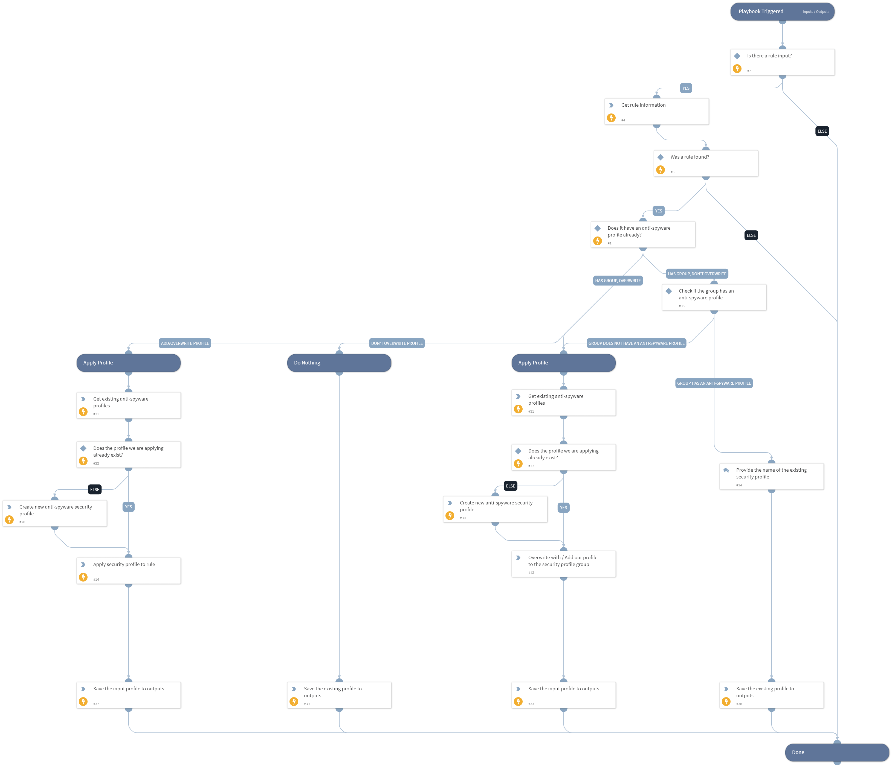

This playbook is used to add an Anti-Spyware security profile to a rule in PAN-OS in a safe manner. This means that it first checks if there's already a security profile attached, and if there is - it won't necessarily overwrite it.
In addition, it checks if there's a Security Profile Group attached, and if there is, it will try to add the Security Profile to the group safely.
In case we are trying to apply a Security Profile that doesn't exist yet - the playbook will create it too.

## Dependencies

This playbook uses the following sub-playbooks, integrations, and scripts.

### Sub-playbooks

This playbook does not use any sub-playbooks.

### Integrations

* Panorama

### Scripts

* SetAndHandleEmpty

### Commands

* pan-os-get-security-profiles
* pan-os-apply-security-profile
* pan-os-create-anti-spyware-best-practice-profile
* pan-os-list-rules

## Playbook Inputs

---

| **Name** | **Description** | **Default Value** | **Required** |
| --- | --- | --- | --- |
| RuleName | The name of the rule to which the Security Profile should be added. |  | Required |
| SecurityProfileName | The name of the Security Profile that should be added to the rule. |  | Required |
| OverwriteProfileIfExists | Whether to overwrite an existing Anti-Spyware Security Profile. If an Anti-Spyware Security Profile is configured to the rule through a group of profiles and not a single profile, setting this input's value to True will overwrite the existing profile within the group instead of applying the profile and overwriting the whole group.  Possible values are: True to overwrite, False to keep existing. | True | Required |

## Playbook Outputs

---

| **Path** | **Description** | **Type** |
| --- | --- | --- |
| AntiSpywareProfileNameApplied | The name of the Anti-Spyware Security Profile that is applied to the rule. The value could be the name of the rule that was added, overwritten with, or left untouched - for the specified rule. | unknown |

## Playbook Image

---

