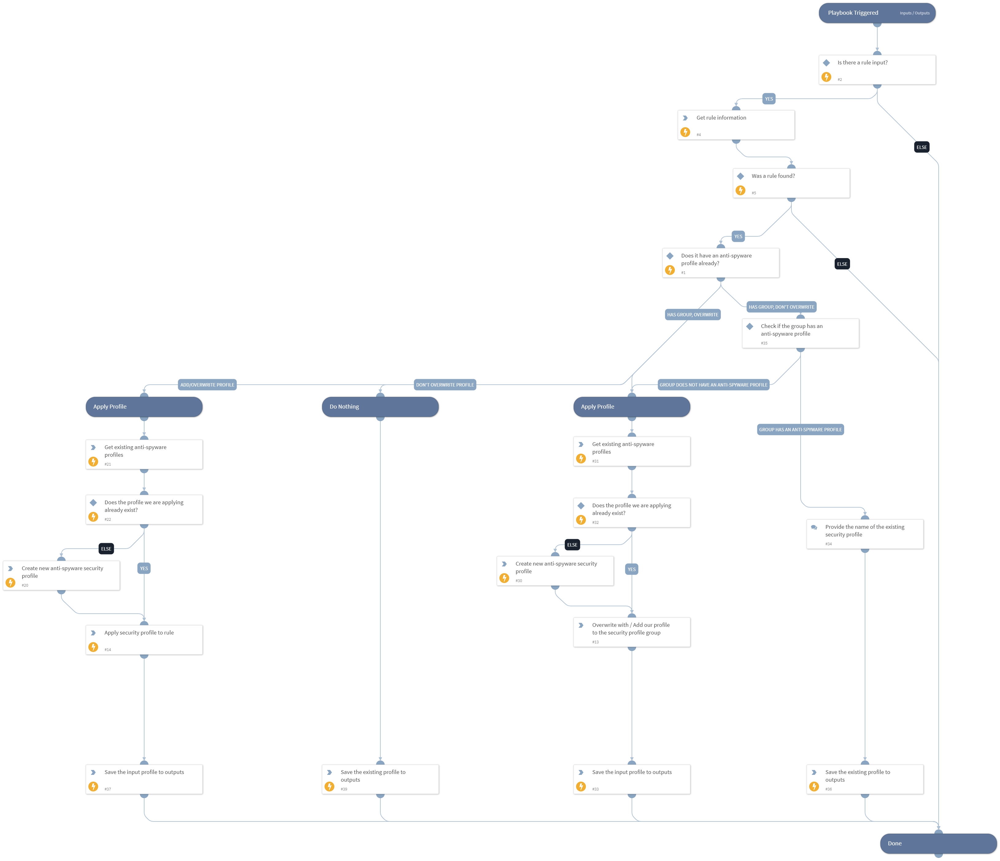

This playbook is designed to enhance the security level in PAN-OS firewalls by safely adding an Anti-Spyware security profile to a security rule.

The playbook provides control over the behavior when a rule:
- Already has an Anti-Spyware profile
- Uses a security profile group, with or without an Anti-Spyware profile

The output of the playbook is the Anti-Spyware profile configured for the rule upon playbook completion. This can be:
- The initial profile, if untouched
- A newly overwritten profile
- A newly added profile

## Dependencies

This playbook uses the following sub-playbooks, integrations, and scripts.

### Sub-playbooks

This playbook does not use any sub-playbooks.

### Integrations

* Panorama

### Scripts

* SetAndHandleEmpty

### Commands

* pan-os-get-security-profiles
* pan-os-create-anti-spyware-best-practice-profile
* pan-os-apply-security-profile
* pan-os-list-rules

## Playbook Inputs

---

| **Name** | **Description** | **Default Value** | **Required** |
| --- | --- | --- | --- |
| RuleName | The name of the rule to which the Security Profile should be added. |  | Required |
| SecurityProfileName | The name of the Security Profile that should be added to the rule. If it doesn't exit, one will be created with the name specified here. |  | Required |
| OverwriteProfileIfExists | Whether to overwrite an existing Anti-Spyware Security Profile. If an Anti-Spyware Security Profile is configured to the rule through a group of profiles and not a single profile, setting this input's value to True will overwrite the existing profile within the group instead of applying the profile and overwriting the whole group.  Possible values are: True to overwrite, False to keep existing. | False | Required |

## Playbook Outputs

---

| **Path** | **Description** | **Type** |
| --- | --- | --- |
| AntiSpywareProfileNameApplied | The name of the Anti-Spyware Security Profile that is applied to the rule. The value could be the name of the profile that was added, overwritten with, or left untouched - for the specified rule. | unknown |

## Playbook Image

---

