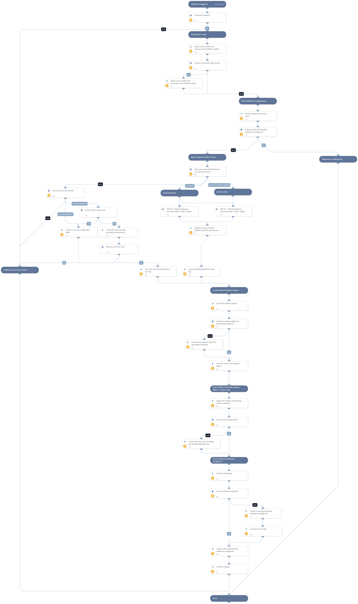

This playbook creates a DNS sinkhole in a PAN-OS firewall. It does the following:
1. Finds a security rule that allows DNS traffic from the internal network to the internet using the "Security Policy Match" feature against traffic from the internal DNS server/s to the public DNS server.
2. Creates or adds an existing anti-spyware security profile to the security rule/s that were found.
3. Sets the DNS Signature Source under the DNS Policies configuration of the security profile with the "sinkhole" action.
4. Creates an address object for the sinkhole address so that it can be referenced later in a deny rule (the sinkhole IP constantly rotates).
5. Creates a new security rule to deny traffic to the sinkhole address object, in order to generate traffic logs for the compromised systems. The IPs of the compromised systems can then be retrieved using the "PAN-OS - Extract IPs From Traffic Logs To Sinkhole" playbook.

Once the configuration is completed, the playbook will create a Tag object and tag the relevant security rules to indicate that sinkholing is configured. That tag will be checked in consecutive playbook runs in order to minimize the actions done on the firewall and time spent in the playbook execution.

How it works:
A DNS sinkhole can be used to identify infected hosts on a network where there is an internal DNS Server in-route to the firewall that causes the reference of the original source IP address of the host that first originated the query to be lost (the query is received by the internal DNS server, and the internal DNS server sources a new query if the name-to-IP resolution is not locally cached).

This causes the firewall to report observations of malicious DNS queries in the Threat logs where the source IP of the malicious DNS query is the Internal DNS server, which would force the administrator to look into the DNS Server logs to try to trace down what was the infected host that originally sourced the malicious DNS query.

After a security profile with a "sinkhole" action for domains that are listed in the DNS signature source is applied to a rule that allows DNS traffic from the internal server/s to the external one, the threat logs will show that requests from the internal DNS server/s were sinkholed. However, the compromised systems will not appear in those logs.

In order to find the IP addresses of those systems, a new rule denying all requests to our sinkhole address needs to be created. Since the infected systems received a forged DNS response (due to the security profile involved in our previous step), they will now try to connect to the sinkhole address, assuming it is their C&C server. The new rule will deny the subsequent attempts of those systems when they try to access the sinkhole address, and log them.

Assumptions:
- The domains that should be sinkholed are already in a DNS signature source. It can be one of the following sources available in PAN-OS:
    1. An existing External Dynamic List (EDL) of type Domain configured in the PAN-OS firewall. Note: Cortex XSOAR simplifies the process of creating an EDL, with the Export Generic Indicators Service integration.
    2. Palo Alto Networks Content-delivered malicious domains
    3. DNS Security Categories available with a DNS Security subscription.
- There is at least one internal DNS server that is sending the DNS requests out through the firewall to a specific public DNS server.

## Dependencies

This playbook uses the following sub-playbooks, integrations, and scripts.

### Sub-playbooks

* PAN-OS - Add Anti-Spyware Security Profile To Rule

### Integrations

* Panorama

### Scripts

* Set
* IsIntegrationAvailable

### Commands

* pan-os-apply-dns-signature-policy
* pan-os-create-tag
* pan-os-create-address
* pan-os-commit
* pan-os-create-rule
* pan-os-list-tag
* pan-os-list-rules
* pan-os-list-addresses
* pan-os-edit-rule
* pan-os-security-policy-match

## Playbook Inputs

---

| **Name** | **Description** | **Default Value** | **Required** |
| --- | --- | --- | --- |
| DNSSignatureSource | The name of the signature source that contains the domains to sinkhole. It is used by the security profile to check if DNS requests for these domains are being sent through the firewall. Supported signature sources are: Custom EDLs of type Domain, Palo Alto Networks Content-delivered malicious domains, and DNS Security Categories.  To find your available DNS signature sources in PAN-OS, navigate to Objects &gt; Security Profiles &gt; Anti-Spyware. Click on the name of an existing profile or click Add, then open the DNS Policies tab.  Note: using External Dynamic Lists \(EDLs\) or DNS Security as signature sources requires a "DNS Security" subscription. If you don't have one, you can keep the default value of "default-paloalto-dns", which is part of the Palo Alto Networks Content. | default-paloalto-dns | Required |
| SecurityProfileName | The name of the Anti-Spyware Security Profile that will be applied to the DNS related rule, in order to filter the malicious domains and facilitate the sinkhole action. The profile has to be an anti-spyware profile that the user wants the playbook to modify. The playbook will apply this profile to a security rule currently allowing DNS traffic. If a security profile with the specified name does not exist, it will be created automatically. Afterwards, the playbook will modify the profile to sinkhole any traffic to the domains found in the DNS signature source defined in the playbook input.  If you're not sure, leave the default value of this input. | Sinkhole Anti Spyware Profile | Optional |
| PrimaryInternalDNSServerIP | The IP of the primary internal DNS server. Used to find a policy that matches the malicious DNS queries that go out from the internal DNS server to the firewall. The idea is to find a policy that allows DNS traffic in order to sinkhole that traffic when used for resolving malicious domains found in our signature source. |  | Required |
| SecondaryInternalDNSServerIP | Optional - the IP of the secondary internal DNS server. Used to find a policy that matches the malicious DNS queries that go out from the internal DNS server to the firewall. The idea is to find a policy that allows DNS traffic in order to sinkhole that traffic when used for resolving malicious domains found in our signature source. |  | Optional |
| PublicDNSServerIP | The IP of the public DNS server that the organization is using to resolve external domains. This is needed to find the rule that allows DNS requests so that malicious ones can be sinkholed by attaching a security profile to that rule.  If there is currently no rule to allow DNS traffic from the internal DNS server to the internet, the user will be prompted to approve the creation of a new rule that allows DNS traffic from the internal DNS server/s to the IP specified in this input's value. | 8.8.8.8 | Required |
| RuleNameToAllowDNS | Optional - the name of the security rule that will allow DNS traffic. If permission is granted and no other rule is currently allowing DNS, the playbook will create a new rule with the name specified in this value to allow DNS traffic from inside the network to the outside internet. | Internal DNS to External DNS - Allow DNS Traffic | Optional |
| AutoCreateRuleToAllowDNS | Determines whether the playbook can automatically create a rule that specifically allows DNS traffic from the internal DNS servers to the public DNS server configured in the playbook inputs. Possible values and their meanings are as follows: True - create such a rule automatically if one does not exist \(Warning - this will allow previously unallowed traffic\). False - do not create such a rule automatically.  If a value of "False" is specified, the playbook will check if the NetworkAdminEmail input is specified. If it is, the playbook will seek approval to create the rule, from the email specified in that input. If no email is specified, the playbook will abort without making any changes. | False | Optional |
| NetworkAdminEmail | Optional - the email of the person who should approve the creation of a new security policy rule in the firewall. If no rule allows internal DNS traffic to go outside, the playbook will send an email to the email specified in this input, asking to approve the creation of such rule. If no email is specified, and the AutoCreateRuleToAllowDNS input is set to False, the playbook will abort without making any changes, as such a rule is mandatory for the flow of the playbook. |  | Optional |
| RuleNameToDenyToSinkhole | The name of the rule that will be created to deny traffic to the sinkhole address. This is required so that traffic logs will reveal the endpoints attempting to connect to their C&amp;C \(which by the end of this playbook will be sinkholed\). If a rule with the specified name does not exist, one will be created. The new rule will be placed before rules that allow DNS traffic, as recommended by the PAN-OS best practices. If no value is specified, and a rule for denying the traffic to the sinkhole does not exist, one with the name "Deny To Sinkhole" will be created. | Deny To Sinkhole | Optional |
| OverwriteExistingProfile | Whether to overwrite an existing anti-spyware security profile if one is currently applied to the rule that allows DNS traffic.  If set to True - if the rule already has a different anti-spyware profile applied to it, it will be overwritten with the one specified in the SecurityProfileName input.  If set to False - if the rule already has a different anti-spyware profile applied to it, the playbook will use that profile when sinkholing domains from the specified DNS Signature Source.  If you are not sure whether to overwrite it or not - leave this as False, since an existing security profile may have additional logic configured to it. | False | Required |

## Playbook Outputs

---
There are no outputs for this playbook.

## Playbook Image

---

## Playbook Demo Video
<video controls>
    <source src="https://github.com/demisto/content-assets/raw/master/Assets/DNSSinkhole/DNS%20Sinkhole.mp4"
            type="video/mp4"/>
    Sorry, your browser doesn't support embedded videos. You can download the video at: https://github.com/demisto/content-assets/raw/master/Assets/DNSSinkhole/DNS%20Sinkhole.mp4
</video>