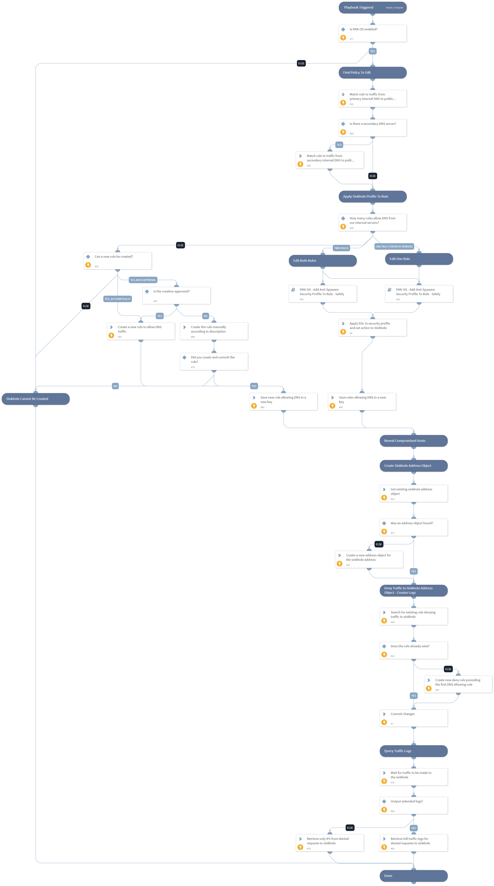

This playbook creates a DNS sinkhole in a PAN-OS firewall. It does the following:
1. Finds a security rule that allows DNS traffic from the internal network to the internet using the "Security Policy Match" feature against traffic from the internal DNS server/s to the public DNS server.
2. Creates or adds an existing anti-spyware security profile to the security rule/s that were found.
3. Sets the External Dynamic List under the DNS Policies configuration of the security profile with the "sinkhole" action.
4. Creates an address object for the sinkhole address so that it can be referenced later in a deny rule (the sinkhole IP constantly rotates).
5. Creates a new security rule to deny traffic to the sinkhole address object, in order to generate traffic logs for the compromised hosts.
6. Retrieves the traffic logs for the IPs that generate traffic that is denied by the previous step.
7. Outputs the revealed IPs, or the full traffic logs, depending on the playbook input configuration.

How it works:
A DNS sinkhole can be used to identify infected hosts on a network where there is an internal DNS Server in-route to the firewall that causes the reference of the original source IP address of the host that first originated the query to be lost (the query is received by the internal DNS server, and the internal DNS server sources a new query if the name-to-IP resolution is not locally cached).

This causes the firewall to report observations of malicious DNS queries in the Threat logs where the source IP of the malicious DNS query is the Internal DNS server, which would force the administrator to look into the DNS Server logs to try to trace down what was the infected host that originally sourced the malicious DNS query.

After a security profile with a "sinkhole" action for domains listed in our EDL is attached to a rule that allows DNS traffic, the threat logs will show that requests from our DNS server were sinkholed. However, the compromised systems will not appear in those logs.
In order to find the IPs of the systems that tried to resolve the malicious domain, a new rule denying all requests to our Sinkhole Address needs to be created. Since the infected hosts received a forged DNS response due to the security profile involved in our previous step, they will now try to connect to the Sinkhole Address, assuming it is their C&C server. The new rule will deny the subsequent attempts of those infected hosts when they try to access the Sinkhole Address, and log them.

Assumptions:
- There is an existing External Dynamic List (EDL) that has the domain that you want to sinkhole in it.
- There is an internal DNS server going out through the firewall to a specific public DNS server.

## Dependencies

This playbook uses the following sub-playbooks, integrations, and scripts.

### Sub-playbooks

* PAN-OS - Add Anti-Spyware Security Profile To Rule - Safely

### Integrations

* Panorama

### Scripts

* Set
* Sleep
* IsIntegrationAvailable

### Commands

* pan-os-security-policy-match
* pan-os-commit
* pan-os-query-logs
* pan-os-get-address
* pan-os-apply-dns-signature-policy
* pan-os-create-rule
* pan-os-list-rules
* pan-os-create-address

## Playbook Inputs

---

| **Name** | **Description** | **Default Value** | **Required** |
| --- | --- | --- | --- |
| SinkholeDomainsEDLName | The name of the External Dynamic List in the PAN-OS next generation firewall that contains the domains that should be sinkholed. |  | Required |
| SecurityProfileName | The name of the Anti-Spyware Security Profile that will be applied to the DNS related rule, in order to filter the malicious domains and facilitate the sinkhole action. The profile has to be an anti-spyware profile that the user wants the playbook to modify. The playbook will apply the EDL of the domains to sinkhole to this profile, and will apply this profile to a security rule currently allowing DNS traffic. If a security profile with the specified name does not exist, it will be created automatically.  If you're not sure, leave the default value of this input. | Sinkhole Anti Spyware Profile | Optional |
| SinkholeAddressObjectName | The name for the sinkhole Address Object. If such an address object exists, the playbook will use it to deny and log the traffic to the sinkhole address. If the object does not exist, a new one with the name specified will be created.  Explanation: In order to identify compromised hosts, a rule denying traffic to the sinkhole address needs to be applied. Since the sinkhole address constantly rotates, the destination for that rule should be an Address Object of type FQDN.  | Sinkhole Address | Optional |
| PrimaryInternalDNSServerIP | The IP of the primary internal DNS server. Used to find a policy that matches the malicious DNS queries that go out from the internal DNS server to the firewall. The idea is to find a policy that allows DNS traffic in order to sinkhole that traffic when used for resolving malicious domains found in our EDL. |  | Required |
| SecondaryInternalDNSServerIP | Optional - the IP of the secondary internal DNS server. Used to find a policy that matches the malicious DNS queries that go out from the internal DNS server to the firewall. The idea is to find a policy that allows DNS traffic in order to sinkhole that traffic when used for resolving malicious domains found in our EDL. |  | Optional |
| PublicDNSServerIP | The IP of the public DNS server that the organization is using to resolve external domains. This is needed to find the rule that allows DNS requests so that malicious ones can be sinkholed by attaching a security profile to that rule.  If there is currently no rule to allow DNS traffic from the internal DNS server to the internet, the user will be prompted to approve the creation of a new rule that allows DNS traffic from the internal DNS server/s to the IP specified in this input's value. |  | Required |
| RuleNameToAllowDNS | Optional - the name of the security rule that will allow DNS traffic. If permission is granted and no other rule is currently allowing DNS, the playbook will create a new rule with the name specified in this value to allow DNS traffic from inside the network to the outside internet. | Allow DNS Outside - Created By XSOAR | Optional |
| OutputLogsForDetectedIPs | Whether to output full traffic logs for the infected IPs.  If set to True, this will output the logs containing the traffic from the compromised IPs to the sinkhole address. It includes data that can be used for remediation or for deeper investigation by examining what traffic the hosts are creating.  If set to False, data from the logs will not be outputted.  Note: The IP addresses of the systems creating traffic to the sinkhole address will be outputted regardless of playbook input configurations. | False | Optional |
| AutoCreateRuleToAllowDNS | Determines whether the playbook can automatically create a rule that specifically allows DNS traffic from the internal DNS servers to the public DNS server configured in the playbook inputs. Possible values and their meanings are as follows: True - create such a rule automatically if one does not exist \(Warning - this will allow previously unallowed traffic\). False - do not create such a rule automatically.  If a value of "False" is specified, the playbook will check if the NetworkAdminEmail input is specified. If it is, the playbook will seek approval to create the rule, from the email specified in that input. If no email is specified, the playbook will abort without making any changes. | False | Optional |
| NetworkAdminEmail | Optional - the email of the person who should approve the creation of a new security policy rule in the firewall. If no rule allows internal DNS traffic to go outside, the playbook will send an email to the email specified in this input, asking to approve the creation of such rule. If no email is specified, and the AutoCreateRuleToAllowDNS input is set to False, the playbook will abort without making any changes, as such a rule is mandatory for the flow of the playbook. |  | Optional |
| RuleNameToDenyToSinkhole | The name of the rule that will be created  to deny traffic to the sinkhole address. This is required so that traffic logs will reveal the endpoints attempting to connect to their C&amp;C \(which by the end of this playbook will be sinkholed\). If a rule with the specified name does not exist, one will be created. The new rule will be placed before rules that allow DNS traffic, as recommended by the PAN-OS best practices. | Deny To Sinkhole | Required |
| TimeToWaitForTraffic | The time in seconds that the playbook will wait for hosts to generate traffic to the sinkhole address, after the sinkhole configuration was completed. We recommend waiting for at least a couple of minutes in order to give the hosts the chance to create logs in the firewall. | 180 | Required |
| OverwriteExistingProfile | Whether to overwrite the existing anti-spyware security profile that is currently applied to the rule that allows DNS traffic. If set to True - if the rule already has a different anti-spyware profile applied to it, it will be overwritten with the one specified in the SecurityProfileName input. If set to False - if the rule already has a different anti-spyware profile applied to it, it will use that profile and add the sinkhole action with the EDL to it.  If you are not sure whether to overwrite it or not - leave this as False, since an existing security profile may have additional logic configured to it. | False | Required |

## Playbook Outputs

---

| **Path** | **Description** | **Type** |
| --- | --- | --- |
| DetectedIPsFromSinkhole | The IP addresses of the hosts that attempted to connect to the sinkhole address. If your EDL contained C2C domains, then this would be a list of IP addresses of compromised hosts. | unknown |
| Panorama.Monitor.Logs | The Traffic logs generated by the rule that denies traffic to the sinkhole address. After the sinkhole is created - these logs should be generated by the infected systems. | unknown |
| Panorama.Monitor.Logs.Action | The action taken for the session. Can be "alert", "allow", "deny", "drop", "drop-all-packets", "reset-client", "reset-server", "reset-both", or "block-url". | unknown |
| Panorama.Monitor.Logs.Application | The application associated with the session. | unknown |
| Panorama.Monitor.Logs.Category | The URL category of the URL subtype. For WildFire subtype, it is the verdict on the file, and can be either "malicious", "phishing", "grayware", or "benign". For other subtypes, the value is "any". | unknown |
| Panorama.Monitor.Logs.DeviceName | The hostname of the firewall on which the session was logged. | unknown |
| Panorama.Monitor.Logs.DestinationAddress | The original session destination IP address. | unknown |
| Panorama.Monitor.Logs.DestinationUser | The username of the user to which the session was destined. | unknown |
| Panorama.Monitor.Logs.DestinationCountry | The destination country or internal region for private addresses. Maximum length is 32 bytes. | unknown |
| Panorama.Monitor.Logs.DestinationPort | The destination port utilized by the session. | unknown |
| Panorama.Monitor.Logs.FileDigest | Only for the WildFire subtype, all other types do not use this field. The filedigest string shows the binary hash of the file sent to be analyzed by the WildFire service. | unknown |
| Panorama.Monitor.Logs.FileName | File name or file type when the subtype is file. File name when the subtype is virus. File name when the subtype is wildfire-virus. File name when the subtype is wildfire. | unknown |
| Panorama.Monitor.Logs.FileType | Only for the WildFire subtype, all other types do not use this field. Specifies the type of file that the firewall forwarded for WildFire analysis. | unknown |
| Panorama.Monitor.Logs.FromZone | The zone from which the session was sourced. | unknown |
| Panorama.Monitor.Logs.URLOrFilename | The actual URL when the subtype is url. The file name or file type when the subtype is file. The file name when the subtype is virus. The file name when the subtype is wildfire-virus. The file name when the subtype is wildfire. The URL or file name when the subtype is vulnerability \(if applicable\). | unknown |
| Panorama.Monitor.Logs.NATDestinationIP | The post-NAT destination IP address if destination NAT was performed. | unknown |
| Panorama.Monitor.Logs.NATDestinationPort | The post-NAT destination port. | unknown |
| Panorama.Monitor.Logs.NATSourceIP | The post-NAT source IP address if source NAT was performed. | unknown |
| Panorama.Monitor.Logs.NATSourcePort | The post-NAT source port. | unknown |
| Panorama.Monitor.Logs.PCAPid | The packet capture \(pcap\) ID is a 64 bit unsigned integral denoting an ID to correlate threat pcap files with extended pcaps taken as a part of that flow. All threat logs will contain either a pcap_id of 0 \(no associated pcap\), or an ID referencing the extended pcap file. | unknown |
| Panorama.Monitor.Logs.IPProtocol | The IP protocol associated with the session. | unknown |
| Panorama.Monitor.Logs.Recipient | Only for the WildFire subtype, all other types do not use this field. Specifies the name of the receiver of an email that WildFire determined to be malicious when analyzing an email link forwarded by the firewall. | unknown |
| Panorama.Monitor.Logs.Rule | The name of the rule that the session matched. | unknown |
| Panorama.Monitor.Logs.RuleID | The ID of the rule that the session matched. | unknown |
| Panorama.Monitor.Logs.ReceiveTime | The time the log was received at the management plane. | unknown |
| Panorama.Monitor.Logs.Sender | Only for the WildFire subtype; all other types do not use this field. Specifies the name of the sender of an email that WildFire determined to be malicious when analyzing an email link forwarded by the firewall. | unknown |
| Panorama.Monitor.Logs.SessionID | An internal numerical identifier applied to each session. | unknown |
| Panorama.Monitor.Logs.DeviceSN | The serial number of the firewall on which the session was logged. | unknown |
| Panorama.Monitor.Logs.Severity | The severity associated with the threat. Can be "informational", "low", "medium", "high", or "critical". | unknown |
| Panorama.Monitor.Logs.SourceAddress | The original session source IP address. | unknown |
| Panorama.Monitor.Logs.SourceCountry | The source country or internal region for private addresses. Maximum length is 32 bytes. | unknown |
| Panorama.Monitor.Logs.SourceUser | The username of the user who initiated the session. | unknown |
| Panorama.Monitor.Logs.SourcePort | The source port utilized by the session. | unknown |
| Panorama.Monitor.Logs.ThreatCategory | The threat categories used to classify different types of threat signatures. | unknown |
| Panorama.Monitor.Logs.Name | The Palo Alto Networks identifier for the threat. A description string followed by a 64-bit numerical identifier. | unknown |
| Panorama.Monitor.Logs.ID | The Palo Alto Networks ID for the threat. | unknown |
| Panorama.Monitor.Logs.ToZone | The zone to which the session was destined. | unknown |
| Panorama.Monitor.Logs.TimeGenerated | The time the log was generated on the data plane. | unknown |
| Panorama.Monitor.Logs.URLCategoryList | A list of the URL filtering categories the firewall used to enforce the policy. | unknown |
| Panorama.Monitor.Logs.Bytes | The total log bytes. | unknown |
| Panorama.Monitor.Logs.BytesReceived | The log bytes received. | unknown |
| Panorama.Monitor.Logs.BytesSent | The log bytes sent. | unknown |
| Panorama.Monitor.Logs.Vsys | The VSYS on the firewall that generated the log. | unknown |

## Playbook Image

---

