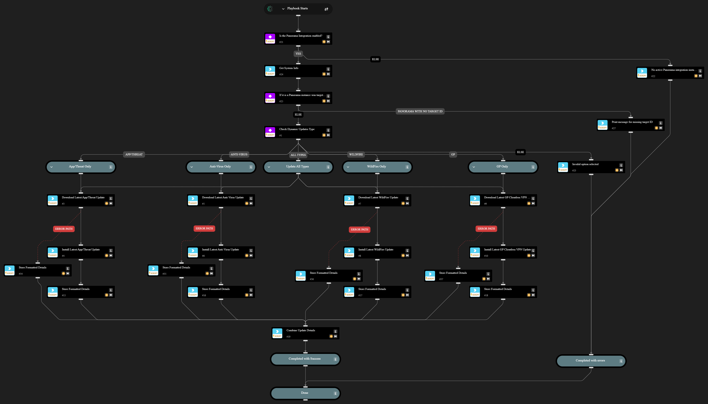

This playbook automates the download and installation of the following Dynamic Update types on Palo Alto firewalls:

- App/Threat
- Anti-Virus
- WildFire
- GlobalProtect Clientless VPN

Use the "itemsToUpdate" input to control which update type(s) to download and install. All types are updated by default.

NOTE: This playbook is intended for use with a single PAN-OS Integration Instance.

## Dependencies

This playbook uses the following sub-playbooks, integrations, and scripts.

### Sub-playbooks

This playbook does not use any sub-playbooks.

### Integrations

- Panorama

### Scripts

- Set
- SetAndHandleEmpty

### Commands

- pan-os-download-latest-antivirus-update
- pan-os-download-latest-content-update
- pan-os-download-latest-gp-update
- pan-os-download-latest-wildfire-update
- pan-os-install-latest-antivirus-update
- pan-os-install-latest-content-update
- pan-os-install-latest-gp-update
- pan-os-install-latest-wildfire-update

## Playbook Inputs

---

| **Name** | **Description** | **Default Value** | **Required** |
| --- | --- | --- | --- |
| targetDevice | The serial number of a specific firewall to target \(Used when connected to Panorama\) \[Optional\].  |  | Optional |
| itemsToUpdate | Specifies which item types to download and install. Select one of the following options: all app/threat anti-virus wildfire gp | all | Required |

## Playbook Outputs

---

| **Path** | **Description** | **Type** |
| --- | --- | --- |
| DynamicUpdates | A dictionary containing details of the Dynamic Update type\(s\) downloaded and installed, including their version number and associated job IDs. | unknown |

## Playbook Image

---

