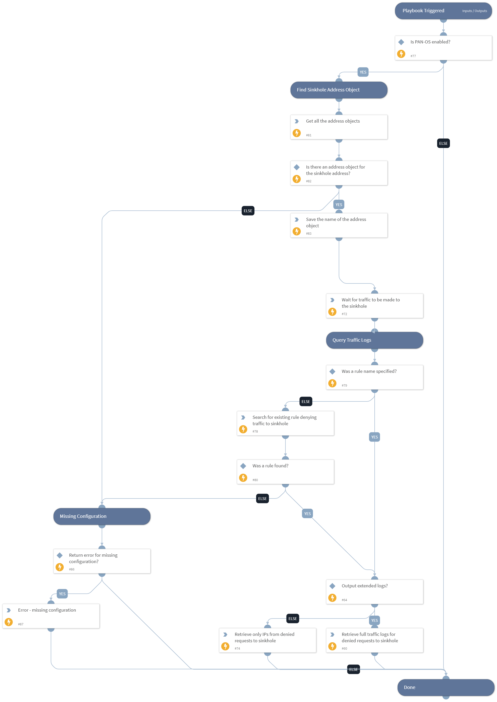

This playbook searches for outgoing traffic to the sinkhole address in PAN-OS. It should be used after a DNS sinkhole was created using the "PAN-OS - Configure DNS Sinkhole" playbook. If a DNS sinkhole was created manually, you should verify in your PAN-OS firewall that there is an address object for the sinkhole FQDN "sinkhole.paloaltonetworks.com", and that there is a rule denying traffic to it from any source. You may specify the name of the deny rule if you know it, or you can let the playbook find the rule automatically.

## Dependencies

This playbook uses the following sub-playbooks, integrations, and scripts.

### Sub-playbooks

This playbook does not use any sub-playbooks.

### Integrations

* Panorama

### Scripts

* Sleep
* IsIntegrationAvailable
* Set
* PrintErrorEntry

### Commands

* pan-os-list-addresses
* pan-os-list-rules
* pan-os-query-logs

## Playbook Inputs

---

| **Name** | **Description** | **Default Value** | **Required** |
| --- | --- | --- | --- |
| OutputLogsForDetectedIPs | Whether to output full traffic logs for the infected IPs.  If set to True, this will output the logs containing the traffic from the compromised IPs to the sinkhole address. It includes data that can be used for remediation or for deeper investigation by examining what traffic the hosts are creating.  If set to False, data from the logs will not be outputted.  Note: The IP addresses of the systems creating traffic to the sinkhole address will be outputted regardless of playbook input configurations. | False | Required |
| RuleNameToDenyToSinkhole | The name of the rule that will be created to deny traffic to the sinkhole address. This is required so that traffic logs will reveal the endpoints attempting to connect to their C&amp;C \(which by the end of this playbook will be sinkholed\). If a rule with the specified name does not exist, one will be created. The new rule will be placed before rules that allow DNS traffic, as recommended by the PAN-OS best practices. |  | Optional |
| TimeToWaitForTraffic | The time in seconds that the playbook will wait for hosts to generate traffic to the sinkhole address. Waiting for long periods of time will increase your chances of finding additional infected systems. However, if enough time passed since your DNS sinkhole was first configured, it may not be needed to wait at all, as systems are already generating traffic to the sinkhole address. By default, the playbook will wait for 5 minutes \(300 seconds\). If you do not wish to wait at all, do not delete the value of this input. Instead, you can set the value to 0. | 300 | Required |
| ReturnErrorForIncompleteConfig | Whether to return errors if the configuration for the sinkhole is incomplete. An incomplete configuration will result in no logs being returned from this playbook. | False | Required |

## Playbook Outputs

---

| **Path** | **Description** | **Type** |
| --- | --- | --- |
| DetectedIPsFromSinkhole | The IP addresses of the hosts that attempted to connect to the sinkhole address. If your EDL contained C2C domains, then this would be a list of IP addresses of compromised hosts. | unknown |
| Panorama.Monitor.Logs | The Traffic logs generated by the rule that denies traffic to the sinkhole address. After the sinkhole is created, these logs should be generated by the infected systems. | unknown |
| Panorama.Monitor.Logs.Action | The action taken for the session. Can be "alert", "allow", "deny", "drop", "drop-all-packets", "reset-client", "reset-server", "reset-both", or "block-url". | unknown |
| Panorama.Monitor.Logs.Application | The application associated with the session. | unknown |
| Panorama.Monitor.Logs.Category | The URL category of the URL subtype. For WildFire subtype, it is the verdict on the file, and can be either "malicious", "phishing", "grayware", or "benign". For other subtypes, the value is "any". | unknown |
| Panorama.Monitor.Logs.DeviceName | The hostname of the firewall on which the session was logged. | unknown |
| Panorama.Monitor.Logs.DestinationAddress | The original session destination IP address. | unknown |
| Panorama.Monitor.Logs.DestinationUser | The username of the user to which the session was destined. | unknown |
| Panorama.Monitor.Logs.DestinationCountry | The destination country or internal region for private addresses. Maximum length is 32 bytes. | unknown |
| Panorama.Monitor.Logs.DestinationPort | The destination port utilized by the session. | unknown |
| Panorama.Monitor.Logs.FileDigest | Only for the WildFire subtype, all other types do not use this field. The filedigest string shows the binary hash of the file sent to be analyzed by the WildFire service. | unknown |
| Panorama.Monitor.Logs.FileName | File name or file type when the subtype is file. File name when the subtype is virus. File name when the subtype is wildfire-virus. File name when the subtype is wildfire. | unknown |
| Panorama.Monitor.Logs.FileType | Only for the WildFire subtype, all other types do not use this field. Specifies the type of file that the firewall forwarded for WildFire analysis. | unknown |
| Panorama.Monitor.Logs.FromZone | The zone from which the session was sourced. | unknown |
| Panorama.Monitor.Logs.URLOrFilename | The actual URL when the subtype is url. The file name or file type when the subtype is file. The file name when the subtype is virus. The file name when the subtype is wildfire-virus. The file name when the subtype is wildfire. The URL or file name when the subtype is vulnerability \(if applicable\). | unknown |
| Panorama.Monitor.Logs.NATDestinationIP | The post-NAT destination IP address if destination NAT was performed. | unknown |
| Panorama.Monitor.Logs.NATDestinationPort | The post-NAT destination port. | unknown |
| Panorama.Monitor.Logs.NATSourceIP | The post-NAT source IP address if source NAT was performed. | unknown |
| Panorama.Monitor.Logs.NATSourcePort | The post-NAT source port. | unknown |
| Panorama.Monitor.Logs.PCAPid | The packet capture \(pcap\) ID is a 64 bit unsigned integral denoting an ID to correlate threat pcap files with extended pcaps taken as a part of that flow. All threat logs will contain either a pcap_id of 0 \(no associated pcap\), or an ID referencing the extended pcap file. | unknown |
| Panorama.Monitor.Logs.IPProtocol | The IP protocol associated with the session. | unknown |
| Panorama.Monitor.Logs.Recipient | Only for the WildFire subtype, all other types do not use this field. Specifies the name of the receiver of an email that WildFire determined to be malicious when analyzing an email link forwarded by the firewall. | unknown |
| Panorama.Monitor.Logs.Rule | The name of the rule that the session matched. | unknown |
| Panorama.Monitor.Logs.RuleID | The ID of the rule that the session matched. | unknown |
| Panorama.Monitor.Logs.ReceiveTime | The time the log was received at the management plane. | unknown |
| Panorama.Monitor.Logs.Sender | Only for the WildFire subtype; all other types do not use this field. Specifies the name of the sender of an email that WildFire determined to be malicious when analyzing an email link forwarded by the firewall. | unknown |
| Panorama.Monitor.Logs.SessionID | An internal numerical identifier applied to each session. | unknown |
| Panorama.Monitor.Logs.DeviceSN | The serial number of the firewall on which the session was logged. | unknown |
| Panorama.Monitor.Logs.Severity | The severity associated with the threat. Can be "informational", "low", "medium", "high", or "critical". | unknown |
| Panorama.Monitor.Logs.SourceAddress | The original session source IP address. | unknown |
| Panorama.Monitor.Logs.SourceCountry | The source country or internal region for private addresses. Maximum length is 32 bytes. | unknown |
| Panorama.Monitor.Logs.SourceUser | The username of the user who initiated the session. | unknown |
| Panorama.Monitor.Logs.SourcePort | The source port utilized by the session. | unknown |
| Panorama.Monitor.Logs.ThreatCategory | The threat categories used to classify different types of threat signatures. | unknown |
| Panorama.Monitor.Logs.Name | The Palo Alto Networks identifier for the threat. A description string followed by a 64-bit numerical identifier. | unknown |
| Panorama.Monitor.Logs.ID | The Palo Alto Networks ID for the threat. | unknown |
| Panorama.Monitor.Logs.ToZone | The zone to which the session was destined. | unknown |
| Panorama.Monitor.Logs.TimeGenerated | The time the log was generated on the data plane. | unknown |
| Panorama.Monitor.Logs.URLCategoryList | A list of the URL filtering categories the firewall used to enforce the policy. | unknown |
| Panorama.Monitor.Logs.Bytes | The total log bytes. | unknown |
| Panorama.Monitor.Logs.BytesReceived | The log bytes received. | unknown |
| Panorama.Monitor.Logs.BytesSent | The log bytes sent. | unknown |
| Panorama.Monitor.Logs.Vsys | The VSYS on the firewall that generated the log. | unknown |

## Playbook Image

---

