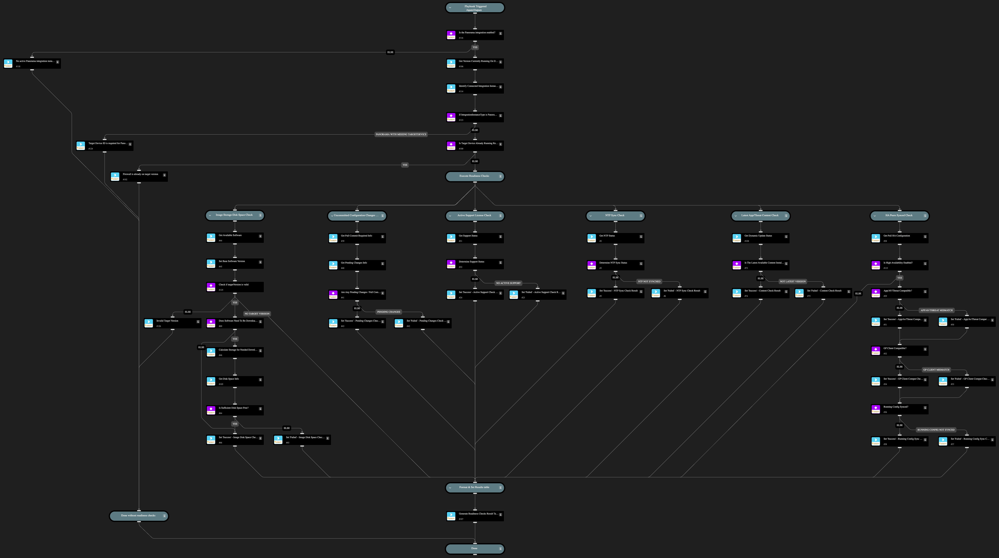

This playbook uses the PAN-OS integration to check NGFW device conditions that can affect its readiness to perform a PAN-OS upgrade.  Included checks examine the following:
1. Available disk space for the target version (base image and release image)
2. Presence of any uncommitted configuration changes
3. Whether the device has an active Support license
4. Whether NTP is configured and synced
5. Whether the latest App/Threat dynamic update is installed
6. For devices in HA groups, check that devices in the group have:
    1. App/Threat, AntiVirus, and GlobalProtect Client are at the same level and compatible for HA failover
    2. Running configuration synchronized among peers

Playbook output includes a register of the checks performed, a brief description, and their result.

NOTE: This playbook is intended for use with a single PAN-OS Integration Instance.

## Dependencies

This playbook uses the following sub-playbooks, integrations, and scripts.

### Sub-playbooks

This playbook does not use any sub-playbooks.

### Integrations

* Panorama

### Scripts

* JsonToTable
* PAN-OS-GetAvailablePANOSSoftware
* PAN-OS-GetDeviceDiskSpace
* Print
* PrintErrorEntry
* Set

### Commands

* pan-os
* pan-os-check-dynamic-updates-status
* pan-os-platform-get-system-info

## Playbook Inputs

---

| **Name** | **Description** | **Default Value** | **Required** |
| --- | --- | --- | --- |
| targetDevice | Serial Number of the firewall to check upgrade readiness for. |  | Required |
| targetVersion | The target PAN-OS version to check upgrade readiness for. |  | Optional |

## Playbook Outputs

---

| **Path** | **Description** | **Type** |
| --- | --- | --- |
| ReadinessChecks | List of upgrade readiness checks performed and their result \(Passed/Failed\). | unknown |

## Playbook Image

---

