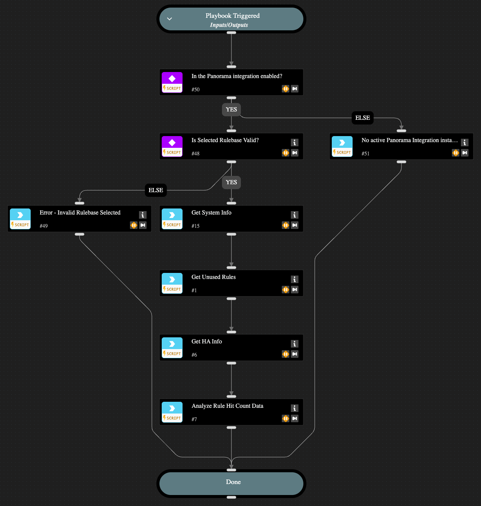

The playbook collects and analyzes Palo Alto Networks NGFW policy rule hitcount information and generates a summary of unused rules for potential clean-up.  Policy rules are classified into three categories:

1. Unused Local Rules - Rules configured locally on firewalls.
2. Unused Panorama Rules - Rules pushed to one or more firewalls from Panorama that have zero hits on all firewalls.
3. Used Panorama Rules - Rules pushed to one or more firewalls from Panorama that have hits on some firewalls but not all.
    i. These rules may be pushed to firewalls where they are not needed and should be considered for clean-up.

For firewalls in HA pairs, rules are only considered unused if all members of the HA group have zero hits for it.

## Dependencies

This playbook uses the following sub-playbooks, integrations, and scripts.

### Sub-playbooks

This playbook does not use any sub-playbooks.

### Integrations

* Panorama

### Scripts

* PAN-OS-AnalyzeRuleHitCounts
* PrintErrorEntry

### Commands

* pan-os-get-rule-hitcounts
* pan-os-platform-get-ha-state
* pan-os-platform-get-system-info

## Playbook Inputs

---

| **Name** | **Description** | **Default Value** | **Required** |
| --- | --- | --- | --- |
| Rulebase | The firewall rulebase to analyze. Must be one of the following: security, nat, decryption, application-override, authentication, dos, network-packet-broker, pbf, qos, sdwan, security, tunnel-inspect. | security | Required |

## Playbook Outputs

---

| **Path** | **Description** | **Type** |
| --- | --- | --- |
| PANOS.UnusedRules.TotalLocalRulesAnalyzed | The total number of local rules analyzed. | Number |
| PANOS.UnusedRules.TotalPanoramaRulesAnalyzed | The total number of analyzed rules pushed from Panorama. | Number |
| PANOS.UnusedRules.UnusedLocalRules | List of Unused Local Rules. | unknown |
| PANOS.UnusedRules.UnusedLocalRules.activeHAPeer | If the firewall where this rule data comes from is in an HA pair, contains the Host ID of the active device in the pair. | Unknown |
| PANOS.UnusedRules.UnusedLocalRules.hostid | Host ID of the firewall where the rule is configured. | String |
| PANOS.UnusedRules.UnusedLocalRules.hostname | Hostname of the firewall where this rule is configured. | String |
| PANOS.UnusedRules.UnusedLocalRules.vsys | The virtual system \(VSYS\) where the rule is configured. | String |
| PANOS.UnusedRules.UnusedLocalRules.instanceName | Name of the PAN-OS Integration Instance used to collect rule hitcount data. | String |
| PANOS.UnusedRules.UnusedLocalRules.name | The name of the rule. | String |
| PANOS.UnusedRules.UnusedLocalRules.position | The position of the rule within the Panorama device-group rulebase \(pre-rulebase or post-rulebase\). | String |
| PANOS.UnusedRules.UnusedLocalRules.rulebase | The rulebase where the rule is configured \(e.g. "Security", "NAT", etc\). | String |
| PANOS.UnusedRules.UnusedPanoramaRules | List of Unused Rules Pushed from Panorama. | unknown |
| PANOS.UnusedRules.UnusedPanoramaRules.from_dg_name | The rulebase where the rule is configured \(e.g. "Security", "NAT", etc\). | String |
| PANOS.UnusedRules.UnusedPanoramaRules.instanceName | Name of the PAN-OS Integration Instance used to collect rule hitcount data. | String |
| PANOS.UnusedRules.UnusedPanoramaRules.name | The name of the rule. | String |
| PANOS.UnusedRules.UnusedPanoramaRules.position | The position of the rule within the Panorama device-group rulebase \(pre-rulebase or post-rulebase\). | String |
| PANOS.UnusedRules.UnusedPanoramaRules.rulebase | The rulebase where the rule is configured \(e.g. "Security", "NAT", etc\). | String |
| PANOS.UnusedRules.UsedPanoramaRules | List of Rules Pushed from Panorama that are used on some firewalls but not all. | unknown |
| PANOS.UnusedRules.UsedPanoramaRules.from_dg_name | Name of the Device Group the rule is inherited from. | String |
| PANOS.UnusedRules.UsedPanoramaRules.hostids_with_hits | Host IDs of firewalls where this rule has hits. | String |
| PANOS.UnusedRules.UsedPanoramaRules.hostnames_with_hits | Hostnames of firewalls where this rule has hits. | String |
| PANOS.UnusedRules.UsedPanoramaRules.hostids_with_zero_hits | Host IDs of firewalls where this rule has zero hits. | Unknown |
| PANOS.UnusedRules.UsedPanoramaRules.hostnames_with_zero_hits | Hostnames of firewalls where this rule has zero hits. | Unknown |
| PANOS.UnusedRules.UsedPanoramaRules.instanceName | Name of the PAN-OS Integration Instance used to collect rule hitcount data. | String |
| PANOS.UnusedRules.UsedPanoramaRules.name | The name of the rule. | String |
| PANOS.UnusedRules.UsedPanoramaRules.position | The position of the rule within the Panorama device-group rulebase \(pre-rulebase or post-rulebase\). | String |
| PANOS.UnusedRules.UsedPanoramaRules.rulebase | The rulebase where the rule is configured \(e.g. "Security", "NAT", etc\). | String |

## Playbook Image

---

