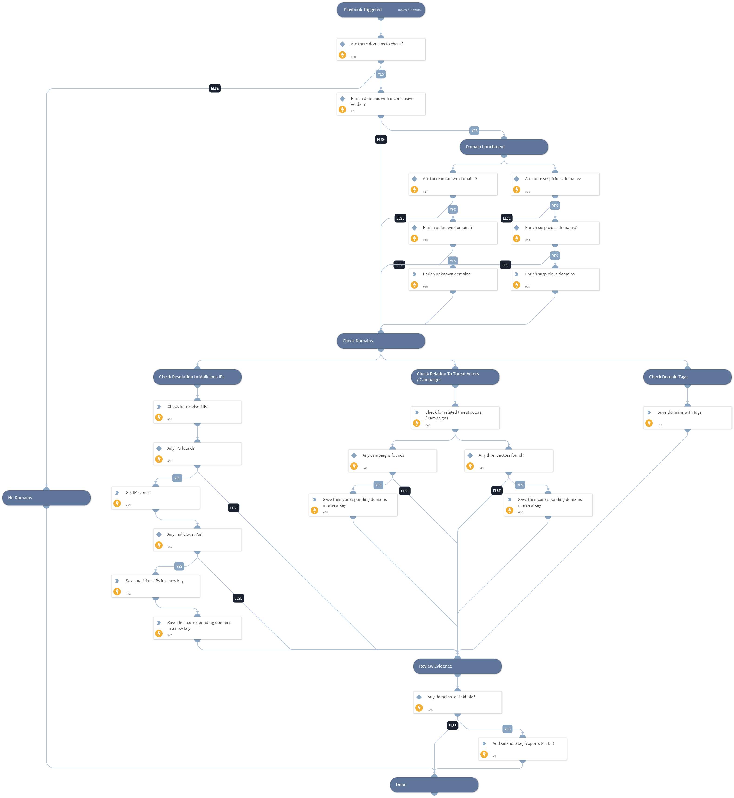

This TIM playbook should be run as a job. The playbook runs on domain indicators and performs various checks to decide if they should be sinkholed.

If a domain is related to a campaign or a threat actor, or if it resolves to a malicious IP or has malware-related tags, the playbook will add a new tag to it in order to sinkhole that domain.

The playbook assumes that the user is exporting indicators with the sinkhole tag to an EDL (External Dynamic List) using the Export Generic Indicators Service integration in Cortex XSOAR. That EDL should be connected to PAN-OS. It also assumes that a DNS sinkhole is configured in the PAN-OS firewall. However, these are not required for the sole purpose of tagging the domains.

Note: This playbook has inputs from both the "From context data" tab and the "From indicators" tab.

## Dependencies

This playbook uses the following sub-playbooks, integrations, and scripts.

### Sub-playbooks

This playbook does not use any sub-playbooks.

### Integrations

This playbook does not use any integrations.

### Scripts

* GetIndicatorDBotScoreFromCache
* Set
* SetAndHandleEmpty
* SearchIndicatorRelationships

### Commands

* enrichIndicators
* appendIndicatorField

## Playbook Inputs

---

| **Name** | **Description** | **Default Value** | **Required** |
| --- | --- | --- | --- |
| Indicator Query | All domain indicators. In the playbook, the domains will be filtered by those used for malicious communication, and tagged to be sinkholed. | type:Domain | Optional |
| SinkholeTagForEDL | The tag that should be applied to the domain so that it will be exported to the EDL using the Generic Export Indicators Service integration in Cortex XSOAR. | to_sinkhole | Required |
| EnrichUnknownDomains | Whether to enrich unknown domains. Enriching domains can be useful to gain additional information regarding reputation for domains from your feed which will help identify domains used in C2 communication, but may consume more API quota from your threat intelligence integrations. Can be True or False. | False | Optional |
| EnrichSuspiciousDomains | Whether to enrich suspicious domains. Enriching domains can be useful to gain additional information regarding reputation for domains from your feed which will help identify domains used in C2 communication, but may consume more API quota from your threat intelligence integrations. Can be True or False. | False | Optional |

## Playbook Outputs

---
There are no outputs for this playbook.

## Playbook Image

---

