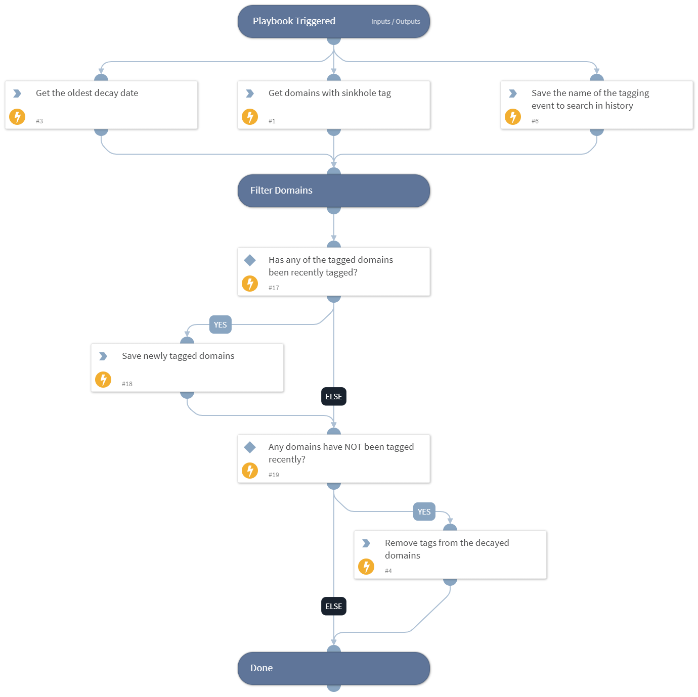

This playbook should be run as a job. It is used to periodically remove the specified tag from domain indicators. It should be used in conjunction with the "PAN-OS - Job - Add Malicious Domains To Sinkhole" playbook, to stop domains from being sinkholed after a certain amount of time.
The idea is that traffic to malicious domains will not be redirected to a sinkhole address forever, as malicious domains tend to lose their malicious properties (become inactive, get taken down, or the malware using them is no longer used or maintained).

## Dependencies

This playbook uses the following sub-playbooks, integrations, and scripts.

### Sub-playbooks

This playbook does not use any sub-playbooks.

### Integrations

This playbook does not use any integrations.

### Scripts

* GetTime
* Set

### Commands

* findIndicators
* removeIndicatorField

## Playbook Inputs

---

| **Name** | **Description** | **Default Value** | **Required** |
| --- | --- | --- | --- |
| SinkholeTag | The tag that will be removed from the tagged domain indicators. This should be the tag that was used to export the domains to the EDL using the Generic Export Indicators Service integration, which is used by the firewall's sinkhole configuration. | to_sinkhole | Required |
| DaysTaggedBeforeRemoval | The "decay period" - how many days should pass since the domains were tagged, before removing the sinkhole tag from those domains. The value should be a number of days. For example: 14.  Technical details: When specifying the decay period, the playbook will take into account multiple tagging/untagging activities in the domain indicator in Cortex XSOAR. This means that if you specified a value of "14" and a domain was tagged 15 days ago, but also untagged and then tagged again 10 days ago - it will not be untagged by the playbook, as tagging activity happened 10 days ago. It will, however, be untagged when the playbook runs 5 days afterwards, since at that time the domain will have reached the decay period again. | 14 | Required |

## Playbook Outputs

---
There are no outputs for this playbook.

## Playbook Image

---

