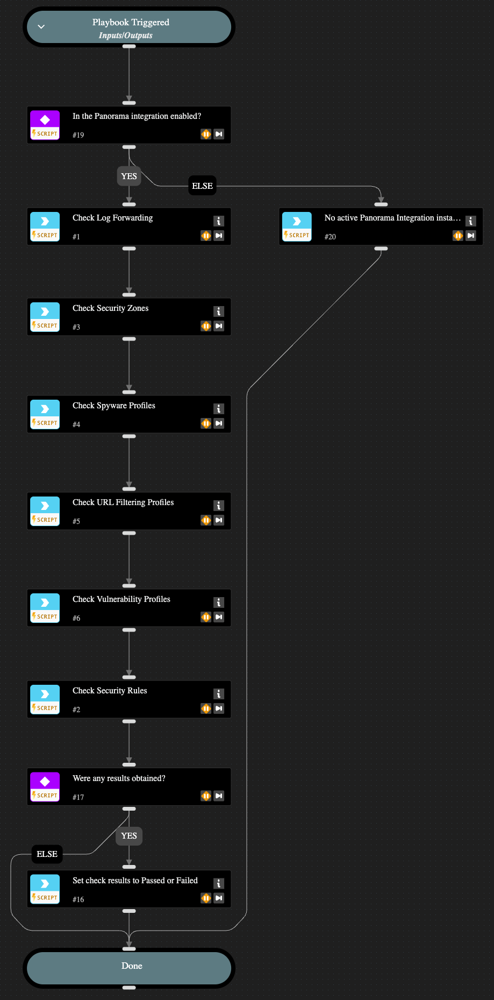

This playbook executes hygiene check commands using the PAN-OS integration and identifies items configured in a manner that do not meet minimum security best practices.  It looks for the following:

1. Log Forwarding Profiles
  i. Profiles without Enhanced Logging enabled
  ii. Profiles with no match list (rules) configured
  iii. Profiles that do not include rules to forward Traffic or Threat logs
2. Security Zones with no Log Forwarding Profile assigned
3. Spyware Profiles that do not:
  i. Block signatures of Critical and High severity
  ii. Alert on (or block) signatures of Medium and Low severity
4. URL Filtering Profiles do not block the default URL categories blocked in the pre-defined profile
5. Vulnerability Profiles that do not:
  i. Block signatures of Critical and High severity
  ii. Alert on (or block) signatures of Medium and Low severity
6. Security Rules that do not:
  i. Log at Session End
  ii. Have a Log Forwarding Profile assigned
  iii. Have Security Profiles assigned for Anti Virus, Spyware, Vulnerability, and URL Filtering (or a group that includes each)

NOTE: This playbook is intended for use with a single PAN-OS Integration Instance.

## Dependencies

This playbook uses the following sub-playbooks, integrations, and scripts.

### Sub-playbooks

This playbook does not use any sub-playbooks.

### Integrations

* Panorama

### Scripts

* SetAndHandleEmpty

### Commands

* pan-os-hygiene-check-log-forwarding
* pan-os-hygiene-check-security-rules
* pan-os-hygiene-check-security-zones
* pan-os-hygiene-check-spyware-profiles
* pan-os-hygiene-check-url-filtering-profiles
* pan-os-hygiene-check-vulnerability-profiles

## Playbook Inputs

---

| **Name** | **Description** | **Default Value** | **Required** |
| --- | --- | --- | --- |
| targetDevice | The serial number of a specific firewall to target \(Used when connected to Panorama\) \[Optional\].  When connected to Panorama, leaving this blank will run the checks against Panorama configuration as well as all currently connected managed firewalls. |  | Optional |

## Playbook Outputs

---

| **Path** | **Description** | **Type** |
| --- | --- | --- |
| PANOS.ConfigurationHygiene.Summary | A list of hygiene check summaries \(constructed as dictionaries\) describing the overall result of hygiene checks and how many issues of each type were found, if any. | unknown |
| PANOS.ConfigurationHygiene.Result | A list of hygiene check results \(constructed as dictionaries\) including a description of the issue found, the configuration location \(container name\), and the name of the object affected by the issue. | unknown |

## Playbook Image

---

