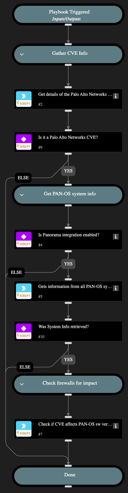

Checks if any Palo Alto Networks firewalls in your environment have PAN-OS software versions or GlobalProtect client package versions that are vulnerable to a specific CVE ID, as published on the Palo Alto Networks Security Advisories page. The playbook accepts an optional target parameter to check a specific firewall by serial number. If a non-Palo Networks CVE is provided, the playbook returns an empty output.

## Dependencies

This playbook uses the following sub-playbooks, integrations, and scripts.

### Sub-playbooks

This playbook does not use any sub-playbooks.

### Integrations

* Panorama

### Scripts

* CheckFirewallAndGPForCVEs
* PAN-OS_Security_Advisories_Enrichment

### Commands

* pan-os-platform-get-system-info

## Playbook Inputs

---
There are no inputs for this playbook.

## Playbook Outputs

---

| **Path** | **Description** | **Type** |
| --- | --- | --- |
| CVE_Check.CVE_ID | ID of the CVE being checked. | string |
| CVE_Check.Result | Result of the assessment for the input CVE with details about the firewall in the following json format: \{  Hostname : string,  IPAddress : string,  SWVersion : string,  IsFirewallVersionAffected : True/False,  GlobalProtectVersion : string,  GlobalProtectVersionAffected: True/False \} | unknown |
| CVE_Check.Severity | Severity of the CVE being assessed. | string |
| PANOSSecurityAdvisories.Advisory.cve_url | Link to the \[Palo Alto Networks Security Advisories\]\(https://security.paloaltonetworks.com/\) page for that CVE. | String |
| PANOSSecurityAdvisories.Advisory.configurations | Required configurations for the exploit to be successful. | String |
| PANOSSecurityAdvisories.Advisory.cpes | Affected products defined by CPE. | Unknown |
| PANOSSecurityAdvisories.Advisory.cveproductstatus | List of affected products with platform information and fixed versions. | Unknown |
| PANOSSecurityAdvisories.Advisory.cvethreatscore | Threat Score of the CVE. | Number |
| PANOSSecurityAdvisories.Advisory.cvethreatseverity | Threat Severity of CVE - LOW, MEDIUM, HIGH or CRITICAL. | String |
| PANOSSecurityAdvisories.Advisory.cvss_score | Base score of the CVE. | Number |
| PANOSSecurityAdvisories.Advisory.cvss_severity | Base severity of CVE - LOW, MEDIUM, HIGH or CRITICAL. | String |
| PANOSSecurityAdvisories.Advisory.cvss_table | Metrics of the vulnerability. | Unknown |
| PANOSSecurityAdvisories.Advisory.description | Vulnerability description. | String |
| PANOSSecurityAdvisories.Advisory.exploits | Known exploits of this vulnerability in the field. | String |
| PANOSSecurityAdvisories.Advisory.external_cve_list | If the specified CVE is a PAN-SA advisory, an array of related external CVEs. | Unknown |
| PANOSSecurityAdvisories.Advisory.solution | Solution provided for the CVE. | String |
| PANOSSecurityAdvisories.Advisory.title | CVE title. | String |
| PANOSSecurityAdvisories.Advisory.workaround | Workaround for the CVE. | String |

## Playbook Image

---

