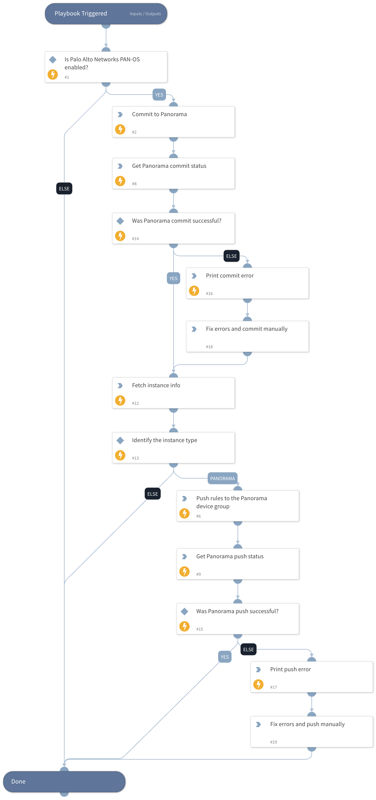

Commit the PAN-OS Panorama or Firewall configuration. If specified as Panorama, it also pushes the Policies to the specified Device Group in the instance.

## Dependencies

This playbook uses the following sub-playbooks, integrations, and scripts.

### Sub-playbooks

This playbook does not use any sub-playbooks.

### Integrations

Panorama

### Scripts

PrintErrorEntry

### Commands

* pan-os-push-to-device-group
* pan-os
* pan-os-commit-status
* pan-os-commit

## Playbook Inputs

---

| **Name** | **Description** | **Default Value** | **Required** |
| --- | --- | --- | --- |
| device-group |  The device group | Optional |

## Playbook Outputs

---

| **Path** | **Description** | **Type** |
| --- | --- | --- |
| Panorama.Commit.JobID | The job ID to commit. | unknown |
| Panorama.Commit.Status | The commit status. | unknown |
| Panorama.Commit.Description | The commit description from the the command input. | unknown |
| Panorama.Push.DeviceGroup | The device group in which the policies were pushed. | unknown |
| Panorama.Push.JobID | The job ID of the policies that were pushed. | unknown |
| Panorama.Push.Status | The push status. | unknown |
| Panorama.Push.Warnings | The push warnings. | unknown |
| Panorama.Push.Errors | The push errors. | unknown |
| Panorama.Push.Details | The job ID details. | unknown |

## Playbook Image

---

