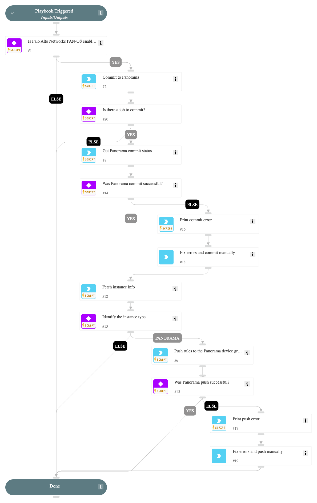

Commit the PAN-OS Panorama or Firewall configuration.\nIf specified as Panorama, it also pushes the Policies to the specified Device Group in the instance.

## Dependencies

This playbook uses the following sub-playbooks, integrations, and scripts.

### Sub-playbooks

This playbook does not use any sub-playbooks.

### Integrations

Panorama

### Scripts

PrintErrorEntry

### Commands

* pan-os-commit
* pan-os
* pan-os-commit-status
* pan-os-push-to-device-group
* pan-os-push-status

## Playbook Inputs

---

| **Name** | **Description** | **Default Value** | **Required** |
| --- | --- | --- | --- |
| device-group |  |  | Optional |

## Playbook Outputs

---

| **Path** | **Description** | **Type** |
| --- | --- | --- |
| Panorama.Commit.Warnings | Job ID warnings. | string |
| Panorama.Push.Warnings | Job ID warnings. | unknown |
| Panorama.Push.DeviceGroup | The device group in which the policies were pushed. | unknown |

## Playbook Image

---

