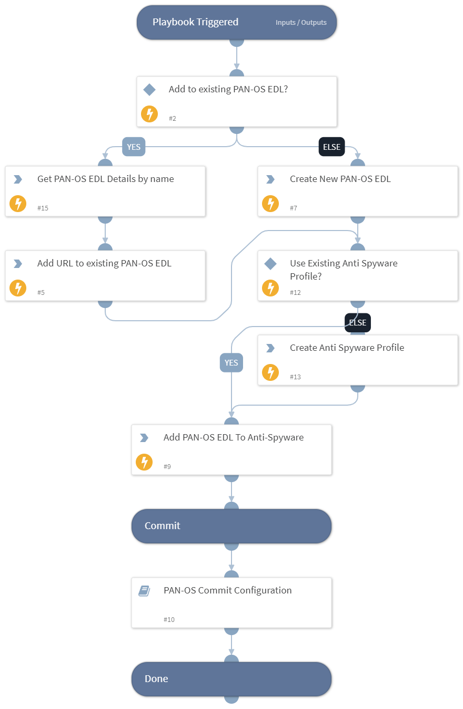

This playbook add domains EDL to Panorama Anti-Spyware. It assigns External Dynamic List URLs that contain domains to block to Panorama Anti-Spyware. You can create an External Dynamic List (EDL) and add domains to it using the Cortex XSOAR pack called "Generic Export Indicators Service".
We recommend using this playbook as a one-time job. Once EDL is created and assigned to anti-spyware, domains can be blocked by adding them to the EDL.

## Dependencies
This playbook uses the following sub-playbooks, integrations, and scripts.

### Sub-playbooks
* PAN-OS Commit Configuration

### Integrations
* Panorama

### Scripts
This playbook does not use any scripts.

### Commands
* pan-os-apply-dns-signature-policy
* pan-os-get-edl
* pan-os-create-anti-spyware-best-practice-profile
* pan-os-create-edl
* pan-os-edit-edl

## Playbook Inputs
---

| **Name** | **Description** | **Default Value** | **Required** |
| --- | --- | --- | --- |
| EDL_URL | The URL from which to pull the EDL. |  | Required |
| Add_To_Existing_PAN-OS_EDL | Set to "true" to use the existing PAN-OS EDL. |  | Optional |
| PAN-OS_EDL_Name | PAN-OS EDL name to create/edit if it exists \(depending on the value in Add_To_Existing_PAN-OS_EDL\). |  | Required |
| Device_Group | The device group for which to return addresses for the EDL \(Panorama instances\).  |  | Optional |
| Certificate_Profile | The certificate profile name for the URL that was previously uploaded to PAN OS.  |  | Optional |
| Anti_Spyware_Profile | Name of the anti-spyware profile to create OR to edit if it exists \(depending on the value in Use_Existing_AntiSpyware_Profile\). |  | Required |
| Use_Existing_AntiSpyware_Profile | Set to "true" to create a new anti-spyware profile. |  | Optional |

## Playbook Outputs
---
There are no outputs for this playbook.

## Playbook Image
---

