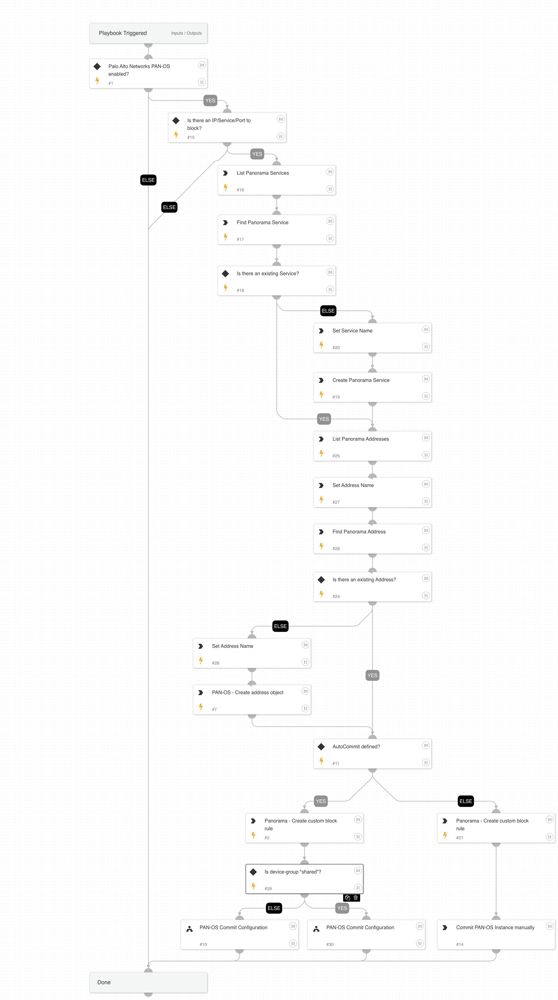

This playbook blocks a destination IP and service (TCP or UDP port) by creating a rule for a specific device group on PAN-OS. 

## Dependencies

This playbook uses the following sub-playbooks, integrations, and scripts.

### Sub-playbooks

* PAN-OS Commit Configuration

### Integrations

* Panorama

### Scripts

* Set
* SetAndHandleEmpty

### Commands

* pan-os-create-service
* pan-os-list-addresses
* pan-os-create-address
* pan-os-list-services
* pan-os-create-rule

## Playbook Inputs

---

| **Name** | **Description** | **Default Value** | **Required** |
| --- | --- | --- | --- |
| LogForwarding | Panorama log forwarding object name. |  | Optional |
| IP | IP address to block. |  | Optional |
| AutoCommit | This input establishes whether to commit the configuration automatically. True - Commit automatically. False - Commit manually. | False | Optional |
| DeviceGroup | Target Device Group. |  | Optional |
| Port | Destination port to block. |  | Optional |
| Protocol | Protocol |  | Optional |
| ServiceNamePrefix | Prefix of the Service name to be created. | xsoar-service- | Optional |
| RuleNamePrefix | Prefix of the Rule name to be created. | xsoar-rule- | Optional |
| ObjectNamePrefix | Prefix of the object name to be created. | xsoar-object- | Optional |
| WhereRule | Where to move the rule. If you specify "before" or "after", you need to supply the "dst" argument. \(Default is: 'top'\) | top | Optional |
| SourceZone | A comma-separated list of source zones. |  | Optional |
| DestinationZone | A comma-separated list of destination zones. |  | Optional |
| SecondaryDeviceGroup | If the rule, address and service are created in the "Shared" location, we need to know what device groups we can push to because it isn't possible to push to the "Shared" location. |  | Optional |

## Playbook Outputs

---
There are no outputs for this playbook.

## Playbook Image

---

