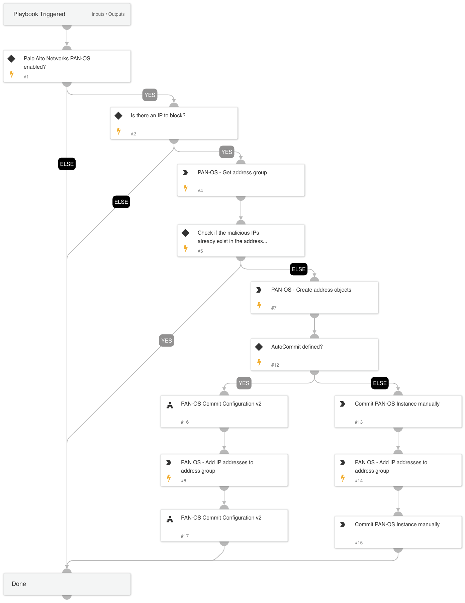

This playbook blocks IP addresses using Static Address Groups in Palo Alto Networks Panorama or Firewall.
The playbook receives malicious IP addresses and an address group name as inputs, verifies that the addresses are not already a part of the address group, adds them and commits the configuration.

***Note - The playbook does not block the address group communication using a policy block rule. This step will be taken once outside of the playbook.

## Dependencies

This playbook uses the following sub-playbooks, integrations, and scripts.

### Sub-playbooks

* PAN-OS Commit Configuration

### Integrations

* Panorama

### Scripts

This playbook does not use any scripts.

### Commands

* pan-os-create-address
* pan-os-get-address-group
* pan-os-edit-address-group

## Playbook Inputs

---

| **Name** | **Description** | **Default Value** | **Required** |
| --- | --- | --- | --- |
| IP | IP address to block | IP.Address | Optional |
| AddressGroupName | Static address group name | Demisto Remediation - Static Address Group | Optional |
| AutoCommit | This input establishes whether to commit the configuration automatically. Yes - Commit automatically. No - Commit manually. | No | Optional |
| IPDescription | The description of the IP in case it will get created by the playbook. | Automatically created using "PAN-OS - Block IP - Static Address Group" playbook in Cortex XSOAR. | Optional |

## Playbook Outputs

---
There are no outputs for this playbook.

## Playbook Image

---

