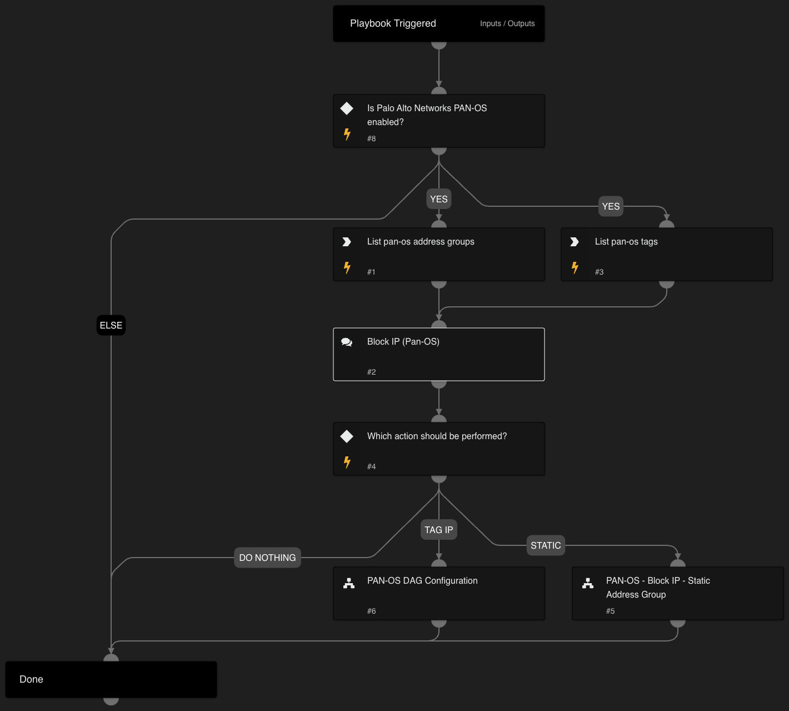

This playbook blocks IP addresses with 2 optional actions:

- Block IP addresses using Static Address Groups in Palo Alto Networks Panorama or Firewall. The playbook receives malicious IP addresses and an address group name as inputs, verifies that the addresses are not already a part of the address group, adds them and commits the configuration.

- Utilize the Dynamic Address Group (DAG) capability of PAN-OS. DAG enables analysts to create a rule one time, where the group is the source/destination, and adds IP addresses dynamically without the need to commit the configuration every time.
The playbook checks if the given tag already exists. If the tag exists, then the IP address is added to the tag.
If the tag does not exist, a new address group is created with the given tag and a matching rule, and the configuration is committed.

## Dependencies

This playbook uses the following sub-playbooks, integrations, and scripts.

### Sub-playbooks

* PAN-OS DAG Configuration
* PAN-OS - Block IP - Static Address Group

### Integrations

* Panorama

### Scripts

This playbook does not use any scripts.

### Commands

* pan-os-list-tag
* pan-os-list-address-groups

## Playbook Inputs

---

| **Name** | **Description** | **Default Value** | **Required** |
| --- | --- | --- | --- |
| MaliciousIPs | IP or list of IPs. |  | Optional |

## Playbook Outputs

---
There are no outputs for this playbook.

## Playbook Image

---

