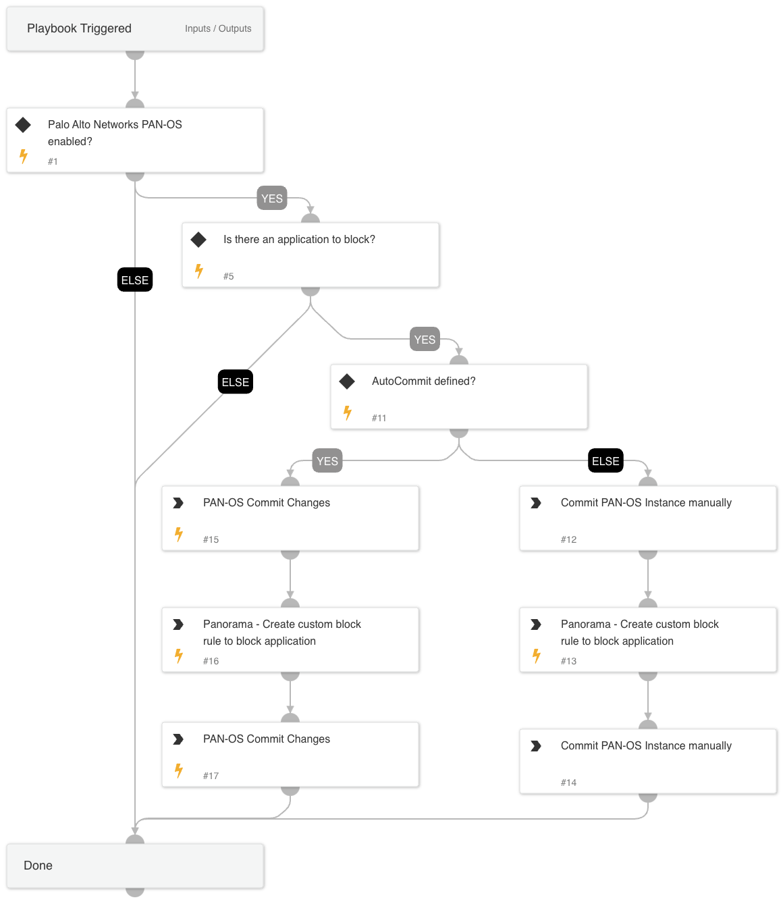

This playbook blocks IP addresses from an External Dynamic List using Custom Block Rules in Palo Alto Networks Panorama or Firewall. The playbook receives an EDL name as input, creates a custom "from" directional rule to block, and commits the configuration.

## Dependencies

This playbook uses the following sub-playbooks, integrations, and scripts.

### Sub-playbooks

This playbook does not use any sub-playbooks.

### Integrations

Panorama

### Scripts

This playbook does not use any scripts.

### Commands

* pan-os-commit
* pan-os-custom-block-rule

## Playbook Inputs

---

| **Name** | **Description** | **Default Value** | **Required** |
| --- | --- | --- | --- |
| RuleName | Panorama rule name. |  | Optional |
| EDLName | EDL IPs to block. |  | Optional |
| AutoCommit | This input establishes whether to commit the configuration automatically. Yes - Commit automatically. No - Commit manually. | No | Optional |
| LogForwarding | Panorama log forwarding object name. |  | Optional |

## Playbook Outputs

---
There are no outputs for this playbook.

## Playbook Image

---

