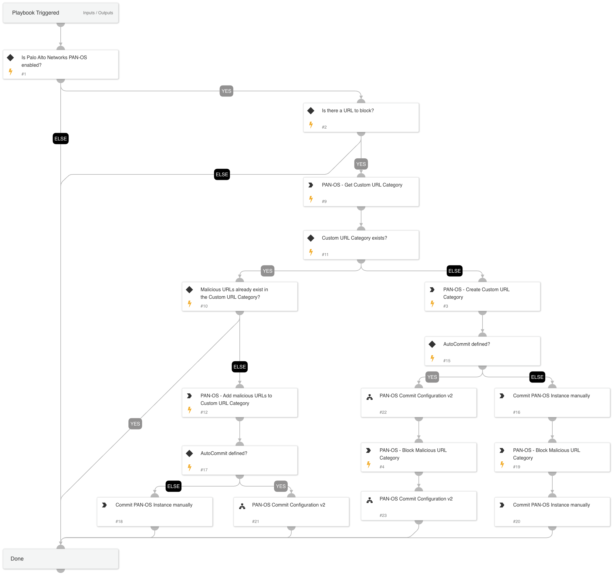

This playbook blocks URLs using Palo Alto Networks Panorama or Firewall through Custom URL Categories.
The playbook checks whether the input URL category already exists, and if the URLs are a part of this category. Otherwise, it will create the category, block the URLs, and commit the configuration.

## Dependencies

This playbook uses the following sub-playbooks, integrations, and scripts.

### Sub-playbooks

* PAN-OS Commit Configuration v2

### Integrations

* Panorama

### Scripts

This playbook does not use any scripts.

### Commands

* pan-os-edit-custom-url-category
* pan-os-custom-block-rule
* pan-os-get-custom-url-category
* pan-os-create-custom-url-category

## Playbook Inputs

---

| **Name** | **Description** | **Default Value** | **Required** |
| --- | --- | --- | --- |
| URL | URL to block | URL.Data | Optional |
| CustomURLCategory | Custom URL Category name | Remediation - Malicious URLs | Optional |
| LogForwarding | Panorama log forwarding object name |  | Optional |
| AutoCommit | This input establishes whether to commit the configuration automatically. Yes - Commit automatically. No - Commit manually. | No | Optional |
| type | Custom URL category type. Insert "URL List"/ "Category Match". |  | Optional |
| device-group | Device group for the Custom URL Category \(Panorama instances\). |  | Optional |
| categories | The list of categories. Relevant from PAN-OS v9.x. |  | Optional |
| pre-post | Specify pre-rulebase or post-rulebase. \(Panorama instances\). | pre-rulebase | Optional |

## Playbook Outputs

---
There are no outputs for this playbook.

## Playbook Image

---

